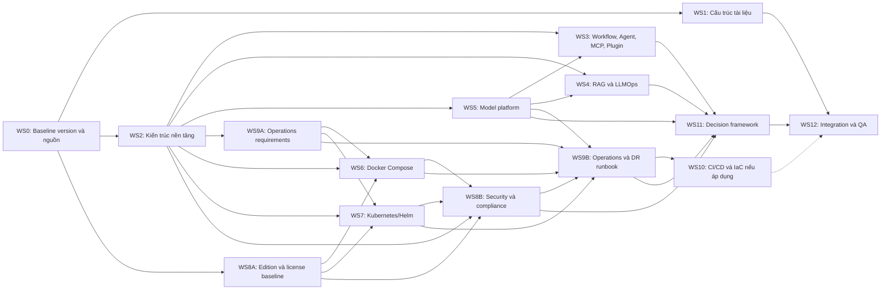

# Kế hoạch triển khai tài liệu kỹ thuật Dify AI self-hosted

> **Nguồn yêu cầu:** `dify-research-brief.md`  
> **Trạng thái:** Đang triển khai — draft vòng 1 cho Chương 00–19 và Phụ lục A–E đã hoàn tất; static QA đạt, còn runtime validation, specialist review và release gate G5  
> **Ngôn ngữ tài liệu final:** Tiếng Việt; giữ thuật ngữ kỹ thuật tiếng Anh và giải thích trong glossary  
> **Định dạng:** Markdown; mọi sơ đồ được nhúng trực tiếp bằng Mermaid  
> **Baseline phiên bản Dify:** Community `1.15.0` tại commit `3aa26fb6374bbd47e5469f7d7cc25f3e0075a60c`; docs snapshot `57a492d8063d1583c582b4c0444fb838c6dd3027`; khóa ngày `2026-07-16`

## 1. Kết quả cần bàn giao

Bộ tài liệu final phải đồng thời là:

1. **Technical reference:** giải thích kiến trúc, cơ chế hoạt động, giới hạn và khác biệt giữa các edition.
2. **Deployment & operations playbook:** đủ cụ thể để dựng POC bằng Docker Compose và thiết kế/vận hành production theo hướng Kubernetes/Helm.
3. **Decision framework:** giúp chọn use case, topology triển khai, model provider và mô hình chi phí phù hợp.

Sau khi đọc, một developer chưa từng dùng Dify phải có thể:

- Giải thích luồng xử lý và vai trò của từng thành phần chính.
- Tự dựng, kiểm tra và xử lý lỗi cơ bản cho một instance POC.
- Hiểu đường chuyển từ POC sang production, gồm security, HA, backup, upgrade và DR.
- Chọn được use case và mô hình triển khai dựa trên tiêu chí, thay vì theo cảm tính.
- Biết điểm nào phụ thuộc edition, phiên bản, chính sách nội bộ hoặc cần Legal/Procurement xác nhận.

## 2. Các quyết định cấu trúc ngay từ đầu

### 2.1. Tách các năng lực Tier 2 thành chương riêng

Brief yêu cầu mỗi năng lực Tier 2 đủ sâu để bắt đầu implement, nhưng outline ban đầu đang gom Workflow, RAG, Agent, MCP, Plugin và LLMOps vào một chương. Kế hoạch này tách chúng thành các chương độc lập để tránh nội dung bị nông và dễ cập nhật khi Dify thay đổi.

### 2.2. Dùng nhiều file Markdown, một điểm vào duy nhất

- `README.md` là mục lục và điểm vào chính của bộ tài liệu.
- `README.md` phải nêu prerequisite và ba learning path: **đọc để hiểu**, **đọc để triển khai/vận hành**, **đọc để ra quyết định**.
- Mỗi chủ đề lớn là một file riêng để dễ review, nhập wiki và cập nhật theo phiên bản.
- Khi phát hành có thể sinh thêm `dify-research-final.md` là bản ghép đơn-file; bản nguồn theo chương vẫn là nguồn chuẩn.
- Mermaid nằm ngay trong file chương tương ứng, không lưu sơ đồ kiến trúc dưới dạng ảnh rời.

Các chương về năng lực lõi dùng cách viết “vertical slice”: bắt đầu bằng cơ chế, sau đó có ví dụ implement tối thiểu và checklist. Vì vậy RAG nằm cùng nhóm năng lực lõi nhưng vẫn phải đáp ứng mục tiêu “đọc để làm”; phần deployment/operations phải liên kết ngược rõ ràng tới runbook RAG thay vì lặp lại nội dung.

### 2.3. Không giả định một cấu hình production duy nhất

Do chưa biết cloud/on-prem, SLA, concurrency, data classification, IdP, RPO/RTO và năng lực đội vận hành, tài liệu sẽ dùng:

- Reference architecture theo cấp độ.
- Decision matrix và công thức sizing/cost có biến đầu vào.
- Phân biệt rõ heuristic với giới hạn kỹ thuật đã kiểm chứng.
- Nhãn xác minh cho từng hướng dẫn hoặc khuyến nghị.

### 2.4. Chuẩn hóa nhãn mức độ xác minh

Mỗi procedure, cấu hình hoặc kết luận quan trọng phải mang một trong các trạng thái:

| Nhãn | Ý nghĩa |
|---|---|
| `Official-source verified` | Đã đối chiếu tài liệu, source code, manifest hoặc release chính thức đúng version |
| `RUNTIME-VALIDATED` | Đã thực thi end-to-end trong môi trường đại diện và ghi lại expected/actual evidence |
| `Config validated` | Đã kiểm tra cú pháp/render/config nhưng chưa chạy toàn bộ hệ thống |
| `Design reviewed` | Đã review logic kiến trúc nhưng chưa có môi trường để kiểm chứng runtime |
| `Requires Legal confirmation` | Liên quan license/compliance; không thay thế kết luận pháp lý |

### 2.5. Giữ core ổn định, mở rộng bằng use-case addendum

- Tier 1 và Tier 2 là **stable core**, chỉ sửa khi baseline/version hoặc kiến trúc nền thay đổi.
- Khi doanh nghiệp chốt use case/hạ tầng, nội dung đào sâu mới được thêm dưới `part-3-decision-framework/addenda/`.
- Addendum phải tham chiếu chương nền, không sao chép architecture/security/operations chung.
- Mỗi addendum chỉ bổ sung yêu cầu riêng: business flow, dữ liệu, integration, SLO, threat, sizing, evaluation và rollout.
- Việc thêm use case không được làm thay đổi kết luận chung của Tier 1/2 nếu không có evidence về thay đổi platform.

## 3. Cấu trúc thư mục đề xuất

```text
docs/
├── dify-technical-guide/
│   ├── README.md
│   ├── 00-scope-version-and-assumptions.md
│   ├── part-1-foundations/
│   │   ├── 01-dify-overview.md
│   │   ├── 02-system-architecture.md
│   │   ├── 03-workflow.md
│   │   ├── 04-rag.md
│   │   ├── 05-agent.md
│   │   ├── 06-model-management.md
│   │   ├── 07-mcp.md
│   │   ├── 08-plugins.md
│   │   ├── 09-llmops-observability.md
│   │   └── 10-editions-license.md
│   ├── part-2-deployment-playbook/
│   │   ├── 11-docker-compose.md
│   │   ├── 12-kubernetes-ha.md
│   │   ├── 13-security-hardening.md
│   │   ├── 14-model-provider-integration.md
│   │   ├── 15-operations-backup-upgrade-dr.md
│   │   └── 16-cicd-iac.md
│   ├── part-3-decision-framework/
│   │   ├── 17-use-case-patterns.md
│   │   ├── 18-poc-pilot-checklist.md
│   │   ├── 19-cost-model.md
│   │   └── addenda/
│   │       └── README.md
│   └── appendices/
│       ├── a-quick-comparison.md
│       ├── b-glossary.md
│       ├── c-configuration-checklists.md
│       ├── d-troubleshooting.md
│       ├── e-references.md
│       └── f-change-log.md
├── working/
│   ├── source-register.md
│   ├── claim-evidence-matrix.md
│   ├── assumptions-and-gaps.md
│   ├── decision-log.md
│   ├── validation-log.md
│   └── chapter-status.md
└── releases/
    └── dify-research-final.md
```

`working/` phục vụ nghiên cứu và review, không phải nội dung công bố. `releases/dify-research-final.md` chỉ được tạo khi các chương đã qua QA.

## 4. Phạm vi chi tiết theo chương

| Chương | Tier | Câu hỏi/nội dung bắt buộc | Đầu ra kiểm chứng |
|---|---:|---|---|
| `00` Scope, version, assumptions | Nền | Version/tag Dify, ngày chốt, edition, lab topology, giả định, ngoài phạm vi, chính sách review major release | Baseline được reviewer duyệt; không còn placeholder phiên bản |
| `01` Dify overview | 1 | Dify là gì, giải quyết lớp bài toán nào, vai trò trong LLM application stack, giới hạn và trường hợp không nên dùng | Bản đồ phạm vi; tránh biến phụ lục thành bài so sánh sâu |
| `02` System architecture | 1 | Component inventory; **frontend và API server là hai runtime boundary riêng**; worker/Celery, PostgreSQL, Redis, vector DB, storage, sandbox, plugin runtime, proxy; protocol, auth/session path, state ownership, scaling và failure mode | Sơ đồ context/component/request flow; bảng component–state–dependency–failure; frontend/API không bị gộp |
| `03` Workflow | 2 | Visual DSL, node/variable, branching, iteration, error path, retry, timeout, publish/version và giới hạn | Một workflow mẫu; sơ đồ execution; checklist debug |
| `04` RAG | 2 | Ingestion, parsing, chunking, embedding, index, retrieval, rerank, context assembly, evaluation và vector DB selection | Hai sơ đồ ingestion/query; pipeline mẫu; ma trận chọn vector DB |
| `05` Agent | 2 | Reasoning/tool loop, function calling, memory/context, stop condition, guardrail, prompt injection và giới hạn | State diagram; agent mẫu; failure/abuse cases |
| `06` Model management | 2 | Model types, provider abstraction, credentials, parameters, quota/rate limit, fallback/routing và lifecycle | Bảng capability; ranh giới với chương tích hợp provider |
| `07` MCP | 2 | Mức hỗ trợ theo version; Dify làm MCP client và expose workflow như MCP server; auth, permissions, trust boundary | Sơ đồ dual-role; ví dụ tối thiểu cho hai chiều; giới hạn được ghi rõ |
| `08` Plugins | 2 | Marketplace, cài đặt/update, lifecycle, tự viết plugin, permission, isolation, supply-chain risk | Sơ đồ lifecycle; skeleton ví dụ; checklist review plugin |
| `09` LLMOps/observability | 2 | Logs, metrics, traces, prompt/model telemetry, evaluation; điểm tích hợp Langfuse/Opik/Arize Phoenix | Sơ đồ telemetry; bộ tín hiệu và alert tối thiểu |
| `10` Editions & license | 1 | Community vs Enterprise vs Cloud; feature/limit/support; xác minh chính xác claim từ brief về nền Apache-2.0, điều kiện bổ sung và phân loại source-available; tác động sử dụng nội bộ/phân phối/cung cấp dịch vụ | Exact wording từ license của baseline; ma trận có nguồn; checklist Legal/Procurement; không đưa kết luận pháp lý thay Legal |
| `11` Docker Compose | 1 | Prerequisite, quick start, cấu hình nâng cao, persistence, reverse proxy/TLS, health check, backup cơ bản, upgrade path và troubleshooting | Dựng lại trên môi trường sạch; smoke test và validation log |
| `12` Kubernetes/Helm HA | 1 | Xác minh provenance/support status của chart; ingress, replica, worker scaling, HPA/PDB, stateful dependency, storage, affinity, multi-AZ và rollout; fallback nếu không có chart official được duy trì | Topology HA; liệt kê SPOF; reference deployment chạy được với smoke/rollout/load/failure-recovery test trước final; artifact có owner |
| `13` Security hardening | 1 | SSO/LDAP, RBAC, audit theo edition; TLS, secret, network/egress, data flow, sandbox/plugin/tool risk, SSRF, prompt injection, exfiltration, PII; data classification, retention/deletion, encryption và evidence | Trust-zone/data-flow diagram; threat-control matrix; security baseline; compliance checklist tham số hóa |
| `14` Model provider integration | 1 | OpenAI-compatible, Anthropic, Azure, Bedrock, Ollama/vLLM; auth, endpoint, network, timeout, retry, quota, residency, GPU boundary | Ít nhất một external API và một self-host path được kiểm chứng; bảng chọn provider |
| `15` Operations, backup, upgrade, DR | 1 | State inventory, backup/restore order, migration, upgrade/rollback, monitoring, capacity, incident response, RPO/RTO và DR drill | Restore test hoặc nhãn design-reviewed; runbook upgrade/rollback/DR |
| `16` CI/CD & IaC | 2 — điều kiện | Baseline bắt buộc: image pinning, config/secret separation, migration và rollback principle. Phần pipeline, IaC, scan/sign và environment promotion chỉ đào sâu khi áp dụng | Baseline được ghi; pipeline tham chiếu nếu áp dụng, hoặc `N/A` có lý do; không có secret thật trong repo |
| `17` Use-case patterns | 3 | Chatbot nội bộ, enterprise knowledge RAG, agent automation, AI Backend-as-a-Service; dữ liệu, rủi ro, topology và tiêu chí chọn | Mỗi mẫu 1–2 trang; cây quyết định use case/deployment |
| `18` POC/pilot | 3 | Problem framing, data readiness, success metrics, evaluation set, security gate, demo, go/no-go và production exit criteria | Checklist có owner/evidence; scenario walkthrough |
| `19` Cost model | 3 | Infra, model/token, GPU, vector/storage, observability, network, effort vận hành, Enterprise subscription/vendor support và chi phí compensating controls của Community Edition | Công thức tham số hóa; 2–3 scenario mẫu; nêu rõ giả định, không tạo độ chính xác giả |

Phụ lục so sánh nhanh phải có đủ **Flowise, n8n, LangChain và LangGraph**, đúng phạm vi “bản đồ định vị”, không mở rộng thành nghiên cứu trade-off độc lập.

### 4.1. Contract cho bảng quyết định Docker Compose và Kubernetes

Bản final bắt buộc có cả bảng so sánh và decision flow. Bảng tối thiểu phải chứa:

| Nhóm tiêu chí | Nội dung bắt buộc |
|---|---|
| Giai đoạn | POC/pilot so với production |
| Tải | Số người dùng như heuristic, concurrency, job ingestion, workflow complexity và model latency |
| Availability | SLA, HA, RPO/RTO và failure-domain requirement |
| Scale | Vertical scale so với horizontal scale; thành phần nào thực sự scale ngang |
| Tổ chức | Một team/nhiều team, kỹ năng Kubernetes và ownership vận hành |
| Effort | Effort triển khai, nâng cấp, monitoring, incident và chi phí nền tảng |
| Security/compliance | Isolation, secret, egress, audit và data-residency requirement |
| Kết luận | Khi chọn Compose, khi chọn Kubernetes, prerequisite và exit criteria để chuyển topology |

Ngưỡng “dưới khoảng 50 người dùng” từ brief phải được giữ như một **heuristic có điều kiện**, không được dùng làm giới hạn kỹ thuật độc lập.

### 4.2. Content ownership để tránh trùng lặp

| Chủ đề giao nhau | Chương sở hữu nội dung | Chương còn lại chỉ làm gì |
|---|---|---|
| Model abstraction, credential, parameters, routing | `06 Model management` sở hữu khái niệm/capability | `14` sở hữu procedure theo từng provider và chỉ link về `06` |
| LLM trace/evaluation | `09 LLMOps` sở hữu telemetry ở cấp ứng dụng/model | `15` sở hữu platform metrics, alert, incident/runbook và link về `09` |
| Edition availability của SSO/RBAC/audit | `10 Editions & license` sở hữu ma trận availability | `13` sở hữu cách cấu hình/kiểm thử control hoặc compensating control |
| RAG mechanism và implementation | `04 RAG` sở hữu cả cơ chế và pipeline mẫu | Deployment/operations chỉ mô tả hạ tầng, sizing, backup và link về `04` |

## 5. Chiến lược nghiên cứu và quản trị nguồn

### 5.1. Thứ tự ưu tiên nguồn

1. **Nguồn chính thức Dify:** documentation, repository/source, release/tag, Docker Compose/manifests, license và edition documentation.
2. **Nguồn chính thức của dependency/provider:** Kubernetes, database/vector store, model provider và observability platform.
3. **Nguồn thứ cấp:** chỉ dùng để bổ sung ngữ cảnh hoặc ghi nhận kinh nghiệm vận hành; không dùng làm bằng chứng duy nhất cho claim về security, license, feature hoặc compatibility.

### 5.2. Baseline bắt buộc trước khi viết

Sprint 0 phải chốt và ghi trong `00-scope-version-and-assumptions.md`:

- Dify release/tag và ngày kiểm chứng.
- Image tag/digest được dùng trong lab.
- Phiên bản Docker/Compose và Kubernetes/Helm nếu có lab.
- Chart/repository dùng cho Kubernetes và mức độ official/community/internal.
- Database, Redis, vector DB, object storage và model provider dùng trong reference lab.
- Mermaid version/renderer mà nền tảng wiki mục tiêu hỗ trợ.
- Những phần chỉ design review do thiếu hạ tầng hoặc credential.

### 5.3. Source register và claim-evidence matrix

`source-register.md` tối thiểu có các cột:

| Source ID | URL/repository | Loại nguồn | Version/tag | Ngày truy cập | Chương sử dụng | Trạng thái |
|---|---|---|---|---|---|---|

`claim-evidence-matrix.md` tối thiểu có các cột:

| Claim ID | Claim | Chapter | Source ID | Version-sensitive | Validation method | Status |
|---|---|---|---|---|---|---|

Trong bản final, claim quan trọng phải có citation ngay cạnh nội dung theo dạng `[S-###]`; phụ lục `e-references.md` ánh xạ ID tới URL/repository, version/tag và ngày truy cập. Source register trong `working/` không thay thế inline citation.

Các claim bắt buộc có evidence trực tiếp gồm:

- Component/topology và data flow.
- Tính năng theo Community/Enterprise/Cloud.
- License và điều kiện bổ sung.
- Exact wording cần thiết để xác minh hoặc hiệu chỉnh claim “Apache-2.0 kèm điều kiện bổ sung” và “source-available, không phải open-source thuần” của baseline.
- MCP client/server và plugin architecture.
- Chart/Helm support status.
- Cấu hình backup/restore/upgrade.
- Security feature, default port, secret và network requirement.
- Tích hợp provider và observability.

### 5.4. Cách viết fact, inference và recommendation

- **Fact:** gắn nguồn và version/date.
- **Inference:** nói rõ đây là kết luận suy ra từ nguồn hoặc lab.
- **Recommendation:** ghi điều kiện áp dụng và trade-off.
- **Heuristic:** không trình bày như hard limit. Ví dụ “khoảng 50 người dùng” phải đi kèm concurrency, workflow complexity, model latency và benchmark thực tế.

## 6. Workstream và tiêu chí hoàn tất

| ID | Workstream | Công việc chính | Phụ thuộc | Hoàn tất khi |
|---|---|---|---|---|
| WS0 | Scope/version/source | Khóa baseline, giả định, nguồn và quy ước version | Không | Baseline được duyệt; vùng thay đổi nhanh có owner xác minh |
| WS1 | Information architecture | Tạo cây file, template chương, TOC, link và quy ước Mermaid | WS0 | Mọi yêu cầu Tier 1/2/3 ánh xạ được tới chương |
| WS2 | Platform architecture | Component inventory, state, protocol, request/job/data flow, scaling và failure modes | WS0 | Sơ đồ và bảng inventory thống nhất với topology deploy |
| WS3 | Core capabilities | Workflow, Agent, MCP, Plugins | WS2, WS5 | Mỗi chương có ví dụ, giới hạn, security note và validation |
| WS4 | RAG & LLMOps | Ingestion/query pipeline, vector DB, evaluation và telemetry | WS2, WS5 | Pipeline mẫu và tiêu chí chất lượng/quan sát được xác định |
| WS5 | Model platform | Model management, external provider, Ollama/vLLM | WS2 | Một external path và một self-host path được kiểm chứng |
| WS6 | Docker Compose | Install, config, persistence, TLS, smoke test, troubleshooting | WS2, WS8A, WS9A | Clean-install lab thành công và có log kiểm chứng |
| WS7 | Kubernetes/Helm | Chart provenance, HA topology, scale, storage, rollout | WS2, WS8A, WS9A | SPOF được nêu; reference deployment qua runtime/load/HA validation trước final |
| WS8A | Edition/license baseline | Edition matrix, exact license wording, feature availability và câu hỏi Legal/Procurement | WS0 | Baseline review-ready trước khi chốt security/deployment recommendation |
| WS8B | Security/compliance hardening | Identity, audit, network, secrets, data lifecycle, provider egress, threat/control và compliance evidence | WS2, WS6, WS7, WS8A | Security baseline, runtime control tests và compliance checklist hoàn chỉnh |
| WS9A | Operations requirements | State inventory, backup boundary, SLO/RPO/RTO inputs, observability và capacity signals | WS2 | Requirement ảnh hưởng ngược vào storage/HA trước khi triển khai |
| WS9B | Operations/DR runbook | Backup/restore, upgrade/rollback, monitoring, incident, load/HA và DR validation | WS5, WS6, WS7, WS8B, WS9A | Có runbook và bằng chứng runtime tương ứng |
| WS10 | CI/CD/IaC — điều kiện | Baseline pinning/secret/migration/rollback; pipeline/IaC/scan/promotion khi bối cảnh áp dụng | WS6, WS7, WS9B | Baseline hoàn tất; phần mở rộng có output hoặc `N/A` được giải thích |
| WS11 | Decision framework | 4 use case, deployment matrix, POC checklist, cost formula | WS3, WS4, WS5, WS8B, WS9B | Có thể walkthrough một yêu cầu mẫu tới quyết định có lý do |
| WS12 | Integration/QA | Cross-review, render/link check, novice test, release assembly | Tất cả | Đạt Definition of Done toàn tài liệu |

## 7. Thứ tự triển khai và dependency



**Đường găng:** baseline → architecture → deployment topology → security → operations/DR → decision framework → end-to-end QA. WS10 không nằm trên đường găng; chỉ baseline release-management là bắt buộc.

Sau WS2 có thể chạy song song bốn nhánh:

- Core capabilities: Workflow, Agent, MCP, Plugin.
- Data/AI: RAG, model platform, LLMOps.
- Platform: Docker Compose và Kubernetes/Helm.
- Governance: edition/license baseline, sau đó nhập với security topology.

## 8. Lộ trình theo sprint

Ước lượng dưới đây là **author-days**, không phải cam kết lịch; chưa tính thời gian chờ môi trường, credential, Security review hoặc Legal review.

| Sprint | Effort gợi ý | Nội dung | Deliverable/Gate |
|---|---:|---|---|
| Sprint 0 — Baseline | 1–2 ngày | Chốt version, nguồn, lab, chart provenance, template và coverage matrix | **G0:** Scope/version/source approved |
| Sprint 1 — Architecture | 3–4 ngày | Component inventory, request/job/data flow, state ownership, edition/license draft | **G1:** Architecture reviewed; không còn component chưa rõ owner/state |
| Sprint 2 — POC & core | 5–7 ngày | Docker Compose clean install, external/self-host model path, Workflow/RAG/Agent/MCP/Plugin drafts | **G2:** POC reproducible; core examples chạy hoặc được gắn nhãn đúng |
| Sprint 3 — Production | 6–8 ngày | Kubernetes/Helm reference deployment, HA/SPOF, security, observability, backup/restore, upgrade/rollback, DR | **G3:** Runtime validation + security/ops review |
| Sprint 4 — Decision | 3–4 ngày | 4 use case, Compose-vs-K8s matrix, POC checklist, cost model; CI/CD/IaC nếu áp dụng | **G4:** Scenario walkthrough đạt yêu cầu |
| Sprint 5 — Hardening | 3–5 ngày | Cross-check, render Mermaid, link/TOC, consistency, novice-reader test, release assembly | **G5:** Final accepted |

**Tổng effort tham khảo:** khoảng 21–30 author-days cho một tác giả chính; các reviewer chuyên môn và nhánh nghiên cứu có thể chạy song song. Đây không phải số ngày lịch.

Sau G1 phải re-estimate riêng ba loại effort: **authoring**, **specialist review** và **lab/validation**; không dùng một con số gộp để cam kết lịch phát hành.

## 9. Quy trình viết chuẩn cho từng chương

Mỗi chương đi qua cùng một vòng:

1. Xác định 3–7 câu hỏi người đọc phải trả lời được sau chương.
2. Ghi claim cần chứng minh vào claim-evidence matrix.
3. Thu thập và khóa nguồn đúng version.
4. Viết outline cấp heading trước khi viết prose.
5. Vẽ Mermaid cho kiến trúc/sequence/state nếu giúp giải thích luồng.
6. Viết procedure hoặc ví dụ nhỏ nhất có thể kiểm chứng.
7. Bổ sung trade-off, giới hạn, failure modes, security và operations implications.
8. Chạy validation phù hợp; lưu bằng chứng trong validation log.
9. Technical review và editorial review.
10. Cập nhật trạng thái chương trong `chapter-status.md`.

Template bắt buộc cho mỗi chương:

```markdown
# <Tên chương>

> Version áp dụng · Ngày kiểm chứng · Trạng thái xác minh · Reviewer

## Mục tiêu
## Phạm vi và giả định
## Cơ chế hoạt động
## Kiến trúc/luồng dữ liệu
## Hướng dẫn hoặc ví dụ triển khai
## Quyết định và trade-off
## Security và operations implications
## Failure modes và troubleshooting
## Checklist xác nhận
## Giới hạn/version caveats
## Nguồn tham khảo
```

## 10. Danh sách sơ đồ Mermaid

### 10.1. Bắt buộc

| ID | Sơ đồ | Kiểu Mermaid | Chương | Nội dung chính |
|---|---|---|---|---|
| D01 | System context | `flowchart` | 02 | User/operator, Dify, data store, model/tool/provider ngoài |
| D02 | Component architecture | `flowchart` | 02 | Frontend và API server tách riêng; worker/queue, DB, Redis, vector DB, storage, sandbox, plugin, proxy |
| D03A | Online application request | `sequenceDiagram` | 02 | Auth, synchronous orchestration, tool/model call, persistence và response; không giả định mọi request đi qua queue |
| D03B | Streaming Workflow/Chatflow | `sequenceDiagram` | 02 | API tạo subscription/event path, enqueue Celery task, worker stream kết quả qua Redis |
| D03C | Background document indexing | `sequenceDiagram` | 02/04 | Ingestion/indexing đã được xác minh → queue → worker → state store |
| D04 | Workflow execution | `flowchart` | 03 | Node, branch, retry/error và output |
| D05 | RAG ingestion | `flowchart` | 04 | Source → parse → chunk → embed → index |
| D06 | RAG query | `flowchart` | 04 | Query → retrieve → rerank → context → generate |
| D07 | Agent/tool loop | `stateDiagram-v2` | 05 | Plan/reason → tool → observation → stop/guardrail |
| D08 | MCP dual role | `flowchart` | 07 | Dify client gọi MCP server và Dify workflow được expose như MCP server |
| D08B | Plugin lifecycle/trust boundary | `flowchart` | 08 | Discover/install/permission/execute/update/remove và điểm kiểm soát supply chain |
| D09 | Docker Compose topology | `flowchart` | 11 | Host/container boundary, port, proxy và volume |
| D10 | Kubernetes HA topology | `flowchart` | 12 | Ingress, replica, worker, autoscaling, stateful service và availability zone |
| D11 | Trust zones/data flow | `flowchart` | 13 | User/admin/app/data/egress zones và security controls |
| D12 | Model provider integration | `flowchart` | 14 | External API so với Ollama/vLLM tự host, secret/network/telemetry path |
| D13 | Observability pipeline | `flowchart` | 09/15 | Logs, metrics, traces, LLM evaluation, alert và retention |
| D14 | Backup/restore/DR | `flowchart` | 15 | State store, snapshot, copy, restore order và verification |
| D15 | CI/CD promotion/rollback — nếu áp dụng | `flowchart` | 16 | Build/scan/config/migrate/deploy/verify/rollback |
| D16 | Use-case/deployment decision | `flowchart` | 17 | Chọn pattern và Compose/Kubernetes theo rủi ro/tải/SLA/team |

### 10.2. Quy ước Mermaid

- Nhúng trực tiếp bằng fenced block `mermaid`; không dùng ảnh PNG/SVG cho sơ đồ kiến trúc.
- Giữ node ID ngắn, label đặt trong dấu nháy khi có dấu câu hoặc ngoặc.
- Dùng màu/style ở mức tối thiểu để tương thích GitHub/Confluence renderer.
- Không đưa secret, hostname nội bộ hoặc dữ liệu nhạy cảm vào sơ đồ.
- Render kiểm tra bằng đúng Mermaid version của nền tảng đích.
- Sơ đồ phải nhất quán với tên component, port/protocol và hướng data flow trong prose.

## 11. Validation plan

### 11.1. Docker Compose

- Dựng từ host/VM sạch theo đúng prerequisite đã viết.
- Xác nhận container health, UI/API access và worker processing.
- Tạo application/workflow tối thiểu và gọi model provider.
- Ingest một bộ tài liệu nhỏ, chạy retrieval và kiểm tra kết quả.
- Restart stack và xác nhận persistence.
- Chạy backup/restore tối thiểu trên dữ liệu mẫu.
- Thử một lỗi có chủ đích: sai credential, provider timeout hoặc worker unavailable; ghi symptom và cách chẩn đoán.

### 11.2. Kubernetes/Helm

- Xác minh nguồn chart và maintenance/support status.
- Nếu không có chart official được duy trì: chọn chart cộng đồng sau risk review hoặc tạo reference manifest/internal chart; pin version, ghi owner và trách nhiệm bảo trì.
- Render manifest với values tham chiếu; kiểm tra secret, ingress, persistence và replica.
- Trước bản final: deploy reference topology, scale stateless component, restart/fail pod và worker, mô phỏng dependency failure, rolling upgrade, restore dữ liệu đại diện, recovery và smoke test trên một cluster đại diện.
- Chạy load profile có đầu vào công khai; ghi concurrency, end-to-end latency, retrieval latency, model-provider latency, worker queue backlog, saturation và recovery time. Đây là baseline đo được, không phải capacity guarantee cho mọi use case.
- Nếu chưa có cluster phù hợp: chỉ được phát hành **review draft** với nhãn `Config validated`/`Design reviewed`; không được gọi là final production-validated playbook.
- Liệt kê từng single point of failure và control tương ứng.

### 11.3. Security

- Lập data-flow và trust-boundary review.
- Xác minh edition availability cho SSO/RBAC/audit.
- Kiểm tra port exposure, TLS termination, secret storage/rotation, outbound egress/network policy và admin access.
- Nếu edition hỗ trợ: kiểm thử SSO/login, RBAC negative case và việc sinh/truy xuất audit event.
- Nếu Community Edition thiếu native control: kiểm thử compensating control ở reverse proxy/IdP/network/logging và ghi rõ residual risk.
- Lập compliance checklist tham số hóa: data classification, retention/deletion, encryption, access review, audit/incident evidence và control owner.
- Với provider ngoài: ghi dữ liệu nào rời hệ thống, retention/training policy của provider, DPA/data residency và egress approval cần có.
- Threat review tối thiểu cho plugin/tool execution, SSRF, prompt injection, data exfiltration và upload/ingestion.
- Security reviewer duyệt baseline trước khi chốt chương operations.

### 11.4. Operations và DR

- Lập inventory đầy đủ state/config/key/artifact cần backup.
- Xác định restore order và tiêu chí xác nhận tính toàn vẹn.
- Trước final, kiểm tra upgrade/migration/rollback path trên bản sao dữ liệu mẫu; nếu ứng dụng không hỗ trợ rollback trực tiếp, phải kiểm chứng chiến lược restore-based rollback và ghi rõ giới hạn.
- Định nghĩa dashboard, alert và on-call signals tối thiểu.
- Dùng RPO/RTO dưới dạng biến đầu vào; không tự gán SLA khi doanh nghiệp chưa chốt.

### 11.5. Usability test

Chọn một developer chưa dùng Dify và giao bốn bài test:

1. Giải thích kiến trúc và data flow dựa trên tài liệu.
2. Dựng POC và xử lý một lỗi cấu hình đã cài sẵn.
3. Với một scenario mẫu, chọn use case, model path và topology; giải thích trade-off và cost drivers.
4. Dùng runbook để thực hiện backup/restore hoặc upgrade/rollback, sau đó đọc dashboard/alert và xử lý một incident giả lập.

Các điểm người đọc phải hỏi thêm được ghi lại thành issue và xử lý trước release.

## 12. Review gates và vai trò

| Gate | Nội dung duyệt | Reviewer đề xuất | Điều kiện qua gate |
|---|---|---|---|
| G0 | Scope, version, source, assumptions | Tech lead + tác giả | Baseline được khóa; source register đủ cho Tier 1 |
| G1 | Architecture và edition matrix | Platform architect + Dify SME | Component/state/data flow nhất quán |
| G2 | POC, provider và core capabilities | Developer reviewer | Clean install và ví dụ tối thiểu tái hiện được |
| G3 | K8s, security, operations/DR | DevOps/SRE + Security | Reference deployment qua smoke/rollout/load/failure-recovery/restore; security controls và runbook được kiểm chứng |
| G3-L | License/compliance review-readiness | Legal/Procurement hoặc owner được chỉ định | Exact wording, câu hỏi/rủi ro và caveat đã sẵn sàng để review; approval thực tế là deployment gate |
| G4 | Use case, POC framework, cost | Architect + engineering manager | Scenario walkthrough tạo quyết định có lý do |
| G5 | Final integration | Editor + novice reader | Link, TOC, citation, Mermaid, thuật ngữ và DoD đều đạt; đã chạy version-drift check |

## 13. Definition of Done toàn tài liệu

Tài liệu chỉ được phát hành khi:

- [ ] Dify version/tag, ngày kiểm chứng và lịch review major release xuất hiện rõ ở đầu bộ tài liệu.
- [ ] Tier 1 có architecture, procedure, failure mode, checklist, security và operations implications.
- [ ] Mỗi năng lực Tier 2 có chương độc lập, ví dụ tối thiểu, giới hạn và nguồn.
- [ ] Mỗi use case Tier 3 giữ ở mức 1–2 trang theo renderer mục tiêu; editorial band mặc định 700–1.200 từ và tập trung vào tiêu chí quyết định.
- [ ] Docker Compose có clean-install validation, smoke test, persistence và troubleshooting.
- [ ] Kubernetes/Helm ghi rõ provenance/support status và mức độ lab validation thực tế.
- [ ] Reference deployment Kubernetes/Helm đã qua smoke, rollout, load, failure/recovery và representative restore test; nếu chưa đạt chỉ được phát hành review draft.
- [ ] Community/Enterprise/Cloud matrix được kiểm chứng đúng version.
- [ ] License dùng exact wording từ nguồn chính thức, làm rõ hoặc hiệu chỉnh claim Apache-2.0 + điều kiện bổ sung/source-available của brief, và đủ review-ready cho Legal/Procurement.
- [ ] External model API và self-host model path đều được mô tả; mức kiểm chứng được ghi rõ.
- [ ] Backup/restore và upgrade/rollback đã được kiểm chứng trên dữ liệu mẫu; monitoring và DR có runbook/actionable checklist.
- [ ] SSO/RBAC/audit hoặc compensating controls tương ứng đã có positive/negative runtime test theo edition áp dụng.
- [ ] Không có secret thật, internal hostname hoặc dữ liệu nhạy cảm trong tài liệu/config mẫu.
- [ ] Mọi Mermaid render thành công trên renderer mục tiêu.
- [ ] Mọi link nội bộ, heading anchor, TOC và source link đều hợp lệ.
- [ ] Claim quan trọng về version, edition, license, security, chart và compatibility có inline citation `[S-###]` ngay cạnh nội dung.
- [ ] Không có mâu thuẫn giữa architecture, deployment, security, backup và cost model.
- [ ] CI/CD/IaC baseline đã có; phần mở rộng có output hoặc `N/A` kèm lý do.
- [ ] Trước release đã kiểm tra release notes/latest stable; nếu có version mới, tài liệu vẫn ghi rõ target version và delta quan trọng về MCP, plugin, license/deployment.
- [ ] Không còn `TODO`, `TBD` hoặc claim quan trọng thiếu nguồn trong bản release.
- [ ] Bốn bài usability test được hoàn thành; issue phát hiện đã được đóng trước final.

## 14. Rủi ro và cách kiểm soát

| Rủi ro | Tác động | Cách kiểm soát |
|---|---|---|
| Dify thay đổi nhanh | Trộn hành vi của nhiều version; tài liệu lỗi thời | Khóa release/tag; source register; review khi có major release |
| Phạm vi “toàn bộ platform” phình vô hạn | Chậm release, thiếu chiều sâu Tier 1 | Chapter template + DoD theo Tier; giới hạn Tier 3 1–2 trang |
| Outline cũ gom Tier 2 | Workflow/Agent/MCP/Plugin/LLMOps quá nông | Tách thành chương riêng như mục 3 |
| “Production-grade” chưa có SLA/tải | Khuyến nghị sizing thiếu cơ sở | Reference architecture + biến đầu vào + benchmark gate |
| Ngưỡng “~50 user” bị hiểu là hard limit | Quyết định topology sai | Ghi là heuristic; thêm concurrency, workload, latency và load test |
| Helm/chart chưa rõ mức official | Tạo kỳ vọng hỗ trợ sai | Xác minh provenance/maintenance; nếu cần dùng community/internal artifact thì pin, risk-review và gán owner bảo trì |
| Security feature phụ thuộc edition | Tài liệu hứa tính năng không có | Capability matrix theo version; phân biệt native control và compensating control |
| License bị diễn giải quá mức | Rủi ro pháp lý/procurement | Dẫn nguồn chính thức; gate Legal; không trình bày như tư vấn pháp lý |
| Ollama/vLLM kéo theo phạm vi GPU lớn | Chương provider mất kiểm soát | Giới hạn ở integration topology và decision criteria; sizing GPU là addendum khi chốt model |
| Cost thiếu input | Con số thiếu tin cậy | Cost model tham số hóa và scenario có giả định |
| Không có môi trường K8s/credential | Không thể kiểm thử end-to-end | Nhãn xác minh trung thực; ghi rõ test gap và owner đóng gap |
| Mermaid không tương thích wiki | Sơ đồ không render khi publish | Khóa renderer/version và render check ở CI/QA |

## 15. Backlog khởi động

Thứ tự công việc để bắt đầu ngay:

1. Tạo cây thư mục `docs/`, template chương và `README.md` rỗng có mục lục.
2. Xác định release/tag Dify được nghiên cứu và ngày đóng băng baseline.
3. Tạo `source-register.md`, `claim-evidence-matrix.md`, `assumptions-and-gaps.md` và `chapter-status.md`.
4. Thu thập nguồn chính thức cho architecture, Docker Compose, edition/license, MCP, plugins và release notes.
5. Xác minh chart/repository Kubernetes/Helm sẽ dùng và mức độ hỗ trợ.
6. Lập component inventory: process/container, protocol, state, persistence, scale model và failure mode.
7. Dựng D01–D03A/D03B bằng Mermaid và review với component inventory.
8. Chuẩn bị lab Docker Compose sạch; pin image/config đúng baseline.
9. Chạy clean install, smoke test và lưu validation log.
10. Chốt outline heading-level cho toàn bộ 19 chương trước khi viết prose hàng loạt.

### Mốc đầu tiên nên đạt

Mốc đầu tiên không phải “viết xong Chương 1”, mà là hoàn tất **G0 + G1**:

- Baseline phiên bản và nguồn đã khóa.
- Cấu trúc tài liệu và coverage matrix đã duyệt.
- Component inventory và ba sơ đồ kiến trúc nền tảng nhất quán.
- Lab Compose đã sẵn sàng hoặc mọi blocker đã được ghi rõ.

Sau mốc này, các nhánh nội dung có thể được viết song song mà ít phải làm lại.

## 16. Các input cần chốt dần nhưng không chặn Sprint 0

- Nền tảng đích: on-prem, private cloud hay public cloud.
- Mục tiêu SLA, RPO/RTO, concurrency và data volume.
- Data classification, data residency và yêu cầu egress.
- IdP/SSO, secret manager, logging/SIEM và observability stack hiện có.
- Model/provider được phép dùng; có GPU hay không.
- Vector DB/object storage/database chuẩn của doanh nghiệp.
- Năng lực Kubernetes/SRE của đội vận hành.
- Mermaid renderer/Confluence plugin dùng để publish.

Khi chưa có các input này, tài liệu giữ mô hình tham số hóa và reference architecture; không tự chốt thay doanh nghiệp.
