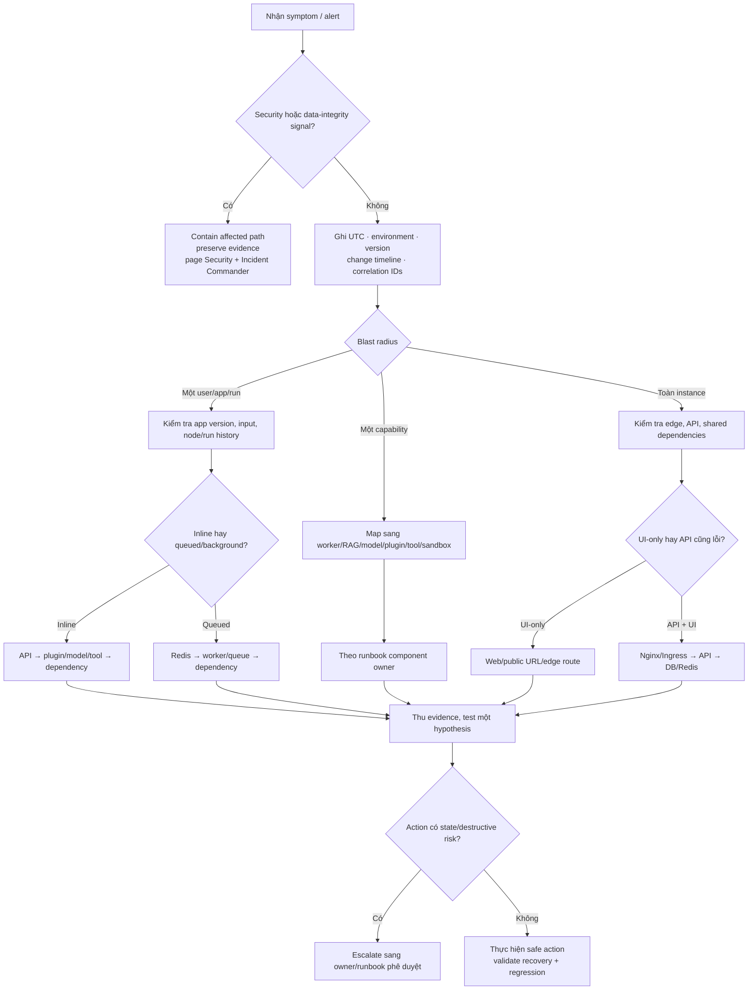

# D. Troubleshooting

> **Version áp dụng:** Dify Community `1.15.0 @ 3aa26fb…`; docs snapshot `release/1.15.0 @ 57a492d…`  
> **Ngày kiểm chứng:** `2026-07-16`  
> **Trạng thái xác minh:** `Official-source verified` + `Config validated` + `Design reviewed` qua cross-review nội bộ; specialist review và mọi lệnh, output, recovery action tại môi trường thật vẫn `RUNTIME-PENDING`
>
> **Reviewer:** Platform/SRE, Database, Security, AI Platform, Integration và Application Owner review pending

## Cách sử dụng

Phụ lục này là **bộ định tuyến triage**, không thay runbook sở hữu bởi từng chương. Mục tiêu là thu hẹp failure domain, giữ evidence và chọn hành động đầu tiên có thể đảo ngược. Khi đã xác định component hoặc data path, chuyển sang chương chịu trách nhiệm để sửa chữa, phục hồi và xác nhận exit criteria.

| Failure domain | Phụ lục này giúp | Runbook/chương sở hữu |
|---|---|---|
| Edge, web, API, WebSocket, execution path | Xác định route/runtime/dependency đầu tiên bị lỗi | [Chương 02 — Kiến trúc hệ thống](../part-1-foundations/02-system-architecture.md) |
| Workflow, RAG, Agent | Phân biệt app/data/branch với platform dependency | [Chương 03](../part-1-foundations/03-workflow.md), [Chương 04](../part-1-foundations/04-rag.md), [Chương 05](../part-1-foundations/05-agent.md) |
| Model, embedding, rerank | Khoanh vùng selection → plugin → network → endpoint → capability | [Chương 06](../part-1-foundations/06-model-management.md), [Chương 14](../part-2-deployment-playbook/14-model-provider-integration.md) |
| MCP, plugin, tool, sandbox | Tách discovery/auth/schema/runtime/side effect | [Chương 07](../part-1-foundations/07-mcp.md), [Chương 08](../part-1-foundations/08-plugins.md), [Chương 13](../part-2-deployment-playbook/13-security-hardening.md) |
| Logs, traces, correlation, retention | Chọn đúng evidence source và data boundary | [Chương 09 — LLMOps](../part-1-foundations/09-llmops-observability.md) |
| Compose hoặc Kubernetes | Dùng diagnostic pack đúng topology, không trộn service với Pod | [Chương 11 — Compose](../part-2-deployment-playbook/11-docker-compose.md), [Chương 12 — Kubernetes/HA](../part-2-deployment-playbook/12-kubernetes-ha.md) |
| Backup, migration, rollback, DR, data integrity | Nhận biết khi nào dừng triage và mở recovery procedure | [Chương 15 — Operations/backup/upgrade/DR](../part-2-deployment-playbook/15-operations-backup-upgrade-dr.md) |

Mọi kết luận phải giữ đúng cấp evidence:

- `Official-source verified`: source/docs cho biết feature hoặc path tồn tại; không chứng minh instance đang chạy đúng.
- `Config validated`: manifest/rendered topology đã kiểm tra tĩnh; không chứng minh DNS, TLS, credential, persistence hoặc failover.
- `Design reviewed`: là target/recommendation; không phải observed behavior.
- `RUNTIME-PENDING`: chưa có log, metric, timing, command output hoặc reproduction từ môi trường mục tiêu.
- `RUNTIME-VALIDATED`: chỉ dùng khi có timestamp, version, environment, procedure, expected/actual và evidence đã redacted.

Các lệnh bên dưới chỉ đọc trạng thái hoặc log có giới hạn. Chúng không phải bằng chứng đã chạy. Không dùng full resolved configuration, Secret object, environment dump hoặc credential-bearing URL làm attachment.

## Quy trình triage

### Nguyên tắc evidence-first và non-destructive

1. **Ghi trước khi đổi:** incident ID, UTC timestamp, environment, deployment type, Dify/core component version, thay đổi gần nhất, first-failure time và blast radius.
2. **Bảo toàn correlation:** request/trace ID, app/conversation/message/workflow-run/node/task ID, model/plugin/tool và downstream request ID nếu có.
3. **Một giả thuyết, một thay đổi:** không đồng thời rotate key, đổi URL, scale worker, đổi model và restart dependency.
4. **Đọc ngoài vào trong:** client/edge → web/API → worker/Beat hoặc plugin/sandbox → PostgreSQL/Redis/vector/storage → external endpoint.
5. **Giảm tải trước khi sửa state:** pause producer/canary hoặc hạn chế traffic bằng approved control nếu backlog, quota, disk hoặc data-integrity risk đang tăng.
6. **Containment trước availability** nếu có secret/PII exposure, cross-user access, sandbox escape, public internal endpoint hoặc split-brain.
7. **Không dùng reset như chẩn đoán:** cấm `docker compose down -v`, xóa volume, database init/reset, Redis `FLUSH*`, schema edit, vector collection delete/reindex, reinstall plugin hoặc restore đè nguồn đang lỗi. Docker xác nhận `down --volumes` xóa named/anonymous volumes; Chương 11 cũng cấm dùng nó như troubleshooting chung. [S-047]
8. **Dừng và escalate** trước action không đảo ngược, migration/recovery, failover, secret mass rotation hoặc action có thể phát lại side effect.

### Quick triage tree



### Checklist 10 phút đầu

- [ ] Xác nhận đúng environment/tenant/workspace và không thao tác nhầm production.
- [ ] Xác nhận Compose hay Kubernetes; ghi namespace/project/host và release revision.
- [ ] Ghi health/status tổng thể, restart count, first error và thay đổi gần nhất.
- [ ] Reproduce bằng fixture không nhạy cảm; không dùng production secret trong terminal history.
- [ ] Xác định symptom xảy ra ở UI, API, streaming/WebSocket, background, scheduled hay dependency-specific path.
- [ ] So sánh một request thành công gần nhất với request lỗi bằng cùng correlation fields.
- [ ] Kiểm tra capacity/quota/disk/queue age để biết incident đang tăng hay ổn định.
- [ ] Chỉ định incident owner và component owner; mở Security/DBA sớm khi có trigger tương ứng.

### Symptom → check → safe action → escalate

| Symptom | Check/evidence ưu tiên | Safe action đầu tiên | Escalate khi / owner |
|---|---|---|---|
| UI và API đều không vào được | DNS/TLS/LB/Nginx hoặc Ingress, edge status, upstream endpoints, API restart | Dừng rollout; giữ hoặc chuyển về approved known-good edge revision nếu runbook cho phép | Widespread/SLO breach, certificate/private-key issue — Platform/SRE + Security |
| UI mở nhưng console/API `4xx/5xx` | Browser network, public/internal URL, route, CORS, web/API/Nginx logs | Khoanh đúng route; sửa một URL/rule qua reviewed config, không mở CORS rộng | Auth/cross-user/data exposure — Application + Platform + Security |
| WebSocket/SSE ngắt hoặc treo | `/socket.io`, `api_websocket`, profile, upgrade header, proxy timeout, worker/Redis event path | Giữ blocking path nếu đã approved; pause rollout; test long connection bằng synthetic user | Nhiều user, reconnect storm, rollout/drain issue — Edge/SRE |
| Upload/indexing đứng `queued/processing` | Task/document ID, queue age, worker consumer/log, Redis, embedding/vector health | Giảm/pause ingestion; khôi phục consumer/dependency; không upload lặp | Backlog vượt budget, duplicate/stale segment risk — Data/RAG + SRE |
| Scheduled cleanup/polling không chạy | Beat identity/log, schedule freshness, worker/DB | Khôi phục **một** Beat theo topology; theo dõi duplicate task ID | Hai scheduler hoặc retention/data-growth risk — SRE + Data owner |
| DB/Redis unhealthy hoặc connection storm | Dependency health, pool/client errors, disk/IO, failover/change timeline | Hạn chế write/load; bảo vệ source data; mời owner | Data loss, split-brain, failover/restore — DBA/Cache owner + IC |
| Knowledge có nhưng retrieval rỗng | Dataset/index metadata, actual backend, document status, filter/threshold, golden query | Freeze config; rollback reviewed config nếu rõ; không đổi backend/reindex mù | Collection/index inconsistency hoặc restore need — RAG + Vector owner |
| Metadata file có nhưng download `404` | Object/mount path, version, permission, storage errors, canary checksum | Dừng write liên quan; preserve object/version; kiểm tra metadata-object consistency | Missing/corrupt storage hoặc recovery set — Storage + DBA + IC |
| Mọi model call lỗi | Plugin daemon, provider config, DNS/TLS/proxy, endpoint status | Pause canary; repair shared path; không đổi hàng loạt provider/key | Shared daemon/outbound outage hoặc quota impact lớn — AI Platform + SRE |
| Chỉ một model/key/capability lỗi | Exact model/type, credential alias, error class, capability/parameter mapping | Disable bad config/canary; bounded approved fallback | Key exposure, billing/quota, embedding dimension drift — AI Platform + Security/FinOps |
| Plugin/MCP/tool lỗi | Daemon, plugin version, DB/storage, discovery/auth/schema, downstream audit | Pin/rollback known version nếu đã rehearsed; pause side-effect tool | Package compromise, credential URL leak, unknown side effect — Integration + Security |
| Code node/sandbox lỗi | Sandbox/SSRF logs, resource limit, key pair, approved egress | Giữ deny-by-default; cô lập workload nếu escape nghi ngờ | Escape, host access, egress bypass — Security incident ngay lập tức |
| App lỗi nhưng dashboard hạ tầng xanh | Run History, node/model/tool output, feedback/golden set | Mở quality/application investigation; không scale hạ tầng theo cảm tính | Safety/quality/business impact — Application + AI Quality owner |
| Có run/log nhưng thiếu trace | Integration status, exporter queue/drop, egress/TLS, sampling, correlation mapping | Chạy canary không nhạy cảm; sửa exporter/config có kiểm soát | Telemetry outage che incident hoặc data egress — Observability + Security |

Topology và failure-domain expectations trong bảng bám Chương 02, Compose/Kubernetes chapters và các component runbook; actual blast radius vẫn phải được tái hiện trên deployment mục tiêu. [S-005][S-010][S-038]

## Installation và startup

### Docker Compose

Bộ lệnh đầu tiên chỉ liệt kê service/profile/image và log có giới hạn; không chạy `docker compose config` không có option vì rendered output có thể chứa secret:

```bash
date -u
docker compose ps -a
docker compose config --quiet
docker compose config --services
docker compose config --profiles
docker compose config --images
docker compose logs --tail=200 nginx web api api_websocket worker worker_beat plugin_daemon
docker compose logs --tail=200 db_postgres redis weaviate sandbox ssrf_proxy
```

Output log vẫn có thể chứa payload, URL hoặc token do application đã ghi; lưu vào evidence store hạn chế quyền và scan/redact trước khi chia sẻ.

Kiểm tra theo thứ tự:

1. Docker daemon/context và Compose version hoạt động.
2. Checkout/tag, `.env` location và Compose profiles đúng release; chỉ so key name/fingerprint, không in value.
3. `init_permissions` exit `0`; mount/storage path có owner và filesystem semantics đúng.
4. PostgreSQL, Redis, vector backend, sandbox và plugin daemon không restart loop.
5. API startup log từ dòng đầu: migration, DB/Redis connection và secret-pair mismatch.
6. `web`, `nginx` và `api_websocket` chỉ kiểm tra sau core dependency; profile `collaboration` quyết định WebSocket service.
7. Upgrade `1.15.0` phải có migration/backfill evidence đúng release; không rerun migration hoặc khởi tạo DB như phép thử. API entrypoint và service modes là release-specific. [S-013]

Nếu container `running` nhưng function fail, không kết luận healthy. Worker healthcheck mặc định có caveat; cần synthetic queue job. Restart loop phải được chẩn đoán từ first error, không bằng restart liên tục. Compose service/mount/profile baseline lấy từ official tag `1.15.0`. [S-005][S-006]

### Kubernetes/Helm target design

Kubernetes chapter là reference design cho Community, không phải bằng chứng có official Community Helm chart hoặc HA đã chạy. Mọi lệnh dưới đây dùng namespace/pod thực tế do operator thay vào; không đọc `Secret` hoặc full Pod YAML:

```bash
kubectl -n <namespace> get pods,deploy,statefulset,job -o wide
kubectl -n <namespace> get ingress,service,endpointslice
kubectl -n <namespace> get events --sort-by=.metadata.creationTimestamp
kubectl -n <namespace> logs <pod> --all-containers --tail=200
kubectl -n <namespace> logs <pod> --all-containers --previous --tail=200
kubectl -n <namespace> get pod <pod> -o jsonpath='{range .status.containerStatuses[*]}{.name}{"\t"}{.restartCount}{"\t"}{.state.waiting.reason}{"\t"}{.lastState.terminated.reason}{"\n"}{end}'
```

Khoanh vùng:

- `Pending`: capacity, affinity/topology, PVC, image pull hoặc policy; không scale/delete mù.
- `CrashLoopBackOff`: startup/first-error, config/secret reference, migration và dependency; `--previous` thường quan trọng hơn log vòng hiện tại.
- Nhiều Pod chạy migration: dừng rollout; migration phải là one-shot Job, còn long-lived workload tắt migration. [S-013][S-086]
- Restart storm khi DB/Redis/provider down: kiểm tra liveness có đang phụ thuộc external stack; dependency health thường thuộc readiness/canary. [S-083]
- `Ready` nhưng API lỗi: probe quá nông, endpoint/pool cạn hoặc route sai; readiness chỉ chứng minh predicate đã cấu hình.
- Drain/eviction block: PDB chỉ quản voluntary disruption và có thể chặn maintenance; không force-delete trước khi hiểu quorum/capacity. [S-082]
- Ingress/WebSocket behavior phụ thuộc controller; timeout, body size, affinity và upgrade header không portable. [S-085]

### Startup stop conditions

Dừng startup/rollout và escalate nếu thấy schema lock/migration cạnh tranh, data directory/version mismatch, missing storage, wrong secret version, plugin DB/storage lệch, image/version trộn hoặc request đã ghi vào cả primary lẫn DR. Không “sửa cho chạy” bằng bypass TLS/signature, privileged container, `chmod 777`, force delete hoặc database reset.

## API và frontend

Official Nginx template route các boundary khác nhau; vì vậy một trang UI tải được không chứng minh API, WebSocket, plugin callback hoặc MCP hoạt động. [S-005][S-010]

| Public path | Runtime đích | Evidence chính |
|---|---|---|
| `/`, `/explore` | `web:3000` | Browser status/static error, web và edge log |
| `/console/api`, `/api`, `/v1`, `/openapi`, `/files`, `/mcp`, `/triggers` | `api:5001` | HTTP status, API correlation, API/dependency log |
| `/socket.io/` | `api_websocket:5001` | Handshake, reconnect, active connection, proxy/drain timing |
| `/e/` | `plugin_daemon:5002` | Edge route, daemon callback/runtime log |

Read-only public smoke không gửi credential:

```bash
curl --silent --show-error --output /dev/null --write-out 'status=%{http_code} connect=%{time_connect} total=%{time_total}\n' https://dify.example.internal/
```

Không thêm `Authorization`, cookie, signed URL hoặc MCP credential vào shell history/ticket. Với authenticated route, dùng approved synthetic client/secret injection và chỉ ghi alias/fingerprint vào evidence.

Triage theo lớp:

1. **Client:** URL, DNS resolver, certificate/SAN/expiry, browser time, proxy và response status.
2. **Edge:** exact path, upstream, status (`499/502/503/504`), request ID, upload/body limit, buffering và timeout.
3. **Web:** server-side internal API URL khác browser public URL; sai `SERVER_CONSOLE_API_URL`, public URL hoặc CORS có thể cho UI shell nhưng làm console/API lỗi. [S-005][S-006][S-009]
4. **API:** startup/restart, DB/Redis pool, request mode, app/version và downstream correlation.
5. **Streaming:** phân biệt SSE của app/workflow với `/socket.io/` collaboration. Workflow/Chatflow streaming còn phụ thuộc worker và Redis event path; blocking success không loại trừ worker/Redis failure. [S-034][S-035][S-036][S-037]
6. **Kubernetes rollout:** đối chiếu connection drop với Pod termination, readiness removal, grace period, Ingress/Gateway và client reconnect.

Safe action là dừng rollout, khôi phục một reviewed route/URL/certificate revision hoặc tạm dùng approved blocking mode. Không tắt TLS verification, mở CORS wildcard, tăng mọi timeout vô hạn hay bật sticky session nếu chưa có evidence.

## Worker và queue

Không dùng “API chạy” để kết luận worker khỏe, và không dùng “worker down” để kết luận mọi request phải lỗi. Dify `1.15.0` có bốn path khác nhau: inline online ở API, queued streaming qua worker/Redis, background jobs ở Celery worker và scheduled jobs do Beat phát. [S-011][S-012][S-013][S-034][S-035][S-036][S-037]

| Symptom | Failure domain ưu tiên | Evidence cần giữ | Hành động an toàn |
|---|---|---|---|
| Completion/Chat blocking lỗi ngay | API, plugin/model/tool/dependency; chưa chắc worker | Request/run ID, API log, downstream error | Theo inline path; không scale worker |
| Workflow/Chatflow blocking đạt nhưng streaming treo | Worker, Redis subscription/event path, edge buffering | Run/task ID, queue/worker/Redis/edge timeline | Tạm blocking nếu approved; sửa consumer/event path |
| Document đứng queued | Dataset queue/worker, Redis, embedding/vector dependency | Document/task ID, queue age, worker/provider/vector log | Pause ingestion; synthetic indexing; không upload lại hàng loạt |
| Backlog tăng, worker `running` | Consumer/queue routing, concurrency, downstream throttle | Queue name, oldest age, consumer count, worker first error | Giảm producer; sửa routing/dependency; scale chỉ theo capacity budget |
| Task chạy trùng sau restart/drain | Ack/redelivery, grace period, non-idempotent side effect | Task/business/idempotency ID, attempt, downstream audit | Fence side effect; reconcile; không retry/requeue mù |
| Cleanup/polling mất | Beat down, schedule/config, worker/DB | Beat identity, emit time, task freshness | Khôi phục singleton scheduler; monitor missed tasks |
| Cleanup/polling chạy trùng | Hai Beat active do rollout/DR | Scheduler identity, duplicated task ID/side effect | Dừng một scheduler; reconcile impact; mở incident nếu side effect |

Triage worker/queue:

1. Xác định producer, queue và expected consumer từ exact release/config.
2. Ghi oldest-message age, arrival/consume rate và worker concurrency; queue length đơn lẻ không cho biết stagnation.
3. Tìm first dependency error trước retry storm: Redis, DB, provider, vector, plugin hoặc storage.
4. Xác định task có side effect/idempotency/dedup không trước retry, replay hoặc requeue.
5. Kubernetes chỉ scale worker sau khi queue mapping và downstream quota/capacity rõ; CPU-only scaling có thể không phản ánh backlog.
6. Beat là scheduler, không phải worker replacement. Giữ singleton cho tới khi distributed scheduling được chứng minh.

Redis là broker/backend mặc định và tham gia một số event/stream path, không chỉ là cache. Không flush hoặc restore Redis giữa incident để “làm sạch queue”; recovery/replay decision thuộc Chương 15 và cần business reconciliation. [S-006][S-011][S-039]

## Database, cache, vector store và storage

### State map trước khi thao tác

| Store | Vai trò trong baseline | Symptom thường thấy | Ranh giới safe action |
|---|---|---|---|
| PostgreSQL main DB | Workspace/app/config/conversation/run và state nghiệp vụ | API `5xx`, login/config fail, pool/lock/migration error | Hạn chế write; kiểm tra health/locks/disk qua DBA; không init/edit schema/restore đè |
| PostgreSQL plugin logical DB | Plugin lifecycle/runtime metadata | Install/invoke fail trong khi core phần khác còn chạy | Giữ cùng recovery point với plugin storage; không reinstall mù |
| Redis | Celery broker/backend, cache và event/stream path tùy code path | Queue đứng, stream treo, reconnect/retry storm | Bảo vệ instance; không `FLUSH*`, key delete hàng loạt hoặc restore không reconcile |
| Vector backend | Embedding index/collection cho knowledge | Indexing fail, retrieval rỗng hoặc stale | Freeze backend/model config; kiểm tra stored index metadata; không xóa collection/reindex mù |
| Application storage | Upload/file/knowledge artifact | Upload/download `404`, metadata-object lệch | Dừng write liên quan; giữ object/version/checksum; không overwrite source |
| Plugin storage | Package/runtime asset | Plugin mất sau restart, DB có metadata nhưng asset thiếu | Restore đồng bộ với plugin DB; pin inventory/version |

### Chẩn đoán theo component

**PostgreSQL**

- Phân biệt unavailable, auth/secret mismatch, connection-pool exhaustion, disk/IO, migration lock và schema incompatibility.
- Lưu DB server/version, database name **không chứa credential**, connection error class, migration head/lock evidence và change timeline.
- Nếu nhiều process chạy migration, dừng rollout/writer theo runbook; không tự chỉnh migration table.
- Mọi failover, PITR, restore, role remap hoặc data repair thuộc DBA + Chương 15.

**Redis/cache/queue state**

- Kiểm tra connectivity/latency, memory/eviction, reconnect, blocked client, queue age và event delivery; không suy mọi Redis key là disposable cache.
- Nếu Redis failover vừa xảy ra, đối chiếu task duplicate/loss, stream reconnect và result state.
- Không reset để chữa stale UI; xác định key class/owner và release behavior trước bất kỳ deletion nào. Client support cho standalone/Sentinel/Cluster không tự chứng minh deployment failover semantics. [S-039]

**Vector backend**

- Xác nhận dataset/index đang trỏ backend/collection/model nào từ stored metadata, không chỉ current `VECTOR_STORE`.
- So document/segment state, vector collection/count, embedding dimension/model và một golden retrieval query.
- Đổi endpoint/backend không migrate existing index. Rollback config hoặc chạy approved migration/reindex plan; không coerce vector dimension. [S-056]

**Application/plugin storage**

- So metadata ID/path với actual object/mount/version, filesystem owner, free space, object-store error và canary checksum.
- Pod/container-local file success không chứng minh shared storage; đọc từ replica khác nếu topology có nhiều replica.
- Không dùng permission mở rộng hoặc copy đè để “thử”. Nếu metadata và object khác recovery point, giữ target cô lập và chọn full recovery set.

Data integrity luôn thắng partial availability. DB, object/file, vector và plugin state không có distributed transaction chung được chứng minh; một store “healthy” không chứng minh cross-store consistency. Recovery bundle và RPO/RTO thuộc Chương 15.

## Model providers

Mọi LLM, embedding và rerank plugin-backed call đi qua `plugin_daemon` trong baseline; daemon outage có thể làm nhiều provider cùng lỗi. [S-038] Khoanh vùng theo đúng thứ tự, không đổi nhiều biến:

1. **Consumer/selection:** app, node, model type, exact model ID, default hay pinned model.
2. **Plugin/schema:** installed plugin version, model capability, completion mode và parameter mapping.
3. **Credential:** alias, owner, scope, expiry/revoke và provider audit; không in key.
4. **Plugin daemon:** service health, API↔daemon inner connectivity/auth, plugin DB/storage.
5. **Network:** DNS từ plugin runtime, route, firewall, proxy, TLS chain/SAN/SNI/custom CA.
6. **Endpoint:** base URL/path/deployment/model, auth result, provider status, replica/model revision.
7. **Capacity/policy:** timeout, `429`, quota, concurrency, cold load, GPU/OOM, retry/fallback.
8. **Protocol/capability:** streaming terminal/error, tool calls, structured output, embedding dimension và rerank order.

| Symptom | Check | Safe action | Escalate |
|---|---|---|---|
| Mọi provider/model type lỗi | Daemon/inner path, plugin DB/storage, shared egress | Restore shared control path; provider switch không giải quyết daemon outage | Plugin Platform + SRE |
| `401/403` một config | Alias/scope/project/revoke, provider audit | Disable bad config; rotate qua secret process; retest synthetic | Security nếu nghi exposure; AI Platform owner |
| DNS/TCP/TLS timeout | Runtime DNS/route/proxy, CA/SAN/expiry/SNI | Sửa network/cert hẹp; không disable verify | Network/Security nếu private endpoint/CA |
| `429`/quota | Provider headers/dashboard, traffic, retries, account pool | Backoff/admission, giảm tải; bounded approved fallback | FinOps/provider owner khi hard quota |
| Blocking đạt, streaming lỗi | Proxy buffering/idle timeout, chunk/terminal mapping, disconnect | Giữ blocking nếu business cho phép; capture redacted stream timeline | Edge + plugin/provider owner |
| Tool/JSON output sai | Model capability, parser/template, schema validator | Tắt capability/canary; fail closed; không parse lỏng | Application safety owner |
| Embedding dimension/index drift | Model/revision, endpoint output, index metadata | Rollback model/config; plan dual-index/reindex | RAG/vector owner; không sửa vector tại chỗ |
| Rerank fail/slow | Path/model, candidates/Top N, timeout/quota | Approved fail/degrade branch; không silent bypass | AI Quality owner |
| Self-host replica khác output | Mixed model revision/template/config | Drain mixed canary/pool theo LB runbook; pin homogeneous revision | Model serving/SRE |

Dify error taxonomy có auth, connection, rate-limit/quota và node/system classes, nhưng installed plugin mapping vẫn phải được quan sát. Retry/fallback chỉ dựa trên typed error đã phê duyệt; không retry storm hoặc dùng cross-model fallback như credential rotation. [S-060][S-066][S-072]

Toàn bộ provider runtime test trong Chương 14 đang `RUNTIME-PENDING` nếu chưa có evidence package từ endpoint thật.

## Plugins, MCP và tools

### Plugin và plugin daemon

- Xác định lỗi ở API→daemon, daemon→plugin process, daemon DB/storage, package/version hay downstream provider/tool.
- Model-provider dispatch cũng dùng daemon; “không dùng custom plugin” không loại daemon khỏi critical path. [S-038]
- So core version, daemon image, installed plugin version/hash/source, last update, plugin DB/storage và egress.
- Nếu regression sau update, pause rollout và rollback **version đã pin** chỉ khi procedure đã được rehearsal. Không reinstall, auto-update, xóa plugin storage hoặc DB metadata như phép thử.
- Không expose debug port `5003`, tắt signature verification hoặc mở unrestricted egress để chữa invocation. Plugin version drift độc lập với Dify core. [S-005][S-016][S-032]

### MCP client/server

| Symptom | Check theo thứ tự | Safe action |
|---|---|---|
| Discovery không kết nối | Direction client/server, URL host, DNS/TLS/proxy, transport | Sửa connectivity; không đổi app/model trước |
| `401/403` | OAuth/header/token expiry/scope, credential alias | Re-authorize/rotate theo process; không log header/token |
| Tool mất/schema lỗi | Discovery metadata, server version/change, cached catalog | Re-discover và regression-test affected app |
| Invocation timeout | Dify/server/downstream latency, timeout budget, quota | Retry chỉ operation idempotent; cap total budget |
| Published MCP URL bị lộ | Access log, secret scan, consumer inventory | Revoke/regenerate, rollout consumer, security triage |
| Endpoint reachable nhưng call lỗi | App run, plugin/model/tool/knowledge dependency | Chuyển sang runbook runtime tương ứng |

Dify MCP client auth/transport và app-as-server URL behavior bám docs snapshot; server URL mang credential phải được xử lý như secret. Không paste URL đầy đủ vào command, screenshot hoặc ticket. [S-014][S-015]

### Tool side effect và sandbox

- Ghi tool name/version, input schema hash, attempt, idempotency/business ID và downstream audit ID trước retry.
- Nếu side effect không rõ, disable affected app/tool path hoặc fence downstream theo approved runbook; không “test lại” trên production.
- Code node failure: kiểm tra sandbox health, resource/time limit, API key pair, SSRF proxy và egress policy; giữ deny-by-default.
- Sandbox/SSRF bypass, host access hoặc escape suspicion là security incident: isolate workload/host, preserve evidence, revoke exposed credential và báo cáo theo private security channel. [S-078]
- Không chạy malicious reproduction trên production, không cấp privileged mode, host mount hoặc blanket network access.

## Observability và evidence

### Correlation contract tối thiểu

| Lớp | Field/evidence cần giữ |
|---|---|
| Incident | Incident ID, UTC first/last seen, environment, severity, blast radius, reporter |
| Release/topology | Dify/core/daemon/plugin/model version, image digest nếu có, Compose project hoặc K8s namespace/revision |
| Request | Trace/request ID, route, response mode, HTTP status, edge/API timestamp |
| Application | Workspace/app/version, user pseudonymous ID, conversation/message, workflow run và node ID |
| Queue | Task/business/idempotency ID, queue, producer/consumer, attempt, enqueue/start/end time |
| Extension/model | Plugin/tool/provider/model ID và version, credential **alias/fingerprint**, downstream request ID, typed error |
| Data | Dataset/document/index/storage object ID, backend/version; không đính kèm raw sensitive content mặc định |
| Change | Deploy/config/secret/cert/model/plugin change ID, actor/team, start/end và rollback status |

Built-in **Application Logs** dành cho live/published interaction; draft/debug run có thể nằm ở **Run History**. Dùng sai source dễ kết luận “không có log”. [S-073][S-074]

### Thu và chia sẻ evidence

1. Thu bounded time window quanh first failure và một known-good request; đồng bộ timezone về UTC.
2. Đi theo cùng correlation qua edge → API → worker/Beat → plugin/sandbox → dependency/provider.
3. Giữ raw evidence trong restricted store; tạo bản redacted để ticket/vendor escalation.
4. Redact `Authorization`, cookie/session, password/key/token, `.env`, Secret value, signed/MCP URL, prompt/response/PII và file content không cần thiết.
5. Ghi command/tool version, exact command, exit code và timestamp; không chỉ paste ảnh màn hình.
6. Ghi hypothesis, expected signal, actual signal và action; một log line không tự chứng minh root cause.
7. Sau safe action, chạy cả recovery canary và regression canary ở path liên quan.

Mẫu record không chứa secret:

```yaml
incident_id: INC-YYYY-NNN
observed_at_utc: YYYY-MM-DDTHH:MM:SSZ
environment: production-or-lab
deployment: compose-or-kubernetes
release:
  dify: 1.15.0
  revision: approved-release-id
scope:
  affected_apps: count-or-redacted-aliases
  affected_paths: [ui, api, streaming, background, scheduled]
correlation:
  request_id: redacted-or-pseudonymous-id
  workflow_run_id: redacted-or-pseudonymous-id
first_error:
  component: component-name
  class: typed-error-without-payload
change_before_incident: approved-change-id-or-none
hypothesis: one-testable-statement
action_taken: read-only-or-approved-safe-action
result: expected-vs-actual
evidence_location: restricted-store-reference
```

Không bật `DEBUG=true`, full request/response logging hoặc full telemetry sampling như phản xạ chung. Baseline có logging/request logging, Sentry và OTLP controls, nhưng debug/body logging có thể lộ prompt, response hoặc secret. Ưu tiên structured metadata, correlation và short-lived scoped diagnostic có approval/expiry. [S-009]

### Evidence gate

- Source/config/design claim giữ nguyên nhãn cho tới khi có runtime observation.
- Command exit `0` chỉ chứng minh command đó, không chứng minh end-to-end app health.
- Container/Pod `running/Ready` không chứng minh queue consume, retrieval, plugin, model hoặc storage consistency.
- Một request success không chứng minh HA/failover; một backup Job success không chứng minh restore.
- Dashboard xanh không chứng minh answer quality, authorization hoặc tool side-effect safety.

## Escalation

### Escalate ngay, không tiếp tục trial-and-error

- Secret/PII leak, cross-user/tenant access, public internal endpoint, SSRF bypass, sandbox/plugin compromise hoặc suspicious package.
- Data corruption/loss, split-brain, primary và DR cùng ghi, DB/schema inconsistency, missing storage/vector/plugin recovery set.
- Migration/backfill cạnh tranh hoặc thất bại, restore/failover/PITR/rollback, Redis replay hay action có thể nhân side effect.
- Widespread outage/SLO breach, growing backlog/disk/quota, unknown blast radius hoặc không còn reversible safe action.
- Provider billing/quota anomaly, key exposure, model/embedding drift tác động nhiều app.
- Incident cần vendor/private vulnerability report; Dify security policy yêu cầu private Security Advisory thay vì public issue cho vulnerability. [S-078]

### Routing owner

| Trigger | Primary owner | Bắt buộc phối hợp |
|---|---|---|
| Edge/API/Compose/K8s rollout | Platform/SRE on-call | Application owner; Security nếu TLS/auth/exposure |
| PostgreSQL/schema/migration/recovery | DBA | Platform, application/data owner, Incident Commander |
| Redis/queue/replay/duplicate | Platform/Cache owner | Worker owner, business owner của side effect |
| Vector/RAG/index | RAG/Data Platform | Model provider, storage, application quality owner |
| Model/provider/quota/cost | AI Platform | Network, Security, Privacy/Legal, FinOps/provider support |
| Plugin/MCP/tool | Integration/Plugin owner | AI Platform, downstream owner, Security |
| Sandbox/SSRF/secret/data exposure | Security Incident Response | Platform, application/data owner; private vendor channel |
| Backup/DR/split-brain | Incident Commander + Service owner | DBA, Storage, Security, Network/DNS, business owner |

### Escalation bundle bắt buộc

- Incident/severity, business impact, affected environment/workspace/app/path và UTC timeline.
- Dify commit/version, docs/config baseline, daemon/plugin/model/provider revision, image digest/release ID nếu có.
- Compose service/profile/image list **hoặc** K8s namespace/workload/job/revision/status; không trộn hai topology.
- First error và 100–200 dòng log liên quan trước/sau, đã redacted; correlation chain và one known-good comparison.
- Change/deploy/config/secret/cert/model/plugin timeline; diff chỉ gồm non-secret key/structure hoặc fingerprint.
- Capacity state: queue age/rate, worker consumers, DB/Redis/vector/storage health, disk/IO, provider quota và telemetry drop.
- Hypotheses đã test, exact read-only commands/exit codes, safe actions và observed result.
- Data-integrity/side-effect assessment, containment/fencing status, recovery-point ID nếu liên quan.
- Owner/on-call/contact, requested decision và deadline; nêu rõ action nào cần approval.

Không đính kèm `.env`, full `docker compose config`, `kubectl get secret ...`, Secret manifest, DB dump, Redis dump, provider/API key, cookie/session, private key/certificate bundle, MCP credential URL, signed object URL hoặc unredacted prompt/file/user data. Nếu vendor cần raw artifact, dùng approved secure transfer, least privilege, retention/expiry và access audit.

### Exit criteria

Chỉ hạ incident khi symptom không còn, synthetic và representative path đạt, backlog/capacity ổn định, data/side effect đã reconcile, telemetry/correlation hoạt động, security containment hoàn tất và owner xác nhận. Ghi root cause hoặc trạng thái “unknown”, action follow-up, runbook/test cần bổ sung và evidence gap vẫn `RUNTIME-PENDING`; không biến recovery tạm thời thành root-cause claim.

### Nguồn trụ cột đã dùng

- [S-005] Dify Docker Compose tại tag `1.15.0`: service, dependency, route-adjacent topology và persistent mounts.
- [S-006] Docker `.env.example` tại tag `1.15.0`: profile, URL, DB/Redis/vector/storage/plugin/sandbox configuration.
- [S-009] Environment Variables, docs snapshot `57a492d…`: logging, request logging, Sentry/OTLP và runtime configuration.
- [S-010] Nginx route template tại tag `1.15.0`: web/API/WebSocket/plugin callback routing.
- [S-011] Celery extension tại tag `1.15.0`: broker/backend và scheduled-task configuration.
- [S-012] Document indexing task tại tag `1.15.0`: background indexing path.
- [S-013] API image entrypoint tại tag `1.15.0`: API/worker/Beat/migration modes và queue controls.
- [S-014][S-015] Dify MCP client và publish-as-MCP-server docs snapshot.
- [S-016] Integrations and Plugins docs snapshot: plugin lifecycle/governance surface.
- [S-032] Plugin Daemon README `0.6.3`: daemon lifecycle/runtime boundary.
- [S-034][S-035][S-036][S-037] App generation, queued workflow execution và Redis streaming source paths tại `1.15.0`.
- [S-038] Plugin model implementation tại `1.15.0`: LLM/embedding/rerank dispatch qua plugin daemon.
- [S-039] Redis extension tại `1.15.0`: supported client topology; runtime failover vẫn cần validation.
- [S-047] Docker Compose `down` reference: volume-removal semantics.
- [S-056] Vector factory tại `1.15.0`: existing index backend resolution.
- [S-060] Node and System Error Types, docs snapshot: typed error taxonomy.
- [S-066] LLM Node, docs snapshot: retry/fallback/structured-output behavior.
- [S-072] Model Manager source tại `1.15.0`: same-model credential cooldown/load-balancing boundary.
- [S-073][S-074] Application Logs và Workflow Run History docs snapshot.
- [S-078] Dify Security Policy tại tag `1.15.0`: private vulnerability reporting.
- [S-082][S-083][S-085][S-086] Kubernetes disruptions, probes, Ingress và Jobs official docs; exact cluster/controller behavior vẫn environment-specific.
