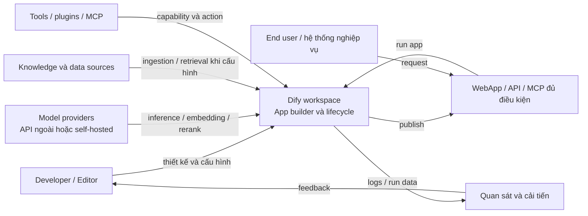

# 01. Tổng quan Dify

> **Version áp dụng:** Community Edition `1.15.0`; Enterprise/Cloud theo snapshot nguồn công khai ngày truy cập  
> **Docs snapshot:** `release/1.15.0 @ 57a492d8063d1583c582b4c0444fb838c6dd3027`  
> **Ngày kiểm chứng:** `2026-07-16`  
> **Trạng thái xác minh:** `Official-source verified`; runtime đang `RUNTIME-PENDING`  
> **Reviewer:** Platform/Product/Security review pending

## Mục tiêu

Chương này cung cấp mental model chung trước khi đi vào kiến trúc và triển khai. Sau khi đọc, người đọc cần:

1. Giải thích được Dify là lớp nào trong một hệ thống ứng dụng AI và phân biệt nó với model, vector database hoặc hạ tầng inference.
2. Nhận diện các năng lực cốt lõi: Workflow, RAG, Agent, model management, plugin/tool, observability và API phục vụ tích hợp.
3. Phân biệt ba hình thức cung cấp được Dify công bố: Community Edition self-hosted, Enterprise và Dify Cloud.
4. Biết phần trách nhiệm nào thuộc Dify, phần nào vẫn thuộc đội ứng dụng, Platform, Security và Operations.
5. Chọn được chương tiếp theo thay vì coi chương tổng quan là hướng dẫn production hoàn chỉnh.

Dify tự mô tả là một nền tảng phát triển ứng dụng LLM mã nguồn mở, kết hợp visual workflow, RAG, Agent, quản lý model, observability và API để đưa ứng dụng từ prototype đến production. [S-003] Trong bộ tài liệu này, mô tả đó được dùng làm **định vị sản phẩm**, không phải bằng chứng rằng mọi workload sẽ tự động đạt yêu cầu production.

## Phạm vi và giả định

### Dify là gì trong hệ thống

Dify là lớp **application orchestration và lifecycle** nằm giữa người xây dựng ứng dụng, model/data/tool ở phía dưới và người dùng hoặc hệ thống tích hợp ở phía trên. Nền tảng cung cấp một workspace để đội ngũ cấu hình model, knowledge base, integration và xây dựng/publish ứng dụng. [S-003][S-028]

Dify **không phải**:

- một foundation model hay inference engine; model vẫn do provider bên ngoài hoặc hạ tầng tự host cung cấp;
- một vector database; Dify sử dụng vector store như một dependency cho các luồng retrieval khi được cấu hình;
- một biện pháp compliance tự thân; quyền truy cập, network, secret, logging, retention và quy trình vận hành vẫn phải được thiết kế;
- một dịch vụ managed khi dùng Community Edition self-hosted; tổ chức tự chịu trách nhiệm cho availability, backup, upgrade và incident response;
- sự thay thế mặc định cho mọi mã ứng dụng: logic nghiệp vụ đặc thù vẫn có thể nằm ngoài Dify và gọi ứng dụng Dify qua API. [S-003]

### Baseline và mức bằng chứng

- Community Edition (CE) được khóa tại tag `1.15.0`, phát hành ngày `2026-06-25`. [S-001]
- Nội dung thao tác sản phẩm dùng docs snapshot bất biến `57a492d…`; không dùng nhánh `main` để suy ra hành vi của baseline.
- Thông tin Enterprise và Cloud là snapshot trang sản phẩm/pricing tại `2026-07-16`. Đây là bằng chứng về thông tin công khai, không phải entitlement đã được xác nhận bằng hợp đồng hoặc runtime test. [S-018][S-019]
- Chương này chỉ mô tả product mental model. Runtime topology, queue, state ownership và failure domain nằm ở [Chương 02](02-system-architecture.md).

### Ba hình thức cung cấp

| Hình thức | Ai vận hành | Điểm định vị từ nguồn chính thức | Cách sử dụng trong tài liệu này |
|---|---|---|---|
| Community Edition self-hosted | Tổ chức tự triển khai và vận hành | Core feature surface trong public repository; quick start bằng Docker Compose; một workspace theo thông tin công khai hiện tại [S-003][S-007][S-018][S-028] | Baseline kỹ thuật chính, version-pinned tại `1.15.0` |
| Enterprise | Dify/đối tác hoặc tổ chức theo mô hình triển khai đã thỏa thuận | Trang công khai nêu multi-workspace, SSO/RBAC/audit, hỗ trợ, K8s/Helm và các lựa chọn private deployment [S-018][S-019] | Chỉ dùng để lập requirement/edition matrix; cần artifact, hợp đồng và review riêng trước khi khẳng định capability |
| Dify Cloud | Dify vận hành SaaS | Trải nghiệm hosted không cần tự dựng hạ tầng; quota và khả năng phụ thuộc plan hiện hành [S-003][S-018] | Dùng làm lựa chọn build/POC hoặc managed service; không phải mục tiêu của self-host playbook |

Tên gọi “open source” xuất hiện trong README và trang sản phẩm, nhưng văn bản kiểm soát quyền sử dụng CE là `LICENSE` tại đúng tag. License dựa trên Apache 2.0 và có điều kiện bổ sung; kết luận pháp lý phải do Legal thực hiện tại [Chương 10](10-editions-license.md). [S-003][S-004]

## Cơ chế hoạt động

Ở tầng sản phẩm, vòng đời điển hình gồm sáu bước:

1. **Tổ chức tài nguyên trong workspace.** App, knowledge base, thành viên, model configuration và integration thuộc một workspace; quyền vai trò quyết định khả năng truy cập tài nguyên. [S-028]
2. **Chọn loại ứng dụng và thiết kế logic.** Người xây dựng dùng visual canvas/prompt interface để kết hợp input, model, retrieval, điều kiện, tool hoặc Agent theo use case. [S-003]
3. **Gắn capability bên ngoài.** Model provider, data source và tool có thể được đưa vào qua cấu hình hoặc plugin. Plugin là module mở rộng để kết nối API, xử lý dữ liệu, thực hiện tính toán/hành động, hoặc cung cấp model/tool/strategy/data source/trigger. [S-029]
4. **Test và hiệu chỉnh.** Prompt, model, knowledge/retrieval và workflow được thử trước khi publish; log, performance data và annotation hỗ trợ vòng lặp cải tiến. [S-003]
5. **Publish cho consumer.** Ứng dụng có thể được dùng qua giao diện do Dify cung cấp hoặc API để nhúng vào hệ thống nghiệp vụ; một số workflow đủ điều kiện còn có thể được expose qua MCP. [S-003][S-015][S-026]
6. **Vận hành và quản trị.** Đội vận hành theo dõi dependency, latency, quota, lỗi workflow/model/tool, dữ liệu và phiên bản. Với self-hosted, trách nhiệm này không chuyển sang model provider hay Dify.

Mỗi ứng dụng chỉ sử dụng các capability thực sự được cấu hình. Ví dụ, một workflow không có Knowledge Retrieval không nhất thiết truy cập vector store; một workflow không dùng Code node không nhất thiết gọi sandbox. Các nhánh runtime cụ thể được mô tả ở Chương 02–05.

## Kiến trúc/luồng dữ liệu

Sơ đồ sau là **product context**, không phải deployment topology:

Điểm quan trọng của sơ đồ:

- Workspace là ranh giới tổ chức tài nguyên và cấu hình, không đồng nghĩa với một security boundary hoàn chỉnh nếu network, IAM và data store chưa được harden. [S-028]
- Model, knowledge và extension là dependency có điều kiện; không nên vẽ chúng như những bước bắt buộc của mọi request.
- Dify có cả mặt phẳng xây dựng/quản trị và mặt phẳng phục vụ app đã publish. Việc UI hoạt động không chứng minh một app run end-to-end thành công.
- WebApp/API/MCP là kênh sử dụng khác nhau; quyền publish, credential và input contract phải được quản trị riêng. [S-003][S-015]

Xem [Chương 02](02-system-architecture.md) để map mental model này sang `web`, `api`, Celery worker, PostgreSQL, Redis, vector store, storage, plugin daemon, sandbox và Nginx.

## Hướng dẫn hoặc ví dụ triển khai

### Lộ trình làm quen tối thiểu

Đây là lộ trình orientation, chưa phải production runbook:

1. Đọc [phạm vi và baseline](../00-scope-version-and-assumptions.md), chọn CE self-hosted, Enterprise hay Cloud làm đối tượng thử nghiệm.
2. Chọn **một** use case nhỏ có tiêu chí đầu ra rõ ràng, ví dụ hỏi đáp trên một bộ tài liệu không nhạy cảm.
3. Xác định consumer: người dùng WebApp hay hệ thống gọi API. Không xây đồng thời tất cả kênh ở vòng đầu.
4. Cấu hình một model provider thử nghiệm bằng credential riêng cho lab; ghi rõ dữ liệu nào có thể rời khỏi trust boundary.
5. Tạo app đơn giản, sau đó chỉ thêm Knowledge Retrieval hoặc tool khi baseline không đáp ứng tiêu chí.
6. Chạy một bộ câu hỏi cố định, ghi output, latency, token/cost và lỗi; không đánh giá chỉ bằng một demo thành công.
7. Khi flow chức năng đã rõ, chuyển sang [Compose playbook](../part-2-deployment-playbook/11-docker-compose.md), [model provider integration](../part-2-deployment-playbook/14-model-provider-integration.md) và [security hardening](../part-2-deployment-playbook/13-security-hardening.md).

### Ví dụ: trợ lý tra cứu tài liệu nội bộ

| Câu hỏi thiết kế | Lựa chọn POC tối thiểu | Bằng chứng cần thu |
|---|---|---|
| Consumer là ai? | Một nhóm evaluator qua WebApp | Danh sách evaluator và quyền truy cập |
| Dữ liệu nào? | Một corpus đã phân loại là không nhạy cảm | Nguồn, owner, phiên bản corpus |
| Model nào? | Một provider/model đã được phê duyệt cho lab | Credential owner, region/endpoint, retention assumption |
| Dify capability nào? | Workflow/Chat app + Knowledge Retrieval; chưa dùng Agent/tool | App config và test cases |
| Thành công là gì? | Trả lời đúng/có căn cứ trên bộ câu hỏi chuẩn | Accuracy rubric, latency và failure log |
| Bước sau POC? | Threat model, load test, backup/restore và edition review | Sign-off của Product/Platform/Security/Legal |

Nếu use case chủ yếu là tích hợp backend, giữ cùng workflow nhưng đánh giá qua API thay vì WebApp. Nếu use case cần hành động bên ngoài, chỉ thêm tool/plugin sau khi xác định permission, timeout, idempotency và audit requirement.

## Quyết định và trade-off

### Khi Dify là lựa chọn hợp lý

Dify đáng được đưa vào shortlist khi tổ chức cần một bề mặt chung để:

- xây và thay đổi luồng AI trực quan;
- kết hợp model, retrieval và tool mà không tự dựng toàn bộ orchestration layer;
- publish app qua UI/API;
- cho nhiều vai trò cùng cấu hình, thử nghiệm và quan sát ứng dụng;
- tiêu chuẩn hóa các POC trước khi chọn phần nào cần viết code chuyên biệt. [S-003][S-028][S-029]

### Trade-off cần chấp nhận

| Lợi ích kỳ vọng | Chi phí/giới hạn đi kèm |
|---|---|
| Visual builder rút ngắn vòng lặp thử nghiệm | Có thêm abstraction; debug cần hiểu cả graph lẫn runtime dependency |
| Model/tool/plugin ecosystem mở rộng nhanh | Provider và plugin trở thành external failure/trust domain |
| Workspace gom app, model, knowledge và thành viên | Cần quản trị blast radius, quyền thay đổi và tách môi trường rõ ràng |
| API giúp nhúng AI vào sản phẩm | Hệ thống gọi vẫn phải xử lý auth, timeout, retry, idempotency và contract versioning |
| Self-host tăng quyền kiểm soát deployment/data path | Tổ chức nhận toàn bộ gánh nặng patching, backup, capacity, monitoring và DR |
| Enterprise bổ sung control/support công khai | Capability, entitlement và topology phải xác nhận qua artifact/hợp đồng; không suy từ marketing page |

Một heuristic thực dụng: nếu giá trị chính nằm ở orchestration, retrieval, experimentation và tích hợp đa model, Dify có thể giảm thời gian tạo application layer. Nếu workload chỉ là một call model đơn giản, yêu cầu latency cực chặt hoặc cần runtime hoàn toàn tùy biến, một service viết trực tiếp có thể ít thành phần và dễ kiểm soát hơn. Đây là quyết định kiến trúc theo workload, không phải tuyên bố capability của nhà cung cấp.

## Security và operations implications

- **Self-hosted không đồng nghĩa dữ liệu luôn ở nội bộ.** Prompt, chunk, file hoặc tool input có thể rời môi trường khi app gọi model/tool/data source bên ngoài. Phải lập data-flow inventory theo từng app. [S-003][S-029]
- **Workspace là đơn vị quản trị, không thay thế defense in depth.** Role trong ứng dụng cần đi cùng SSO/IAM phù hợp edition, network segmentation, secret management và quyền ở data store. [S-028]
- **Plugin là supply-chain và execution boundary.** Nguồn cài đặt, permission, update policy, outbound destination và secret access phải được review trước khi enable. Xem [Chương 08](08-plugins.md).
- **Model provider là failure và compliance domain.** Quota, rate limit, region, retention, content policy, endpoint certificate và credential rotation thuộc thiết kế vận hành. Xem [Chương 06](06-model-management.md) và [Chương 14](../part-2-deployment-playbook/14-model-provider-integration.md).
- **Dữ liệu không chỉ nằm trong prompt.** Metadata ứng dụng, knowledge artifact, vector index, log, annotation, file và plugin state đều phải có owner, retention và backup rule.
- **Enterprise control không được mặc định cho CE.** Trang Enterprise công bố SSO/RBAC/audit/SIEM và private deployment, nhưng CE baseline phải được kiểm tra độc lập trước mỗi security design. [S-018][S-019]
- **License là một deployment gate.** Không triển khai thương mại/multi-tenant hoặc thay đổi branding dựa trên tóm tắt; dùng văn bản license và Legal review. [S-004]

## Failure modes và troubleshooting

| Hiện tượng | Nguyên nhân thường bị nhầm ở tầng tổng quan | Hướng phân loại đầu tiên |
|---|---|---|
| Console mở được nhưng app run lỗi | UI health không chứng minh model credential, egress, worker hoặc provider hoạt động | Tách lỗi control plane, app runtime và external provider; xem Chương 02 |
| App trả lời trôi chảy nhưng sai | Availability không đồng nghĩa quality; prompt, corpus, chunking, retrieval và model đều có thể gây lỗi | Dùng test set; tách generation error khỏi retrieval error; xem Chương 04 |
| App chậm không ổn định | Provider latency/quota, queue backlog, tool timeout hoặc dependency state | Đo từng hop và phân biệt inline/queued path |
| Không tìm thấy SSO, fine-grained RBAC hoặc audit mong đợi | Đang dùng sai edition hoặc lấy Enterprise marketing claim áp cho CE | Đối chiếu edition/entitlement; xem Chương 10 và 13 |
| POC trên Cloud khác self-hosted | Plan quota, phiên bản, cấu hình provider hoặc topology không tương đương | Ghi baseline cho từng môi trường; không suy kết quả chéo môi trường |
| App vô tình gửi dữ liệu ra ngoài | Model/tool/plugin/data source có outbound call chưa được inventory | Dừng flow, rotate secret nếu cần, rà log/egress và threat model |
| Compose chạy được nhưng không đạt production gate | Quick start không chứng minh HA, backup, restore, monitoring hay security posture | Chuyển sang checklist Platform/Security/Operations thay vì tiếp tục mở user |

Ở bước đầu, luôn ghi lại `edition + version + app + environment + provider + thời điểm` trước khi điều tra. Thiếu sáu trường này dễ biến một lỗi cấu hình cụ thể thành kết luận sai về toàn platform.

## Checklist xác nhận

- [x] Baseline Community Edition được khóa tại `1.15.0`.
- [x] Định vị sản phẩm và capability map dùng nguồn chính thức/tag-pinned.
- [x] Community, Enterprise và Cloud được tách theo ownership/evidence level.
- [x] Sơ đồ product context dùng Mermaid nhúng trực tiếp.
- [x] Chương tổng quan không lặp component/runtime topology của Chương 02.
- [ ] Nhóm sản phẩm chọn một use case POC và success metric cụ thể.
- [ ] Platform chọn delivery model và environment đầu tiên.
- [ ] Security hoàn thành data-flow/trust-boundary inventory cho app POC.
- [ ] Legal xác nhận cách áp dụng Dify Open Source License cho mô hình sử dụng dự kiến.
- [ ] Enterprise capability/entitlement được đối chiếu với artifact và hợp đồng nếu Enterprise vào shortlist.
- [ ] Runtime lab được chạy và evidence được gắn vào validation log.

## Giới hạn/version caveats

- Capability của CE bám tag `1.15.0`; release mới có thể thay đổi node, plugin, MCP, provider, cấu hình hoặc topology.
- Enterprise/Cloud là snapshot public page ngày `2026-07-16`, không được pin theo version `1.15.0` và có thể thay đổi độc lập.
- Cụm từ “open source” trong thông tin sản phẩm không thay thế điều khoản license; chương này không đưa ra kết luận pháp lý. [S-003][S-004]
- Các nhận định “phù hợp” trong phần trade-off là heuristic thiết kế, cần kiểm tra bằng workload, SLA, RPO/RTO, data classification và năng lực vận hành thực tế.
- Chưa có runtime lab trong chương này; `Official-source verified` không đồng nghĩa với `RUNTIME-VALIDATED`.
- Tên role, quota plan và danh sách Enterprise feature là change-sensitive; dùng [Chương 10](10-editions-license.md) và tài liệu/hợp đồng hiện hành khi ra quyết định mua hoặc triển khai.

## Nguồn tham khảo

- [S-001] Dify `1.15.0` Release Note.
- [S-003] Dify README tại tag `1.15.0` — định vị, core feature, delivery options và quick start.
- [S-004] Dify LICENSE tại tag `1.15.0` — văn bản license kiểm soát.
- [S-007] Docker Compose quick start, docs snapshot `1.15.0`.
- [S-015] Publish Dify app as MCP server, docs snapshot `1.15.0`.
- [S-026] Workflow Start Node, docs snapshot `1.15.0` — điều kiện đầu vào khi publish workflow qua MCP.
- [S-018] Dify Pricing — snapshot Community/Enterprise/Cloud ngày truy cập.
- [S-019] Dify Enterprise — snapshot public capability/deployment ngày truy cập.
- [S-028] Workspace Overview, docs snapshot `1.15.0`.
- [S-029] Plugin Introduction, docs snapshot `1.15.0`.
