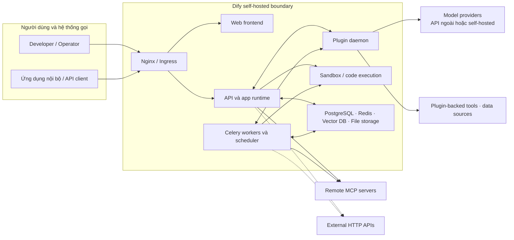
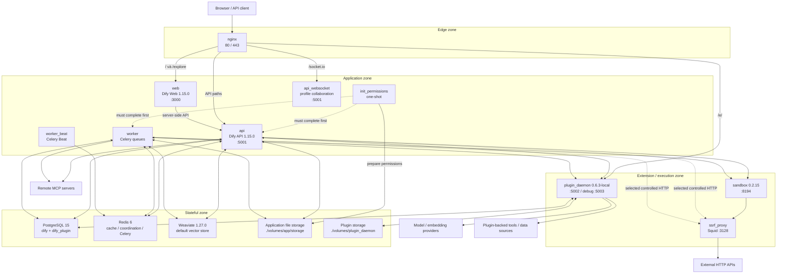
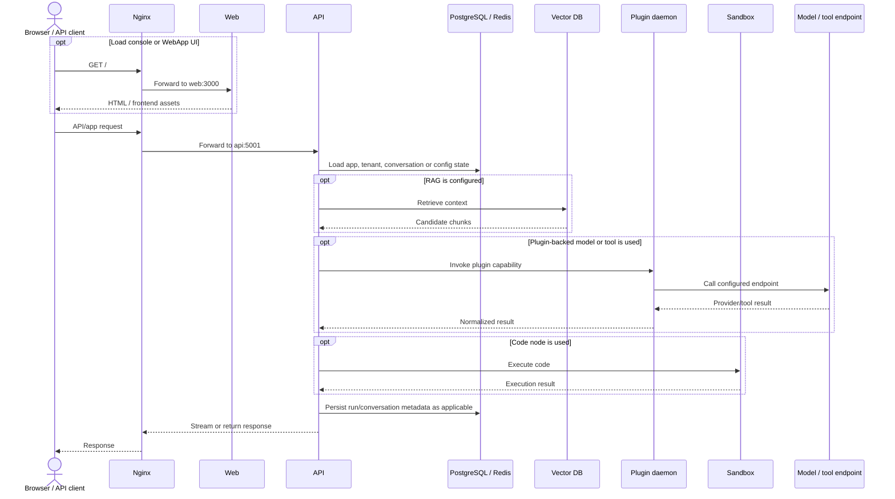
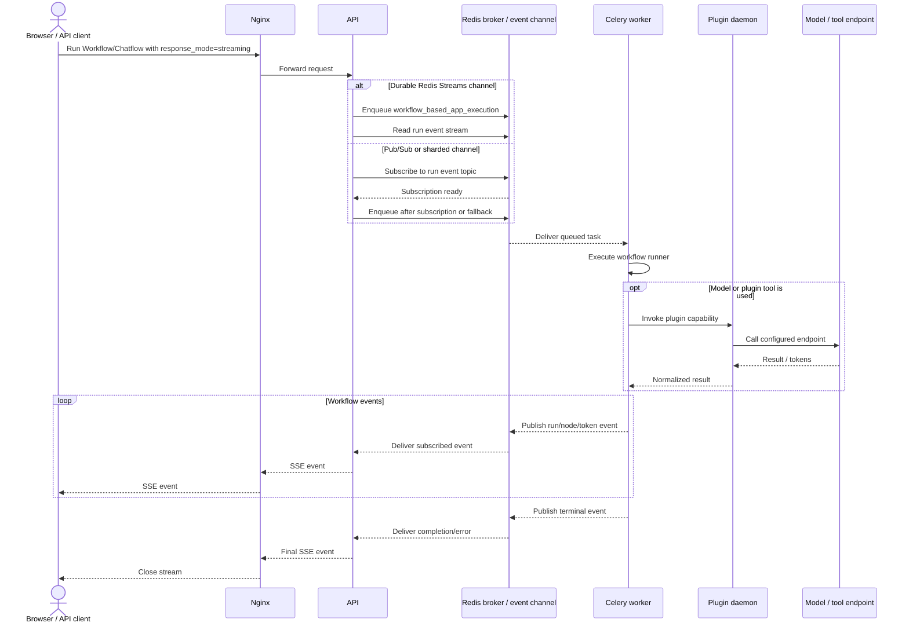
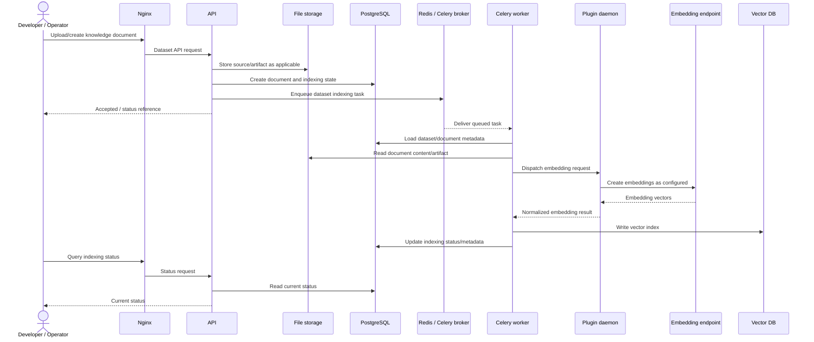

# 02. Kiến trúc hệ thống

> **Version áp dụng:** Dify Community `1.15.0 @ 3aa26fb…`  
> **Ngày kiểm chứng:** `2026-07-16`  
> **Trạng thái xác minh:** `Official-source verified` + `Config validated`; runtime lab pending  
> **Reviewer:** Platform architecture review pending

## Mục tiêu

Sau chương này, người đọc phải:

- Phân biệt frontend, API, WebSocket, worker, scheduler, plugin daemon và sandbox như các runtime boundary độc lập.
- Giải thích request nào đi trực tiếp qua API và công việc nào được đưa vào Celery queue.
- Xác định state nằm ở PostgreSQL, Redis, vector database, file storage và plugin storage.
- Nhận diện trust boundary, dependency, single point of failure và điểm cần thay đổi khi đi từ Compose sang HA.
- Không suy luận rằng mọi request Dify đều đi qua worker/Celery.

## Phạm vi và giả định

Phân tích dưới đây dựa trên Docker Compose, `.env.example`, Nginx template và source code tại tag `1.15.0`. [S-005][S-006][S-010][S-011][S-013]

- Topology mô tả **Community Edition default Compose**, không phải cấu hình production recommendation.
- Default active profiles là `weaviate`, `postgresql` và `collaboration`; các database/vector profile khác là lựa chọn thay thế, không phải dependency đồng thời. [S-006]
- Weaviate/PostgreSQL/local storage là lựa chọn mặc định trong `.env.example`; Dify hỗ trợ lựa chọn khác nhưng operational characteristics phải được đánh giá riêng. [S-006][S-009]
- Default Compose không chạy model server hoặc object-storage container riêng; model/tool endpoint nằm ngoài stack, còn file storage mặc định dùng OpenDAL filesystem.
- Mũi tên “model/tool call” trong sơ đồ là đường có điều kiện: chỉ xuất hiện khi app/workflow sử dụng capability tương ứng.
- Tác động failure hiện là suy luận từ dependency/config và phải được xác nhận bằng failure-injection lab.
- Enterprise components và Helm topology không được trộn vào sơ đồ Community ở chương này.

## Cơ chế hoạt động

### 1. Edge routing và frontend/API boundary

Nginx là entry point mặc định trên cổng 80/443. Template chính thức route UI tới `web:3000`, các API path tới `api:5001`, WebSocket tới `api_websocket:5001`, và extension hook `/e/` tới `plugin_daemon:5002`. [S-005][S-010]

| Path mặc định | Upstream | Ý nghĩa kiến trúc |
|---|---|---|
| `/`, `/explore` | `web:3000` | Frontend web/SSR |
| `/console/api`, `/api`, `/v1`, `/openapi`, `/files`, `/mcp`, `/triggers` | `api:5001` | Console, app/service API, file, MCP và trigger endpoints |
| `/socket.io/` | `api_websocket:5001` | Kênh WebSocket/collaboration |
| `/e/` | `plugin_daemon:5002` | Plugin/extension callback path |

`web` và `api` là hai image/runtime riêng. `SERVER_CONSOLE_API_URL=http://api:5001` cho phép web container gọi API qua Docker network trong server-side flow; browser API request vẫn đi qua public Nginx route. [S-005][S-006][S-009]

### 2. Có bốn execution path, không phải một đường chung qua Celery

| Execution path | Nơi thực thi chính | Vai trò của Redis/Celery | Ví dụ |
|---|---|---|---|
| Inline online | API process | Không enqueue execution chính tại dispatch point | Completion, Chat, Agent; Workflow/Chatflow ở chế độ `blocking` |
| Queued streaming | Celery worker; API giữ kết nối SSE | Redis vừa làm broker vừa chuyển event từ worker về API | Workflow/Chatflow ở chế độ `streaming` |
| Background job | Celery worker | API enqueue task vào queue chuyên biệt | Dataset indexing, mail, data deletion |
| Scheduled job | Beat phát lịch, worker tiêu thụ | Redis broker nối Beat với worker | Cleanup, polling và công việc định kỳ được bật |

Source tại tag `1.15.0` cho thấy Completion/Chat/Agent được generator gọi trực tiếp; Workflow/Chatflow blocking chạy đồng bộ trong API. Với Workflow/Chatflow streaming, API đợi Redis subscription sẵn sàng rồi enqueue `workflow_based_app_execution` để worker chạy và publish event về API. [S-034][S-035][S-036][S-037]

Document indexing là background path khác: task chạy trên queue `dataset`, worker gọi indexing runner và cập nhật state/index. [S-012][S-013] `worker_beat` là scheduler cho scheduled path. [S-011][S-013]

Redis là Celery broker/backend mặc định và tham gia streaming event path. Vì vậy worker down không mặc định làm mọi request Dify ngừng, nhưng nó làm background jobs và Workflow/Chatflow streaming bị đình trệ; Redis down có phạm vi ảnh hưởng rộng hơn cache đơn thuần. [S-006][S-011][S-037]

### 3. Extension và execution boundary

- `plugin_daemon` là service riêng, dùng database logic `dify_plugin`, storage plugin riêng và inner API tới Dify API. [S-005][S-006]
- LLM, embedding và rerank provider plugin được API/worker dispatch qua `plugin_daemon`; vì vậy daemon là dependency của model-backed execution, không chỉ của plugin tool/install flow. [S-038]
- `sandbox` là endpoint code execution riêng tại cổng nội bộ `8194`; cấu hình mặc định cho phép network qua `ssrf_proxy`. [S-005][S-006]
- `ssrf_proxy` dùng Squid và nằm giữa một số luồng HTTP có rủi ro SSRF với mạng ngoài. Không nên diễn giải rằng mọi model-provider call đều bắt buộc đi qua proxy nếu source chưa chứng minh. [S-005][S-006]

## Kiến trúc/luồng dữ liệu

### D01 — System context

Sơ đồ context chỉ thể hiện boundary và dependency chính; nó không khẳng định tất cả dependency được gọi trong một request. MCP client nằm trong API core và kết nối remote MCP server trực tiếp; không gom đường này vào `plugin_daemon`. [S-119][S-120]

### D02 — Component architecture của default Compose

Các cạnh tách ba failure/trust boundary: model/tool/data-source được triển khai bằng plugin đi qua `plugin_daemon`; MCP client của API core kết nối remote MCP server; HTTP/code fetch chỉ được credit cho `ssrf_proxy` khi route thực tế đã được chứng minh. [S-038][S-044][S-119][S-120]

### D03A — Inline/blocking application request (simplified)

Đây là control-flow rút gọn cho nhánh inline/blocking. Workflow/agent internals và kiểu persistence cụ thể sẽ được đào sâu ở Chương 03–05; không phải request nào cũng gọi vector DB, plugin daemon, sandbox hoặc provider. [S-034][S-038]

### D03B — Streaming Workflow/Chatflow qua Celery và Redis

Với durable Redis Streams, source có thể enqueue rồi đọc lại event; với Pub/Sub/sharded channel, API ưu tiên subscription ready trước khi enqueue để giảm race mất event. Đây là đường streaming riêng; không được dùng nó để mô tả Completion/Chat/Agent hoặc Workflow blocking. [S-034][S-035][S-036][S-037]

### D03C — Background document indexing

Task source xác nhận document indexing là Celery task và chạy `IndexingRunner`; trong baseline này, model-provider dispatch cho embedding vẫn đi qua `plugin_daemon`, còn `Embedding endpoint` là provider external hoặc self-hosted đã cấu hình. Chi tiết parsing/chunking/embedding được kiểm chứng tiếp ở Chương 04. [S-012][S-038]

### Component inventory

| Component | Vai trò | Giao tiếp chính | State/persistence | Scale/failure note hiện tại |
|---|---|---|---|---|
| `init_permissions` | One-shot chuẩn bị quyền cho app storage | Chạm `./volumes/app/storage`; là startup dependency của API/worker | Marker/permission trên bind mount | Không scale; failure chặn API/worker start theo dependency condition |
| `nginx` | Edge routing/TLS termination mặc định | Public 80/443 → web/API/WS/plugin | Config/certificate volumes | Một instance là SPOF trong Compose; HA dùng external LB/Ingress |
| `web` | Console và published WebApp frontend | Nginx; internal server-side call tới API | Không phải system-of-record | Có thể scale ngang nếu session/state không nằm local; cần lab xác nhận |
| `api` | Console/service/app API, inline execution và đầu SSE streaming | DB, Redis, vector, storage, plugin, sandbox | Ghi state vào stores bên ngoài; mount file storage mặc định | Stateless process nhưng phụ thuộc shared state; migrations cần single controlled step |
| `api_websocket` | WebSocket/collaboration channel | Nginx `/socket.io`; DB/Redis | State ngoài process theo cấu hình | Profile `collaboration`; cần sticky/session behavior validation |
| `worker` | Celery background jobs và queued streaming Workflow/Chatflow | Redis broker/event path; DB/vector/storage/plugin/sandbox | Không nên giữ durable state trong process | Có knobs queue/concurrency cho K8s; scale theo queue/backlog [S-013][S-035] |
| `worker_beat` | Phát scheduled tasks | Redis/Celery | Schedule config | Chỉ nên có một active scheduler trừ khi dùng HA scheduler phù hợp |
| `plugin_daemon` | Plugin lifecycle/runtime gateway và model-provider dispatch | API inner URL, plugin DB/storage, plugin-backed model/tool/data-source endpoints | `dify_plugin` + plugin volume | Community HA/replica semantics chưa đủ evidence; outage ảnh hưởng LLM/embedding/rerank, nhưng không mặc nhiên chặn MCP core path [S-038][S-119] |
| `sandbox` | Cô lập code execution service | API/worker; outbound qua SSRF proxy theo default | Dependency/config volumes | Failure làm code nodes không chạy; security boundary cần threat test |
| `ssrf_proxy` | Kiểm soát một số outbound HTTP có rủi ro SSRF | API/worker/sandbox network | Config only | Failure có thể làm HTTP/code fetch liên quan lỗi; không phải proof mọi egress qua proxy |
| PostgreSQL | Primary relational state; plugin DB logic | API/WS/worker/beat/plugin | `./volumes/db/data` trong default | Stateful SPOF trong Compose; production cần HA, backup và restore |
| Redis | Celery broker/backend, streaming event channel và shared coordination/cache | API/WS/worker/beat | `./volumes/redis/data` trong default | Outage ảnh hưởng queue, streaming execution và các chức năng dùng Redis; exact degradation cần test |
| Vector DB | Embedding/vector index | API/worker | Volume theo engine; Weaviate mặc định | Engine-specific HA/backup; không thể thay engine mà bỏ migration plan |
| Application storage | Uploaded/generated file artifacts | API và worker mount chung | `./volumes/app/storage` | Local bind mount cản horizontal scale nếu không chuyển shared/object storage |
| Plugin storage | Plugin package/cache/assets/runtime files | Plugin daemon | `./volumes/plugin_daemon` | Phải nằm trong backup/HA design riêng |
| Plugin-backed model/tool/data-source providers | Inference, embedding, rerank hoặc extension execution | `plugin_daemon` outbound tới endpoint cấu hình | State/retention phụ thuộc provider | Latency/quota/egress là external failure domain; daemon là dependency của path này [S-038] |
| Remote MCP servers | Tool/resource endpoint do Dify MCP client gọi | API/worker core → remote MCP transport | State/auth/retention phụ thuộc server | Không đi qua plugin daemon theo core path đã trace; transport/auth/egress cần policy riêng [S-014][S-119][S-120] |
| External HTTP APIs | Endpoint do HTTP/code/tool path gọi | API/worker/sandbox qua route/proxy được cấu hình | State/retention phụ thuộc endpoint | Không giả định mọi request đi qua SSRF proxy; phải capture route thực tế [S-044] |

### Provisional state ownership

| State | System of record mặc định | Backup priority | Ghi chú |
|---|---|---:|---|
| Tenant/user/app/workflow/knowledge metadata | PostgreSQL | Critical | Exact table inventory sẽ được khóa ở Chương 15 |
| Plugin metadata | PostgreSQL database `dify_plugin` | Critical | Có thể cùng PostgreSQL service nhưng logical DB riêng [S-005][S-006] |
| Uploaded/generated files | Application storage/OpenDAL local path mặc định | Critical | Production nên dùng shared/object storage theo decision framework |
| Vector index | Configured vector DB | Critical nhưng có thể rebuild có điều kiện | Restore/rebuild phải giữ consistency với relational metadata |
| Queue/in-flight coordination/cache | Redis | High | Không mặc định coi toàn bộ Redis là disposable; cần phân loại key/queue ở operations chapter |
| Installed plugin packages/assets | Plugin storage | High/Critical tùy recovery strategy | Cần kiểm chứng khả năng reinstall so với restore |
| Secrets và environment config | External `.env`/secret store | Critical | Không nằm trong Git; cần backup/rotation/access control |

## Hướng dẫn hoặc ví dụ triển khai

### Cách dùng sơ đồ khi chẩn đoán

1. Xác định request đi vào path nào trên Nginx.
2. Map path tới runtime `web`, `api`, `api_websocket` hoặc `plugin_daemon`.
3. Phân loại flow là inline, queued streaming, background hay scheduled.
4. Kiểm tra dependency theo thứ tự: process health → network/DNS → credential → state store → external provider.
5. Nếu là queued streaming/background, kiểm tra Redis, queue name, worker subscription và backlog trước khi kết luận API lỗi.

### Bằng chứng cần thu trong lab

- `docker compose ps` và health status của 13 service/task mặc định.
- Request trace cho UI, `/console/api`, `/v1`, `/socket.io`, `/mcp` và plugin hook khi có.
- So sánh trace Workflow/Chatflow `blocking` với `streaming`, gồm Redis subscription, task enqueue và SSE completion.
- Celery queue/backlog khi ingest tài liệu.
- Persistence sau restart của PostgreSQL, Redis, vector store, app storage và plugin storage.
- Failure injection có kiểm soát cho worker, Redis, vector DB, sandbox và provider timeout.

## Quyết định và trade-off

### Tách stateless compute khỏi stateful dependencies

API/web/worker có thể được nhân bản dễ hơn PostgreSQL, Redis, vector DB và storage. Tuy nhiên “container không giữ state” chưa đủ để kết luận scale ngang an toàn: migration, scheduler singleton, shared file storage, WebSocket/pubsub và plugin runtime đều cần thiết kế riêng.

### Scale worker theo queue thay vì chỉ tăng replica tổng

Entrypoint hỗ trợ `CELERY_WORKER_QUEUES`, concurrency và pool riêng cho Kubernetes. Điều này cho phép tách worker theo workload như dataset, workflow hoặc trigger, nhưng queue topology phải bám đúng danh sách queue của release. [S-013]

### Local file storage phù hợp POC, không phải HA mặc định

Bind mount đơn giản và dễ backup ở single node, nhưng không cung cấp shared multi-node access. Production cần object/shared storage, consistency và restore plan trước khi scale API/worker.

### Vector database là pluggable nhưng không interchangeable về vận hành

`VECTOR_STORE` cho phép đổi engine, nhưng HA, backup, auth, filtering, performance và migration khác nhau. Chương 04/12/15 phải đưa decision matrix thay vì chọn theo danh sách hỗ trợ. [S-006][S-009][S-021]

## Security và operations implications

- Chỉ Nginx 80/443 nên là public entry point chuẩn. Compose còn publish plugin debugging port `5003`; phải disable/restrict bằng firewall/binding trong production reference. [S-005][S-006]
- Plugin daemon, sandbox, MCP/tools và model-provider egress là trust boundary, không chỉ là dependency kỹ thuật.
- `ssrf_proxy` là compensating control cho selected HTTP/code paths; cần negative test cho private IP/domain và không được dùng như bằng chứng rằng toàn bộ egress đã bị chặn.
- API và worker cùng truy cập application storage; secret/permission và backup phải nhất quán giữa hai runtime.
- Plugin DB/storage phải xuất hiện trong backup inventory; chỉ backup main database là chưa đủ.
- Worker healthcheck bị disable mặc định; trạng thái container `running` không đủ chứng minh consumer đang nhận và xử lý queue. [S-005][S-006]
- Default password/key trong `.env.example` phải thay trước shared lab/production. [S-006]
- Nginx/Squid/BusyBox dùng tag `latest` trong Compose; production phải pin digest/version và quản lý CVE/update. [S-005]

## Failure modes và troubleshooting

| Failure | Expected impact từ topology | Tín hiệu cần kiểm tra | Validation còn thiếu |
|---|---|---|---|
| Nginx down | UI/API public entry mất | Nginx health/log, upstream DNS | Failover/LB test |
| Web down | Console/WebApp UI lỗi; direct API có thể vẫn reachable qua Nginx | `/`, web logs, internal API URL | Runtime smoke test |
| API down | Console/service/app API và nhiều orchestration flow lỗi | API health/log, DB/Redis connectivity | Multi-replica/failover test |
| Redis down | Celery enqueue/consume, streaming event path và các chức năng dùng Redis lỗi/degrade | Redis health, broker errors, pub/sub event, backlog | Exact degradation matrix |
| Worker down | Background queue tích tụ; Workflow/Chatflow streaming đình trệ; inline request có thể vẫn chạy | Queue depth, worker heartbeat, synthetic queued task | Queue-specific test |
| Beat down | Scheduled tasks không được phát đúng lịch | Beat log, scheduled task freshness | Singleton/recovery test |
| PostgreSQL down | Phần lớn control/state operations lỗi | Connection pool, DB health/replication | HA/restore test |
| Vector DB down | Retrieval/indexing lỗi; app không dùng RAG có thể ít ảnh hưởng hơn | Vector health, retrieval/index error | Graceful-degradation test |
| App storage down | Upload/file/knowledge artifact flow lỗi | Mount/object-store error | Restore/consistency test |
| Plugin daemon down | Plugin install/tool và LLM/embedding/rerank dispatch lỗi | Daemon health, inner API, plugin/provider logs | Community HA semantics |
| Sandbox down | Code execution nodes lỗi | Sandbox health, API key/proxy | Isolation/failure test |
| External provider timeout | Request latency/error, retry/quota impact | Provider status, timeout/rate-limit telemetry | Fallback/circuit-breaker test |

## Checklist xác nhận

- [x] Frontend và API được mô tả như hai runtime boundary riêng.
- [x] Nginx route map được đối chiếu với tag `1.15.0`.
- [x] Inline, queued streaming, background và scheduled path được tách riêng.
- [x] Core/dependency component inventory được lập từ Compose/config/source.
- [x] D01, D02, D03A, D03B và D03C dùng Mermaid nhúng trực tiếp.
- [x] State ownership sơ bộ và backup implications được ghi lại.
- [ ] Mermaid render trên renderer wiki mục tiêu.
- [ ] Compose runtime smoke test.
- [ ] Trace online request thực tế.
- [ ] Celery ingestion/backlog test.
- [ ] Failure injection và recovery timing.
- [ ] Platform architect review và `DOC-G1` sign-off.

## Giới hạn/version caveats

- Sơ đồ bám Community `1.15.0`; Dify `main` hoặc Enterprise có thể có component khác.
- Compose là single-node reference, không chứng minh HA/scaling semantics.
- Component inventory chưa phải exhaustive call graph của source code.
- Plugin daemon Community scale-out, WebSocket affinity, Redis state taxonomy và exact backup order vẫn là open research items.
- Nhiều vector engine có profile trong Compose; chương này chỉ vẽ default Weaviate để tránh biến sơ đồ thành danh sách vô hạn.
- `Official-source verified`/`Config validated` không thay thế runtime/network/failure validation.

## Nguồn tham khảo

- [S-005] Docker Compose tại tag `1.15.0`.
- [S-006] Docker `.env.example` tại tag `1.15.0`.
- [S-009] Environment Variables, docs snapshot `1.15.0`.
- [S-010] Nginx route template tại tag `1.15.0`.
- [S-011] Celery extension tại tag `1.15.0`.
- [S-012] Document indexing task tại tag `1.15.0`.
- [S-013] API/worker/beat entrypoint tại tag `1.15.0`.
- [S-021] Docker deployment README tại tag `1.15.0`.
- [S-034] Application Generate Service tại tag `1.15.0`.
- [S-035] Workflow Execute Task tại tag `1.15.0`.
- [S-036] Message-based App Generator tại tag `1.15.0`.
- [S-037] Streaming Utilities tại tag `1.15.0`.
- [S-038] Plugin Model Implementation tại tag `1.15.0`.
