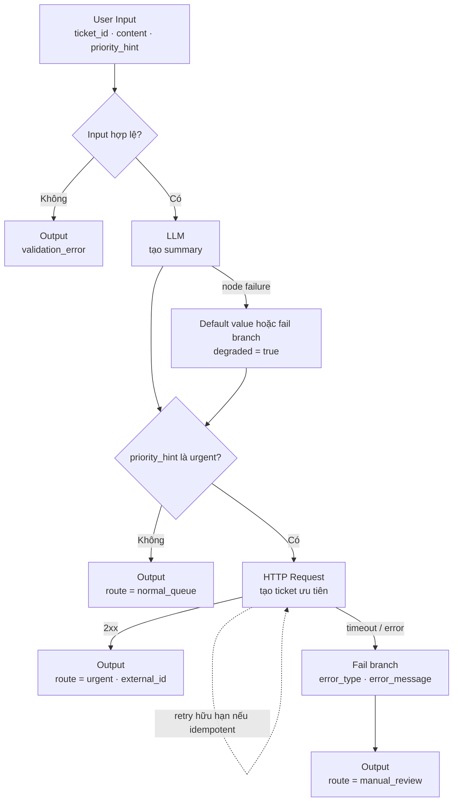
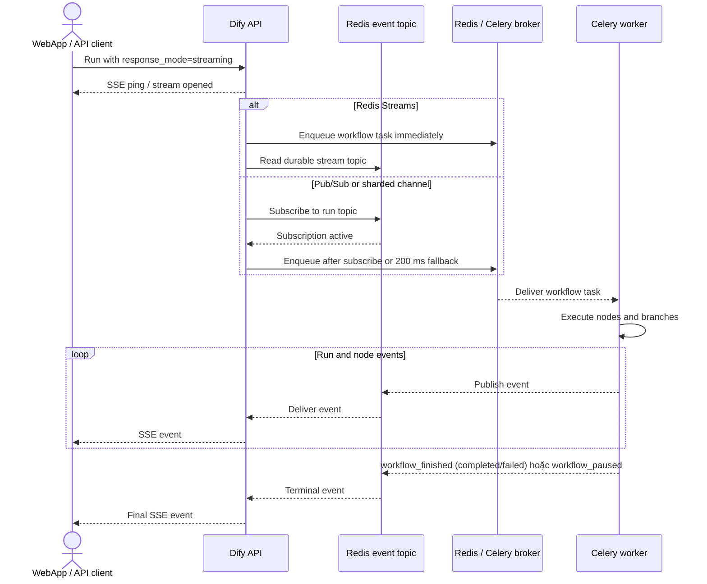

# 03. Workflow

> **Version áp dụng:** Dify Community `1.15.0 @ 3aa26fb…`  
> **Docs snapshot:** `release/1.15.0 @ 57a492d…`  
> **Ngày kiểm chứng:** `2026-07-16`  
> **Trạng thái xác minh:** `Official-source verified`; runtime lab và publish/rollback validation pending  
> **Reviewer:** Workflow/platform review pending

## Mục tiêu

Sau chương này, người đọc phải có thể:

- Phân biệt **Workflow** với **Chatflow**, chọn đúng kiểu ứng dụng cho xử lý một lần hoặc hội thoại nhiều lượt.
- Đọc visual DSL như một đồ thị có node, edge, biến vào/ra, nhánh điều kiện và đường lỗi; không xem canvas chỉ là một prompt lớn.
- Thiết kế contract biến rõ kiểu dữ liệu, nguồn, owner và dữ liệu nhạy cảm trước khi nối node.
- Chọn đúng giữa xử lý tuần tự, song song, Iteration và Loop; đặt điều kiện dừng cho mọi đường lặp.
- Cấu hình error path, retry và timeout theo tính chất của dependency, đặc biệt tránh retry mù với thao tác có side effect.
- Giải thích đúng execution path của Dify `1.15.0`: Workflow/Chatflow `blocking` chạy inline trong API, còn nhánh `streaming` được đưa sang Celery worker và truyền event qua Redis.
- Dựng và kiểm thử workflow mẫu “phân luồng ticket hỗ trợ” đủ để dùng làm skeleton cho POC.
- Biết phần nào đã được xác minh bằng source chính thức và phần nào vẫn phải kiểm chứng trong lab trước khi coi là production-ready.

## Phạm vi và giả định

Chương này mô tả Workflow/Chatflow ở mức **đủ để bắt đầu implement**, không phải danh mục đầy đủ mọi node hay mọi tham số.

- Baseline là Dify Community `1.15.0`; source code được đọc tại tag `1.15.0`, documentation được pin tại commit `57a492d8063d1583c582b4c0444fb838c6dd3027`.
- **Workflow** chạy một lần từ đầu tới cuối; có thể bắt đầu bằng User Input hoặc Trigger và có thể kết thúc bằng Output. **Chatflow** thêm lớp hội thoại, luôn bắt đầu bằng User Input và cần Answer để trả lời người dùng. [S-040]
- Phần node tập trung vào nhóm cần cho thiết kế mẫu: User Input/Trigger, LLM, If-Else, HTTP Request, Iteration/Loop, Output/Answer và error branch. Các node RAG, Agent, MCP và plugin được đào sâu ở chương tương ứng.
- Mô tả runtime chỉ áp dụng cho đường gọi ứng dụng đi qua `AppGenerateService`; trigger, debugger, single-node run, Human Input resume và job định kỳ cần trace riêng trước khi tổng quát hóa.
- Source chính thức xác nhận đường dispatch inline/queued; Docker lab hiện chưa chạy nên latency, queue delay, duplicate delivery, cancellation và recovery behavior vẫn là hạng mục kiểm thử.
- Chương không khẳng định Dify cung cấp immutable release, approval gate hoặc one-click rollback cho workflow. DSL export/import được xác minh; quy trình version/release bên dưới là **khuyến nghị vận hành**, cần lab xác nhận với UI/API của baseline. [S-045]
- Ví dụ timeout/retry là giá trị khởi điểm cho POC, không phải default chính thức hay SLO chung cho mọi hệ thống.

## Cơ chế hoạt động

### 1. Visual DSL là dataflow có contract, không chỉ là sơ đồ trình bày

Workflow và Chatflow dùng chung visual canvas và hệ thống node. Mỗi node thực hiện một bước như gọi model, truy xuất knowledge, chạy code, gọi integration hoặc quyết định nhánh; edge biểu diễn thứ tự/control flow và làm cho output của node trước khả dụng cho node sau. [S-040]

Khi review một canvas, cần đọc theo bốn lớp:

| Lớp | Câu hỏi bắt buộc | Lỗi thiết kế thường gặp |
|---|---|---|
| Control flow | Node nào có thể chạy, theo nhánh nào, điều kiện dừng ở đâu? | Có đường không tới Output/Answer; Loop không có guard hữu hạn |
| Data flow | Biến nào đi vào/ra từng node, kiểu và nullability là gì? | Dùng output tự do của LLM như JSON đã được kiểm chứng |
| Failure flow | Node lỗi thì dừng, dùng default hay đi fail branch? | Nuốt lỗi bằng default nhưng không phát cảnh báo |
| Side effect | Node nào gọi API, ghi dữ liệu, gửi email hoặc tạo ticket? | Retry tạo bản ghi trùng vì không có idempotency key |

Một đường thực thi có thể chạy node tuần tự hoặc song song. Node chạy tuần tự có thể đọc biến từ các node trước; các nhánh song song không đọc output của nhau trong lúc cùng chạy, nhưng node sau điểm hội tụ có thể dùng output của các nhánh. Tài liệu baseline nêu một execution path hỗ trợ tối đa 50 node và có thể điều chỉnh bằng `MAX_TREE_DEPTH`; đây là guard cấu hình, không phải chỉ tiêu hiệu năng. [S-041]

### 2. Node và biến nên được thiết kế theo interface contract

Danh mục rút gọn dưới đây là bản đồ thiết kế, không phải exhaustive node catalog:

| Nhóm | Node điển hình | Vai trò | Contract cần khóa |
|---|---|---|---|
| Điểm vào | User Input, Trigger | Nhận input từ người dùng hoặc sự kiện | Tên biến, kiểu, required, kích thước, nguồn tin cậy |
| AI/data | LLM, Knowledge Retrieval | Sinh nội dung hoặc lấy context | Model, prompt, context, output format, token/cost budget |
| Logic | If-Else | Chọn IF/ELIF/ELSE theo điều kiện | Biến so sánh, operator, null/default, nhánh fallback [S-043] |
| Lặp | Iteration, Loop | Xử lý danh sách hoặc tinh chỉnh tuần tự | Input array hoặc state, điều kiện dừng, giới hạn, error policy |
| Tích hợp | HTTP Request, Tool | Gọi hệ thống ngoài | Auth, timeout, retry, idempotency, data classification |
| Thực thi | Code | Biến đổi/validate bằng code | Input/output schema, sandbox limits, package/network need |
| Điểm ra | Output, Answer | Trả kết quả của Workflow hoặc Chatflow | Response schema, error contract, dữ liệu được phép lộ |

Mỗi biến nên có ít nhất: `name`, `type`, `required/nullable`, node sinh ra, node tiêu thụ, kích thước dự kiến, mức nhạy cảm và hành vi khi thiếu. Dùng tên có nghĩa nghiệp vụ như `ticket_id`, `summary`, `route` thay vì `text2` hoặc `result_final_new`.

Biến lấy từ LLM, HTTP hoặc tool là **untrusted input** đối với node tiếp theo. Trước khi dùng biến đó làm URL, header, câu lệnh, điều kiện cấp quyền hoặc side effect, phải validate kiểu, tập giá trị và giới hạn kích thước.

### 3. Branch, Iteration và Loop giải quyết ba bài toán khác nhau

- **If-Else** dùng để chọn một trong các đường dựa trên biến đã có. Baseline hỗ trợ IF, nhiều ELIF, ELSE, điều kiện text/value và tổ hợp AND/OR. [S-043]
- **Iteration** áp dụng một subflow cho từng phần tử của danh sách. Nó phù hợp khi các phần tử độc lập hoặc có thể xử lý theo batch; error policy có thể dừng toàn bộ, tiếp tục và trả `null`, hoặc loại kết quả lỗi. [S-041][S-042]
- **Loop** dùng khi vòng sau phụ thuộc state của vòng trước, ví dụ tinh chỉnh câu trả lời đến ngưỡng chất lượng. Theo docs baseline, child-node failure làm Loop dừng; vì vậy Loop cần điều kiện dừng, maximum count và fail path rõ ràng. [S-042]

Không dùng Loop để thay Iteration nếu mỗi item độc lập: làm vậy tăng latency, khó scale và dễ tạo state coupling. Không bật parallel execution khi các item cùng ghi một resource không có concurrency control.

### 4. Error handling, retry và timeout là policy theo node

Docs baseline xác nhận LLM, HTTP, Code và Tool hỗ trợ ba hành vi lỗi: [S-042]

1. **None**: mặc định, node lỗi làm workflow dừng và trả lỗi gốc.
2. **Default Value**: thay output lỗi bằng giá trị cùng kiểu rồi tiếp tục.
3. **Fail Branch**: chuyển control flow sang nhánh lỗi; có `error_type` và `error_message` cho xử lý tiếp.

Chọn policy theo ý nghĩa nghiệp vụ:

| Tình huống | Policy khởi điểm | Lý do |
|---|---|---|
| Validation hoặc authorization thất bại | Dừng/route tới Output lỗi | Không được che lỗi bằng dữ liệu giả |
| LLM tạo phần mô tả không critical | Retry hữu hạn, sau đó Default Value có gắn trạng thái degraded | Giữ service nhưng phải quan sát được |
| HTTP GET idempotent bị timeout tạm thời | Retry hữu hạn với backoff, sau đó Fail Branch | Có thể phục hồi transient failure |
| HTTP POST tạo ticket/thanh toán | Chỉ retry khi có idempotency key hoặc downstream đảm bảo dedup | Tránh side effect trùng |
| Dependency bắt buộc không khả dụng | Fail Branch hoặc dừng | Output “thành công” giả gây sai nghiệp vụ |

HTTP Request node có connect/read/write timeout riêng và retry có giới hạn cấu hình. [S-044] Timeout phải nhỏ hơn latency budget của caller; tổng retry budget phải tính cả model latency và queue delay. Không có bằng chứng trong vòng nghiên cứu này về một “workflow timeout” duy nhất bao phủ mọi node/path, nên phải kiểm chứng các biến môi trường và behavior thực tế trước khi công bố hard limit.

### 5. Blocking và streaming đi qua hai runtime path khác nhau

Source tại tag `1.15.0` cho thấy dispatch như sau: [S-034][S-035][S-036][S-037]

| App/path | Execution chính | Redis/Celery tại dispatch point | Response path |
|---|---|---|---|
| Completion, Chat, Agent | Inline trong API process | Không enqueue execution chính ở nhánh này | Generator trả blocking hoặc stream từ API |
| Workflow/Chatflow `blocking` | Inline trong API process | Không enqueue `workflow_based_app_execution` | API trả kết quả sau khi run hoàn tất |
| Workflow/Chatflow `streaming` | Celery worker | API enqueue task; Redis làm broker/event channel theo cấu hình mặc định | Worker publish event, API chuyển thành SSE |

Với streaming Workflow/Chatflow:

- Nếu channel type là Redis Streams, API có thể start task ngay vì subscriber đến muộn có thể đọc lại event.
- Với Pub/Sub hoặc sharded mode có đặc tính at-most-once, API ưu tiên chờ subscription active rồi mới enqueue; source còn có fallback timer 200 ms để task vẫn bắt đầu nếu client không subscribe.
- Event reader phát một `ping` đầu tiên, sau đó nhận event từ topic; mặc định kết thúc khi gặp `workflow_finished` hoặc `workflow_paused`, và `retrieve_events` có idle timeout 300 giây trong source hiện tại. Đây là code-level behavior của baseline, không nên sao chép thành SLO production.
- Worker task có đường phát lifecycle terminal dạng failed cho một số lỗi xảy ra trước khi runtime tạo task entity, giúp SSE consumer không chờ vô hạn. Client vẫn phải xử lý disconnect, idle timeout và trường hợp không nhận terminal event.

Hệ quả vận hành: worker down có thể làm streaming Workflow/Chatflow đình trệ trong khi một số request inline vẫn chạy; Redis down ảnh hưởng cả queue lẫn đường event. Health check chỉ gọi API không đủ chứng minh workflow streaming hoạt động.

### 6. Lifecycle thiết kế và phát hành

Lifecycle khuyến nghị cho một workflow:

1. **Define**: khóa input/output schema, data classification, dependency và SLO.
2. **Build**: tạo node/edge, đặt tên rõ, cấu hình branch/error/timeout.
3. **Debug**: test từng node, sau đó test từng path với dữ liệu đại diện và lỗi giả lập.
4. **Review**: review prompt, secret, outbound call, side effect, retry và cost.
5. **Snapshot**: export DSL, loại secret, lưu hash và version ứng dụng trong source control.
6. **Publish**: publish theo change window; smoke test WebApp/API bằng test case đã cố định.
7. **Observe**: theo dõi success/failure, node latency, token/cost, queue delay và downstream errors.
8. **Rollback/forward fix**: dùng snapshot đã review theo runbook đã lab-validate; không giả định import DSL tự động khôi phục log, knowledge data hoặc secret.

Dify export DSL ở dạng YAML gồm app config, workflow/node settings, model parameters, prompt và liên kết knowledge, nhưng không gồm API key, dữ liệu knowledge hay usage logs. Secret-type environment variables có thể được hỏi có đưa vào export hay không; quy trình an toàn là không commit secret và inject lại từ secret store. DSL mới hơn có thể không tương thích với Dify cũ. [S-045]

## Kiến trúc/luồng dữ liệu

### D04 — Workflow mẫu với branch, retry và fail path



Sơ đồ là design mẫu, không phải export chính xác từ Dify. Self-loop retry diễn tả policy tại HTTP node; không có nghĩa người viết phải nối edge quay lại node trong canvas.

### D04B — Runtime path của Workflow/Chatflow streaming



`Events` và `Broker` là hai vai trò logic; default Compose có thể dùng cùng Redis service. Sơ đồ không mô tả mọi internal queue, event type hay trigger path. [S-034][S-035][S-036][S-037]

## Hướng dẫn hoặc ví dụ triển khai

### Ví dụ: phân luồng ticket hỗ trợ

Mục đích của ví dụ là kiểm chứng visual DSL, biến, branch, LLM, HTTP, error policy và hai response mode; không nhằm tạo ứng dụng helpdesk hoàn chỉnh.

#### 1. Chuẩn bị

- Một model provider đã cấu hình và chỉ dùng dữ liệu thử không nhạy cảm.
- Một HTTP test endpoint có thể trả lần lượt `2xx`, `5xx`, timeout và echo `Idempotency-Key`.
- Một app loại Workflow khởi đầu bằng User Input.
- Một bộ request/expected-output cố định để lặp lại sau mỗi thay đổi.

#### 2. Khóa input/output contract

| Biến | Kiểu | Required | Ý nghĩa | Security note |
|---|---|---:|---|---|
| `ticket_id` | string | Có | ID duy nhất do caller sinh | Dùng làm correlation/idempotency key |
| `content` | string | Có | Nội dung cần tóm tắt | Giới hạn độ dài; không dùng PII thật trong POC |
| `priority_hint` | string enum | Có | `normal` hoặc `urgent` | Reject giá trị ngoài enum |
| `requester` | string | Không | Mã người gửi | Không đưa email/PII vào prompt nếu không cần |

Output trên mọi nhánh phải giữ envelope thống nhất:

```json
{
  "ticket_id": "T-0001",
  "status": "accepted|degraded|rejected",
  "route": "normal_queue|urgent|manual_review|none",
  "summary": "...",
  "external_id": null,
  "error_code": null
}
```

Đây là schema thiết kế của ví dụ, không phải response schema mặc định của Dify.

#### 3. Tạo node theo thứ tự

1. **User Input**: khai báo bốn biến ở trên; `ticket_id`, `content`, `priority_hint` là required.
2. **If-Else — Validate input**: kiểm tra `content` không rỗng và `priority_hint` thuộc tập cho phép. Nhánh lỗi trả Output `status=rejected`, không gọi model.
3. **LLM — Summarize**: prompt chỉ yêu cầu tóm tắt ngắn nội dung, không tự quyết định quyền hoặc hành động. Đặt output vào `summary`.
4. **LLM error policy**: với POC, retry tối đa một lần; sau đó dùng default summary có `status=degraded` hoặc đi fail branch. Con số này là quyết định mẫu, không phải default sản phẩm.
5. **If-Else — Route**: `priority_hint=urgent` đi nhánh HTTP; còn lại trả Output `normal_queue`.
6. **HTTP Request — Create urgent ticket**: POST JSON gồm `ticket_id`, `summary`; truyền `ticket_id` làm idempotency key nếu test service hỗ trợ. Không hardcode credential trong URL/header.
7. **HTTP retry/timeout**: POC khởi đầu với connect `3s`, read `20s`, write `10s`, tối đa `2` lần retry với interval `1s`; phải đổi theo downstream SLA và xác nhận UI/runtime chấp nhận giá trị này. Chỉ retry POST khi dedup/idempotency đã được test.
8. **HTTP fail branch**: map `error_type`/`error_message` sang output an toàn `route=manual_review`; không trả stack trace hoặc secret cho caller.
9. **Output**: đảm bảo mọi terminal branch trả cùng envelope và không để biến nội bộ nhạy cảm lọt ra ngoài.

#### 4. Test matrix tối thiểu

| Case | Input/dependency | Kết quả mong đợi | Evidence cần lưu |
|---|---|---|---|
| W01 | `normal`, model thành công | `accepted`, `normal_queue`, có summary | Run ID, node outputs, latency |
| W02 | `urgent`, HTTP `2xx` | `accepted`, `urgent`, có `external_id` | Request ID, idempotency key |
| W03 | `content` rỗng | `rejected`; model/HTTP không được gọi | Node path và call count |
| W04 | Model transient error | Retry hữu hạn; success hoặc `degraded` theo policy | Số attempt, error type |
| W05 | HTTP `5xx` rồi `2xx` | Một business ticket dù có retry | Downstream record count |
| W06 | HTTP timeout liên tục | `manual_review`; workflow kết thúc hữu hạn | Timeout duration, fail-branch output |
| W07 | Worker dừng, chạy `streaming` | Queue/stream lỗi hoặc đình trệ theo runtime thực tế | API/worker/Redis logs, terminal event |
| W08 | Worker dừng, chạy `blocking` | So sánh với W07; không mặc định kết luận trước lab | Response, API CPU/log |
| W09 | Redis dừng trong streaming | Client xử lý disconnect/idle timeout, không chờ vô hạn | SSE transcript, recovery time |
| W10 | Export/import DSL vào app test | Graph/config phục hồi; secret và data không tự xuất hiện | DSL hash, import warning, diff |

#### 5. Release checklist cho workflow mẫu

- Export DSL không chứa secret; lưu ở source control cùng `app_version`, Dify baseline và changelog.
- Peer review ít nhất input/output schema, prompt, outbound domains, retry và fail branch.
- Chạy W01–W06 ở draft; chạy smoke W01/W02 qua published endpoint.
- Gắn correlation giữa client request, workflow run, downstream request và log.
- Chỉ dùng W10 làm rollback runbook sau khi đã xác nhận cách import/publish và ảnh hưởng tới endpoint trên lab baseline.

## Quyết định và trade-off

### Workflow hay Chatflow

Chọn Workflow khi mỗi request là một transaction/batch độc lập và cần output có schema. Chọn Chatflow khi cần lịch sử hội thoại và Answer theo từng lượt. Không dùng Chatflow chỉ để có UI chat nếu nghiệp vụ thực chất là batch; conversation state làm tăng data-retention và debugging scope. [S-040]

### Blocking hay streaming

`blocking` đơn giản hơn cho caller và giảm số component trên execution path, nhưng giữ API request đến khi run hoàn tất và không phù hợp với latency dài. `streaming` cải thiện trải nghiệm tiến trình/token nhưng phụ thuộc worker, broker, event delivery và client SSE state machine. Quyết định phải dựa trên latency budget, network timeout, queue capacity và khả năng xử lý reconnect, không chỉ dựa trên UI preference. [S-034][S-037]

### Branch rõ ràng hay giao toàn bộ routing cho LLM

If-Else trên field đã validate dễ audit và lặp lại. LLM classifier linh hoạt hơn với dữ liệu ngôn ngữ tự nhiên nhưng output có xác suất; nếu nó quyết định hành động nhạy cảm, cần structured validation, confidence threshold, fallback và human review.

### Iteration tuần tự hay song song

Tuần tự phù hợp khi phải giữ thứ tự, có shared state hoặc downstream rate limit thấp. Song song giảm wall-clock time cho item độc lập nhưng tăng burst, token spend và áp lực lên provider. Không lấy giới hạn kỹ thuật làm concurrency recommendation; benchmark với workload thật.

### Default Value hay Fail Branch

Default Value giảm lỗi thấy bởi người dùng nhưng có thể che degradation. Fail Branch nhiều node hơn nhưng cho phép alert, fallback và response contract minh bạch. Với output ảnh hưởng quyết định nghiệp vụ, ưu tiên fail rõ thay vì dữ liệu “có vẻ hợp lệ” nhưng giả.

### DSL là artifact phát hành, không phải backup toàn hệ thống

DSL phù hợp để review/diff app configuration; nó không chứa knowledge data, log hoặc toàn bộ secret. Backup/restore PostgreSQL, storage và vector DB vẫn thuộc runbook Chương 15. [S-045]

## Security và operations implications

- **Secret**: dùng secret/environment configuration của workspace hoặc secret manager ngoài; không hardcode token trong prompt, URL, header hay DSL được commit. Kiểm tra lựa chọn export Secret-type variable. [S-045]
- **Prompt/data leakage**: chỉ đưa biến cần thiết vào LLM. Dữ liệu từ user, retrieval, HTTP và tool có thể chứa prompt injection hoặc nội dung độc hại.
- **Authorization**: workflow không tự biến input `user_id`, `role` hoặc `priority` thành claim đáng tin. Quyết định quyền phải dựa trên identity/context do trusted boundary cung cấp.
- **HTTP egress/SSRF**: allowlist domain, chặn private/control-plane address, bật TLS verification và không cho untrusted variable điều khiển toàn bộ URL. Việc node có SSL toggle không phải lý do để tắt verify trong production. [S-044]
- **Side effect và retry**: mọi POST/PUT/delete/email/payment cần idempotency/dedup hoặc compensation. Ghi attempt number và downstream correlation ID.
- **Code node**: coi sandbox là trust boundary; giới hạn package, CPU/memory/time, network và kích thước input/output theo security baseline.
- **PII/logging**: workflow run và conversation log có thể chứa input/output đầy đủ. Xác định retention, masking và quyền xem log trước khi đưa dữ liệu thật.
- **Cost guard**: giới hạn input, iteration count, loop count, model/token budget và parallel fan-out. Một loop sai có thể nhân model cost dù không làm platform crash.
- **Observability**: tối thiểu cần run ID, app/workflow version, response mode, queue wait, node latency/status, model/provider, token/cost, retry count và downstream status. Không log raw secret hoặc toàn bộ PII.
- **Health**: synthetic test phải có cả blocking và streaming. API health xanh không chứng minh worker đang consume queue hay SSE event path hoạt động.
- **Change control**: prompt/model/node/retry/timeout đều là thay đổi hành vi production; phải có DSL diff, test case và rollback/forward-fix plan.

## Failure modes và troubleshooting

| Triệu chứng | Khả năng nguyên nhân | Kiểm tra theo thứ tự | Hướng xử lý/validation |
|---|---|---|---|
| Workflow dừng ngay tại node | Default error behavior `None`; input/type sai; dependency lỗi | Run trace → node input → `error_type/message` → dependency log | Sửa contract hoặc thêm fail branch có chủ đích [S-042] |
| Branch không như mong đợi | Null/string-number mismatch, whitespace/case, điều kiện ELIF/AND/OR sai | Log giá trị và kiểu ngay trước If-Else; test boundary values | Normalize/validate trước branch; thêm ELSE [S-043] |
| Iteration thiếu phần tử output | `continue-on-error` trả `null` hoặc remove-abnormal-output loại item | So input/output index, child error và policy | Chọn policy theo nhu cầu giữ correspondence [S-042] |
| Loop không kết thúc | Điều kiện dừng không đạt; state không update | Iteration count, loop variable, Exit path | Maximum count hữu hạn; alert gần ngưỡng |
| HTTP tạo record trùng | Retry POST sau timeout nhưng request đầu đã thành công | Idempotency key, downstream access log, attempt count | Dedup/compensation; không retry mù |
| HTTP treo lâu | Timeout quá cao, retry budget chồng, DNS/TLS chậm | Connect/read/write duration, attempt timeline | Thu hẹp budget, circuit/fail branch [S-044] |
| Blocking chạy nhưng streaming treo | Worker/broker/event subscription lỗi | Worker consume, Redis, task enqueue, event topic, SSE transcript | Test queue và terminal event; không chỉ restart API [S-034][S-035][S-036][S-037] |
| SSE mở nhưng không có event | Task chưa enqueue, worker backlog, Pub/Sub race, subscriber disconnect | `ping`, enqueue log, queue depth, worker log, 200 ms fallback behavior | Phân biệt streams với pub/sub; trace cùng run ID |
| Client chờ vô hạn sau lỗi sớm | Không nhận terminal event hoặc client bỏ qua failed/paused/disconnect | Raw SSE, terminal type, idle timeout, API/worker exception | Client timeout/reconnect policy; test pre-runtime failure [S-035][S-037] |
| Import DSL thiếu integration/knowledge | Resource thuộc workspace khác hoặc không nằm trong export | Import warning, resource mapping, secret/provider config | Rebind dependency; không coi DSL là full backup [S-045] |
| Kết quả khác sau import/upgrade | Model/plugin/docs/version khác; DSL compatibility | Dify version, DSL version, model/provider, plugin versions | Pin baseline, regression test, forward migration |
| Chi phí/latency tăng đột biến | Parallel fan-out, loop/iteration lớn, retry storm | Node count, item count, attempts, tokens, queue wait | Guard input/fan-out; quota/rate limit; alert |

Quy trình chẩn đoán ngắn:

1. Lấy `workflow_run_id`/request correlation và xác định app version/DSL hash.
2. Xác định `blocking` hay `streaming`; nếu streaming, thêm Redis/Celery/worker vào phạm vi.
3. Tìm node đầu tiên sai, so input/output thực tế với contract thay vì đọc node cuối trước.
4. Phân loại lỗi: data/type, branch, model/provider, HTTP/tool, sandbox, queue/event hay client timeout.
5. Kiểm tra retry có tạo side effect hoặc retry storm không trước khi replay.
6. Reproduce bằng input đã redacted ở draft/lab; lưu trace và expected result vào validation log.

## Checklist xác nhận

- [x] Workflow và Chatflow được phân biệt theo interaction, start/end node.
- [x] Visual DSL được mô tả theo control/data/failure/side-effect flow.
- [x] Serial, parallel, If-Else, Iteration và Loop được đặt đúng ngữ cảnh.
- [x] Ba error behavior chính và biến lỗi được ghi nhận từ docs baseline.
- [x] Inline blocking và queued streaming path được tách đúng theo source `1.15.0`.
- [x] D04 và D04B dùng Mermaid nhúng trực tiếp.
- [x] Workflow mẫu có input/output contract, branch, retry/fail path và test matrix.
- [x] DSL export/import được giới hạn đúng phạm vi, có cảnh báo secret/version.
- [ ] Render Mermaid trên wiki/renderer mục tiêu.
- [ ] Dựng W01–W10 trong lab và lưu evidence.
- [ ] Xác minh UI thực tế cho retry/timeout và mọi giá trị POC đề xuất.
- [ ] Đo blocking/streaming latency, queue wait và terminal-event behavior.
- [ ] Failure injection worker/Redis/provider/HTTP timeout.
- [ ] Xác minh publish, endpoint stability, DSL import và rollback runbook.
- [ ] Security review cho secret, PII, egress, idempotency và log retention.
- [ ] Workflow/platform reviewer sign-off.

## Giới hạn/version caveats

- Source dispatch trong chương bám `1.15.0`; Dify `main`, bản mới hơn hoặc Enterprise có thể thay queue/event/versioning behavior.
- `AppGenerateService` không đại diện cho mọi đường trigger, debugger, Human Input resume, child workflow hay scheduled execution; mỗi path cần trace riêng.
- Con số `50` node trên một execution path và các timeout/retry UI là guard/config của baseline, không phải sizing recommendation hoặc SLA. [S-041][S-044]
- Chưa kiểm chứng runtime nên các tác động worker/Redis failure là expectation từ source/topology, chưa phải kết quả failure-injection.
- Tài liệu chưa chứng minh end-to-end exactly-once. Celery, timeout, reconnect và external side effect phải được thiết kế theo hướng có thể lặp và deduplicate.
- Native draft/publish history, approval, rollback semantics và API automation chưa đủ evidence. Tạm dùng DSL snapshot + review + lab-validated runbook như control vận hành.
- Node/plugin/model capability phụ thuộc provider và workspace configuration; import được graph không đảm bảo workflow chạy nếu dependency chưa được cài/rebind.
- Ví dụ ticket dùng dữ liệu giả; không phải security/compliance approval cho dữ liệu khách hàng thật.

## Nguồn tham khảo

- [S-034] [Application Generate Service tại tag `1.15.0`](https://github.com/langgenius/dify/blob/1.15.0/api/services/app_generate_service.py).
- [S-035] [Workflow Execute Task tại tag `1.15.0`](https://github.com/langgenius/dify/blob/1.15.0/api/tasks/app_generate/workflow_execute_task.py).
- [S-036] [Message-based App Generator tại tag `1.15.0`](https://github.com/langgenius/dify/blob/1.15.0/api/core/app/apps/message_based_app_generator.py).
- [S-037] [Streaming Utilities tại tag `1.15.0`](https://github.com/langgenius/dify/blob/1.15.0/api/core/app/apps/streaming_utils.py).
- [S-040] [Workflow & Chatflow, docs snapshot `57a492d…`](https://github.com/langgenius/dify-docs/blob/57a492d8063d1583c582b4c0444fb838c6dd3027/en/self-host/use-dify/build/workflow-chatflow.mdx).
- [S-041] [Orchestration Logic, docs snapshot `57a492d…`](https://github.com/langgenius/dify-docs/blob/57a492d8063d1583c582b4c0444fb838c6dd3027/en/self-host/use-dify/build/orchestrate-node.mdx).
- [S-042] [Handle Errors, docs snapshot `57a492d…`](https://github.com/langgenius/dify-docs/blob/57a492d8063d1583c582b4c0444fb838c6dd3027/en/self-host/use-dify/build/predefined-error-handling-logic.mdx).
- [S-043] [If-Else node, docs snapshot `57a492d…`](https://github.com/langgenius/dify-docs/blob/57a492d8063d1583c582b4c0444fb838c6dd3027/en/self-host/use-dify/nodes/ifelse.mdx).
- [S-044] [HTTP Request node, docs snapshot `57a492d…`](https://github.com/langgenius/dify-docs/blob/57a492d8063d1583c582b4c0444fb838c6dd3027/en/self-host/use-dify/nodes/http-request.mdx).
- [S-045] [Manage Apps và DSL export/import, docs snapshot `57a492d…`](https://github.com/langgenius/dify-docs/blob/57a492d8063d1583c582b4c0444fb838c6dd3027/en/self-host/use-dify/workspace/app-management.mdx).
