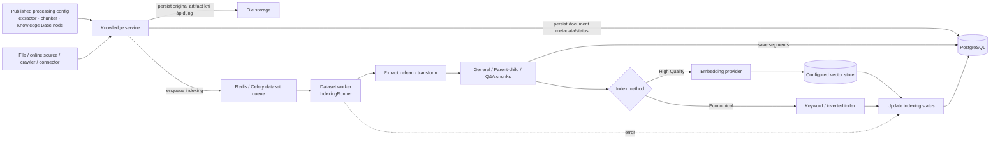
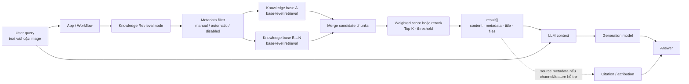

# 04. RAG

> **Version áp dụng:** Dify Community `1.15.0 @ 3aa26fb…`  
> **Docs snapshot:** `release/1.15.0 @ 57a492d8063d1583c582b4c0444fb838c6dd3027`  
> **Ngày kiểm chứng:** `2026-07-16`  
> **Trạng thái xác minh:** `Official-source verified`; runtime, quality và performance lab pending  
> **Reviewer:** AI Engineering/Platform/Security review pending

## Mục tiêu

Sau chương này, người đọc phải có thể:

1. Giải thích hai pha tách biệt của RAG: ingest/index và retrieve/augment/generate.
2. Chọn có chủ đích chunk structure, index method, retrieval strategy, rerank và metadata filter.
3. Nối `Knowledge Retrieval.result` vào LLM context mà không coi citation là bằng chứng tự động về tính đúng của câu trả lời.
4. Thiết kế bộ test cho ingestion, retrieval, generation, citation, security và operations.
5. Nhận diện state và failure domain trải trên file storage, PostgreSQL, vector/keyword index, Redis/Celery và model provider.
6. Lập kế hoạch reindex/migration thay vì giả định đổi embedding model hoặc `VECTOR_STORE` là thay đổi cấu hình không ảnh hưởng dữ liệu.

Dify mô tả Knowledge là dữ liệu riêng được dùng làm context cho LLM qua ba bước Retrieval → Augmented context → Generation. [S-048] Đây là cơ chế grounding, không phải cam kết loại bỏ hallucination.

## Phạm vi và giả định

### Phạm vi

Chương này tập trung vào knowledge base do Dify quản lý và cách app/Workflow sử dụng `Knowledge Retrieval`. Dify cũng cho phép kết nối external knowledge base, nhưng API contract, auth, latency và consistency của external system cần một thiết kế riêng. [S-048]

Nội dung bao gồm:

- data source → extract/clean/transform → chunk → segment → index;
- General, Parent-child và Q&A chunk structure;
- High Quality và Economical index method;
- vector, full-text, hybrid và inverted-index retrieval;
- metadata filtering, rerank, `Top K`, score threshold;
- truyền retrieval result vào LLM, citation/attribution;
- retrieval testing, quality regression, security và vận hành.

Ngoài phạm vi vòng này:

- benchmark chất lượng của từng embedding/rerank model;
- khuyến nghị một vector database duy nhất cho mọi workload;
- sizing theo số chunk/QPS khi chưa có corpus và SLA;
- đánh giá OCR/parser cụ thể ngoài artifact chính thức;
- chứng minh runtime, latency, recall hoặc restore khi lab chưa chạy.

### Thuật ngữ và boundary

| Thuật ngữ | Cách dùng trong chương |
|---|---|
| Document | Đơn vị nguồn được ingest, ví dụ file hoặc nội dung từ data source |
| Chunk/segment | Phần nội dung sau xử lý, là đơn vị được lưu và/hoặc index để retrieval |
| Embedding | Vector biểu diễn nội dung/query khi dùng High Quality semantic retrieval |
| Candidate | Chunk được tầng knowledge base trả về trước node-level rerank/filter cuối |
| Retrieval result | Mảng kết quả gồm content, metadata, title và có thể có file/image attachment [S-051] |
| Context | Retrieval result được truyền cho LLM; không đồng nghĩa toàn bộ corpus |
| Citation | Provenance hiển thị từ retrieval result; không tự chứng minh mọi mệnh đề do LLM sinh ra |

### Giả định bằng chứng

- Factual claim về UI/capability bám docs commit `57a492d…`.
- Claim runtime bám source tag `1.15.0`; source inspection không thay runtime trace.
- Default Compose dùng Weaviate làm vector store, nhưng chương không coi Weaviate là lựa chọn production mặc định. [S-006]
- Các metric đánh giá bên dưới là framework nội bộ đề xuất; không khẳng định Dify tự tính tất cả metric đó.

## Cơ chế hoạt động

### 1. Ingest và index

Knowledge Pipeline chính thức mô tả chuỗi tổng quát: Data Source → Data Processing (Extractor + Chunker) → Knowledge Base node → User Input → Test & Publish. Knowledge Base node khóa chunk structure, index method và retrieval settings. [S-049]

Ở Dify-managed indexing path, source `IndexingRunner` tại tag `1.15.0` thực hiện lần lượt:

1. đọc document, dataset và processing rule;
2. chọn index processor theo document form;
3. extract nội dung;
4. transform/clean/chunk;
5. lưu segment;
6. load dữ liệu vào index;
7. ghi document status/error khi xử lý thất bại. [S-054]

Document indexing được dispatch như background Celery task và gọi `IndexingRunner`; vì vậy upload được chấp nhận không đồng nghĩa document đã sẵn sàng retrieval. [S-012][S-054]

### 2. Chọn chunk structure trước khi publish

Dify `1.15.0` công bố ba structure trong Knowledge Pipeline. [S-049]

| Structure | Cơ chế | Index method | Điểm cần nhớ |
|---|---|---|---|
| General | Mỗi chunk vừa là đơn vị match vừa là context trả về | High Quality hoặc Economical | Đơn giản, nhưng một kích thước chunk phải cân bằng precision và context |
| Parent-child | Child nhỏ dùng để match; parent lớn hơn cung cấp context | Chỉ High Quality | Tách precision khỏi context; tăng số đối tượng và độ phức tạp index |
| Q&A | Index phần question và trả cặp question-answer tương ứng | Chỉ High Quality | Hợp với dữ liệu FAQ có cấu trúc; không nên áp máy móc cho văn bản tự do |

Docs cảnh báo chunk structure không thể sửa sau khi lưu và publish. [S-049] Vì vậy phải preview chunk, test một corpus nhỏ và lưu processing rule trước khi tạo knowledge base production.

### 3. Chọn index method

| Index method | Cách index | Retrieval khả dụng | Trade-off chính |
|---|---|---|---|
| High Quality | Dùng embedding model để vector hóa chunk | Vector, full-text hoặc hybrid | Semantic retrieval tốt hơn nhưng có dependency/cost của embedding; có thể thêm rerank |
| Economical | Tạo keyword index; docs nêu 10 keyword mỗi chunk | Inverted index | Không gọi embedding model cho indexing, nhưng độ chính xác retrieval có thể thấp hơn |

Knowledge base High Quality không thể chuyển xuống Economical; Economical có thể upgrade lên High Quality theo docs snapshot. [S-050] Dù UI hỗ trợ một số chuyển đổi, mọi thay đổi embedding/chunk/index phải được coi là reindex event cho đến khi lab chứng minh migration và rollback an toàn.

### 4. Retrieval theo hai tầng

`Knowledge Retrieval` yêu cầu xác định query, knowledge base và node-level retrieval settings. Khi chọn nhiều knowledge base, Dify retrieve từ các base rồi tổng hợp và xử lý kết quả ở tầng node. [S-051]

1. **Knowledge-base level:** tạo initial candidate pool theo vector, full-text, hybrid hoặc inverted index.
2. **Node/app level:** kết hợp candidate từ một hoặc nhiều knowledge base; áp metadata filter, weighted score hoặc rerank model, rồi `Top K` và score threshold theo cấu hình của tầng này. [S-051][S-052]
3. **Output:** node trả `result` là mảng chunk gồm content, metadata, title và các thuộc tính liên quan; image details nằm trong `files` khi có. [S-051]
4. **Augment:** LLM node nhận `result` qua trường Context; prompt chỉ dẫn cách dùng context.

Không nên ghi một “giá trị mặc định toàn cục” cho `Top K` hoặc score threshold. Docs UI của knowledge-base settings nêu default `TopK=3`, threshold `0.5` trong một số mode, trong khi source retrieval có fallback `top_k=4` và threshold disabled cho một đường xử lý. [S-050][S-055] Giá trị hiệu lực còn phụ thuộc layer, mode, app config và rerank; phải lưu actual config trong evidence.

### 5. Metadata filtering và rerank

- Metadata filtering giới hạn retrieval vào document phù hợp điều kiện manual hoặc automatic; automatic mode cần model. [S-051][S-052]
- Weighted Score cân bằng semantic similarity và keyword match; tùy chọn này chỉ khả dụng khi các knowledge base liên quan đáp ứng điều kiện High Quality. [S-051]
- Rerank model chấm lại và sắp xếp candidate; đây là external model dependency có thêm latency, cost, credential và data-egress consideration. [S-050][S-052]
- Với multimodal knowledge base, docs yêu cầu rerank model có capability Vision nếu muốn giữ image trong kết quả sau rerank. [S-050][S-051]

Metadata filter là query constraint, không mặc định được coi là authorization boundary. Quyền truy cập dữ liệu nhạy cảm phải được thực thi ở boundary được Security phê duyệt và có negative test.

### 6. Citation và attribution

Trong Chatflow, citation cho response có tham chiếu knowledge được hiển thị mặc định và có thể tắt bằng feature `Citation and Attributions`. [S-051] Source retrieval tạo source metadata từ dataset/document/segment, score và document metadata khi đường gọi yêu cầu retrieve source. [S-055]

Citation chỉ chứng minh hệ thống gắn response với một retrieval source. Nó không tự chứng minh:

- chunk thực sự hỗ trợ đúng mệnh đề được sinh;
- source còn hiệu lực/đúng phiên bản;
- model không trộn kiến thức ngoài context;
- citation hiển thị giống nhau trên WebApp, API và mọi app type.

Do đó phải test **citation presence**, **source correctness** và **claim support** như ba tiêu chí riêng.

### 7. Evaluation loop

Trang Retrieval Testing cho phép mô phỏng query và thử retrieval settings; thay đổi tại đây chỉ áp dụng tạm thời cho test session. Records chứa cả query thử trực tiếp và retrieval từ linked app, và hai loại dùng chung API endpoint theo docs. [S-053]

Quy trình chất lượng đề xuất:

1. khóa corpus version và processing config;
2. tạo golden query set gồm positive, paraphrase, exact term, negative và permission-sensitive cases;
3. đánh giá retrieval trước generation;
4. chỉ thay một biến mỗi vòng: chunk, embedding, search mode, rerank, `Top K` hoặc threshold;
5. chạy generation/citation test trên retrieval config đạt gate;
6. lưu regression result theo `dataset version + config + model version + app version`.

## Kiến trúc/luồng dữ liệu

### D05 — Dify-managed ingestion/indexing path

Đây là logical flow rút gọn. Custom Knowledge Pipeline có thể thêm processor/plugin trước Knowledge Base node; exact storage write, retry và transaction boundary cần runtime trace. [S-012][S-049][S-054]

### D06 — Retrieval, augmentation và citation

Base-level retrieval và node-level post-processing là hai lớp khác nhau. Không dùng một ảnh chụp UI hoặc một giá trị `Top K` để suy ra toàn bộ flow nếu chưa xác định nó thuộc layer nào. [S-050][S-051][S-055]

### State và consistency cần quản trị

| State | Vai trò | Rủi ro nếu lệch nhau |
|---|---|---|
| Original file/object | Nguồn để xử lý hoặc rebuild | Không thể tái lập chunk/index nếu source bị mất |
| PostgreSQL metadata/segments | Dataset, document, processing rule, status, chunk/segment metadata | UI/status/citation không khớp index |
| Vector hoặc keyword index | Candidate retrieval | Empty/stale result dù document nhìn thấy trong UI |
| Embedding/rerank configuration | Xác định vector/query scoring | Model/dimension/version drift làm reindex hoặc quality regression |
| Redis/Celery state | Điều phối background indexing | Upload tồn tại nhưng indexing không hoàn tất |
| Retrieval records/logs | Debug và evaluation evidence | Có thể chứa query/snippet nhạy cảm; retention sai gây compliance risk |

## Hướng dẫn hoặc ví dụ triển khai

### POC: trợ lý tra cứu chính sách nội bộ

1. **Khóa corpus.** Chọn một bộ tài liệu đã có owner, version, data classification và quyền sử dụng; loại bỏ secret/PII không cần thiết.
2. **Tạo baseline chunk.** Bắt đầu bằng General hoặc Parent-child, preview ranh giới chunk và kiểm tra heading/table/list không bị cắt sai. Khuyến nghị Parent-child trong docs là điểm khởi đầu, không thay benchmark. [S-049]
3. **Tạo baseline index.** Dùng High Quality nếu cần semantic/paraphrase retrieval; ghi embedding provider/model/version và vector backend.
4. **Chờ indexing hoàn tất.** Không test retrieval khi document còn queued/processing; thu document status, segment count và error.
5. **Tạo golden set.** Ít nhất có exact keyword, paraphrase, multi-hop không được hỗ trợ, out-of-corpus, stale document và unauthorized-scope cases.
6. **Tune retrieval độc lập.** So sánh vector/full-text/hybrid, sau đó mới bật rerank; thay một tham số mỗi lượt.
7. **Nối Workflow.** `User Input → Knowledge Retrieval → LLM → Answer`; map `Knowledge Retrieval.result` vào Context và chỉ dẫn model trả lời theo context. [S-051]
8. **Bật/test citation.** Kiểm tra filename/document/chunk được dẫn, mở đúng source, và source thực sự hỗ trợ claim.
9. **Chạy failure/security test.** Tắt provider hoặc vector DB trong lab, thử metadata bypass, prompt injection trong document và corpus update/delete.
10. **Khóa release evidence.** Lưu dataset/config/model/app version cùng test report trước khi mở rộng corpus hoặc user.

### Configuration record tối thiểu

| Nhóm | Trường phải ghi |
|---|---|
| Corpus | Owner, version, source count, format, language, classification, update cadence |
| Processing | Extractor/plugin version, cleaning rule, chunk structure, delimiter, size/overlap, summary setting |
| Index | High Quality/Economical, embedding provider/model, multimodal flag, vector backend |
| Retrieval | Base search mode, node-level mode, metadata filter, rerank model/weights, `Top K`, threshold |
| Generation | LLM provider/model, prompt version, context budget, refusal behavior |
| Evidence | Ingestion status, segment count, golden set version, metrics, latency, cost, reviewer/date |

### Test matrix

Các metric sau là framework đề xuất, không phải khẳng định về dashboard built-in của Dify.

| Layer | Test case | Pass signal/metric đề xuất |
|---|---|---|
| Extraction | PDF/DOCX/table/list/Unicode; empty or corrupt file | Text quan trọng còn đủ, thứ tự hợp lý, lỗi được ghi rõ |
| Chunking | Câu trả lời nằm giữa boundary; heading + body; parent-child | Expected passage không bị tách mất nghĩa; parent phù hợp child hit |
| Indexing | Upload mới, reindex, update, delete, provider timeout | Status terminal đúng; segment/index không stale hoặc duplicate |
| Retrieval exact | Mã sản phẩm, điều khoản, acronym | `Hit@K`, `Precision@K`; expected chunk xuất hiện đúng thứ hạng |
| Retrieval semantic | Paraphrase, synonym, cross-language nếu có | `Recall@K`, MRR; so sánh vector/hybrid |
| Negative | Câu hỏi ngoài corpus hoặc không đủ evidence | Không retrieve rác vượt threshold; app từ chối/giới hạn đúng policy |
| Metadata/security | Tài liệu khác phòng ban/trạng thái/tenant | Không có unauthorized document trong candidate/citation |
| Multi-KB | Cùng query ở nhiều knowledge base | Merge/rerank ổn định; không ưu tiên sai do score không tương thích |
| Generation | Context đúng/sai/thiếu/conflict | Groundedness, answer correctness, refusal correctness |
| Citation | Một/multiple claims, source update/delete | Citation presence, source correctness, claim support |
| Performance | Cold/warm query, concurrent query, bulk ingest | p50/p95/p99 latency, queue wait, throughput, provider error rate |
| Recovery | Redis/worker/vector DB/provider restart | Không mất document; retry/recovery time và consistency đạt RTO thử nghiệm |

## Quyết định và trade-off

### Chunking

| Khi ưu tiên | Lựa chọn khởi đầu | Điều phải chứng minh |
|---|---|---|
| Tài liệu ngắn, cấu trúc đồng đều | General | Chunk đủ context nhưng không kéo nhiều nội dung nhiễu |
| Tài liệu dài, section rõ, cần match chính xác nhưng trả context rộng | Parent-child | Child hit dẫn đúng parent; cost/index size và context budget chấp nhận được |
| FAQ hoặc bảng question-answer chuẩn | Q&A | Mapping cột/cặp đúng; câu hỏi thực tế gần với question index |

Chunk nhỏ thường tăng precision nhưng mất context; chunk lớn tăng context nhưng có thể giảm specificity và chiếm prompt budget. Không có một số ký tự/token tối ưu chung—phải benchmark trên corpus thực.

### Retrieval và rerank

| Nhu cầu | Lựa chọn khởi đầu | Trade-off |
|---|---|---|
| Query gần exact term/mã/tiêu đề | Full-text hoặc keyword-heavy hybrid | Có thể bỏ lỡ paraphrase |
| Query diễn đạt khác source | Vector hoặc semantic-heavy hybrid | Có thể trả chunk gần nghĩa nhưng sai chi tiết |
| Cần cả exact và semantic | Hybrid | Cần tune weight/rerank và quan sát score distribution |
| Candidate từ nhiều knowledge base/model | External rerank | Tăng latency/cost/egress; cần credential và fallback |
| POC chi phí thấp, corpus đơn giản | Economical | Chỉ inverted index; cần chứng minh recall đủ dùng |

### Vector-store caveat

Source `Vector` chọn backend từ `dataset.index_struct_dict["type"]` nếu dataset đã có index structure; nếu chưa thì dùng global `VECTOR_STORE`. [S-056] Hệ quả thiết kế:

- đổi `VECTOR_STORE` không phải bằng chứng existing dataset được migrate;
- đổi backend, embedding model hoặc vector dimension phải có reindex/cutover/rollback plan;
- backup vector store không thay backup PostgreSQL, source file và processing config;
- filter, full-text, consistency, HA, auth, backup và latency khác theo backend;
- “được Dify hỗ trợ” không đồng nghĩa backend đạt SLA/certification của tổ chức.

Mặc định Weaviate trong Compose chỉ là working baseline. Chọn production backend dựa trên corpus size/churn, query mode, metadata filter, HA/RPO/RTO, data residency, kỹ năng vận hành và kết quả benchmark. [S-006][S-056]

### Internal hay external knowledge

Dify-managed knowledge giảm integration effort và đưa chunk/index/retrieval vào cùng platform. External knowledge giữ dữ liệu/index ở hệ thống hiện hữu nhưng thêm API auth, timeout, schema, score normalization, availability và audit boundary. Không chọn chỉ vì muốn tránh migration; cần đánh giá end-to-end quality và ownership.

## Security và operations implications

### Security

- **Corpus là untrusted input.** Document có thể chứa prompt injection hoặc chỉ dẫn độc hại; LLM prompt phải phân biệt instruction với retrieved data, và tool/action cần authorization độc lập.
- **Metadata filter không mặc định là ACL.** Phải negative-test bypass, missing metadata, case sensitivity và multi-KB behavior; dữ liệu có ranh giới nghiêm ngặt nên tách ở boundary được phê duyệt.
- **Embedding/rerank có thể làm data egress.** Chunk, query hoặc image có thể được gửi tới provider; phải xác nhận region, retention, training policy, encryption và DPA.
- **Connector/crawler/plugin mở thêm trust boundary.** Scope credential, source authorization, redirect/private-network access và update policy phải được review.
- **Citation có thể làm lộ dữ liệu.** Filename, document title, snippet hoặc signed file URL cần được kiểm tra trên từng channel và role.
- **Retrieval records là dữ liệu nhạy cảm tiềm tàng.** Query và hit có thể tiết lộ ý định/ngữ cảnh người dùng; đặt access control và retention phù hợp. [S-053]
- **Delete phải xuyên nhiều store.** Xóa UI record chưa đủ bằng chứng file, segment, vector, cache, log và provider copy đã hết; cần deletion test và audit evidence.

### Operations

Theo dõi tối thiểu:

- ingestion queue age/depth, indexing duration và error rate;
- document theo indexing status; segment/chunk count và bất thường tăng/giảm;
- embedding/rerank quota, latency, error và cost;
- vector/keyword backend latency, saturation, storage growth và backup freshness;
- empty-result rate, score distribution, `Hit@K` regression và citation failure;
- corpus freshness, connector sync lag, update/delete completion;
- reindex progress, dual-read/cutover evidence và rollback readiness.

Backup/restore phải giữ consistency giữa source file, PostgreSQL metadata/segments, index và configuration. Nếu định tái tạo vector index thay vì restore, phải chứng minh source, processing rule, embedding model/version và thời gian rebuild vẫn còn khả dụng và đạt RTO.

## Failure modes và troubleshooting

| Hiện tượng | Nguyên nhân khả dĩ | Kiểm tra đầu tiên | Hành động/validation |
|---|---|---|---|
| Document đứng ở queued/processing | Redis/Celery worker, queue routing, backlog hoặc provider treo | Worker consumer, queue age, task/error log | Chạy synthetic indexing; đo recovery, không upload lặp mù |
| Indexing chuyển error | Extractor, processing rule, embedding credential/quota hoặc vector backend | Document error/status, provider và backend log | Sửa dependency, retry có kiểm soát, kiểm tra duplicate/stale segment [S-054] |
| Document completed nhưng retrieval rỗng | Document disabled/archived, filter quá chặt, threshold, query rỗng hoặc index thiếu | Actual KB/node config; document availability | Test không filter/threshold; kiểm tra expected segment/index [S-055] |
| Exact term bị bỏ lỡ | Chỉ semantic retrieval hoặc chunk làm mất term | Retrieval Testing với exact query | So sánh full-text/hybrid; sửa chunk/metadata |
| Paraphrase bị bỏ lỡ | Economical/keyword-only, embedding không phù hợp hoặc threshold cao | Compare query/chunk và score | Benchmark High Quality/vector/hybrid; không chỉ tăng `Top K` |
| Nhiều kết quả không liên quan | Chunk quá lớn, `Top K` cao, threshold thấp, corpus lẫn domain | Score distribution và top chunks | Tách corpus/metadata, tune chunk và threshold/rerank |
| Weighted Score không khả dụng | Có Economical knowledge base hoặc cấu hình/model không tương thích | Index mode của mọi selected KB | Chuẩn hóa base hoặc dùng rerank model [S-051][S-052] |
| Citation không hiển thị | Feature tắt, app/channel không hỗ trợ giống kỳ vọng hoặc context mapping sai | Feature flag, app type, API payload | Test từng channel; không suy từ Chatflow UI [S-051] |
| Citation hiển thị nhưng sai claim | Candidate đúng chủ đề nhưng không entail answer; LLM pha kiến thức ngoài | So claim với cited chunk | Thắt prompt, improve retrieval, thêm claim-level evaluation |
| Image bị mất sau retrieval/rerank | Knowledge/embedding/rerank/LLM không đồng bộ multimodal | Vision tags, file field, rerank model | Test multimodal end-to-end; dùng Vision-capable components [S-050][S-051] |
| Sau đổi vector backend/model, data cũ biến mất | Config đổi nhưng existing index không migrate/reindex | Dataset index structure và collection | Roll back; chạy migration/reindex plan [S-056] |
| Update/delete vẫn trả nội dung cũ | Relational/index/cache sync chưa hoàn tất | Document/segment status và direct retrieval | Consistency test; không xác nhận xóa chỉ từ UI |
| Retrieval chậm/cost tăng | Multi-KB fan-out, rerank, `Top K`, provider hoặc backend saturation | Per-stage latency/call count | Giảm candidate/fan-out, capacity test, timeout/fallback design |

## Checklist xác nhận

- [x] Ingest/index và retrieve/generate được tách thành hai flow.
- [x] General, Parent-child và Q&A được mô tả cùng ràng buộc index method.
- [x] Knowledge-base level và node-level retrieval settings được phân biệt.
- [x] Citation được mô tả là provenance, không phải proof of correctness.
- [x] Vector-store migration caveat được gắn với source tag `1.15.0`.
- [x] Hai sơ đồ Mermaid mô tả ingest và retrieval được nhúng trực tiếp.
- [ ] Mermaid render trên wiki renderer mục tiêu.
- [ ] Corpus POC, owner, classification và golden set được khóa.
- [ ] Chunk preview và indexing run được lưu làm evidence.
- [ ] Retrieval benchmark có `Hit@K`/`Recall@K`/MRR hoặc metric tương đương.
- [ ] Generation, refusal và citation correctness đạt quality gate.
- [ ] Metadata/ACL/prompt-injection negative tests hoàn tất.
- [ ] Provider/vector/worker failure injection và recovery được đo.
- [ ] Backup/restore hoặc deterministic rebuild được chứng minh.
- [ ] AI Engineering, Platform và Security review sign-off.

## Giới hạn/version caveats

- Nội dung bám Community `1.15.0` và docs commit `57a492d…`; UI label, default và retrieval path có thể thay ở release sau.
- Docs và source cho thấy default khác nhau theo layer/path; chương không công bố một `Top K`/threshold mặc định chung. [S-050][S-055]
- Pipeline/custom processor/plugin có thể tạo data path khác flow rút gọn; cần trace đúng app/dataset đang triển khai.
- Chưa có lab evidence cho parser quality, chunk count, recall, latency, cost, concurrency, deletion consistency, backup/restore hoặc failure recovery.
- Parent-child được docs khuyến nghị cho người mới nhưng không phải lựa chọn tối ưu đã chứng minh cho mọi corpus. [S-049]
- Citation behavior được xác nhận trong docs cho Chatflow; API/channel khác phải test riêng. [S-051]
- Source code là bằng chứng implementation tại tag, không phải API compatibility guarantee cho custom integration.
- Vector backend support không đồng nghĩa feature parity hay production certification giữa các engine.
- Metric và test gate trong chương là recommendation nội bộ, không phải feature claim của Dify.

## Nguồn tham khảo

- [S-006] Docker `.env.example` tại tag `1.15.0` — default `VECTOR_STORE`/Weaviate baseline.
- [S-012] Document indexing task tại tag `1.15.0` — background Celery dataset indexing.
- [S-048] Knowledge Overview, docs snapshot `1.15.0` — RAG mental model và knowledge lifecycle.
- [S-049] Knowledge Pipeline Orchestration, docs snapshot `1.15.0` — data processing, chunk structure, index/retrieval setup và test/publish.
- [S-050] Specify the Index Method and Retrieval Settings, docs snapshot `1.15.0` — High Quality/Economical, vector/full-text/hybrid, rerank, `Top K`, threshold.
- [S-051] Knowledge Retrieval node, docs snapshot `1.15.0` — query, multi-KB retrieval, two-layer settings, output/context và citation.
- [S-052] Integrate Knowledge within Apps, docs snapshot `1.15.0` — multi-path retrieval, rerank, metadata filtering và app integration.
- [S-053] Test Knowledge Retrieval, docs snapshot `1.15.0` — temporary test settings và retrieval records.
- [S-054] `api/core/indexing_runner.py` tại tag `1.15.0` — extract/transform/segment/load và error status flow.
- [S-055] `api/core/rag/retrieval/dataset_retrieval.py` tại tag `1.15.0` — dataset availability, retrieval, source metadata và defaults theo code path.
- [S-056] `api/core/rag/datasource/vdb/vector_factory.py` tại tag `1.15.0` — vector backend selection và embedding/search dispatch.
