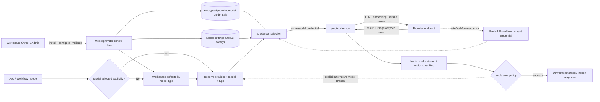

# 06. Quản lý model và model provider

> **Version áp dụng:** Dify Community `1.15.0`; docs snapshot `57a492d8063d1583c582b4c0444fb838c6dd3027`  
> **Ngày kiểm chứng:** `2026-07-16`  
> **Trạng thái xác minh:** `Official-source verified` + `Design reviewed` qua cross-review nội bộ; specialist review và provider/runtime test vẫn `RUNTIME-PENDING`
>
> **Reviewer:** AI Platform/Security/FinOps review pending

## Mục tiêu

Sau chương này, người đọc có thể:

1. phân biệt provider, model, model type, workspace default, credential và load-balancing credential;
2. hiểu đường gọi LLM, embedding và rerank qua `plugin_daemon` ở Dify `1.15.0`;
3. thiết lập governance cho credential, quota, chi phí, model lifecycle và quyền quản trị;
4. thiết kế retry/fallback mà không âm thầm đổi output contract hoặc phá vector index;
5. lập test matrix cho model selection, credential rotation, rate limit, provider outage, embedding và rerank.

Chương này tập trung vào control plane và runtime semantics của model. Hướng dẫn network/TLS cụ thể cho external API hoặc self-hosted endpoint nằm ở Chương 14; sizing GPU không thuộc phạm vi bản nháp này.

## Phạm vi và giả định

### Phạm vi

- Community Edition `1.15.0` và model-provider plugin tương ứng.
- Model provider được cài từ Integrations/Marketplace hoặc plugin đã được tổ chức phê duyệt.
- Các model type được schema chính thức mô tả: `llm`, `text-embedding`, `rerank`, `speech2text`, `tts`, `moderation`. [S-069]
- Workspace default, model được chọn rõ trong app/node, custom model, nhiều credential và load balancing cùng model.
- External model API và endpoint self-hosted nhìn từ Dify như các provider endpoint; khác biệt hạ tầng được xử lý ở Chương 14.

### Giả định

- Tổ chức đã có owner cho provider account, billing, secret và data-processing approval.
- Test chỉ dùng credential lab và dữ liệu không nhạy cảm.
- Không có provider credential thật trong workspace hiện tại; Docker daemon cũng chưa chạy, nên chưa có runtime evidence.
- Mọi ngưỡng latency, quota headroom, token budget và cost alert trong chương là biến đầu vào, không phải con số Dify bảo đảm.

### Ngoài phạm vi

- Danh sách “model tốt nhất” theo thời điểm; model catalog và giá thay đổi nhanh.
- Benchmark chất lượng giữa các vendor nếu chưa có dataset/evaluation rubric của doanh nghiệp.
- Hướng dẫn viết model-provider plugin hoàn chỉnh.
- Phân tích điều khoản dữ liệu của từng provider thay Legal/Privacy/Procurement.

## Cơ chế hoạt động

### Provider, model và credential là ba đối tượng khác nhau

- **Provider** mô tả cách xác thực, danh sách model và capability mà plugin cung cấp.
- **Model** có định danh, `model_type`, feature, context size, parameter rules và có thể có pricing metadata.
- **Provider credential** dùng chung cho các predefined model của provider.
- **Model credential** gắn với custom model; custom model có thể yêu cầu model name, base URL và credential riêng.

Schema plugin hỗ trợ ba cách cấu hình: `predefined-model`, `customizable-model` và `fetch-from-remote`. Nó cũng khai báo feature như vision, tool call, multi-tool-call và stream tool call; vì vậy model cùng type `llm` chưa chắc thay thế được nhau về capability. [S-069]

### Workspace defaults không phải explicit pin

Trong **Default Models**, workspace có thể đặt model mặc định cho:

- System Reasoning;
- Embedding;
- Rerank;
- Speech-to-Text;
- Text-to-Speech.

App hoặc node không chọn model sẽ dùng workspace default tương ứng. Thay default vì vậy có blast radius tới mọi consumer không pin model rõ ràng. Model đã chọn trực tiếp trong node có change scope nhỏ hơn nhưng tạo thêm inventory/version-management work. [S-065]

### Credential scope và lifecycle

Tài liệu baseline nêu model key cấp quyền sử dụng model cho toàn workspace, tạo billing trực tiếp vào provider account, và chỉ Owner/Admin được quản lý provider. Dify validate credential trước khi provider khả dụng. Một provider có thể giữ nhiều key; custom model dùng key riêng và việc xóa key duy nhất sẽ xóa custom model. Đáng chú ý, key của custom model có thể vẫn được giữ trong **Manage Credentials** sau khi model bị remove để dùng lại sau này. [S-065]

Do đó, “xóa model khỏi catalog” không được coi là đã revoke credential. Offboarding phải kiểm tra cả Dify credential inventory lẫn provider account.

### Dispatch qua plugin daemon

Ở tag `1.15.0`, `PluginModelClient` gửi các request nội bộ tới plugin daemon cho:

- provider/model schema và credential validation;
- LLM invoke và token count;
- text/multimodal embedding;
- text/multimodal rerank;
- speech-to-text, text-to-speech và các model capability khác.

Request mang tenant, provider, model, model type, credential và payload cần thiết. Vì vậy `plugin_daemon` là dependency của model-backed execution, không chỉ của quá trình cài plugin. Credential phải được giải mã vào memory và đi qua API-to-daemon trust boundary để thực hiện call. [S-038]

### Ba lớp fallback không được trộn lẫn

| Lớp | Thứ được thay | Semantics | Giới hạn quan trọng |
|---|---|---|---|
| Workspace default | Model được dùng khi consumer không chọn rõ | Convenience/default resolution | Thay default có thể đổi hành vi nhiều app/node cùng lúc. |
| Credential load balancing | Credential/config cho **cùng provider + model + model type** | Round robin và thử credential khác khi một credential gặp lỗi được nhận diện | Không phải cross-model hay cross-provider fallback. |
| Node error handling | Retry, default value, error branch hoặc alternative model được workflow thiết kế | Có thể đổi model/provider/output path | Phải validate output contract, policy, cost và idempotency. |

LLM node cho phép cấu hình số lần retry, interval, backoff và fallback bằng default value, error routing hoặc alternative model. Đây là cấu hình node/workflow có chủ đích, không phải bằng chứng mọi app tự động chuyển model. [S-066]

### Load balancing credential tại `1.15.0`

Source `ModelManager` xác nhận chiến lược round robin dùng Redis index/cooldown cho các load-balancing config cùng model. Khi invoke gặp:

- `InvokeRateLimitError`: credential được cooldown `60` giây;
- `InvokeAuthorizationError` hoặc `InvokeConnectionError`: cooldown `10` giây;
- lỗi khác: lỗi được raise, không tự thử credential khác.

Nếu mọi config đều cooldown, call kết thúc bằng lỗi cuối cùng hoặc lỗi chưa có credential. Các TTL trên là hành vi source của `1.15.0`, không phải tuning recommendation chung và chưa được lab xác minh trong workspace này. [S-072]

`ProviderConfiguration` quản lý CRUD/validation cho provider và custom-model credential, mã hóa field được schema đánh dấu secret trước khi persistence, obfuscate chúng khi đọc, đồng thời lắp ghép model settings và load-balancing configs cho workspace. [S-071]

### Quota và rate limit

Provider account là billing/quota domain bên ngoài. Dify phân biệt ít nhất `InvokeRateLimitError` và `QuotaExceededError`; connection/server unavailable là nhóm lỗi khác. [S-060]

Không suy luận quota còn lại chỉ từ HTTP success. Cần theo dõi đồng thời usage/cost phía Dify nếu có, provider billing dashboard/API và rate-limit header/telemetry được provider công bố. Nhiều key không tạo thêm quota một cách an toàn nếu chúng cùng thuộc một account/project hoặc vi phạm policy provider.

### Embedding và rerank cần consistency riêng

High-Quality index dùng embedding model để biến chunk thành vector và hỗ trợ vector/full-text/hybrid retrieval. Rerank mặc định tắt; khi bật, model rerank sắp xếp candidate và phát sinh usage/cost riêng. Với multimodal embedding, docs yêu cầu chọn multimodal rerank; nếu dùng rerank không hỗ trợ multimodal, image sẽ bị loại khỏi rerank và retrieval result. [S-050]

Quy tắc vận hành:

- pin embedding provider/model/revision cho mỗi knowledge base;
- không dùng “fallback sang embedding model khác” cho query của index hiện hữu;
- coi đổi embedding model/dimension/tokenization là migration cần rebuild/reindex và retrieval evaluation;
- pin modality giữa embedding và rerank;
- nếu rerank lỗi, chỉ degrade sang no-rerank/weight-based path khi use case đã phê duyệt và kiểm thử rõ, không bỏ qua âm thầm.

Docs snapshot chưa mô tả đầy đủ một workflow in-place để đổi embedding model cho index đã có. Vì vậy migration/reindex semantics là open validation gap, không phải capability đã được khẳng định.

## Kiến trúc/luồng dữ liệu

Mermaid thể hiện hai loop độc lập: load balancing chỉ đổi credential của cùng model; error policy của node mới có thể route sang alternative model. Cú pháp dashed path không ngụ ý mọi lỗi đều retry: source chỉ rotate credential tự động cho ba nhóm lỗi đã nêu. [S-066][S-072]

### Luồng embedding/rerank

1. Ingestion chọn embedding model, tạo vector và lưu vector cùng knowledge state.
2. Query phải được embed trong cùng vector space với index.
3. Vector/full-text/hybrid retrieval trả candidate.
4. Nếu bật rerank, rerank model nhận query + candidate và trả thứ tự/score mới.
5. Top K/score threshold và candidate cuối được đưa sang LLM context.

Embedding availability ảnh hưởng cả indexing lẫn vector query; rerank availability chỉ ảnh hưởng bước reordering nhưng cách degrade phải được thiết kế rõ. [S-050][S-038]

## Hướng dẫn hoặc ví dụ triển khai

### 1. Lập model requirement matrix trước khi thêm key

| Workload | Type/capability | Quality contract | Latency/SLO input | Data boundary | Cost/quota input | Fallback policy |
|---|---|---|---|---|---|---|
| Workflow generation | `llm`, structured output | JSON schema + semantic checks | p50/p95/timeout | Prompt có/không PII | input/output tokens | Retry rồi explicit alternative branch |
| Agent | `llm`, tool call | Tool schema, max iterations | End-to-end budget | Tool result có dữ liệu gì | tokens + tool cost | Fail closed cho action nhạy cảm |
| Knowledge indexing | `text-embedding` | dimension/model revision pinned | batch throughput | Document chunks rời hệ thống? | embedding tokens | Pause queue; không đổi model tùy ý |
| Knowledge query | cùng embedding của index | retrieval recall/precision | query embedding latency | Query text | request quota | Fail retrieval hoặc approved keyword path |
| Rerank | `rerank`, đúng modality | ranking metric + Top K | rerank latency budget | Query + candidate chunks | per-request/token cost | Approved no-rerank/weight path |

Matrix phải có owner và ngày review. Không chọn model chỉ theo tên/giá nếu capability, context, data policy và output contract chưa khớp.

### 2. Cài và validate provider (`RUNTIME-PENDING`)

1. Vào **Integrations > Model Provider** bằng Owner/Admin.
2. Chọn provider/plugin đã qua supply-chain review.
3. Nhấn **Setup**, nhập credential lab và endpoint/org/project ID nếu provider yêu cầu.
4. Xác nhận Dify validate credential thành công trước khi model xuất hiện.
5. Đặt credential name không nhạy cảm nhưng truy vết được, ví dụ `lab-eval-2026q3`; không đưa secret vào tên.
6. Ghi owner, provider account/project, environment, scope, expiry, rotation date và billing center vào inventory ngoài Dify.
7. Test negative bằng credential sai/revoked; xác nhận UI/log không lộ secret.

Credential này cấp model access trên workspace và phát sinh bill trực tiếp ở provider account. Không dùng production key cho POC. [S-065]

### 3. Chọn workspace defaults có kiểm soát (`RUNTIME-PENDING`)

1. Mở **Default Models**.
2. Chọn System Reasoning, Embedding, Rerank, STT và TTS theo requirement matrix.
3. Lập danh sách app/node đang dựa vào default.
4. Chạy smoke cho từng model type được dùng.
5. Lưu provider/model identifier, plugin version và ngày thay đổi.

Trước khi đổi default, chạy impact analysis cho consumer không pin. Với workflow quan trọng, explicit pin giúp giảm drift nhưng vẫn phải quản lý deprecation.

### 4. Cấu hình LLM node và output contract (`RUNTIME-PENDING`)

1. Chọn provider/model rõ trong LLM node cho workflow cần reproducibility.
2. Chỉ bật feature mà schema/model thực sự hỗ trợ: vision, tool call, structured output, streaming.
3. Pin parameter set cần thiết như temperature, top-p và max tokens; không giả định parameter name/range giống nhau giữa provider.
4. Với structured output, validate JSON/schema ở downstream thay vì tin model tuyệt đối.
5. Đặt timeout/retry trong tổng latency budget.
6. Đưa error branch về contract rõ: error object, human review, degraded result hoặc fail closed.

Docs lưu ý model không có native JSON support có thể chỉ nhận schema qua prompt và kết quả có thể không ổn định. [S-066]

### 5. Thiết kế credential load balancing (`RUNTIME-PENDING`)

Chỉ bật khi có ít nhất hai credential/config hợp lệ cho cùng provider/model/type và policy provider cho phép:

1. Xác định mỗi key thuộc account/project/quota pool nào.
2. Đặt tên config theo owner/environment; không trộn dev/prod trong cùng rotation pool nếu cần isolation.
3. Validate từng key độc lập trước khi bật.
4. Bật load balancing cho đúng model và kiểm tra round robin bằng provider-side request evidence đã redacted.
5. Inject lần lượt rate-limit, revoked credential và connection failure để kiểm chứng cooldown/next-key behavior.
6. Inject một lỗi ngoài ba nhóm source xử lý để xác nhận hệ thống không silently rotate.
7. Alert khi một config vào cooldown, mọi config cooldown hoặc traffic lệch bất thường.

Không dùng load balancing để che key hết quota lâu dài; đó là incident/capacity signal cần xử lý.

### 6. Thiết kế alternative-model fallback (`RUNTIME-PENDING`)

Fallback LLM chỉ được release khi primary và alternative có:

- output schema/structured validation tương đương;
- tool-call/vision/context capability đủ cho cùng input;
- safety/content policy được duyệt;
- data region/retention phù hợp;
- latency và cost budget riêng;
- test set chứng minh chất lượng tối thiểu.

Luồng đề xuất: primary retry có giới hạn → error branch phân loại lỗi → alternative model chỉ cho lỗi transient/approved → validate output → đánh dấu `fallback_used=true` trong telemetry. Authentication/policy error không nên bị che bằng cross-provider fallback nếu credential hoặc approval chưa đúng.

### 7. Quản lý embedding/rerank change (`RUNTIME-PENDING`)

1. Chụp baseline provider/model/revision, modality, vector dimension nếu quan sát được, chunking và retrieval settings.
2. Chọn bộ query có expected relevant chunks và ranking labels.
3. Tạo index/copy tách biệt bằng candidate embedding model; không ghi đè index đang phục vụ.
4. Re-ingest toàn bộ representative corpus.
5. Đo indexing success, recall/precision, latency, cost và failure rate.
6. Test rerank cùng modality; với multimodal phải xác nhận image còn trong result.
7. Cut over có rollback point; giữ index cũ đến khi observation window hoàn tất.

Không fallback query embedding sang model khác khi index chính không đổi.

### 8. Test matrix bắt buộc

| Test ID | Scenario | Kỳ vọng | Evidence | Trạng thái |
|---|---|---|---|---|
| M-01 | Owner/Admin thêm provider với key đúng | Validation đạt, model khả dụng | Audit event/UI + request ID redacted | `RUNTIME-PENDING` |
| M-02 | Member/Normal không có quyền quản trị provider | Bị từ chối, không thấy secret | Negative access test | `RUNTIME-PENDING` |
| M-03 | Key sai hoặc revoked | Typed auth failure; không log secret | Dify + provider log | `RUNTIME-PENDING` |
| M-04 | LLM blocking và streaming | Output/stream hoàn tất đúng contract | Run ID, latency, tokens | `RUNTIME-PENDING` |
| M-05 | Structured output với input biên | Schema validation bắt lỗi invalid output | Raw redacted + validator result | `RUNTIME-PENDING` |
| M-06 | Tool/vision capability mismatch | Fail rõ trước/ở invoke; không hành động sai | Node error + model schema | `RUNTIME-PENDING` |
| M-07 | Rate limit một LB credential | Config cooldown và key cùng model khác được thử | Redis/provider/Dify evidence | `RUNTIME-PENDING` |
| M-08 | Auth/connection error một LB credential | Cooldown theo source; next config được thử | Cooldown TTL + request trace | `RUNTIME-PENDING` |
| M-09 | Mọi LB config cooldown | Call lỗi rõ; không loop vô hạn | Error + bounded duration | `RUNTIME-PENDING` |
| M-10 | Provider trả lỗi ngoài nhóm rotate | Lỗi propagate; không silent switch | Error type + selected config | `RUNTIME-PENDING` |
| M-11 | Plugin daemon dừng | LLM/embedding/rerank path lỗi có chẩn đoán | API/daemon/node logs | `RUNTIME-PENDING` |
| M-12 | Default model thay đổi | Chỉ consumer dựa default đổi; inventory khớp | Before/after app runs | `RUNTIME-PENDING` |
| M-13 | Xóa key duy nhất của custom model | Model bị remove như docs; dependent app được phát hiện | UI + dependency inventory | `RUNTIME-PENDING` |
| M-14 | Embedding index/query cùng model | Retrieval baseline đạt | Query set + retrieved chunks | `RUNTIME-PENDING` |
| M-15 | Candidate embedding model mới | Chỉ index mới dùng candidate; reindex/eval hoàn tất | Dual-index evidence | `RUNTIME-PENDING` |
| M-16 | Multimodal embedding + text-only rerank | Image exclusion được phát hiện; release bị chặn | Retrieval result diff | `RUNTIME-PENDING` |
| M-17 | Rerank unavailable | Approved degrade hoặc fail policy đúng | Branch trace + ranking impact | `RUNTIME-PENDING` |
| M-18 | Credential rotation | New key hoạt động, old key revoked, không downtime ngoài budget | Provider/Dify audit | `RUNTIME-PENDING` |
| M-19 | Quota/cost budget chạm ngưỡng | Alert trước hard failure; owner nhận action | Alert evidence | `RUNTIME-PENDING` |

## Quyết định và trade-off

### Workspace default hay explicit pin

Default giảm effort cấu hình và giúp thay đổi tập trung, nhưng blast radius lớn và dễ gây drift. Explicit pin tăng reproducibility và change visibility, nhưng tạo inventory/deprecation burden. Quy tắc thực dụng: workflow quan trọng pin rõ; prototype có thể dùng default nhưng phải được inventory.

### Một provider hay nhiều provider

Một provider đơn giản hóa contract, billing và data governance nhưng tạo concentration risk. Nhiều provider tăng resilience/negotiating leverage, đổi lại phải duy trì evaluation, policy, output normalization và fallback logic cho từng cặp.

### Nhiều credential hay tách workspace/environment

Nhiều key trong một workspace hỗ trợ rotation/load distribution. Nó không thay thế isolation: dev/prod có blast radius, billing và data policy khác nhau nên thường cần account/project/workspace tách biệt.

### Credential fallback hay model fallback

Credential load balancing giữ nguyên model semantics, phù hợp lỗi key/rate/connect được source hỗ trợ. Model fallback tăng availability nhưng có thể đổi quality, context, tool behavior, safety và cost; chỉ dùng qua error branch đã test.

### External API hay self-hosted model

External API giảm hạ tầng model nhưng đưa dữ liệu, quota, latency và retention sang provider domain. Self-hosted tăng kiểm soát data/network nhưng đội vận hành nhận trách nhiệm GPU, serving, batching, scaling, model artifact và patching. Chương 14 sẽ cụ thể hóa decision matrix.

### Đổi embedding model nhanh hay giữ index ổn định

Model mới có thể tăng quality/cost efficiency, nhưng vector compatibility và reindex cost làm thay đổi này giống data migration hơn config flip. Ưu tiên dual-index evaluation và rollback thay vì in-place switch chưa được chứng minh.

## Security và operations implications

### Security và governance

- Provider key cho phép workspace dùng model và phát sinh bill; quản lý như production secret, không phải cấu hình UI thông thường. [S-065]
- Chỉ Owner/Admin nên thay provider/default/credential; vẫn cần access review và separation of duties ở provider account.
- API giải mã credential để dispatch qua plugin daemon; bảo vệ service-to-service network, daemon logs, crash dump và support bundle. [S-038]
- Provider/model plugin là supply-chain dependency. Pin plugin version, verify signature/source policy và theo dõi advisory.
- Xác định dữ liệu gửi ra ngoài: system/user prompt, retrieved chunks, file/image/audio, tool result và metadata. Chốt DPA, region, retention/training và deletion trước production.
- Không gửi secret trong prompt, node variable, model parameter, trace tag hoặc model-facing file.
- Credential rotation phải gồm create/validate new → controlled switch → smoke → revoke old → audit; không chỉ sửa key trong UI.
- Remove model không nhất thiết xóa stored key; kiểm tra **Manage Credentials** và revoke phía provider. [S-065]

### Operations và FinOps

Telemetry tối thiểu cần thu, không khẳng định mọi field đều có native exporter ở baseline:

- request count, success/error theo provider/model/type/app/node;
- time-to-first-token và end-to-end latency p50/p95/p99;
- input/output/embedding tokens và provider-reported cost;
- `InvokeRateLimitError`, `QuotaExceededError`, auth, connection và server-unavailable count;
- retry count, alternative-model fallback count và fallback quality/error rate;
- LB config cooldown, TTL, all-configs-unavailable và traffic distribution;
- plugin daemon availability/latency;
- indexing backlog/success, query embedding latency, rerank latency và retrieval metric;
- quota headroom, spend forecast và anomaly theo cost center.

Alert threshold phải gắn SLO/budget. Không dùng một timeout hoặc token cap cho mọi model vì context, price và latency khác nhau.

### Change management

Mỗi model change cần record:

- provider/model identifier và plugin version;
- model type/features/context/pricing metadata đã kiểm tra;
- credential alias/account/project, không lưu secret;
- consumer inventory: default-dependent và explicitly pinned;
- evaluation result, rollout window, rollback target và owner;
- với embedding: index version, corpus snapshot, vector/retrieval settings và reindex status.

## Failure modes và troubleshooting

| Triệu chứng | Khả năng | Kiểm tra theo thứ tự | Hành động an toàn |
|---|---|---|---|
| Model không xuất hiện | Provider/plugin chưa cài, credential validation fail, model bị disable/deprecated | Plugin status → provider config → credential → model schema | Không hardcode model name; sửa install/config rồi validate lại. |
| `ModelNotExistError` | Node chưa chọn model hoặc model bị remove | Node config, default model, catalog | Pin model khả dụng hoặc sửa default có impact review. [S-060] |
| `LLMModeRequiredError` | Credential model không hợp lệ/thiếu | Credential alias, scope, provider validation | Rotate/sửa credential; không log key. [S-060] |
| 401/auth failure | Key revoked/sai scope/project | Provider audit, Dify validation, LB config | Disable bad config, rotate; điều tra exposure. |
| `InvokeRateLimitError` | RPM/TPM/concurrency/account pool hết | Provider header/dashboard, traffic, LB cooldown | Backoff, giảm tải; chỉ rotate cùng model nếu policy cho phép. [S-060][S-072] |
| `QuotaExceededError` | Hard quota/credit hết | Provider billing/quota owner | Chặn/reduce workload hoặc nạp quota theo approval; không retry storm. [S-060] |
| Connection/server unavailable | DNS/TLS/egress/provider outage | Plugin daemon → network → endpoint status | Retry bounded; alternative provider chỉ qua approved branch. |
| Mọi LB key cooldown | Shared quota/outage hoặc nhiều key hỏng | Cooldown TTL, account mapping, error class | Fail rõ, alert owner; không loop hoặc thêm key vô kiểm soát. |
| Lỗi khác không rotate key | Source chỉ rotate một số typed error | Exact exception và provider response | Sửa root cause; không mở retry rộng có thể nhân side effect. [S-072] |
| Plugin daemon down | Mọi plugin-backed model call bị ảnh hưởng | Daemon health, API-to-daemon key/network, daemon log | Khôi phục daemon; không đổi provider khi control path vẫn hỏng. [S-038] |
| Output JSON sai schema | Model thiếu native JSON support hoặc prompt/temperature | Raw redacted output, model feature, validator | Retry bounded hoặc error branch; không parse lỏng cho action nhạy cảm. [S-066] |
| Tool/vision không hoạt động | Model feature mismatch | Model schema, node input, provider capability | Chọn model đúng feature; test positive/negative. [S-069] |
| Cost tăng đột biến | Context/prompt dài, retry/fallback loop, model/default đổi | Tokens, model ID, retries, consumer diff | Dừng rollout, cap input/retry, điều tra default blast radius. |
| Indexing fail | Embedding credential/quota/plugin/worker lỗi | Worker → daemon → provider → vector store | Pause ingestion, giữ job/evidence; không đổi embedding model âm thầm. |
| Retrieval giảm sau đổi model | Vector space/index hoặc settings không tương thích | Index version, embedding ID, query set, Top K/rerank | Rollback index/config hoặc reindex candidate đúng quy trình. |
| Image mất khỏi retrieval | Multimodal embedding ghép với rerank không multimodal | Model Vision feature, retrieved candidates trước/sau rerank | Chọn multimodal rerank hoặc disable rerank có đánh giá. [S-050] |
| Rerank timeout | Provider latency/quota/candidate quá lớn | Rerank latency, candidate count, Top K | Approved degrade/fail; không silently bỏ rerank. |

Nguyên tắc chẩn đoán: xác định consumer và model selection → plugin/model schema → credential → plugin daemon → network/provider → quota → output contract. Không rotate secret, đổi default và đổi provider cùng lúc vì sẽ làm mất khả năng khoanh vùng.

## Checklist xác nhận

### Source/design gate

- [x] Model type, feature và configuration method được đối chiếu docs snapshot.
- [x] Workspace default và quyền quản lý provider được đối chiếu docs.
- [x] LLM/embedding/rerank dispatch qua plugin daemon được xác nhận từ tag `1.15.0`.
- [x] Credential LB được phân biệt với alternative-model fallback.
- [x] Round robin và typed-error cooldown được đối chiếu source.
- [x] Embedding/rerank modality constraint được ghi rõ.
- [x] Mermaid routing được nhúng trực tiếp.
- [ ] Mermaid render trên renderer publish mục tiêu.

### Runtime/governance gate (`RUNTIME-PENDING`)

- [ ] Provider/plugin version và provenance được phê duyệt.
- [ ] Provider account, billing owner, data region/retention và DPA được chốt.
- [ ] Owner/Admin positive test và member negative test đạt.
- [ ] Credential đúng/sai/revoked được test, log không lộ secret.
- [ ] Default-dependent và explicitly pinned consumer inventory hoàn tất.
- [ ] LLM blocking/streaming/structured/tool/vision test đạt theo model dùng thực tế.
- [ ] LB round robin, 60s/10s cooldown và all-cooldown behavior được tái hiện.
- [ ] Alternative model branch đạt schema, quality, safety, latency và cost gate.
- [ ] Quota/rate-limit alert và provider escalation path hoạt động.
- [ ] Embedding index/query pin và dual-index migration test đạt.
- [ ] Multimodal embedding/rerank consistency test đạt nếu áp dụng.
- [ ] Credential rotation/revoke rehearsal đạt.
- [ ] Plugin daemon outage/recovery test đạt.
- [ ] AI Platform, Security, Privacy/Legal và FinOps sign-off theo scope.

## Giới hạn/version caveats

- Nội dung bám Community `1.15.0`; model catalog/plugin/provider behavior có thể đổi độc lập với Dify core.
- Source xác nhận call đi qua plugin daemon và logic LB, nhưng workspace này chưa chạy provider call end-to-end.
- Docs model provider xác nhận workspace-wide access và Owner/Admin management, nhưng không thay thế kiểm tra edition-specific RBAC/audit ở Chương 10/13.
- Cooldown `60s/10s` là implementation detail của tag `1.15.0`; không coi là SLA hay setting ổn định qua release.
- Load balancing được source xác nhận cho credential config cùng model; chưa có lab evidence cho từng provider/plugin.
- LLM error branch hỗ trợ alternative model về mặt workflow, nhưng compatibility giữa hai model phải do đội triển khai chứng minh.
- Provider quota, price, rate-limit và retention là change-sensitive; luôn kiểm tra tài liệu/hợp đồng provider hiện hành trước release.
- Docs snapshot chưa đủ để khẳng định quy trình đổi embedding model in-place hoặc automatic reindex. Chương này yêu cầu dual-index/reindex như control bảo thủ.
- Native telemetry/exporter availability cho mọi metric đề xuất chưa được kiểm tra; thiếu metric phải được ghi gap hoặc bổ sung ở gateway/provider.
- Không có model credential, approved test dataset, provider account hay GPU endpoint trong lab hiện tại.

## Nguồn tham khảo

- [S-065] Model Providers, docs snapshot `57a492d`: provider setup/validation, workspace-wide key access, Owner/Admin, multiple/custom credential và workspace defaults.
- [S-066] LLM Node, docs snapshot `57a492d`: model selection/parameters, structured output, streaming, retry và error/fallback strategy.
- [S-050] Specify the Index Method and Retrieval Settings, docs snapshot `57a492d`: embedding index, retrieval/rerank, cost và multimodal compatibility.
- [S-060] Error Types, docs snapshot `57a492d`: model/config error, connection, server unavailable, rate limit và quota error taxonomy.
- [S-069] Model Specs, docs snapshot `57a492d`: model types, configuration methods, features, parameter/pricing và credential schema.
- [S-038] `api/core/plugin/impl/model.py` tại tag `1.15.0`: credential validation và LLM/embedding/rerank dispatch qua plugin daemon.
- [S-071] `api/core/entities/provider_configuration.py` tại tag `1.15.0`: provider/model credential CRUD, validation, encryption/obfuscation và load-balancing configuration assembly.
- [S-072] `api/core/model_manager.py` tại tag `1.15.0`: model resolution, same-model round robin, Redis cooldown và typed-error fallback behavior.
