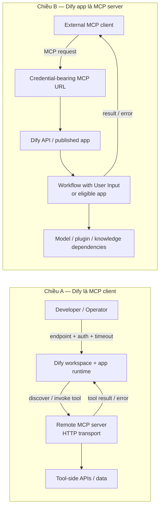

# 07. MCP

> **Version áp dụng:** Dify Community `1.15.0 @ 3aa26fb…`  
> **Docs snapshot:** `release/1.15.0 @ 57a492d…`  
> **Ngày kiểm chứng:** `2026-07-16`  
> **Trạng thái xác minh:** `Official-source verified`; runtime lab pending  
> **Reviewer:** Integration/Security review pending

## Mục tiêu

Sau chương này, người đọc phải:

- Phân biệt rõ Dify **tiêu thụ tool từ MCP server** và Dify **publish app như MCP server**.
- Biết transport và các kiểu credential mà docs `1.15.0` xác nhận cho chiều client.
- Xác định workflow nào đủ điều kiện publish qua MCP.
- Triển khai kết nối thử nghiệm mà không làm lộ server URL, OAuth credential hoặc custom header.
- Xử lý timeout, lỗi discovery, credential rotation và endpoint availability theo đúng failure domain.

## Phạm vi và giả định

- Chương này mô tả capability của Dify `1.15.0`, không thay thế MCP protocol specification.
- Chiều client chỉ ghi nhận **HTTP transport** vì đây là transport docs baseline xác nhận. [S-014]
- Chiều server áp dụng cho app/workflow đủ điều kiện; không tuyên bố mọi workflow đều publish được.
- Ví dụ dùng endpoint giả và không chứa secret thật.
- Chưa có runtime evidence với một MCP server/client cụ thể; procedure hiện mang nhãn source-verified.

## Cơ chế hoạt động

### Dify làm MCP client

Workspace có thể đăng ký MCP server, khám phá/import tool và dùng các tool đó trong app. Docs baseline nêu HTTP transport, OAuth Dynamic Client Registration, OAuth client credential nhập thủ công, custom header và timeout. [S-014]

Execution có hai giai đoạn khác nhau:

1. **Configuration/discovery:** operator khai báo endpoint và cơ chế xác thực; Dify lấy metadata/tool catalog.
2. **Invocation:** app/workflow chọn tool đã import; runtime gửi input tới MCP server và đưa kết quả về execution graph.

Khám phá thành công không bảo đảm mọi invocation thành công. Token expiry, scope, input schema, timeout và tool-side dependency vẫn có thể làm runtime call lỗi.

### Dify làm MCP server

Dify app có thể được expose qua MCP. Tính năng mặc định tắt; sau khi bật, URL server chứa credential và có thể được regenerate. URL đó phải được xử lý như secret, không phải link chia sẻ công khai. [S-015]

Chỉ workflow bắt đầu bằng **User Input** phù hợp với publish flow này. Workflow bắt đầu bằng trigger không được coi là publishable MCP workflow theo docs baseline. [S-026]

## Kiến trúc/luồng dữ liệu

### D08 — Dify trong hai vai trò MCP client và MCP server

Hai chiều có trust boundary khác nhau. Ở chiều client, Dify giữ credential để gọi hệ thống ngoài. Ở chiều server, external client giữ URL có credential để gọi vào Dify. Không dùng credential của chiều này thay cho cơ chế xác thực của chiều kia.

## Hướng dẫn hoặc ví dụ triển khai

### Kết nối một MCP server vào Dify

1. Xác nhận endpoint dùng HTTPS, certificate hợp lệ và host Dify có egress/DNS tới endpoint.
2. Chọn cơ chế xác thực được server hỗ trợ: OAuth DCR, manual client credential hoặc custom header. Không đưa secret vào tài liệu, Git hay ảnh chụp màn hình.
3. Đặt timeout theo latency budget của workflow; timeout phải ngắn hơn tổng request/SLA budget.
4. Đăng ký server trong workspace, chạy discovery và chỉ import tool thực sự cần.
5. Kiểm tra schema input/output với dữ liệu giả, sau đó test success, unauthorized, timeout và invalid-input path.
6. Gắn tool vào một app thử nghiệm có phạm vi dữ liệu thấp trước khi đưa vào workflow nghiệp vụ.
7. Bật monitoring cho latency, error rate, authentication failure và tool-side quota.

### Publish một Dify app qua MCP

1. Xác nhận app/workflow thuộc loại được hỗ trợ; với Workflow, start node phải là User Input. [S-026]
2. Review input/output contract, model/tool/data dependency và hành vi timeout của app.
3. Bật MCP publishing theo docs, lấy credential-bearing URL và lưu thẳng vào secret manager. [S-015]
4. Cấu hình URL trong MCP client mà không log hoặc chia sẻ qua chat/ticket.
5. Test happy path, invalid input, downstream provider failure và concurrent request.
6. Regenerate URL khi nghi ngờ lộ credential hoặc khi client bị thu hồi; cập nhật consumer theo controlled rollout.

### Mẫu test tối thiểu

| Test | Kỳ vọng |
|---|---|
| Client discovery với credential đúng | Tool catalog trả về và schema đọc được |
| Client discovery với credential sai | Bị từ chối, không rò secret trong log |
| Tool invocation timeout | Workflow dừng/đi nhánh lỗi theo thiết kế; không treo vô hạn |
| Publish workflow dùng User Input | MCP client gọi được contract đã duyệt |
| Publish trigger-start workflow | Không coi đây là flow được hỗ trợ theo baseline |
| Regenerate MCP server URL | URL cũ không còn được dùng; consumer nhận URL mới qua secret rollout |

## Quyết định và trade-off

| Quyết định | Lợi ích | Chi phí/rủi ro | Khi chọn |
|---|---|---|---|
| OAuth thay custom static header | Lifecycle/authorization tốt hơn nếu server hỗ trợ | Setup và refresh/error flow phức tạp hơn | Kết nối dài hạn hoặc nhiều environment |
| Custom header | Nhanh cho POC/server đơn giản | Rotation thủ công, dễ lộ nếu vận hành kém | POC có dữ liệu thấp và secret manager sẵn sàng |
| Import ít tool | Giảm attack surface và prompt/tool ambiguity | Cần governance khi mở thêm capability | Mặc định cho production |
| Publish app qua URL trực tiếp | Consumer tích hợp nhanh | URL mang credential, khó chia sẻ an toàn | Consumer đã có secret-management và network controls |
| Wrapper/gateway trước Dify MCP URL | Thêm policy, rate limit và audit | Tăng component/latency | External hoặc high-risk consumer |

## Security và operations implications

- Xem MCP server URL do Dify publish là secret; redact khỏi log, telemetry, ticket và screen recording. [S-015]
- Credential cho remote MCP server phải nằm trong secret manager, có owner, rotation period và revoke procedure.
- Chỉ import/enable tool cần thiết; tool description không phải security policy.
- Egress allowlist, DNS/TLS validation và timeout phải được kiểm soát ở hạ tầng, không chỉ trong prompt.
- Tool output là dữ liệu không tin cậy: giới hạn kích thước, kiểm tra schema và tránh đưa nguyên văn vào downstream action nhạy cảm.
- Với multi-tenant/workspace, xác nhận ai có quyền thêm server, cập nhật credential và đưa tool vào app. Plugin/integration governance được mở rộng ở Chương 08/13.
- Chưa có evidence versioned cho OAuth/scoped authorization ở **Dify MCP server side**; không tự gắn capability client-side vào server-side endpoint.

## Failure modes và troubleshooting

| Failure | Dấu hiệu | Kiểm tra theo thứ tự | Hành động |
|---|---|---|---|
| DNS/TLS/network lỗi | Discovery hoặc invocation không kết nối | DNS từ Dify host, route, certificate chain, proxy/egress | Sửa connectivity trước khi đổi app |
| OAuth/header sai | `401/403`, discovery thất bại | Issuer/client config, token expiry/scope, header redaction | Rotate/re-authorize; không log secret |
| Tool catalog/schema đổi | Tool mất hoặc input validation lỗi | Discovery metadata, version/change log server | Re-discover và regression-test app |
| Invocation timeout | Workflow chậm/lỗi | Dify timeout, server latency, downstream quota | Điều chỉnh budget; retry chỉ với operation an toàn |
| MCP URL Dify bị lộ | Call lạ hoặc URL xuất hiện trong log | Access log, secret scan, consumer inventory | Regenerate URL và rollout credential mới |
| Dify downstream lỗi | MCP client nhận error dù endpoint reachable | App run, plugin daemon, model/tool/knowledge dependency | Chẩn đoán app runtime theo Chương 02/03 |
| Trigger-start workflow không publish được | Không có publish path mong đợi | Kiểm tra start node | Thiết kế adapter workflow dùng User Input hoặc chọn integration khác |

## Checklist xác nhận

- [x] Client và server direction được tách rõ.
- [x] HTTP transport và auth modes client-side bám docs baseline.
- [x] User Input eligibility rule được ghi lại.
- [x] Credential-bearing server URL được coi là secret.
- [ ] Chọn MCP server/client dùng cho lab.
- [ ] Chạy discovery và invocation success/error/timeout test.
- [ ] Xác nhận credential redaction trong log.
- [ ] Test regenerate/revoke flow.
- [ ] Security/Integration reviewer sign-off.

## Giới hạn/version caveats

- MCP capability có thể thay đổi nhanh giữa các release; transport/auth claim chỉ áp dụng snapshot docs đã khóa.
- Docs baseline xác nhận server URL chứa credential nhưng không đủ để kết luận có fine-grained scope, OAuth hoặc RBAC phía MCP server.
- “Publish app như MCP server” không đồng nghĩa mọi app dependency trở nên stateless hoặc HA; model, plugin, Redis, database và provider failure vẫn truyền ra consumer.
- Chưa benchmark concurrency, payload size, timeout hoặc retry semantics.
- Procedure UI có thể đổi theo release; claim kỹ thuật phải ưu tiên source/docs đúng snapshot.

## Nguồn tham khảo

- [S-014] Dify as MCP client, docs snapshot `57a492d…`.
- [S-015] Publish Dify app as MCP server, docs snapshot `57a492d…`.
- [S-026] Workflow Start Node, docs snapshot `57a492d…`.
- [S-005] Docker Compose tại tag `1.15.0` cho `/mcp` routing context.
- [S-010] Nginx route template tại tag `1.15.0`.
