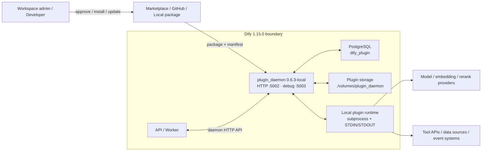

# 08. Plugins

> **Version áp dụng:** Dify Community `1.15.0`; plugin daemon `0.6.3-local`  
> **Product/docs snapshot:** `3aa26fb…` / `57a492d…`  
> **Ngày kiểm chứng:** `2026-07-16`  
> **Trạng thái xác minh:** `Official-source verified` + `Config validated`; runtime/security lab pending  
> **Reviewer:** Plugin platform/Security review pending

## Mục tiêu

Sau chương này, người đọc phải:

- Hiểu plugin là extension boundary tách khỏi Dify API process.
- Phân biệt Model, Tool, Agent Strategy, Extension, Datasource và Trigger plugin.
- Biết Marketplace, GitHub và local upload là các nguồn cài đặt cần governance khác nhau.
- Có thể dựng, debug và đóng gói một thin-slice Tool plugin bằng scaffold chính thức mà không đưa secret vào source/package.
- Nhận diện `plugin_daemon`, plugin database và plugin storage trong topology/backup plan.
- Không nhầm manifest permission hoặc daemon process boundary với bằng chứng isolation hoàn chỉnh.

## Phạm vi và giả định

- Phân tích bám Dify `1.15.0` và image Compose `langgenius/dify-plugin-daemon:0.6.3-local`. [S-005]
- Chương tập trung architecture, lifecycle, governance và operations; không phải SDK tutorial đầy đủ.
- Runtime model từ daemon README mô tả khả năng kiến trúc; Compose Community baseline đang dùng **local** image variant, không chứng minh serverless runtime được cung cấp mặc định. [S-032]
- Enterprise có thể hạn chế nguồn cài integration/plugin; entitlement chi tiết vẫn phải đối chiếu contract/vendor. [S-016]
- Chưa chạy malicious-plugin/isolation test hoặc multi-replica lab.

## Cơ chế hoạt động

### Các loại plugin

| Loại | Mục đích chính | Direction điển hình | Rủi ro cần review |
|---|---|---|---|
| Model | Cung cấp LLM, embedding, rerank/provider capability | Dify → plugin → provider endpoint | Credential, egress, quota, retention |
| Tool | Đưa external action/API vào app/workflow | Dify → plugin → external system | Side effect, authorization, idempotency |
| Agent Strategy | Mở rộng chiến lược lập kế hoạch/tool use | Agent runtime → strategy | Prompt/tool escalation, loop/cost |
| Extension | Mở rộng integration point của Dify | Tùy extension point | Input trust, callback exposure |
| Datasource | Kết nối và đồng bộ nguồn dữ liệu | Source → plugin → Dify/knowledge | Data scope, deletion, freshness |
| Trigger | Khởi chạy flow từ event/schedule bên ngoài | Event source → plugin → workflow | Replay, signature, duplicate event |

Danh mục trên bám plugin developer docs snapshot; direction và entitlement cụ thể phải kiểm tra theo từng plugin. [S-029][S-030]

### Manifest và package contract

Manifest mô tả identity/runtime/architecture, resource, permission, storage và extension points của plugin. [S-031] Nó là contract để daemon biết cách quản lý plugin, nhưng không tự chứng minh rằng code đã an toàn, dependency không có CVE hoặc permission được enforcement ở mọi OS/network boundary.

### Plugin daemon lifecycle

`plugin_daemon` là service riêng. Dify API trao đổi với daemon qua HTTP; daemon quản lý lifecycle và runtime plugin. README `0.6.3` mô tả local runtime dùng subprocess với STDIN/STDOUT, debug runtime dùng TCP và serverless runtime dùng HTTP. [S-032][S-033]

Trong Compose baseline:

- daemon dùng relational database logic `dify_plugin`;
- mount `./volumes/plugin_daemon` cho plugin storage;
- expose internal API `5002` và publish debug port `5003`;
- kết nối ngược Dify API qua inner URL;
- API/worker dispatch LLM, embedding và rerank qua plugin implementation. [S-005][S-006][S-038]

Vì vậy daemon outage có thể làm model-backed app lỗi, không chỉ làm màn hình cài plugin ngừng hoạt động.

## Kiến trúc/luồng dữ liệu

### D08B — Plugin lifecycle và trust boundary

Sơ đồ chỉ vẽ local runtime đang khớp image baseline. Debug/serverless transport được ghi nhận như capability của daemon docs, không được vẽ như component đang chạy mặc định.

## Hướng dẫn hoặc ví dụ triển khai

### Quy trình phê duyệt trước khi cài

1. Ghi nhận source, owner, version/tag/commit, checksum/signature nếu có và license của plugin.
2. Xác định loại plugin, capability, external endpoint, credential, data accessed và side effect.
3. Review manifest resource/permission/storage/extension declarations. [S-031]
4. Review source/dependency hoặc vendor trust; manifest review không thay source/security review.
5. Chọn workspace thử nghiệm, secret riêng và dữ liệu không nhạy cảm.
6. Cài từ source đã phê duyệt; không cho phép arbitrary local upload ở production nếu không có control.
7. Chạy smoke/error/timeout/rotation test trước khi enable cho app nghiệp vụ.
8. Ghi rollback version và owner chịu trách nhiệm cập nhật.

### Lựa chọn nguồn cài

| Nguồn | Khi dùng | Kiểm soát bắt buộc |
|---|---|---|
| Marketplace | Plugin phổ biến, lifecycle do publisher duy trì | Publisher/version review, update policy, regression test |
| GitHub | Cần pin repository/version cụ thể | Commit/tag pin, source/dependency/license review, provenance |
| Local upload | Internal plugin hoặc controlled package | Build pipeline, signing/checksum, malware scan, approval và artifact retention |

Docs workspace xác nhận ba nguồn Marketplace/GitHub/local cùng permission/update behavior; Enterprise có thêm khả năng hạn chế source. [S-016]

### Thin-slice tự viết Tool plugin (`RUNTIME-PENDING`)

Walkthrough chính thức hiện hành yêu cầu plugin scaffolding tool và Python `3.12`, sau đó dùng `dify plugin init`, chọn template **Tool**, khai báo permission, viết provider/tool schema cùng implementation, remote-debug và đóng gói `.difypkg`. [S-123] Vì nguồn này mới hơn docs snapshot `1.15.0`, phải pin version/hash của plugin CLI, SDK và daemon dùng trong lab; không mặc định current template tương thích baseline.

Một thin slice nội bộ nên chỉ gọi một endpoint read-only giả lập và đi theo contract tối thiểu:

1. khởi tạo project bằng CLI đã pin; lưu CLI/SDK version, generated tree và lockfile;
2. đặt identity/permission nhỏ nhất trong manifest; không xin Apps, storage, endpoint hay network capability nếu fixture không dùng;
3. định nghĩa provider YAML và credential bằng `secret-input`; không hard-code token trong YAML, Python, `.env.example` hoặc test fixture;
4. định nghĩa một tool YAML với input/output schema hẹp, `required`, giới hạn độ dài và `llm_description` không mở quyền ngoài ý muốn;
5. implement provider credential validation và tool call với timeout hữu hạn, allowlisted HTTPS host, typed error và output đã normalize; không trả raw response chứa secret/header;
6. chạy unit/contract test cho valid input, missing/oversized input, bad credential, timeout, malformed response và downstream `5xx`;
7. remote-debug chỉ trong workspace lab với debug key ngắn hạn; kiểm tra log/redaction rồi revoke key;
8. chạy `dify plugin package <project>`; lưu `.difypkg`, checksum, source commit, dependency lock, scan/SBOM và approval record;
9. local-upload vào workspace test, invoke từ Workflow/Agent read-only, restart daemon, rollback/uninstall và xác nhận plugin DB/storage nhất quán;
10. chỉ promote package đã ký/duyệt qua artifact pipeline; không rebuild thủ công ở production.

Evidence tối thiểu gồm generated manifest/schema, source commit, dependency lock, unit/negative-test log, package checksum, scan result, install/invoke run ID, daemon log đã redacted và rollback result. Walkthrough này chứng minh đường phát triển cơ bản, không chứng minh malicious-plugin isolation hoặc multi-replica safety.

### Smoke test tối thiểu

- Daemon health và API↔daemon connectivity.
- Install, enable, invoke, disable, uninstall/reinstall.
- Thin-slice custom Tool plugin: scaffold, unit/negative test, remote debug, package/checksum, local upload và rollback.
- Credential đúng/sai/hết hạn và rotation.
- Provider/tool success, timeout, rate limit và malformed response.
- Restart daemon nhưng giữ plugin DB/storage.
- Backup/restore plugin DB + storage trong môi trường test.
- Verify debug port không reachable từ untrusted network.

## Quyết định và trade-off

| Quyết định | Lợi ích | Chi phí/rủi ro | Khuyến nghị |
|---|---|---|---|
| Marketplace auto-update | Nhận fix nhanh | Behavior drift không qua regression | Production dùng controlled update window |
| Pin version/commit | Reproducible | Phải tự theo dõi CVE/fix | Mặc định cho governed environment |
| Local plugin | Fit nội bộ, kiểm soát source | Tự chịu build/sign/support | Chỉ qua trusted artifact pipeline |
| Một daemon local | Đơn giản cho POC | SPOF và local-storage coupling | Không gọi là HA; đo failure/recovery |
| Shared plugin storage + nhiều replica | Có tiềm năng scale/failover | Semantics Community chưa đủ evidence | Chỉ thiết kế sau vendor/source/lab validation |

## Security và operations implications

- Plugin code là supply-chain và code-execution boundary; package source cần trust policy riêng.
- Không expose daemon port `5002` hoặc debug port `5003` ra Internet. Compose publish `5003`; production phải gỡ mapping hoặc giới hạn bind/firewall. [S-005][S-006]
- Mỗi credential cần owner, scope tối thiểu, secret manager, rotation và revoke path.
- Egress từ plugin runtime nên allowlist theo plugin/provider; DNS/TLS/proxy policy phải nằm ở hạ tầng.
- Plugin DB và `./volumes/plugin_daemon` thuộc backup set. Restore main database mà thiếu plugin state có thể tạo môi trường không nhất quán.
- Model provider dispatch qua daemon khiến daemon latency/error phải có dashboard và alert riêng. [S-038]
- Không diễn giải subprocess, manifest permission hoặc container boundary là sandbox chứng minh được; cần threat model và negative test.
- Log phải redact API key, OAuth token, custom header, payload nhạy cảm và credential-bearing URL.

## Failure modes và troubleshooting

| Failure | Impact | Kiểm tra | Hành động |
|---|---|---|---|
| API không gọi được daemon | Model/tool/plugin calls lỗi | DNS, port 5002, inner API URL/key, daemon health | Khôi phục connectivity/credential |
| Daemon DB lỗi | Install/config/lifecycle và runtime metadata lỗi | PostgreSQL, `dify_plugin`, migration/connection pool | Restore DB/connectivity; không reinstall mù |
| Plugin storage mất/khác node | Package/runtime asset thiếu | Mount/object store, checksum, backup | Restore đúng snapshot với DB |
| Provider credential sai | Model/tool trả auth error | Secret version/scope, provider log | Rotate credential và retest |
| Package/update regression | App lỗi sau update | Version diff, daemon/plugin logs, contract test | Rollback version đã pin |
| Plugin process crash/timeout | Invocation lỗi hoặc treo tới timeout | Process/daemon log, resource usage, downstream latency | Cô lập plugin, giới hạn resource, rollback |
| Debug port exposed | Untrusted access risk | Host port/firewall/security scan | Gỡ mapping, rotate affected secret, điều tra access |
| Daemon down | LLM/embedding/rerank và tool flows liên quan lỗi | Daemon health, API log, provider path | Recovery/failover theo topology đã kiểm chứng |

## Checklist xác nhận

- [x] Plugin types và invocation direction được inventory.
- [x] Baseline daemon/image/storage/database được khóa.
- [x] Model-provider critical path được ghi nhận.
- [x] Marketplace/GitHub/local source governance được phân biệt.
- [x] Thin-slice tự viết Tool plugin có scaffold-to-package contract và evidence requirement.
- [ ] Chốt approved-source/update policy.
- [ ] Chạy install/invoke/restart/restore lab.
- [ ] Kiểm tra port `5003` và egress restrictions.
- [ ] Threat-model local plugin runtime và malicious package.
- [ ] Xác minh Community multi-replica semantics hoặc giữ single-instance limitation.
- [ ] Plugin platform/Security sign-off.

## Giới hạn/version caveats

- Plugin daemon có version riêng với Dify core; upgrade phải kiểm tra compatibility matrix, không chỉ bump Dify tag.
- Compose pin tag `0.6.3-local` nhưng không pin image digest; reproducibility tuyệt đối vẫn là gap.
- README daemon mô tả local/debug/serverless runtime, nhưng baseline Compose chỉ chứng minh local image được cấu hình.
- Chưa đủ evidence để khẳng định OS-level isolation, tenant isolation hoặc safe multi-replica behavior.
- Enterprise source restrictions/production-ready daemon capability phải xác minh bằng artifact/entitlement tương ứng.
- Plugin behavior và publisher package có thể drift độc lập với source tree Dify.
- [S-123] là current plugin walkthrough sau snapshot baseline; pin CLI/SDK/daemon và chạy compatibility test trước khi dùng generated package với Dify `1.15.0`.

## Nguồn tham khảo

- [S-005] Docker Compose tại Dify `1.15.0`.
- [S-006] Docker `.env.example` tại Dify `1.15.0`.
- [S-016] Integrations and Plugins, docs snapshot `57a492d…`.
- [S-029] Plugin Introduction, docs snapshot `57a492d…`.
- [S-030] Choose Plugin Type, docs snapshot `57a492d…`.
- [S-031] Plugin Manifest Schema, docs snapshot `57a492d…`.
- [S-032] Plugin Daemon README `0.6.3`.
- [S-033] Plugin Daemon commit `54432d8…`.
- [S-038] Plugin model implementation tại Dify `1.15.0`.
- [S-123] [Dify Tool Plugin Walkthrough](https://docs.dify.ai/en/develop-plugin/dev-guides-and-walkthroughs/tool-plugin) — scaffold, schema, implementation, debug và package flow; truy cập `2026-07-20`.
