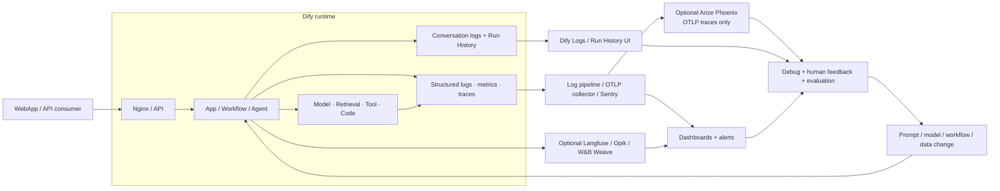

# 09. LLMOps và observability

> **Version áp dụng:** Dify Community `1.15.0 @ 3aa26fb…`  
> **Docs snapshot:** `release/1.15.0 @ 57a492d…`  
> **Ngày kiểm chứng:** `2026-07-16`  
> **Trạng thái xác minh:** `Official-source verified` + `Config validated`; telemetry/runtime lab pending  
> **Reviewer:** Operations/Security/AI quality review pending

## Mục tiêu

Sau chương này, người đọc phải:

- Phân biệt application logs, workflow run history, platform logs, metrics, distributed traces và quality evaluation.
- Thiết kế correlation từ user request tới conversation/message, workflow run, node, model/tool và dependency.
- Xác định dữ liệu nào được Dify lưu hoặc export và áp retention/redaction phù hợp.
- Chọn giữa built-in views, OpenTelemetry/Sentry, native external LLM tracing integration và Arize Phoenix qua OTLP mà không gửi dữ liệu nhạy cảm ngoài ý muốn.
- Xây dashboard, alert và evaluation loop đủ để phát hiện availability, latency, cost và quality regression.

## Phạm vi và giả định

- Built-in application Logs áp dụng cho interaction live sau publish; debugging/prompt-testing session không nằm trong log này. [S-073]
- Run History cung cấp result/detail/tracing ở application và node level cho workflow debugging. [S-074]
- Platform telemetry dựa trên environment-variable docs: structured/text logging, request logging, Sentry và OTLP/OpenTelemetry. [S-009]
- Langfuse, Opik và W&B Weave được docs baseline liệt kê như external tracing integration; đây không phải endorsement hoặc security approval. [S-075][S-076][S-077]
- Không có evidence trong snapshot baseline cho native Phoenix integration. Phoenix nhận trace qua OpenTelemetry/OTLP, nên pattern được tài liệu hóa là Dify OTLP exporter → collector nội bộ → Phoenix trace endpoint; metric/log đi destination riêng. Đây là integration design cần runtime conformance, không phải native-feature claim. [S-009][S-127]
- Chương đưa ra metric/alert rubric khởi điểm, không đặt SLO khi chưa có workload và business objective.
- Chưa có collector, external LLMOps account hoặc runtime traffic trong lab; mọi test thực thi đang pending.

## Cơ chế hoạt động

### Sáu lớp evidence cần ghép lại

| Lớp | Trả lời câu hỏi | Evidence chính | Không thay thế được |
|---|---|---|---|
| Application conversation logs | Người dùng hỏi gì, app trả gì, feedback ra sao? | Input/output history, timing, token, error/warning, feedback [S-073] | Process/container health |
| Workflow run history | Node nào chạy, thứ tự/data flow/latency ở đâu? | Result, detail, tracing, node last run [S-074] | Live-user retention/audit policy |
| Platform logs | Component nào lỗi và tại sao? | API/worker/web/plugin/sandbox/dependency stdout/file | End-user quality |
| Metrics | Tần suất, tỷ lệ và phân phối thay đổi thế nào? | Rate, error, latency, queue, resource, token/cost aggregates | Root-cause trace chi tiết |
| Distributed/LLM traces | Một request đi qua hop/node/model/tool nào? | Trace/span/run/message IDs, inputs/outputs/metadata khi cho phép | Ground-truth quality evaluation |
| Evaluation/feedback | Output có đúng, hữu ích và an toàn không? | User feedback, test set, reviewer score, policy checks | Availability/SLO |

Một dashboard xanh không chứng minh câu trả lời đúng; một tập evaluation tốt cũng không chứng minh queue, database hoặc provider đang khỏe.

### Built-in Logs và Run History không phải một nguồn duy nhất

Application Logs ghi interaction qua WebApp/API, gồm conversation history, performance/token data, system context và feedback; debug session bị loại khỏi nguồn này. [S-073] Workflow Run History ghi mỗi execution, cho xem final result/error, input/output/metadata và trace node/order/timing. [S-074]

Vì hai nguồn phục vụ mục đích khác nhau, test release phải tạo ít nhất:

- một draft/debug run để kiểm tra node trace;
- một published WebApp/API run để kiểm tra application log;
- một failed/degraded run để kiểm tra error visibility;
- một feedback event để kiểm tra quality loop.

### Platform logging, Sentry và OpenTelemetry

Docs environment `1.15.0` nêu: [S-009]

- `LOG_LEVEL`, `LOG_OUTPUT_FORMAT=text|json`, file path/rotation và timezone;
- `ENABLE_REQUEST_LOGGING`; nếu đồng thời dùng `DEBUG`, request/response body có thể bị ghi log;
- `API_SENTRY_DSN`, trace/profile sample rate, `WEB_SENTRY_DSN`, plugin Sentry settings;
- `ENABLE_OTEL`, OTLP trace/metric endpoint, auth, HTTP/gRPC protocol, sampling, batch/queue/export interval/timeout.

JSON logs dễ ingest hơn, nhưng chỉ có giá trị khi field/correlation/redaction được chuẩn hóa. `DEBUG=true` không phải cách chữa observability thiếu vì có thể làm lộ prompt, response, node/tool detail hoặc request body.

### Retention là một control chủ động

Application conversation logs được docs mô tả là giữ vô thời hạn theo mặc định. Workflow cleanup mặc định tắt; khi bật, biến retention mặc định là 30 ngày và cleanup chạy theo lịch. [S-073][S-009] Tổ chức phải chốt retention theo data classification, điều tra sự cố, quyền xóa và chi phí database; không để default quyết định thay policy.

## Kiến trúc/luồng dữ liệu

### D13 — Observability pipeline



External tracing là một data export path. Input, output, model/tool metadata, user/session/run identifiers và errors có thể được gửi ra hệ thống khác theo integration mapping. [S-075][S-076][S-077]

## Hướng dẫn hoặc ví dụ triển khai

### 1. Khóa correlation contract

Tối thiểu giữ và liên kết khi field tồn tại:

| Scope | Correlation/attribute đề xuất |
|---|---|
| Request | `trace_id`, request ID, timestamp, environment, route, response mode |
| App | app ID/version, conversation/message ID, end-user pseudonymous ID |
| Workflow | workflow ID/version, workflow run ID, trigger source, status |
| Node | node ID/type, start/end, latency, retry, error type |
| Model | provider, model ID, token input/output/total, latency, error/rate limit |
| Retrieval | dataset/retrieval event, document IDs đã hạn chế, score/rerank metadata |
| Tool/plugin | tool/plugin name/version, attempt, downstream correlation, error |
| Infra | service/container/pod, host/node, release SHA/image digest |

Không tạo ID chứa email, raw user name hoặc dữ liệu nghiệp vụ nhạy cảm. Correlation phải đi qua blocking/streaming path và downstream call mà không đưa secret vào baggage/tag.

### 2. Cấu hình khởi điểm cho lab

Ví dụ sau chỉ là baseline reviewable; endpoint/key lấy từ secret manager và phải đổi theo collector:

```dotenv
LOG_LEVEL=INFO
LOG_OUTPUT_FORMAT=json
ENABLE_REQUEST_LOGGING=true
DEBUG=false

ENABLE_OTEL=true
OTLP_BASE_ENDPOINT=https://otel-collector.example.internal:4318
OTEL_SAMPLING_RATE=0.1

WORKFLOW_LOG_CLEANUP_ENABLED=true
WORKFLOW_LOG_RETENTION_DAYS=30
```

Trước khi dùng:

1. Xác nhận collector TLS/auth và network path.
2. Chạy secret/PII canary để biết field nào bị export.
3. Kiểm tra trace/log sampling vẫn giữ 100% error hoặc có cơ chế tương đương theo toolchain.
4. Tạo dashboard/alert trước khi mở traffic; telemetry không có consumer không tạo giá trị vận hành.
5. Đo CPU/memory/network/storage overhead và dropped span/log.

### Phoenix qua OTLP collector (`RUNTIME-PENDING`)

Phoenix là một destination **trace/evaluation** hỗ trợ OTLP/OpenTelemetry, không phải backend metric/log tổng quát và không được baseline Dify liệt kê như native integration. [S-127] Dùng collector nội bộ làm protocol, auth, redaction và routing boundary:

1. pin Phoenix image/version và collector config; tách project/environment, retention, access và backup owner;
2. cấu hình Dify gửi OTLP tới collector bằng transport đã được cả hai phía hỗ trợ; không trỏ production thẳng vào một URL lấy từ ví dụ current docs;
3. collector chỉ forward trace đã allowlist/redact sang Phoenix; route metric/log sang backend vận hành tương ứng;
4. map service/environment/release/app/workflow/model attributes nhưng loại raw prompt/output, user ID và tool payload nếu data policy không cho phép;
5. chạy published success, failed model/tool, retrieval và workflow run; đối chiếu trace/span hierarchy với Dify run/message/node IDs;
6. inject Phoenix/collector outage, queue đầy và slow export; Dify phải giữ behavior fail-open/fail-closed đúng policy và báo dropped telemetry;
7. kiểm tra deletion/retention, tenant/project isolation, TLS/auth rotation và restore trước khi dùng trace làm evidence dài hạn.

Nếu collector không preserve semantic attributes mà Phoenix cần, trace vẫn có thể hiện như generic span. Không tuyên bố LLM-specific view/evaluation đạt cho tới khi model, retrieval và tool spans được mapping và test trên đúng version.

### 3. Dashboard tối thiểu

| Dashboard | Chỉ số | Phân tách bắt buộc |
|---|---|---|
| User-facing reliability | request/run success, error/timeout, p50/p95/p99 latency | app/version, blocking/streaming, route |
| Workflow | run/node latency, failed/paused status, retry, queue wait | workflow/version, node type, worker queue |
| Model/provider | call rate, latency, token, rate limit, auth/error | provider/model, app, environment |
| Retrieval | index lag, retrieval latency, empty result/error | dataset/vector engine, app |
| Tool/plugin | invocation latency/error/timeout, daemon health | plugin/tool/version, endpoint |
| Platform | API/worker/beat health, Redis/DB/vector/storage saturation, restart | service/instance, release |
| Quality/cost | feedback rate, pass score, groundedness rubric, token/cost per successful run | app/version/model/test-set |

Không gắn alert trực tiếp vào average latency hoặc raw error count duy nhất. Dùng rate/window, minimum traffic, severity và runbook link.

### 4. Release/evaluation loop

1. Pin app/DSL, prompt, model/provider, plugin, knowledge snapshot và Dify release.
2. Chạy golden set gồm happy, boundary, adversarial, provider/tool failure và sensitive-data cases.
3. So sánh quality, latency, token/cost và error với baseline; không chỉ so output text exact match.
4. Canary một phần traffic nếu topology/edition hỗ trợ; giữ rollback/forward-fix trigger.
5. Theo dõi online feedback và regression window.
6. Ghi quyết định promote/reject cùng evidence, reviewer và known gap.

### 5. Test matrix observability

| Test | Injection | Evidence mong đợi |
|---|---|---|
| O01 | Published success | Application log + platform log + trace cùng correlation |
| O02 | Draft/debug run | Run History/node trace có; không nhầm là live conversation log |
| O03 | Model auth/rate limit | Provider/model/error visible, secret redacted |
| O04 | Worker dừng trong streaming | Queue/worker/event symptom phân biệt với API health |
| O05 | Tool timeout | Node/tool attempt, downstream correlation và fail branch |
| O06 | PII canary | Không xuất raw PII vào destination bị cấm |
| O07 | Collector down | App behavior và telemetry drop/backpressure đúng design |
| O08 | Cleanup enabled | Log quá retention bị xóa; log trong window còn; job có audit |
| O09 | Sampling | Error trace coverage và estimated volume/cost đạt policy |
| O10 | Version change | Dashboard/filter phân biệt old/new app + Dify release |

## Quyết định và trade-off

### Built-in views hay external LLMOps

Built-in Logs/Run History có context sản phẩm và giảm component, phù hợp debugging/POC. External tracing hỗ trợ correlation, search, evaluation và cross-system workflow tốt hơn nhưng tăng data egress, credential, cost và vendor/retention surface. Chọn theo data policy và operation model, không theo số lượng dashboard.

### Full fidelity hay sampling

Full trace hữu ích khi tải thấp/điều tra, nhưng input/output có thể nhạy cảm và volume lớn. Sampling giảm chi phí/overhead nhưng bỏ sót rare failure. Policy nên kết hợp sample cho success, ưu tiên error/slow trace và on-demand diagnostic window đã phê duyệt.

### Debug logging hay structured production logging

Debug logging cho chi tiết nhanh nhưng tăng leakage/volume và có thể thay performance. Production ưu tiên JSON, correlation, metric/trace có kiểm soát; bật debug ngắn hạn theo incident runbook, có expiry và hậu kiểm.

### Online feedback hay offline evaluation

Feedback phản ánh người dùng thật nhưng bias/coverage không ổn định. Golden set lặp lại được nhưng có thể không đại diện drift. Cần cả hai và giữ version/test-set provenance.

## Security và operations implications

- Conversation/run trace có thể chứa full input/output, file metadata, tool payload, user/session ID và error. Áp least privilege, encryption, retention, deletion và export control. [S-073][S-075]
- External Langfuse/Opik/Weave/Phoenix credential nằm trong secret manager; endpoint, region, tenancy, subprocessors và retention phải qua Security/Privacy review.
- `DEBUG` + request logging có thể ghi body; cấm bật lâu dài ở production nếu chưa có redaction và access control. [S-009]
- Không đưa password, token, credential-bearing URL, raw authorization header hoặc private key vào log/span/metric label.
- High-cardinality ID không nên thành metric label; giữ ở logs/traces và dùng bounded dimensions cho metrics.
- Cleanup phải được giám sát như scheduled job; Beat/worker/DB outage có thể làm retention policy không được thực thi.
- Telemetry collector là external dependency: giới hạn queue/batch, timeout, retry và disk buffer để outage không kéo sập app.
- Product Logs không phải tamper-evident audit log. Compliance audit requirement phải dùng control/edition/artifact đã được chứng minh.

## Failure modes và troubleshooting

| Triệu chứng | Nguyên nhân thường gặp | Kiểm tra | Hành động |
|---|---|---|---|
| Built-in Logs không có draft run | Debug session bị loại khỏi live log | Kiểm tra Run History và publish state | Dùng đúng nguồn evidence [S-073][S-074] |
| Run có log nhưng không có external trace | Integration disabled/credential/network/sampling | Status integration, egress/TLS, sample, exporter queue | Sửa config; chạy canary không nhạy cảm |
| Trace không nối được node/provider | Correlation bị mất hoặc field mapping khác | Run/message/node IDs ở Dify và destination | Chuẩn hóa propagation/mapping |
| Dashboard xanh nhưng user báo sai | Metric chỉ đo availability/latency | Feedback, golden set, retrieval/model output | Mở quality investigation, không chỉ infra |
| DB tăng nhanh | Conversation/workflow log retention chưa bật hoặc traffic/payload tăng | Retention variables, cleanup job, row/volume trend | Chốt policy, test cleanup, capacity/backup |
| Cleanup không chạy | Beat/worker/DB lỗi hoặc config chưa bật | Scheduled job, worker/Beat logs, DB query | Khôi phục scheduler/consumer; chạy controlled cleanup |
| Log lộ PII/secret | Debug/body logging hoặc external trace export quá rộng | Canary/secret scan, config, access log | Dừng export, rotate secret, purge theo policy, incident review |
| Collector outage làm latency tăng | Synchronous export/retry/backpressure hoặc queue đầy | Exporter timeout/queue/drop, network | Fail-open/fail-closed theo policy; tune batch/buffer |
| Chi phí telemetry tăng | Full sampling, high volume/cardinality, payload lớn | spans/log bytes/metric series theo app | Sampling/redaction/cardinality budget |
| Error không có trace | Sampling/drop trước terminal export | Error sampling, exporter queue, shutdown flush | Ưu tiên error trace; monitor dropped telemetry |

## Checklist xác nhận

- [x] Built-in Logs và Run History được tách theo mục đích.
- [x] Platform log/Sentry/OTLP controls được inventory từ docs baseline.
- [x] Default indefinite conversation-log retention và disabled cleanup được ghi rõ.
- [x] External tracing được coi là data-export boundary.
- [x] Phoenix được cover qua OTLP collector pattern và không bị mô tả nhầm là native Dify integration.
- [x] Mermaid observability loop được nhúng trực tiếp.
- [ ] Chốt SLI/SLO, traffic window và error budget với business owner.
- [ ] Chọn log/OTLP/Sentry/LLMOps destination và data region.
- [ ] Nếu chọn Phoenix, pin collector/Phoenix version và chạy protocol, mapping, redaction, outage, retention cùng access-control tests.
- [ ] Chạy O01–O10, gồm PII canary và collector-outage test.
- [ ] Xác minh end-to-end correlation blocking/streaming/background.
- [ ] Chốt retention/deletion/backup cho conversation, run và external trace.
- [ ] Render Mermaid trên renderer đích.
- [ ] Operations/Security/AI quality sign-off.

## Giới hạn/version caveats

- Field mapping và integration capability bám docs `1.15.0`; destination API/product có thể thay đổi độc lập.
- Logs “đầy đủ” theo docs không bảo đảm mọi internal event, queue transition hoặc dependency metric được thu.
- OTLP/Sentry option được source/config verify nhưng chưa runtime-test với collector thực.
- Phoenix OTLP support được đối chiếu current official docs, nhưng Dify → collector → Phoenix chưa được runtime-test; không suy ra automatic OpenInference mapping.
- Retention default không phải recommendation; mọi con số cuối cùng phụ thuộc data policy, incident need và storage capacity.
- Chưa chứng minh trace propagation qua mọi provider/plugin/MCP/external tool.
- Evaluation rubric/threshold là use-case specific; chương chỉ cung cấp khung.
- Community product Logs không được coi là compliance audit/SIEM evidence nếu chưa có control chứng minh tương ứng.

## Nguồn tham khảo

- [S-009] Environment Variables, docs snapshot `57a492d…`.
- [S-073] Application Conversation Logs, docs snapshot `57a492d…`.
- [S-074] Workflow Run History, docs snapshot `57a492d…`.
- [S-075] Langfuse Integration, docs snapshot `57a492d…`.
- [S-076] Opik Integration, docs snapshot `57a492d…`.
- [S-077] W&B Weave Integration, docs snapshot `57a492d…`.
- [S-127] [Arize Phoenix Overview](https://arize.com/docs/phoenix) — OTLP/OpenTelemetry trace intake, OpenInference và evaluation surface; truy cập `2026-07-20`.
