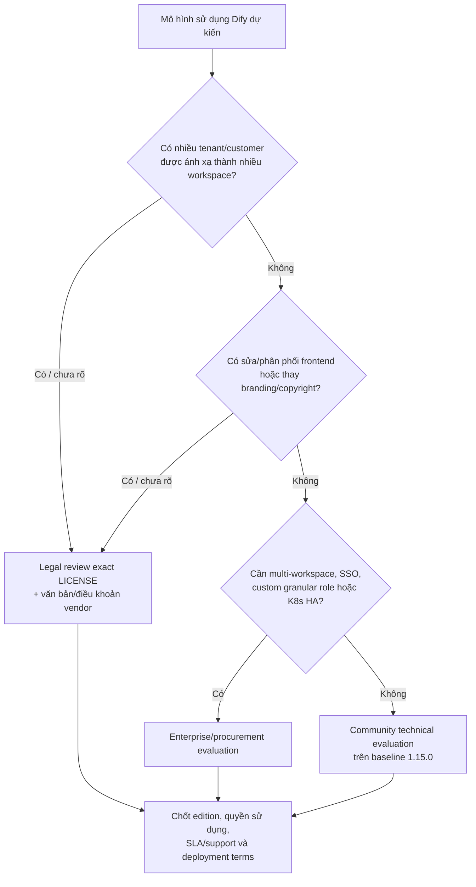

# 10. Editions và license

> **Version áp dụng:** Dify Community `1.15.0`; Enterprise/Cloud theo public snapshot ngày `2026-07-16`  
> **Ngày kiểm chứng:** `2026-07-16`  
> **Trạng thái xác minh:** `Official-source verified` + `Requires Legal confirmation`  
> **Reviewer:** Legal/Security/Procurement review required

## Mục tiêu

Sau chương này, người đọc phải:

- Tách capability được chứng minh ở Community `1.15.0` khỏi Enterprise/Cloud marketing snapshot.
- Hiểu các điều kiện bổ sung được ghi trong file `LICENSE` của tag nghiên cứu.
- Nhận diện use case multi-tenant, workspace mapping và frontend branding cần Legal/vendor review.
- Không biến tài liệu kỹ thuật thành kết luận pháp lý về “open source” hay “source-available”.
- Có bộ câu hỏi đủ để chọn edition và mở procurement/legal review.

## Phạm vi và giả định

- License evidence chính là file `LICENSE` tại tag `1.15.0`. [S-004]
- Pricing/Enterprise page không versioned; mọi capability từ các trang này là snapshot tại ngày truy cập, không phải historical entitlement guarantee. [S-018][S-019]
- Versioned docs đủ để xác nhận một số khác biệt về workspace, role, SSO và deployment; không tạo exhaustive negative matrix.
- Chương này cung cấp triage kỹ thuật. Quyết định license/compliance cuối cùng thuộc Legal và hợp đồng/văn bản từ Dify.
- “Không tìm thấy trong Community docs” không đồng nghĩa “bị cấm” hoặc “chắc chắn không tồn tại”.

## Cơ chế hoạt động

### Điều kiện license cần đưa vào review

File chính thức gọi license là **modified Apache License 2.0** với điều kiện bổ sung. Nội dung kỹ thuật cần chuyển cho Legal gồm: [S-004]

1. Commercial use được cho phép, bao gồm dùng Dify làm backend hoặc nền tảng phát triển ứng dụng doanh nghiệp.
2. Commercial license được yêu cầu khi vận hành môi trường multi-tenant nếu chưa có sự cho phép bằng văn bản; file định nghĩa một tenant tương ứng một workspace.
3. Không được xóa hoặc sửa logo/copyright trong frontend; frontend được định nghĩa là thư mục `web/` hoặc Docker image `web`.
4. Ngoài điều kiện bổ sung, quyền và hạn chế còn lại theo Apache License 2.0.
5. File còn có điều khoản cho contributor.

Đây là bản tóm tắt để định tuyến review, không thay exact license text hoặc tư vấn pháp lý.

### Capability/edition evidence hiện có

| Chủ đề | Evidence versioned/public | Điều có thể nói an toàn | Điều chưa nên khẳng định |
|---|---|---|---|
| Workspace | Versioned docs nêu cài đặt mặc định tạo một workspace; Enterprise hỗ trợ nhiều workspace [S-028] | Multi-workspace là Enterprise capability được docs nêu | Mọi cách tạo isolation ngoài workspace đều được license chấp thuận |
| Workspace roles | Nguồn versioned liệt kê Owner, Admin, Editor, Normal; UI có thể dùng nhãn Member, nên tài liệu gọi Member/Normal đến khi đóng G-011. Enterprise có custom role và granular access [S-017] | Có thể mô tả role set và Enterprise extension với alias caveat | Community “không có RBAC” — built-in roles vẫn là access control |
| SSO | Versioned Personal Settings nêu Enterprise OAuth hoặc SAML SSO [S-027] | OAuth/SAML SSO có evidence Enterprise | OIDC/SCIM/session policy áp dụng chính xác cho 1.15.0 nếu chỉ dựa marketing hiện tại |
| Kubernetes/HA | Versioned deployment overview nêu Enterprise Kubernetes HA [S-008] | Enterprise là official path được docs nêu cho K8s HA | Có official Community Helm chart hoặc chart Enterprise tương thích đúng 1.15.0 khi chưa có artifact |
| Audit/SIEM/fine-grained controls | Current Enterprise page quảng bá các capability này [S-019] | Ghi như current public positioning có ngày truy cập | Historical entitlement hoặc runtime behavior tại Community 1.15.0 |
| Cloud | Current pricing page [S-018] | Managed offering dùng cho positioning/comparison | Hạ tầng, residency, SLA hoặc control không nêu trong nguồn/contract |

## Kiến trúc/luồng dữ liệu

Sơ đồ là routing checklist. Nó không kết luận rằng nhánh Community luôn hợp lệ; Legal vẫn phải review exact deployment/use case, nhất là commercial và customer-facing scenarios.

## Hướng dẫn hoặc ví dụ triển khai

### Hồ sơ đầu vào cho Legal/Procurement

- Sơ đồ tenant, workspace, user/role và data boundary.
- Ai là người dùng: nhân viên nội bộ, contractor, customer hay public.
- Dify là công cụ nội bộ, backend, embedded platform hay dịch vụ cung cấp cho bên thứ ba.
- Số workspace hiện tại/dự kiến và cách ánh xạ customer/organization.
- Có chỉnh `web/`, rebrand, white-label hoặc phân phối Docker image/frontend hay không.
- Deployment target: single-node, Kubernetes, air-gapped, Cloud hay hybrid.
- Feature bắt buộc: SSO, custom role, audit/SIEM, HA, support/SLA.
- Source/tag/license snapshot và mọi văn bản ủy quyền/commercial agreement.

### Mẫu câu hỏi gửi vendor

1. Mô hình tenant/workspace dự kiến có cần commercial license không?
2. Edition nào cấp quyền cho số workspace và deployment topology dự kiến?
3. Feature matrix nào áp dụng cho release/artifact sẽ triển khai?
4. Helm chart/appVersion/support matrix nào được vendor hỗ trợ?
5. Quy định branding áp dụng thế nào với UI customization cụ thể?
6. Upgrade/security-fix/SLA và audit/compliance evidence được cung cấp ra sao?

### Gate trước pilot/production

| Gate | Evidence cần có | Owner |
|---|---|---|
| License model | Legal memo hoặc vendor authorization/agreement | Legal |
| Edition entitlement | Signed quote/order/feature matrix | Procurement/Product |
| Tenant/workspace design | Approved architecture và data-flow | Architecture/Security |
| Branding/frontend | Approved UI change list | Legal/Product |
| Deployment support | Supported chart/image/version matrix | Platform/Vendor |
| Compliance controls | Control evidence và shared-responsibility mapping | Security/Compliance |

## Quyết định và trade-off

- **Community** phù hợp để đánh giá kỹ thuật source-visible/self-hosted capability, nhưng không tự giải quyết multi-tenant license, Enterprise feature hoặc support/SLA requirement.
- **Enterprise** có public positioning cho multi-workspace, SSO, granular access, audit/SIEM và Kubernetes/Helm; đổi lại cần procurement, entitlement và artifact compatibility review. [S-019]
- **Cloud** giảm gánh vận hành nhưng chuyển trọng tâm sang data residency, integration, SLA và shared responsibility; các điều này phải dựa contract, không suy từ pricing page.
- **Tự xây capability còn thiếu** có thể giảm license spend nhưng tăng engineering/security/upgrade risk và vẫn không vô hiệu điều kiện license.

## Security và operations implications

- Edition selection là architecture decision: SSO, role model, audit, HA và support ảnh hưởng control design.
- Built-in workspace roles không nên được gọi là fine-grained RBAC; kiểm tra permission thực tế theo object/action cần bảo vệ. [S-017]
- Nếu chưa có SSO/SCIM phù hợp, joiner/mover/leaver và break-glass procedure phải được thiết kế thủ công.
- Marketing claim audit/SIEM không thay retention, integrity, export, field coverage và incident test.
- Multi-workspace không tự chứng minh tenant isolation; phải test authorization, data access và admin boundary.
- Lưu license/contract/authorization cùng release baseline để audit có thể biết điều khoản nào áp dụng tại thời điểm triển khai.

## Failure modes và troubleshooting

| Failure | Hậu quả | Phòng ngừa/khắc phục |
|---|---|---|
| Tự gọi license là Apache 2.0 thuần | Bỏ sót điều kiện bổ sung | Luôn link exact `LICENSE` của tag và Legal review |
| Một workspace/customer nhưng thiết kế thực là multi-tenant | License/isolation risk | Vẽ tenant↔workspace mapping và lấy written determination |
| Dùng pricing hiện tại làm bằng chứng lịch sử | Entitlement sai phiên bản | Ghi ngày truy cập; yêu cầu versioned/signed matrix |
| Nhầm built-in role với granular RBAC | Over-permission | Permission test theo use case/object |
| Hứa audit/SSO/Helm trước khi có artifact | Pilot bị chặn | Procurement/vendor gate trước architecture commitment |
| Rebrand/xóa attribution không review | License breach risk | Frontend diff + Legal approval trước release |
| Enterprise chart không khớp app version | Deploy/upgrade failure | Compatibility matrix và staging validation |

## Checklist xác nhận

- [x] Exact license source tại tag `1.15.0` được khóa.
- [x] Multi-tenant/workspace và frontend branding conditions được nêu để review.
- [x] Community versioned evidence tách khỏi current Enterprise/Cloud snapshot.
- [x] Built-in roles không bị gọi nhầm là fine-grained RBAC.
- [ ] Legal xác nhận classification và use-case licensing.
- [ ] Vendor cung cấp entitlement/compatibility matrix phù hợp.
- [ ] Tenant/workspace/data-flow được phê duyệt.
- [ ] Frontend/branding change list được Legal review.
- [ ] Security xác minh SSO/role/audit requirements.
- [ ] Procurement chốt support/SLA/upgrade terms.

## Giới hạn/version caveats

- Nguồn chính thức không tự dùng nhãn “source-available” cho baseline; tài liệu không áp nhãn pháp lý đó nếu chưa có Legal.
- Public pricing/Enterprise pages có thể thay đổi mà không gắn với product tag.
- Versioned docs chỉ chứng minh một phần feature matrix; absence không phải exhaustive negative evidence.
- Enterprise release/artifact có thể không cùng version train với Community `1.15.0`.
- Chưa có contract, written authorization, Enterprise chart hoặc environment để runtime-test entitlement-specific capability.

## Nguồn tham khảo

- [S-004] Dify LICENSE tại tag `1.15.0`.
- [S-008] Self-host deployment overview, docs snapshot `57a492d…`.
- [S-017] Manage Members, docs snapshot `57a492d…`.
- [S-018] Dify Pricing, snapshot ngày `2026-07-16`.
- [S-019] Dify Enterprise, snapshot ngày `2026-07-16`.
- [S-027] Personal Settings, docs snapshot `57a492d…`.
- [S-028] Workspace Overview, docs snapshot `57a492d…`.
