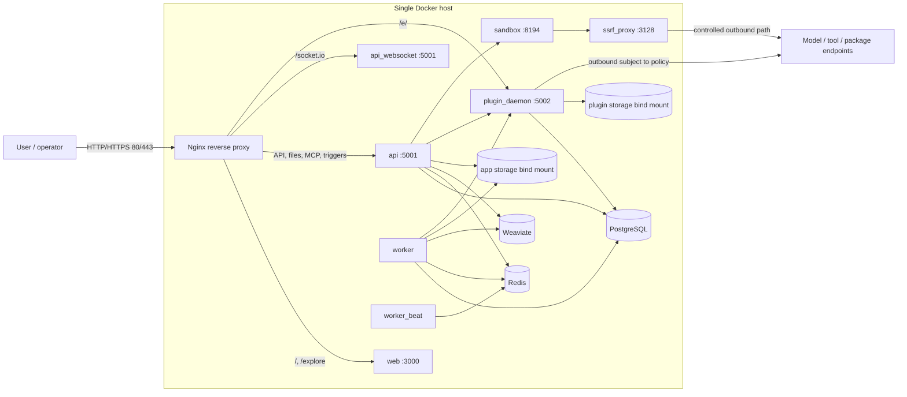

# 11. Triển khai Dify bằng Docker Compose

> **Version áp dụng:** Community Edition `1.15.0`, commit `3aa26fb6374bbd47e5469f7d7cc25f3e0075a60c`  
> **Ngày kiểm chứng:** `2026-07-16`  
> **Trạng thái xác minh:** `Official-source verified` + `Config validated`; toàn bộ runtime test đang `RUNTIME-PENDING` vì Docker daemon của lab chưa chạy  
> **Reviewer:** Platform/Security review pending

## Mục tiêu

Sau chương này, người triển khai có thể:

1. dựng đúng Docker Compose baseline của Dify `1.15.0` trên một host sạch;
2. hiểu service, profile, port và vùng state của cấu hình mặc định;
3. thay các credential mặc định trước khi mở hệ thống cho người dùng;
4. chạy bộ smoke test có thể tái hiện mà không nhầm trạng thái `running` với ứng dụng hoạt động đúng;
5. chuẩn bị upgrade, rollback và rotation theo hướng bảo toàn dữ liệu.

Đây là procedure đã đối chiếu với source/config chính thức. Nó chưa phải runbook đã được chứng minh end-to-end: các bước cần Docker daemon, model credential hoặc dữ liệu mẫu đều được gắn nhãn `RUNTIME-PENDING`.

## Phạm vi và giả định

### Phạm vi được bao phủ

- Một host Linux, macOS Docker Desktop hoặc Windows với WSL 2.
- Community Edition `1.15.0`, clone trực tiếp từ tag cố định thay vì truy vấn `latest` tại thời điểm chạy.
- Profile mặc định `postgresql`, `weaviate`, `collaboration`.
- PostgreSQL, Redis, Weaviate và local file storage do Compose quản lý.
- Nginx là public entry point; API, web, worker, beat, plugin daemon, sandbox và SSRF proxy nằm trong mạng Compose.

### Ngoài phạm vi

- High availability, multi-host, autoscaling và zero-downtime upgrade; xem Chương 12.
- Sizing production, SLA, RPO/RTO hoặc benchmark tải.
- Migration giữa các vector database hoặc storage backend.
- Hướng dẫn cấp model/provider credential; xem Chương 14.
- Khẳng định production readiness khi chưa qua smoke, persistence, backup/restore và failure-recovery test.

### Yêu cầu tối thiểu từ tài liệu chính thức

| Hạng mục | Tối thiểu | Ghi chú triển khai |
|---|---:|---|
| CPU | 2 cores | Là ngưỡng cài đặt, không phải capacity guarantee. |
| RAM | 4 GiB | Docker Desktop trên macOS được hướng dẫn cấp ít nhất 8 GiB cho VM. |
| Docker Engine | `19.03+` trên Linux | macOS/Windows dùng Docker Desktop. |
| Docker Compose | `2.24.0+` | Dùng cú pháp `docker compose`, không dùng binary legacy `docker-compose`. |
| Windows | WSL 2 | Source và bind-mounted data nên đặt trong Linux filesystem của WSL, không đặt trên Windows filesystem. |

Các yêu cầu trên đến từ quick start đúng snapshot tài liệu `1.15.0`. Dung lượng đĩa, IOPS và headroom phải được xác định từ volume tài liệu, số model/plugin, retention và tốc độ tăng dữ liệu thực tế. [S-007]

## Cơ chế hoạt động

### Profile quyết định dependency nào được khởi động

`.env.example` đặt:

```dotenv
COMPOSE_PROFILES=${VECTOR_STORE:-weaviate},${DB_TYPE:-postgresql},collaboration
```

Với giá trị mặc định, Compose bật PostgreSQL, Weaviate và service WebSocket dành cho collaboration. Đổi `DB_TYPE` hoặc `VECTOR_STORE` đồng nghĩa đổi cả endpoint cấu hình lẫn profile service; không bật đồng thời mọi vector engine chỉ vì chúng cùng xuất hiện trong manifest. Muốn bỏ WebSocket chuyên dụng, tài liệu trong `.env.example` yêu cầu loại `collaboration` khỏi `COMPOSE_PROFILES`. [S-005][S-006]

### Inventory mặc định

| Nhóm | Service/task | Vai trò và dependency chính |
|---|---|---|
| Core | `api` | API/control plane, migration lúc khởi động, truy cập DB/Redis/vector/storage/plugin/sandbox. |
| Core | `api_websocket` | WebSocket cho collaboration; chỉ chạy trong profile `collaboration`. |
| Core | `worker` | Celery consumer cho dataset, workflow, mail, plugin và các queue nền khác. |
| Core | `worker_beat` | Phát scheduled task; không được nhân bản tùy ý như worker thông thường. |
| Core | `web` | Frontend, gọi API nội bộ mặc định qua `http://api:5001`. |
| Core | `plugin_daemon` | Cài/chạy plugin; có database và storage logic riêng. |
| Dependency | `db_postgres` | Operational database mặc định; image `postgres:15-alpine`. |
| Dependency | `redis` | Cache, Celery broker/backend và một số luồng event; image `redis:6-alpine`. |
| Dependency | `weaviate` | Vector store mặc định; image `semitechnologies/weaviate:1.27.0`. |
| Dependency | `sandbox` | Thực thi code; API nội bộ mặc định ở port `8194`. |
| Dependency | `ssrf_proxy` | Squid proxy cho các đường outbound được cấu hình đi qua proxy. |
| Edge | `nginx` | Publish HTTP/HTTPS ở host port `80/443` mặc định. |
| One-shot | `init_permissions` | Chỉnh owner cho app storage rồi thoát; `Exited (0)` là kết quả mong đợi. |

Sáu core service, sáu dependency và một one-shot task trên là danh sách chính thức của default deployment. `api`, `worker` và `worker_beat` dùng chung image `langgenius/dify-api:1.15.0` nhưng khởi động bằng `MODE` khác nhau. [S-005][S-007][S-013]

### Migration khi container API khởi động

`.env.example` đặt `MIGRATION_ENABLED=true`. Entrypoint của image API gọi `flask upgrade-db` trước khi chuyển sang API, worker hoặc beat mode. Vì vậy, cần xem log migration và trạng thái schema như một phần của start/upgrade gate; chỉ thấy container được tạo không chứng minh migration thành công. [S-006][S-013]

Release `1.15.0` còn có một backfill riêng cho cấu hình plugin auto-upgrade theo category. Với upgrade lên release này, `docker compose up -d` phải được theo sau bởi:

```bash
docker compose exec api flask backfill-plugin-auto-upgrade
```

Không bỏ qua bước này: release note cảnh báo cấu hình auto-upgrade cũ có thể ngừng hiệu lực nếu chưa backfill. [S-001]

### Thứ tự ưu tiên cấu hình

- `docker/.env.example` là template giá trị thiết yếu; bản chạy thực tế là `docker/.env`.
- Các template nâng cao nằm trong `docker/envs/**/*.env.example`; chỉ copy file cần dùng và bỏ hậu tố `.example`.
- Compose đọc các file `docker/envs/**/*.env` có mặt, sau đó đọc `docker/.env`; giá trị trong `docker/.env` có độ ưu tiên cao hơn.
- `docker-compose.yaml` được auto-generate. Không sửa trực tiếp nếu muốn giữ đường nâng cấp có thể kiểm soát; thay cấu hình qua `.env`, file chuyên biệt trong `envs/`, hoặc một overlay nội bộ được quản lý riêng. [S-005][S-006][S-021]

## Kiến trúc/luồng dữ liệu

### D09 — Docker Compose topology



Sơ đồ thể hiện topology logic của default Compose, không khẳng định mọi outbound request đều bị ép qua `ssrf_proxy`. Nginx route chính thức chuyển `/`, `/explore` sang web; API/file/MCP/trigger path sang API; `/socket.io` sang `api_websocket`; `/e/` sang plugin daemon. [S-005][S-010]

State mặc định nằm ở các bind mount dưới `docker/volumes/`, đáng chú ý gồm PostgreSQL, Redis, Weaviate, app storage, sandbox dependency/config và plugin storage. Backup chỉ main database là chưa đủ để khôi phục toàn bộ chức năng.

## Hướng dẫn hoặc ví dụ triển khai

### 1. Preflight

Chạy trên host đích hoặc trong WSL 2:

```bash
docker version
docker compose version
git --version
```

Điều kiện qua preflight:

- Docker client kết nối được daemon; cả `Client` và `Server` đều trả về trong `docker version`.
- Compose là `2.24.0` trở lên.
- Host có tối thiểu 2 CPU, 4 GiB RAM và đủ dung lượng cho image cộng với dữ liệu tăng trưởng.
- Host port `80`, `443` và `5003` không bị process khác chiếm, hoặc đã có kế hoạch remap/firewall.
- DNS, proxy và firewall cho phép pull image từ registry cần thiết.

> **Trạng thái lab hiện tại:** Docker client `29.2.1` và Compose `v5.0.2` đã được phát hiện, nhưng daemon chưa chạy. Mọi bước từ pull image trở đi là `RUNTIME-PENDING`.

### 2. Clone đúng tag và xác nhận commit

Không dùng lệnh tra `releases/latest` trong tài liệu tái hiện baseline, vì kết quả sẽ thay đổi theo thời gian.

```bash
git clone --branch 1.15.0 --depth 1 https://github.com/langgenius/dify.git
cd dify
git rev-parse HEAD
```

Kết quả phải đúng:

```text
3aa26fb6374bbd47e5469f7d7cc25f3e0075a60c
```

Nếu khác, dừng triển khai và kiểm tra lại tag/remote; không tiếp tục với một checkout không rõ provenance. [S-001][S-003]

### 3. Tạo cấu hình local và thay secret mặc định

```bash
cd docker
cp .env.example .env
chmod 600 .env
```

Không commit `.env`, file backup của `.env`, private key TLS hoặc model/provider credential vào Git. Trước lần start đầu tiên ở shared lab hoặc production-like environment, thay ít nhất các nhóm sau bằng giá trị sinh ngẫu nhiên từ secret manager hoặc CSPRNG được phê duyệt:

| Secret/setting | Ràng buộc nhất quán |
|---|---|
| `DB_PASSWORD` | Phải trùng giữa PostgreSQL server và mọi client Dify/plugin dùng DB. |
| `REDIS_PASSWORD` + `CELERY_BROKER_URL` | Password nhúng trong broker URL phải khớp Redis password. |
| `SANDBOX_API_KEY` + `CODE_EXECUTION_API_KEY` | Server và client side phải cùng giá trị. |
| `PLUGIN_DAEMON_KEY` | API và plugin daemon phải cùng key. |
| `PLUGIN_DIFY_INNER_API_KEY` | API inner endpoint và plugin daemon phải cùng key. |
| `WEAVIATE_API_KEY` + `WEAVIATE_AUTHENTICATION_APIKEY_ALLOWED_KEYS` | Client key phải nằm trong allowed key của Weaviate. |
| `SECRET_KEY` | Có thể để trống để Dify tạo persistent key trong app storage; production nên quyết định rõ ownership/backup/rotation thay vì dựa vào hành vi ngầm. |

Các giá trị mẫu `difyai123456`, `dify-sandbox` và key có sẵn trong `.env.example` là bootstrap default, không phải production secret. Đồng thời:

- đặt `WEAVIATE_AUTHENTICATION_ANONYMOUS_ACCESS_ENABLED=false` cho môi trường cần authentication;
- thu hẹp `WEB_API_CORS_ALLOW_ORIGINS` và `CONSOLE_CORS_ALLOW_ORIGINS` thay vì giữ `*`;
- cấu hình public URL, hostname và TLS theo domain thật;
- review `SANDBOX_ENABLE_NETWORK`, SSRF allowlist và outbound firewall theo nhu cầu use case;
- giữ `FORCE_VERIFYING_SIGNATURE=true` trừ khi có risk acceptance được phê duyệt. [S-005][S-006][S-009]

### 4. Kiểm tra cấu hình trước khi tạo container

Các lệnh dưới đây không khởi động service:

```bash
docker compose config --quiet
docker compose config --profiles
docker compose config --services
docker compose config --images
```

Kỳ vọng từ config mặc định:

- profile có `postgresql`, `weaviate`, `collaboration`;
- service list hiệu lực gồm 6 core service, 6 dependency và `init_permissions`;
- core image là `langgenius/dify-api:1.15.0`, `langgenius/dify-web:1.15.0`, `langgenius/dify-plugin-daemon:0.6.3-local` và `langgenius/dify-sandbox:0.2.15`;
- PostgreSQL, Redis và Weaviate đúng version đã liệt kê ở inventory.

Không lưu output đầy đủ của `docker compose config` vào CI log công khai vì cấu hình đã resolve có thể chứa secret. Các biến `NGINX_SERVER_NAME`, public URL và profile nên được review độc lập bởi người thứ hai.

Docker CLI reference xác nhận `config` resolve/merge Compose model và cung cấp `--quiet`, `--profiles`, `--services`, `--images`; các option này phải được kiểm tra lại nếu toolchain Compose thay đổi. [S-046]

### 5. Pin image cho production gate

Manifest chính thức `1.15.0` vẫn dùng `nginx:latest`, `ubuntu/squid:latest` và `busybox:latest`. Vì vậy, checkout tag đã pin source nhưng chưa làm deployment hoàn toàn immutable. [S-005]

Trước production:

1. pull image trong controlled build/release pipeline;
2. resolve và lưu `RepoDigest` của mọi image;
3. scan CVE/license theo policy;
4. thay mutable tag bằng digest hoặc immutable internal tag trong overlay/template do đội Platform sở hữu;
5. render lại Compose và review diff;
6. chỉ promote đúng artifact set đã qua test.

Không điền digest giả vào tài liệu. Digest thực tế phải được lấy và lưu cùng release evidence tại thời điểm build.

### 6. Pull và start clean install

```bash
docker compose pull
docker compose up -d
docker compose ps -a
```

Kỳ vọng cần kiểm tra, chưa phải output đã quan sát:

- `api`, `api_websocket`, `worker`, `worker_beat`, `web`, `plugin_daemon`, `weaviate`, `db_postgres`, `redis`, `nginx`, `ssrf_proxy`, `sandbox` ở trạng thái `Up`/`running` hoặc `healthy` khi service có healthcheck;
- `init_permissions` kết thúc thành công với exit code `0`;
- không có restart loop;
- log API cho thấy migration hoàn tất trước khi server nhận request.

`worker` healthcheck bị disable mặc định bởi `COMPOSE_WORKER_HEALTHCHECK_DISABLED=true`; do đó `running` không chứng minh worker nhận được queue. Phải có functional queued-task test ở bước smoke. [S-005][S-006]

### 7. Smoke test theo tầng

#### Tầng A — process và dependency health (`RUNTIME-PENDING`)

```bash
docker compose ps -a
docker compose exec api curl -fsS http://localhost:5001/health
docker compose exec sandbox curl -fsS http://localhost:8194/health
docker compose exec db_postgres pg_isready -h db_postgres -U postgres -d dify
docker compose exec redis redis-cli ping
docker compose exec worker celery -A celery_healthcheck.celery inspect ping
```

Nếu username/database đã đổi, thay tham số `pg_isready` bằng giá trị đã cấu hình. Không đưa password lên command line hoặc log.

#### Tầng B — edge và first-run (`RUNTIME-PENDING`)

```bash
curl -fsSI http://localhost/
```

Mở `http://localhost/install`, tạo admin đầu tiên và sau đó đăng nhập tại `http://localhost`. Với server từ xa, thay `localhost` bằng hostname đã cấu hình và chỉ dùng HTTPS ở môi trường chia sẻ. [S-007]

#### Tầng C — functional smoke (`RUNTIME-PENDING`)

1. Cấu hình một model provider test bằng credential không phải production.
2. Tạo workflow tối thiểu `User Input -> LLM -> Output`, chạy một blocking request và lưu run ID.
3. Tạo knowledge base nhỏ, ingest một tài liệu không nhạy cảm và xác nhận worker xử lý xong.
4. Chạy retrieval/query có câu trả lời dự kiến; lưu latency và trace/log liên quan.
5. Cài một plugin test được phê duyệt, gọi một action tối thiểu rồi gỡ nếu không cần giữ.
6. Chạy `docker compose restart`, lặp lại login, workflow và retrieval để xác minh persistence.
7. Kiểm tra không có secret/token trong log đã thu thập.

Lưu evidence gồm timestamp, commit, image digests, `.env` key list đã redacted, `docker compose ps -a`, log đoạn lỗi/thành công, run ID và người thực hiện. Không đánh dấu `RUNTIME-VALIDATED` trước khi hoàn tất cả ba tầng.

### 8. Rotation secret

Rotation trên hệ thống đang có dữ liệu phải được thực hiện trong maintenance window có backup và rollback point. Quy trình chung:

1. Xác định secret owner, mọi producer/consumer và tác động khi invalidate.
2. Chụp backup nhất quán, kiểm tra có thể đọc được và hạn chế quyền truy cập.
3. Sinh secret mới trong secret manager; không paste vào ticket/chat/log.
4. Cập nhật đồng thời các cặp biến trong bảng ở bước 3.
5. Recreate các service tiêu thụ secret; cách bảo thủ cho single-host Compose là recreate toàn stack trong maintenance window.
6. Chạy lại smoke Tầng A-C.
7. Chỉ revoke secret cũ sau khi hệ thống mới đã được xác nhận.
8. Ghi audit evidence đã redacted và ngày rotation kế tiếp.

Các caveat bắt buộc:

- Đổi `DB_PASSWORD` trong `.env` không tự đổi password của PostgreSQL đã được khởi tạo; phải rotate cả credential phía server và client theo một runbook DB riêng.
- Đổi `REDIS_PASSWORD` mà không cập nhật `CELERY_BROKER_URL` sẽ làm API/worker/beat mất broker.
- Đổi `SECRET_KEY` có thể làm mất hiệu lực session, JWT hoặc signed file URL; README chính thức mô tả key này dùng để ký các đối tượng đó. Phải thông báo re-login và chạy negative/positive test sau rotation. [S-021]
- Nếu để `SECRET_KEY` trống để auto-generate, app storage chứa material cần được backup và bảo vệ; không xóa volume trong lúc “dọn” container.

### 9. Upgrade lên `1.15.0`

Mỗi target version có release-specific procedure. Với `1.15.0`, release note chính thức yêu cầu backup config/data, review thay đổi env/Compose, chạy migration và chạy plugin auto-upgrade backfill. [S-001]

Trước upgrade:

- ghi lại source tag/commit và image digest hiện tại;
- backup `.env`, các file `envs/**/*.env`, overlay, certificate và Compose customization ở nơi mã hóa;
- dừng service trước khi snapshot bind-mounted `volumes/` theo procedure chính thức;
- có thêm logical backup cho database và backup object/external storage nếu đã rời default local storage;
- thử restore trên môi trường tách biệt trước maintenance window;
- so sánh `.env.example`, các template `envs/**/*.env.example` và `docker-compose.yaml` giữa hai tag.

Sau khi checkout đúng `1.15.0` và hợp nhất cấu hình:

```bash
cd docker
docker compose up -d
docker compose exec api flask backfill-plugin-auto-upgrade
docker compose ps -a
```

Release `1.15.0` thêm 19 biến, bỏ 2 biến, đổi 1 biến và sửa Compose files; không tái sử dụng `.env` cũ mà không review. `dify-env-sync.sh` có thể hỗ trợ đồng bộ một chiều từ `.env.example` sang `.env` và giữ giá trị hiện có, nhưng diff vẫn phải được con người review. [S-001][S-021]

### 10. Rollback

Theo Docker CLI reference, `docker compose down` mặc định xóa service containers và networks; `--volumes` mới xóa named/anonymous volumes tương ứng. Không dùng tùy chọn phá hủy volume trong một rollback. Với upgrade đã chạy database migration, đổi image về tag cũ nhưng giữ schema mới không phải rollback an toàn. [S-047]

Runbook rollback tối thiểu:

1. tuyên bố rollback, chặn write mới và lưu evidence lỗi;
2. dừng toàn bộ stack lỗi;
3. khôi phục đồng bộ source tag, Compose/overlay, `.env`, database, vector store, app storage và plugin storage từ cùng rollback point;
4. xác nhận owner/permission của bind mount và secret version;
5. khởi động tag cũ đã pin;
6. chạy smoke Tầng A-C và kiểm tra dữ liệu tạo trước rollback point;
7. chỉ mở traffic sau khi owner ứng dụng và DB xác nhận.

Rollback rehearsal là `RUNTIME-PENDING`. Chưa có bằng chứng restore thành công thì không được mô tả procedure này là production-validated.

## Quyết định và trade-off

### Compose phù hợp POC và single-host deployment

Compose giảm số nền tảng cần vận hành và bám sát artifact chính thức. Đổi lại, host là failure domain duy nhất; bind mount, scheduled task, migration và dependency state cùng hội tụ trên một máy. Không dùng ngưỡng user count đơn lẻ để quyết định giữ Compose hay chuyển Kubernetes.

### Bundled dependency nhanh nhưng tăng blast radius

PostgreSQL, Redis và vector DB cùng host giúp dựng nhanh, nhưng tranh chấp CPU/RAM/IO và cùng mất khi host hỏng. External managed dependency làm tăng network/credential/backup complexity nhưng có thể tách failure domain và operational ownership.

### Local storage đơn giản nhưng khóa vào host

`STORAGE_TYPE=opendal`, `OPENDAL_SCHEME=fs` thuận tiện cho POC. Nó không cung cấp shared storage hoặc multi-host semantics. Chỉ chuyển storage backend sau khi đã thiết kế migration, consistency, encryption và restore test.

### Default profile không phải security baseline

Default giúp first-run thành công, không đại diện cho policy doanh nghiệp: password mẫu, CORS `*`, Weaviate anonymous access, sandbox network và published plugin debug port đều phải được review.

## Security và operations implications

- Chỉ Nginx `80/443` nên là public entry point. Compose `1.15.0` còn publish plugin debugging port `5003`; phải chặn bằng host firewall/network policy hoặc một overlay đã review nếu không thực sự dùng remote debugging. [S-005][S-006]
- Bật HTTPS, quản lý certificate/key ngoài source tree và thiết lập renewal/expiry alert. Certbot có profile riêng; việc container tồn tại không chứng minh certificate lifecycle đã đúng. [S-005][S-021]
- Không expose PostgreSQL, Redis, Weaviate, sandbox hoặc SSRF proxy ra public network.
- Giới hạn egress từ API/worker/plugin/sandbox theo allowlist và business need. `ssrf_proxy` chỉ bảo vệ các đường được cấu hình đi qua nó.
- Protect `.env`, backup, `docker inspect`, CI artifact và support bundle vì chúng có thể lộ secret.
- Thu log có rotation/retention; theo dõi restart count, API error rate, DB connection, Redis/Celery health, queue backlog, indexing duration, disk/inode và certificate expiry.
- Backup inventory phải gồm main DB, plugin DB/state, vector data, app file storage, plugin storage, config/secret/certificate và artifact version.
- Image dùng `latest` là release blocker cho reproducibility; image scan và digest lock phải nằm trong promotion gate.
- Release `1.15.0` có security fix liên quan path traversal ở plugin-daemon forwarding và hardening outbound/SSRF; không backport tùy tiện nếu không có security review. [S-001]

## Failure modes và troubleshooting

`docker compose config --services` và `--profiles` chỉ liệt kê metadata, không render toàn bộ cấu hình đã resolve. Ngược lại, application/dependency log có thể chứa token, prompt/response, PII, URL hoặc credential do upstream ghi ra; coi log là dữ liệu nhạy cảm, giới hạn quyền đọc và redact trước khi copy, export hoặc đính kèm support ticket. Không chạy `docker compose config` không có bộ lọc trong kênh log công khai.

Bộ lệnh chẩn đoán đầu tiên:

```bash
docker compose ps -a
docker compose logs --tail=200 api worker worker_beat web plugin_daemon
docker compose logs --tail=200 db_postgres redis weaviate nginx sandbox ssrf_proxy
docker compose config --services
docker compose config --profiles
```

| Triệu chứng | Nguyên nhân có khả năng | Kiểm tra có mục tiêu | Hành động an toàn đầu tiên |
|---|---|---|---|
| `docker version` chỉ có Client | Daemon chưa chạy hoặc thiếu quyền | Docker Desktop/service/socket và context hiện tại | Khởi động daemon, sửa quyền; chưa chạy `up`. |
| `init_permissions` exit khác `0` | Bind mount/owner/filesystem không cho `chown` | Log task, path `volumes/app/storage`, WSL mount location | Sửa ownership/filesystem theo host policy; không chạy container đặc quyền tùy tiện. |
| `db_postgres` unhealthy | Password/data directory/IO hoặc profile sai | DB log, `pg_isready`, disk space, `DB_TYPE` | Dừng retry loop; bảo vệ data directory trước khi sửa. |
| API restart loop | Migration, DB/Redis connection hoặc secret mismatch | API log từ dòng đầu, DB/Redis health, env key name | Không xóa volume; sửa dependency/config rồi recreate API. |
| `api_websocket` không có | Profile `collaboration` bị bỏ hoặc config sai | `docker compose config --profiles`, `.env` | Khôi phục profile nếu cần collaboration; kiểm tra `/socket.io`. |
| UI mở nhưng console/API lỗi | Public/internal URL, Nginx route hoặc CORS sai | Nginx/web/API log, `SERVER_CONSOLE_API_URL` | Giữ internal URL mặc định nếu không có topology khác; sửa URL/CORS theo domain. |
| Upload/indexing đứng | Worker không consume, Redis lỗi hoặc vector DB lỗi | Celery inspect ping, worker log, Redis/vector health, queue backlog | Khôi phục consumer/dependency; không enqueue thêm tải lớn. |
| Plugin install/call lỗi | Plugin daemon, key nội bộ, DB/storage hoặc outbound package access | Plugin/API log, key pair, volume permission, egress | Không tắt signature verification; sửa credential/network có kiểm soát. |
| Code node timeout | Sandbox, API key, SSRF proxy hoặc egress policy | Sandbox/SSRF log, `/health`, key pair | Giữ deny-by-default; chỉ allow endpoint cần thiết. |
| Start báo port conflict | Host port `80`, `443` hoặc `5003` đã dùng | Host listener và rendered port mapping | Remap bằng cấu hình/overlay có review hoặc dừng service xung đột. |
| Sau upgrade plugin auto-update sai | Chưa chạy backfill bắt buộc | Upgrade evidence, API command history/log | Chạy command backfill đúng release, rồi test positive/negative. |
| Restart làm mất file/index | Bind mount sai path, permission hoặc backup thiếu | Rendered mount, volume path, file count trước/sau | Dừng write, bảo toàn dữ liệu hiện tại, điều tra trước restore. |

Không dùng `docker compose down -v`, xóa `docker/volumes/` hoặc khởi tạo lại database như một bước troubleshooting chung.

## Checklist xác nhận

### Source/config gate

- [x] Baseline được pin ở tag `1.15.0` và commit đầy đủ.
- [x] Prerequisite CPU/RAM/Docker/Compose được đối chiếu docs snapshot.
- [x] Default profile và danh sách 13 service/task được đối chiếu Compose + docs.
- [x] Core image, dependency image, port, mount và env precedence được kiểm tra từ source/config.
- [x] Migration entrypoint và backfill riêng của `1.15.0` được ghi rõ.
- [x] Mutable image tag và default secret/security gap được ghi thành release gate.
- [x] D09 được nhúng trực tiếp bằng Mermaid.
- [ ] Mermaid render trên renderer publish mục tiêu.

### Runtime gate (`RUNTIME-PENDING`)

- [ ] Docker daemon hoạt động và preflight đạt.
- [ ] Clean clone có đúng commit `3aa26fb6374bbd47e5469f7d7cc25f3e0075a60c`.
- [ ] Secret mặc định đã thay; `.env` không bị commit/log.
- [ ] `docker compose config --quiet` đạt và service/profile/image list đúng.
- [ ] Image digest được ghi và mutable tag đã được pin cho production candidate.
- [ ] Tất cả service up/healthy; `init_permissions` exit `0`; không restart loop.
- [ ] API, sandbox, PostgreSQL, Redis và worker functional health đạt.
- [ ] First-run/login qua HTTPS đạt.
- [ ] Workflow/model smoke đạt.
- [ ] Knowledge ingest/retrieval chứng minh worker + vector path đạt.
- [ ] Plugin smoke và signature policy đạt.
- [ ] Restart persistence test đạt.
- [ ] Backup/restore và restore-based rollback rehearsal đạt.
- [ ] Secret rotation rehearsal đạt, gồm session/signed URL impact.
- [ ] Log/evidence đã redacted và lưu cùng release record.
- [ ] Platform, Security và application owner sign-off.

## Giới hạn/version caveats

- Tất cả service, biến và procedure release-specific trong chương này bám Dify Community `1.15.0`; không áp dụng nguyên xi cho `main`, Enterprise hoặc release khác.
- Tài liệu quick start cho biết minimum install, không cung cấp capacity/sizing guarantee.
- `Official-source verified` và `Config validated` không đồng nghĩa `RUNTIME-VALIDATED`.
- Docker daemon của lab chưa chạy; chưa có output runtime, image digest, timing, screenshot, failure injection hay restore evidence.
- Model credential, domain/TLS, data classification, retention, RPO/RTO và workload profile chưa được chốt.
- Exact digest cho `nginx`, Squid và BusyBox phải được resolve trong release pipeline; tài liệu không hard-code digest chưa kiểm chứng.
- Worker healthcheck bị tắt mặc định; cần synthetic queued job/queue telemetry để đánh giá readiness.
- Backup thư mục bind mount là baseline tối thiểu, không thay thế logical backup và restore test cho stateful dependency.
- Rollback sau schema migration được coi là restore-based cho đến khi có bằng chứng backward compatibility cụ thể.
- Compose là single-host reference; không suy rộng thành kiến trúc HA.

## Nguồn tham khảo

- [S-001] Dify `1.15.0` Release Note: security update, env/Compose changes, migration và plugin auto-upgrade backfill.
- [S-003] Dify README tại tag `1.15.0`: tag-pinned quick start và product baseline.
- [S-005] `docker/docker-compose.yaml` tại tag `1.15.0`: service, image, profile, network, port, mount và healthcheck.
- [S-006] `docker/.env.example` tại tag `1.15.0`: default profile, credential, URL, storage/vector/sandbox/plugin/Nginx settings.
- [S-007] Docker Compose quick start tại docs snapshot `57a492d`: prerequisite, install, service list, verify, access và customize.
- [S-009] Environment Variables tại docs snapshot `57a492d`: semantics của deployment settings.
- [S-010] Nginx route template tại tag `1.15.0`: route web/API/WebSocket/plugin/MCP/trigger.
- [S-013] API image entrypoint tại tag `1.15.0`: migration và `MODE=api|worker|beat`.
- [S-021] Docker deployment README tại tag `1.15.0`: env precedence, optional env sync, vector/storage switching và migration notes.
- [S-046] Docker Compose Config CLI Reference, truy cập `2026-07-16`.
- [S-047] Docker Compose Down CLI Reference, truy cập `2026-07-16`.
