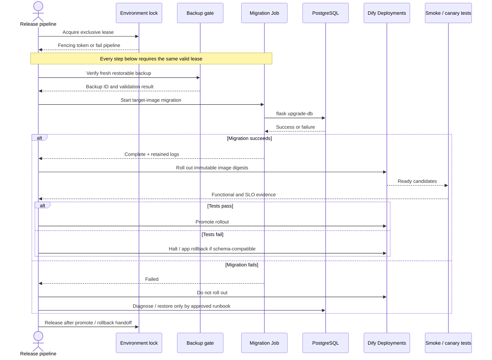

# 12. Kubernetes/Helm và thiết kế High Availability

> **Version áp dụng:** Dify Community `1.15.0`, commit `3aa26fb6374bbd47e5469f7d7cc25f3e0075a60c`  
> **Loại kiến trúc:** Reference architecture/design pattern nội bộ; **không phải Helm chart Community chính thức của Dify**  
> **Ngày kiểm chứng:** `2026-07-16`  
> **Trạng thái xác minh:** `Official-source verified` + `Design reviewed` qua cross-review nội bộ; specialist review và toàn bộ Kubernetes runtime/HA test vẫn `RUNTIME-PENDING`
>
> **Reviewer:** Platform/SRE/Security/Database review pending

## Mục tiêu

Chương này chuyển topology Compose của Dify `1.15.0` thành một reference architecture cho Kubernetes mà đội Platform có thể dùng để xây chart/manifest nội bộ. Sau khi đọc, người triển khai phải có thể:

1. map API, web, WebSocket, worker, beat, plugin daemon, sandbox và SSRF proxy sang đúng workload pattern;
2. tách stateless compute khỏi PostgreSQL, Redis, vector store, application storage và plugin storage;
3. thực hiện database migration đúng một lần trước rollout thay vì để mọi replica tự chạy;
4. chọn replica, queue topology, autoscaling signal, probe, PDB và rollout strategy có chủ đích;
5. duy trì route HTTP/SSE/WebSocket/plugin callback qua Ingress hoặc Gateway;
6. thiết kế backup/restore, failure test và release gate trước khi gọi hệ thống là HA;
7. nhận diện giới hạn Community plugin daemon và các điểm chưa có runtime evidence.

> **Provenance gate:** docs Dify đúng snapshot `1.15.0` hướng dẫn Docker Compose và chỉ nêu Kubernetes HA trong ngữ cảnh Enterprise. Nghiên cứu hiện tại chưa xác nhận một Helm chart Community chính thức, version-pinned và được LangGenius support. [S-008] Vì vậy mọi tên release, chart structure, values key và Kubernetes topology trong chương này thuộc ownership của tổ chức triển khai.

## Phạm vi và giả định

### Phạm vi

- Dify Community `1.15.0`; core image `langgenius/dify-api:1.15.0`, web `langgenius/dify-web:1.15.0`, plugin daemon `0.6.3-local` và sandbox `0.2.15` theo Compose chính thức. [S-005]
- Một Kubernetes cluster production-like có ít nhất hai worker node; multi-zone chỉ được coi là HA sau khi control plane, node pool, storage và dependency cũng có failure-domain design.
- Helm hoặc một GitOps renderer tương đương do đội Platform sở hữu; chart phải render ra native Kubernetes resources có thể review.
- Ingress controller hoặc Gateway implementation đã được tổ chức chuẩn hóa.
- PostgreSQL, Redis, vector store và object/shared storage có thể là managed service hoặc workload do tổ chức vận hành.
- Model/tool/provider vẫn là external failure domain dù Dify chạy trong Kubernetes.

### Ngoài phạm vi

- Helm chart Enterprise, entitlement, SLA hoặc support procedure của nhà cung cấp.
- Khẳng định chart cộng đồng của bên thứ ba là artifact chính thức.
- Chọn operator/database/vector engine cụ thể khi workload, cloud và RPO/RTO chưa khóa.
- Sizing CPU/RAM/QPS cố định trước benchmark.
- Multi-region active-active; reference này ưu tiên một region, nhiều failure domain.
- Chứng minh zero-downtime migration hoặc exactly-once scheduled task khi chưa có lab.

### Baseline Kubernetes phải được khóa riêng

Dify baseline đã cố định, nhưng Kubernetes stack chưa cố định. Trước implementation phải ghi vào release evidence:

- Kubernetes distribution và version;
- CNI/NetworkPolicy implementation;
- CSI/StorageClass và snapshot capability;
- Ingress controller hoặc Gateway implementation/version;
- metrics pipeline/custom metrics adapter;
- secret manager/CSI driver;
- PostgreSQL, Redis và vector backend/version;
- Helm/GitOps renderer/version;
- image registry, digest, admission và signing policy.

Tài liệu Kubernetes được dùng ở đây là tài liệu chính thức hiện hành tại ngày truy cập; phải đối chiếu lại với version cluster được chọn.

### Nhãn bằng chứng

| Nhãn | Ý nghĩa trong chương này |
|---|---|
| `Official-source verified` | Hành vi/component có bằng chứng từ Dify tag `1.15.0` hoặc docs Kubernetes chính thức |
| `Design reviewed` | Topology/guardrail là thiết kế đề xuất, chưa chạy failure test |
| `RUNTIME-PENDING` | Chưa có log, metric, timing hoặc restore evidence từ cluster |
| `RUNTIME-VALIDATED` | Chỉ được dùng sau khi test matrix trong chương hoàn tất và evidence được lưu |

## Cơ chế hoạt động

### 1. Map component sang workload

Kubernetes `Deployment` phù hợp với tập Pod stateless và cung cấp declarative rollout/rollback; `StatefulSet` cung cấp stable identity/storage cho workload stateful nhưng không tự tạo replication protocol hoặc backup. [S-079][S-080]

| Dify component | Kubernetes pattern đề xuất | Replica strategy khởi đầu | State/HA caveat |
|---|---|---:|---|
| `api` | Deployment + ClusterIP Service | `2+` | `MIGRATION_ENABLED=false`; scale bị chặn bởi DB/Redis/provider capacity |
| `web` | Deployment + ClusterIP Service | `2+` | Frontend riêng; route `/` và `/explore` |
| `api_websocket` | Deployment + Service | `2+` sau session/affinity test | Route `/socket.io`; connection drain và Redis/shared-state behavior phải test |
| `worker` | Nhiều Deployment theo queue group | Min `1–2` mỗi critical group | Scale theo queue depth/oldest age; task redelivery/idempotency cần test |
| `worker_beat` | Singleton Deployment, `Recreate`, không HPA | `1` | Chưa có bằng chứng leader election; overlap có thể phát task trùng |
| `plugin_daemon` | Singleton Deployment, rollout `Recreate`, không HPA trong CE | `1` | Không cho surge/overlap hai Pod; README chính thức nói CE chưa scale-out trơn tru trên Kubernetes; đây là SPOF [S-032] |
| `sandbox` | Deployment + ClusterIP Service | `2+` sau isolation/load test | Dependency/config phải immutable hoặc được quản trị; không dùng host path |
| `ssrf_proxy` | Deployment + ClusterIP Service | `2+` | ConfigMap immutable/versioned; egress policy và bypass test bắt buộc |
| migration/backfill | Kubernetes Job | `parallelism: 1`, `completions: 1` | Chạy trước rollout và lưu log; Job là one-off task chạy tới completion [S-086] |
| PostgreSQL/Redis/vector store | Managed HA hoặc operator/StatefulSet | Theo quorum/engine | Một StatefulSet replica không phải HA; backup/failover do engine quyết định |

Replica count trong bảng là **điểm bắt đầu để thiết kế**, không phải sizing recommendation hay evidence về khả năng scale của Dify.

### 2. Migration phải tách khỏi long-lived Pod

Entrypoint `1.15.0` chạy `flask upgrade-db` trước khi phân nhánh `MODE` bất cứ khi nào `MIGRATION_ENABLED=true`; `.env.example` mặc định bật biến này. Nếu sao chép nguyên cấu hình Compose vào nhiều API/worker/beat Pod, tất cả Pod có thể cùng thử migration khi start. [S-006][S-013]

Reference pattern:

1. Lấy environment-scoped atomic lock có owner/run ID, TTL/heartbeat, fencing token và audit; không lấy được lock thì fail trước khi tạo Job.
2. Xác nhận không có migration Job/Pod hoặc promotion khác đang active; stale lock chỉ được thu hồi theo runbook có target identity và DBA/Release approval.
3. Tạo một Job từ đúng image Dify target, đặt `MODE=migration`, `MIGRATION_ENABLED=true`, `parallelism=1`, `completions=1`.
4. Đặt `MIGRATION_ENABLED=false` trên `api`, `api_websocket`, mọi worker và beat Deployment.
5. Release pipeline chờ Job `Complete`; nếu Job `Failed` hoặc timeout thì dừng rollout.
6. Chạy release-specific command/backfill bằng Job riêng, có thứ tự rõ ràng. Release `1.15.0` yêu cầu backfill cấu hình plugin auto-upgrade sau upgrade. [S-001]
7. Chỉ rollout compute sau backup gate và migration success; giữ lock đến khi promotion hoặc rollback handoff hoàn tất.
8. Không mặc định rollback image là an toàn sau schema migration; phải đọc migration compatibility và chuẩn bị forward-fix/restore.

`parallelism: 1` và `completions: 1` chỉ giới hạn **một Job**, không ngăn hai pipeline tạo hai Job. Không chạy migration như init container của mọi replica. Helm hook có thể được dùng nếu release controller bảo đảm environment lock, ordering, log retention và failure propagation; pipeline-controlled Job dễ audit hơn và không phụ thuộc lifecycle hook ngầm.

### 3. Worker queue và concurrency semantics

Entrypoint Community `1.15.0` có danh sách queue mặc định và hỗ trợ riêng cho Kubernetes qua:

- `CELERY_WORKER_QUEUES` — queue mà Deployment này consume;
- `CELERY_WORKER_CONCURRENCY` — concurrency trong mỗi Pod;
- `CELERY_WORKER_POOL` — pool implementation;
- `CELERY_AUTO_SCALE` — autoscale bên trong Celery process. [S-013]

Khuyến nghị tách ít nhất ba class sau khi có traffic model:

| Worker class | Ví dụ queue | Scale signal ưu tiên | Failure impact |
|---|---|---|---|
| Latency-sensitive app execution | `workflow_based_app_execution`, workflow/trigger liên quan | Oldest-message age + backlog + task latency | Streaming/workflow response chậm hoặc timeout |
| Dataset/pipeline | `dataset`, `dataset_summary`, `pipeline` | Backlog + indexing duration + provider quota | Ingest/indexing chậm, ít ảnh hưởng request không dùng job này |
| Maintenance/integration | mail, deletion, plugin, retention, trace | Backlog + task age | Notification, cleanup, plugin/ops task trễ |

Queue list phải lấy từ đúng entrypoint release, không copy cố định từ tài liệu này sang release sau. Chỉ chọn **một** control loop chính: pod HPA với fixed per-Pod concurrency, hoặc Celery internal autoscale với replica count được quản trị riêng. Chạy cả hai mà chưa mô hình hóa có thể gây oscillation, connection storm và vượt provider quota.

`worker_beat` chỉ phát lịch; không scale theo backlog. Source entrypoint khởi động một Celery beat process và không cung cấp bằng chứng version-pinned về distributed leader election. [S-013] Reference dùng một replica, rollout `Recreate`, không HPA; duplicate/missed schedule phải được failure-test.

`plugin_daemon` CE cũng phải có rollout **không overlap**. Deployment một replica với `RollingUpdate` mặc định vẫn có thể tạo Pod surge trước khi xóa Pod cũ, trái với giả định singleton và có thể làm hai plugin runtime cùng chạm DB/storage. Reference dùng `strategy.type: Recreate` hoặc một controller tương đương đã chứng minh `max active daemon = 1`; chấp nhận maintenance gap, drain/cô lập Pod cũ, rồi test API → daemon invocation và daemon → API inner callback trước khi mở traffic. Không dùng `maxSurge: 0` như tuyên bố đủ nếu controller/custom rollout vẫn có đường tạo daemon thứ hai.

### 4. Stateful dependencies và shared state

Default Compose dùng PostgreSQL, Redis, Weaviate, local application storage và local plugin storage. [S-005][S-006] Kubernetes production design phải thay local-host assumptions bằng state service có durability và failure-domain rõ ràng.

| State/dependency | Vai trò | Pattern ưu tiên | Gate trước production |
|---|---|---|---|
| PostgreSQL | App/tenant/workflow/knowledge metadata và logical plugin DB | Managed HA hoặc operator được tổ chức support | PITR/backup, failover, connection limit, migration và restore test |
| Redis | Cache/coordination, Celery broker/backend, event channel | Managed Redis hoặc topology Sentinel/Cluster đã test | Celery/pubsub/stream compatibility, failover, key prefix, TLS, eviction policy [S-039] |
| Vector store | RAG index | Managed/operated HA theo engine | Backup/rebuild, auth, filter/search parity, failover; đổi `VECTOR_STORE` không tự migrate [S-056] |
| Application storage | File upload/generated artifact/secret material liên quan | Shared object storage/OpenDAL backend | Multi-Pod read/write, encryption, versioning, retention và restore [S-006][S-009] |
| Plugin storage/runtime | Plugin package/cache/cwd | CE singleton với storage phù hợp runtime | README cảnh báo network volume cho shared `cwd` có thể gây performance issue; scale-out CE chưa trơn tru [S-032] |
| Logs/traces | Debug, audit và SLO | External log/metrics/tracing pipeline | Redaction, retention, access và backpressure |

Nếu tự host stateful service, StatefulSet chỉ giải quyết identity/volume attachment/order; replication, quorum, backup, failover và upgrade vẫn thuộc operator/engine. [S-080]

### 5. Autoscaling

Kubernetes HPA là control loop định kỳ, có thể đọc resource, custom hoặc external metrics; CPU utilization dạng phần trăm phụ thuộc resource request được khai báo. [S-081]

| Workload | Metric đề xuất | Guardrail |
|---|---|---|
| API | CPU + request concurrency/latency hoặc in-flight request | Min `2`; max theo DB connection budget và provider quota |
| Web | CPU/request rate | Min `2`; không scale nếu bottleneck nằm ở API |
| WebSocket | Active connection + CPU/memory | Drain test; không scale xuống quá nhanh khi còn connection |
| Worker | Queue backlog + oldest age + CPU | HPA riêng từng queue group; stabilization window; task shutdown test |
| Sandbox | Active execution + CPU/memory | Isolation/capacity limit; queue/reject policy rõ ràng |
| SSRF proxy | Connection/request rate + CPU | Egress/NAT capacity; config đồng nhất |
| Beat | Không HPA | Singleton |
| Plugin daemon CE | Không HPA | Scale-out unsupported/không được chứng minh [S-032] |

CPU-only HPA thường không phản ánh Celery backlog. Custom/external metric cần metrics adapter; nếu metric mất, hệ thống phải giữ safe minimum và alert. [S-081] Scale-to-zero chỉ được xem xét cho queue không critical sau cold-start/redelivery test.

### 6. Probes và graceful termination

Readiness loại Pod khỏi Service traffic nhưng không restart container; startup probe bảo vệ workload khởi động chậm; liveness nên phát hiện process deadlock chứ không phụ thuộc toàn bộ external stack. [S-083]

| Workload | Startup/readiness đề xuất | Liveness đề xuất | Functional canary ngoài probe |
|---|---|---|---|
| API | `/health` theo Compose, timeout ngắn | Process-local HTTP health | Login/API/app request và DB/Redis/provider dependency |
| Web | HTTP page/static asset đã xác nhận | Process-local HTTP | UI → API integration |
| WebSocket | Handshake/HTTP endpoint đã lab-validate | Process/TCP-local | Kết nối, reconnect, drain qua Ingress |
| Worker | Process started + queue config hợp lệ | Process-local; tránh broadcast check quá nặng | Enqueue synthetic task vào đúng queue và đo completion |
| Beat | Process alive | Process-local | Scheduled heartbeat/freshness và duplicate detector |
| Plugin daemon | Endpoint/process probe sau khi xác định từ artifact | Process-local | Install/invoke approved plugin |
| Sandbox | `/health` theo Compose | Process-local | Code execution positive/negative/isolation test |
| SSRF proxy | TCP/process + config checksum | Process-local | Allowed egress và denied private target |

Compose worker healthcheck dùng `celery inspect ping` nhưng bị disable mặc định. [S-005][S-006] Không copy nguyên check này thành probe dày cho mọi Pod trước khi đo overhead và queue behavior.

Đặt `terminationGracePeriodSeconds` và `preStop` theo thời gian stream/task thực tế. Khi rollout, readiness phải chuyển false trước khi process dừng; worker phải ngừng nhận task mới và xử lý/redeliver task đang chạy theo semantics đã test.

### 7. PDB và failure-domain placement

PDB giới hạn số Pod của replicated application bị gián đoạn đồng thời bởi **voluntary disruption**; nó không ngăn mọi loại outage, và direct Pod/Deployment deletion có thể bypass PDB. [S-082]

- API, web, WebSocket, sandbox và SSRF proxy: dùng topology spread/anti-affinity và PDB khi có ít nhất hai replica.
- Worker: PDB theo queue group; không để drain loại toàn bộ consumer của critical queue.
- Beat/plugin daemon singleton: PDB `minAvailable: 1` có thể chặn node drain nhưng không biến workload thành HA. Cần maintenance procedure, priority và recovery target; với plugin-critical SLA, xem xét Enterprise.
- Stateful workload: PDB phải khớp quorum/replication rule của engine/operator, không dùng tỷ lệ tùy ý.

### 8. Ingress/Gateway routing

Route phải giữ semantic của Nginx template `1.15.0`: [S-010]

| Path | Backend Service | Yêu cầu edge |
|---|---|---|
| `/`, `/explore` | web | Cache/static policy không làm stale app config |
| `/console/api`, `/api`, `/v1`, `/openapi`, `/files`, `/mcp`, `/triggers` | API | Streaming/SSE timeout, request body/file limit, auth headers |
| `/socket.io` | API WebSocket | Upgrade headers, long connection, reconnect/drain; affinity nếu lab yêu cầu |
| `/e/` | plugin daemon | Chỉ expose khi cần; WAF/rate limit/audit và callback threat model |

TLS terminate tại approved edge, backend network chỉ cho phép ingress controller/Gateway gọi Service cần thiết. Không expose plugin debug port `5003`, PostgreSQL, Redis, vector DB, sandbox hoặc SSRF proxy ra Internet.

Ingress API vẫn GA nhưng Kubernetes project đã freeze API và khuyến nghị Gateway cho phát triển mới. [S-085] Chọn theo platform standard và capability của implementation; annotation/timeouts không portable giữa controller.

## Kiến trúc/luồng dữ liệu

### D10 — Logical reference với failure-domain placement gate

```mermaid
flowchart TB
    User["User / internal API client"] --> Edge["WAF / Load Balancer\nIngress hoặc Gateway"]

    subgraph Cluster["Kubernetes cluster"]
        subgraph Stateless["Replicated application workloads"]
            Web["web Deployment\n2+ replicas"]
            API["api Deployment\n2+ replicas"]
            WS["api_websocket Deployment\n2+ replicas after validation"]
            Workers["queue-specific worker Deployments\nHPA by backlog/age"]
            Sandbox["sandbox Deployment\n2+ after validation"]
            Proxy["ssrf_proxy Deployment\n2+"]
        end

        subgraph Controlled["Singleton / controlled workloads"]
            Beat["worker_beat\n1 replica · Recreate"]
            Plugin["plugin_daemon CE\n1 replica · known HA gap"]
            Migration["migration/backfill Job\none completion"]
        end

        Placement["Topology spread / anti-affinity gate\nFD-A + FD-B · RUNTIME-PENDING"]

        Telemetry["Metrics · logs · traces · alerts"]
    end

    subgraph StateBoundary["External / managed state boundary\nreplication, quorum và failover do provider/operator quyết định"]
        MainDB[("PostgreSQL target\nmain logical DB")]
        PluginDB[("PostgreSQL target\nplugin logical DB")]
        Redis[("Redis target / broker")]
        Vector[("Vector store target")]
        Object[("Shared app object storage")]
        PluginStore[("Durable plugin storage")]
    end

    Edge -->|"/ và /explore"| Web
    Edge -->|"API / files / MCP / triggers"| API
    Edge -->|"/socket.io"| WS
    Edge -->|"/e/ khi được phép"| Plugin

    Web -.-> Placement
    API -.-> Placement
    WS -.-> Placement
    Workers -.-> Placement
    Sandbox -.-> Placement
    Proxy -.-> Placement

    API --> MainDB
    API --> Redis
    API --> Vector
    API --> Object
    Workers --> MainDB
    Workers --> Redis
    Workers --> Vector
    Workers --> Object
    Beat --> Redis
    API -->|"invoke plugin / model"| Plugin
    Plugin -->|"DIFY_INNER_API_URL + inner key"| API
    Workers --> Plugin
    Plugin --> PluginDB
    Plugin --> PluginStore
    API --> Sandbox
    Workers --> Sandbox
    Sandbox --> Proxy
    Plugin --> Providers["Model / tool / package endpoints"]
    Proxy --> Providers
    Migration --> MainDB

    API -.-> Telemetry
    Workers -.-> Telemetry
    Plugin -.-> Telemetry
    Migration -.-> Telemetry
```



Sơ đồ là target logical topology, không phải evidence rằng placement đa zone, quorum hoặc failover đã đạt. Node `Placement` là gate phải chứng minh bằng rendered manifest, scheduler placement và failure test; state boundary giao semantics HA cho provider/operator. Web không được cấp đường trực tiếp tới state store; Beat chỉ đi Redis. NetworkPolicy cho API, worker, plugin daemon và migration phải bám đúng các cạnh riêng thay vì một policy “all services → all state”. Với plugin daemon, policy phải cho phép cả API/worker → daemon invocation và daemon → API inner callback qua đúng Service/port/key, nhưng không public inner API. Dependency runtime của WebSocket vẫn phải được capture trong lab trước khi siết policy. Đặc biệt, plugin daemon Community vẫn là known gap; WebSocket, sandbox và worker shutdown semantics phải qua lab. [S-032]

### D10B — Release/migration gate



Lease bị từ chối phải dừng pipeline trước backup/migration; sơ đồ không coi một file marker hay Job name check là atomic lock. Migration success không đảm bảo application rollback tương thích với schema mới. Release runbook phải phân loại migration backward-compatible, forward-only hoặc restore-required.

## Hướng dẫn hoặc ví dụ triển khai

### 1. Thiết kế chart nội bộ

Chart/rendering layer tối thiểu phải quản lý:

- Deployments: API, web, WebSocket, queue-specific workers, beat, plugin daemon, sandbox, SSRF proxy;
- Services và Ingress/Gateway routes;
- migration/backfill Jobs;
- ServiceAccount, RBAC, NetworkPolicy và Pod security settings;
- ConfigMap cho non-secret config và references tới secret manager;
- resource requests/limits, probes, lifecycle hooks, topology spread và priority;
- HPA/PDB theo workload;
- external service endpoints; không tự tạo stateful dependency trừ khi value bật rõ và owner đã nhận vận hành;
- labels/annotations để trace `Dify version + chart version + config revision + image digest`.

Không đặt một `.env` monolithic chứa secret vào ConfigMap. Chuyển từng biến thành ConfigMap/Secret reference có owner và rotation policy; giữ cùng tên biến mà image `1.15.0` hiểu. [S-006][S-009]

### 2. Values contract và environment profiles

Tên key sau đây là **contract đề xuất**, không phải schema Helm chính thức:

| Nhóm values | Nội dung bắt buộc |
|---|---|
| `global.image` | Repository, immutable tag/digest, pull policy, registry credential reference |
| `externalDatabase` | Host/port/database/TLS/secret refs/pool budget |
| `externalRedis` | Topology, TLS, broker URL secret, key prefix, timeout/retry |
| `vectorStore` | Backend, endpoint/TLS/secret, collection/backup policy |
| `storage` | Shared/object backend, bucket/prefix/region/secret refs |
| `api/web/websocket` | Replicas, resources, probes, rollout, PDB/HPA |
| `workers[]` | Queue list, concurrency, resources, HPA metrics/min/max |
| `beat` | Singleton strategy and scheduler freshness alert |
| `pluginDaemon` | Singleton CE acceptance, `Recreate`/no-overlap rollout, API inner callback policy, storage/runtime và debug disabled |
| `migration` | Enabled, timeout, retry/backoff, release-specific commands |
| `edge` | Host, TLS, routes, timeouts, upload limit, WebSocket/SSE settings |
| `security` | ServiceAccount, network policies, pod/container security, secret provider |

Tách values cho `dev`, `staging`, `production` nhưng không dùng production secret trong Git. Rendered manifest phải được diff/review; không chạy Helm trực tiếp từ laptop cá nhân vào production.

### 3. Preflight và render gate

Trước khi tạo resource:

1. Xác nhận cluster/CNI/CSI/Ingress/metrics/secret dependencies ở trạng thái supported.
2. Xác nhận DNS/TLS, outbound registry/provider/package endpoints và deny policy.
3. Kiểm tra managed PostgreSQL/Redis/vector/object storage từ một diagnostic Pod không chứa production secret trong log.
4. Tính DB connection budget từ tổng API/worker replicas × process concurrency × pool; giữ headroom cho migration, admin và failover.
5. Pin mọi image bằng digest và lưu scan/SBOM/signature evidence.
6. Render chart, lint, schema-validate và server-side dry-run trên cluster version mục tiêu.
7. Kiểm tra rendered manifest không chứa plaintext secret, host path, mutable `latest`, public debug port hoặc `MIGRATION_ENABLED=true` trên long-lived workloads; plugin daemon CE phải có no-overlap strategy và NetworkPolicy hai chiều đúng với API inner path.

Lệnh tham khảo trong CI:

```bash
helm lint ./chart
helm template dify ./chart --values values-staging.yaml > rendered.yaml
kubectl apply --dry-run=server -f rendered.yaml
```

Output render có thể chứa endpoint hoặc material nhạy cảm; redaction và artifact access phải được kiểm soát.

### 4. Trình tự triển khai

1. Provision/verify stateful dependencies và backup policy.
2. Apply ServiceAccount/RBAC, secret references, ConfigMap và NetworkPolicy.
3. Chạy migration Job; giữ log và completion status.
4. Chạy release-specific backfill Job nếu có.
5. Deploy singleton beat và plugin daemon theo accepted risk; cả hai dùng no-overlap strategy và chưa mở traffic/side effect.
6. Deploy sandbox/SSRF proxy và internal Services.
7. Rollout API/web/WebSocket/worker theo canary hoặc controlled rolling update.
8. Khi API và daemon cùng ready, chạy positive/negative auth test hai chiều API ↔ daemon; sau đó mới apply Ingress/Gateway và kiểm tra HTTP, SSE, WebSocket, file upload/callback.
9. Apply HPA/PDB sau khi base resource request và metrics đã xác nhận.
10. Chạy test matrix; chỉ promote khi quality/security/restore gates đạt.

### 5. Test matrix bắt buộc

Mọi dòng dưới đây khởi đầu là `RUNTIME-PENDING`.

| ID | Nhóm | Test/injection | Pass criteria cần định lượng | Accountable owner / control | Evidence cần lưu |
|---|---|---|---|---|---|
| HA-01 | Baseline | Install clean namespace từ immutable artifacts | Tất cả rollout/Job hoàn tất; smoke app/RAG/plugin theo scope | Platform/Release · CFG-K8S-003/004 | Manifest digest, Pod/Job status, run IDs |
| HA-02 | Rollout | Update API/web/worker image hoặc config | Không vượt error/latency budget; connection/task drain đúng | Platform/SRE · CFG-K8S-009 | Rollout events, request/task traces |
| HA-03 | Pod failure | Xóa một API/web/WS/worker/sandbox/proxy Pod | Service duy trì trong SLO; replacement ready đúng thời hạn | SRE · CFG-K8S-016 | Timeline, alerts, p95/p99 |
| HA-04 | Node drain | Drain node chứa nhiều Dify Pod | PDB được tôn trọng; replica chuyển node; critical queue còn consumer | Platform/SRE · CFG-K8S-010/016 | Eviction events, topology before/after |
| HA-05 | Zone failure | Mất một failure domain trong test environment | Stateless traffic tiếp tục; stateful dependency đạt RTO/RPO test | Service owner/SRE · CFG-K8S-016 | Failover timeline, data checks |
| HA-06 | Worker autoscale | Tạo backlog riêng từng queue group | Chỉ đúng worker group scale; backlog age về target; không vượt DB/provider limit | Platform · CFG-K8S-006 | HPA metric/decision, queue graphs |
| HA-07 | Worker termination | Kill worker giữa task dài | Task hoàn tất hoặc redeliver theo contract; không duplicate side effect ngoài policy | App/Platform · CFG-RUN-009 | Task IDs, retry/redelivery logs |
| HA-08 | Beat singleton | Rollout/restart/drain beat | Không có hai scheduler active ngoài window đã chấp nhận; không duplicate/missed critical schedule | Platform/App · CFG-RUN-004, CFG-K8S-007 | Scheduler identity, emitted task IDs |
| HA-09 | Migration | Chạy success, failure và accidental concurrent attempt | Chỉ một execution được pipeline cho phép; failure chặn rollout; DB nhất quán | Release/DBA · CFG-K8S-005, CFG-REL-013 | Job logs, DB revision, release gate |
| HA-10 | PostgreSQL | Failover primary/connection interruption | API/worker recover trong target; không corrupt/mất committed data | DBA · CFG-K8S-015 | DB events, connection/error metrics |
| HA-11 | Redis | Sentinel/Cluster/managed failover | Broker/event/cache paths phục hồi; queued/streaming behavior đúng contract | Platform/Cache owner · CFG-K8S-015 | Queue/event traces, lost/duplicate count |
| HA-12 | Vector store | Restart/failover/unavailable | Non-RAG impact được giới hạn; RAG fail/degrade theo policy; index còn đúng | Data/RAG · CFG-K8S-015 | Retrieval golden set trước/sau |
| HA-13 | Object storage | Timeout/unavailable/restore object | Upload/download/knowledge failure rõ; không mất metadata consistency | Storage owner · CFG-K8S-015 | Object/version IDs, app traces |
| HA-14 | Plugin daemon | Rollout/restart singleton, invoke plugin và callback inner API | Không có hai daemon active; recovery đạt target; hai chiều API ↔ daemon đúng auth; state còn đúng | Platform/Integration · CFG-RUN-005, CFG-K8S-017 | Pod UID/timeline, install/invoke/callback result, storage check |
| HA-15 | Ingress | SSE dài, WebSocket reconnect, large upload, `/e/` callback | Không cắt sớm; route/auth/TLS đúng; denied path bị chặn | Network/Platform · CFG-K8S-011 | Edge logs, connection duration |
| HA-16 | Probes | Làm dependency chậm/down | Readiness loại traffic; liveness không tạo restart storm | SRE/Platform · CFG-K8S-008 | Probe events, restart count |
| HA-17 | Secret rotation | Rotate DB/Redis/Dify/plugin/provider secrets | Consumer chuyển đồng bộ; old secret revoked; smoke pass | Security/Platform · CFG-ENV-004–010 | Secret version refs, audit, smoke IDs |
| HA-18 | Backup/restore | Restore vào namespace/cluster sạch | App, file, knowledge/vector và plugin state đạt RPO/RTO | SRE/DBA/Data · CFG-BKP-003–012 | Backup IDs, restore log, checksum/test set |
| HA-19 | Security | NetworkPolicy, service-account, pod-security và SSRF negative tests | Unauthorized network/API/secret/private-target access bị chặn | Security/Network · CFG-K8S-012–014 | Deny logs, policy report |

### 6. Evidence bundle cho mỗi release

- Dify tag/commit và image digests;
- chart commit/version, values checksum và rendered manifest đã redacted;
- cluster/add-on versions;
- migration/backfill Job logs và DB revision;
- rollout status/events và replica placement;
- HPA/PDB/probe configuration + observed behavior;
- state dependency topology, backup IDs và restore report gần nhất;
- smoke/failure/security test report;
- known gaps, risk acceptance, reviewer và timestamp.

## Quyết định và trade-off

### Bảng quyết định kiến trúc

| Quyết định | Option ưu tiên | Khi dùng option khác | Trade-off/gate |
|---|---|---|---|
| Chart provenance | Chart nội bộ có owner, version và tests | Enterprise artifact khi đã mua/support | Nội bộ chịu toàn bộ maintenance; không gán nhãn official CE |
| Stateful services | Managed HA/operator đã được tổ chức chuẩn hóa | In-cluster StatefulSet khi có đội vận hành engine | Managed giảm toil; in-cluster tăng quyền kiểm soát nhưng không tự tạo HA [S-080] |
| Application storage | Shared object storage | RWX filesystem khi app/provider yêu cầu và đã benchmark | Object storage dễ multi-Pod hơn; filesystem có latency/locking semantics riêng |
| Worker layout | Deployment theo queue class | Một worker consume tất cả queue cho POC nhỏ | Tách queue cô lập blast radius nhưng tăng vận hành và capacity planning |
| Worker scaling | HPA `autoscaling/v2` bằng backlog/age + resource | Fixed replica hoặc Celery internal autoscale | Custom metrics cần adapter; dual control loop dễ oscillate [S-081] |
| Beat | Một replica, `Recreate` | Distributed scheduler chỉ sau evidence | Singleton có failover gap; multiple replica có duplicate risk |
| Plugin daemon CE | Một replica + `Recreate`/no-overlap + accepted SPOF | Enterprise/topology được vendor support | CE README nói scale-out K8s chưa trơn tru; no-overlap đổi lại có maintenance gap [S-032] |
| Edge API | Gateway theo platform roadmap | Ingress khi controller hiện hữu đáp ứng | Ingress GA nhưng frozen; implementation-specific annotations [S-085] |
| Migration | Pipeline-controlled Job | Helm hook khi lifecycle/error propagation được chứng minh | Job dễ audit; schema rollback vẫn là risk [S-086] |
| PDB | Replicated critical workload | Không PDB ở disposable/noncritical workload | PDB chỉ voluntary disruption và có thể block maintenance [S-082] |
| Rollout | Canary/controlled rolling với readiness/drain | `Recreate` cho singleton beat và plugin daemon CE | Rolling cần capacity surge và backward compatibility; singleton CE không được surge |

### Community hay Enterprise cho HA

Community có thể được đóng gói vào Kubernetes bằng chart nội bộ, nhưng “chạy trên Kubernetes” không đồng nghĩa mọi component có supported HA semantics. Plugin daemon CE là giới hạn được upstream công bố; Enterprise docs công khai nêu Kubernetes HA nhưng chi tiết artifact/support cần procurement xác nhận. [S-008][S-032]

Chọn Enterprise hoặc thay đổi SLA nếu:

- plugin execution là critical path nhưng singleton CE không đạt availability target;
- cần chart/upgrade runbook/vendor support có trách nhiệm rõ;
- cần capability quản trị/SSO/multi-workspace đi kèm Enterprise;
- tổ chức không muốn sở hữu việc port Compose, test và duy trì chart qua mỗi release.

### Managed state không loại bỏ trách nhiệm

Managed PostgreSQL/Redis/vector/object storage vẫn cần capacity, network, credential, backup, failover và restore test. Ngược lại, một StatefulSet nhiều replica cũng không đảm bảo quorum/application consistency nếu engine/operator chưa được cấu hình đúng.

## Security và operations implications

### Secrets và configuration

Kubernetes Secret lưu base64 và mặc định không mã hóa trong etcd; Kubernetes khuyến nghị encryption at rest và least-privilege RBAC. [S-084]

- Dùng external secret manager/CSI hoặc operator đã được phê duyệt; Kubernetes Secret chỉ là delivery object khi phù hợp.
- Tách ConfigMap và Secret; không lưu secret trong Helm values, rendered artifact, CLI history hoặc diff công khai.
- Không cấp `list/watch` Secret cho Dify ServiceAccount; phần lớn Pod không cần quyền Kubernetes API.
- Giữ `SECRET_KEY` ổn định, backup/rotate có runbook; thay key có thể ảnh hưởng session/token/signed URL.
- Rotate đồng bộ cặp credential DB, Redis/Celery, sandbox, plugin daemon/inner API và provider.
- NetworkPolicy default-deny; allow theo component-to-component và explicit egress destination.

### Pod/container security

- Chạy non-root, drop Linux capabilities, `allowPrivilegeEscalation: false`, seccomp và read-only root filesystem khi artifact tương thích.
- Không dùng `hostPath`, host network, Docker socket hoặc privileged container cho core Dify.
- Sandbox là security boundary riêng: node pool/runtime class, resource/ephemeral limits, egress qua SSRF proxy và isolation negative test.
- Plugin daemon chạy plugin subprocess ở local runtime; package source/signature, filesystem, process và egress policy phải được threat-model. [S-032]
- Admission policy phải chặn mutable tag, unsigned image, public debug port và missing resource request.

### Capacity và connection budget

Horizontal scale nhân số DB connection, Redis connection, provider concurrency và egress. Trước khi đặt HPA `maxReplicas`, tính worst case:

```text
total_connection_budget ≈ Σ(replicas × process concurrency × pool allowance)
```

Đây là capacity bound, không phải công thức chính xác cho mọi client. Include migration/admin/failover headroom và test connection storm khi HPA scale nhanh.

### Observability/SLO

Alert tối thiểu:

- API/edge availability, latency, error, active SSE/WebSocket;
- rollout/probe failure, restart/OOM/eviction và unschedulable Pod;
- HPA current/desired replicas, missing metric và capped state;
- queue depth, oldest age, task duration/retry/failure theo queue;
- beat freshness và duplicate schedule detector;
- DB connection/pool/replication/backup, Redis broker/event health, vector latency/storage;
- object/plugin storage error và capacity;
- migration Job status/schema revision;
- backup freshness và restore-test age;
- secret/certificate expiry và provider quota.

### Backup, restore và DR

Backup set tối thiểu gồm:

- PostgreSQL main database và plugin logical database;
- application object/file storage;
- vector store snapshot hoặc deterministic rebuild inputs đã chứng minh;
- plugin storage/package inventory phù hợp runtime;
- encrypted secret/config references, chart/values/config revision;
- release metadata và migration history.

Không tuyên bố RPO/RTO từ việc backup Job `Succeeded`. Restore phải chạy vào isolated environment, đối chiếu login/app/workflow/file/knowledge retrieval/plugin và đo thời gian end-to-end.

## Failure modes và troubleshooting

| Hiện tượng | Nguyên nhân ưu tiên kiểm tra | Tín hiệu | Hành động/validation |
|---|---|---|---|
| Nhiều Pod cùng chạy migration | `MIGRATION_ENABLED=true` bị copy sang Deployments | Log `Running migrations` ở nhiều Pod | Dừng rollout; chỉ migration Job bật biến; kiểm tra schema/lock [S-013] |
| Migration Job fail/treo | DB connectivity, lock, incompatible schema hoặc resource limit | Job events/log, DB revision/locks | Không rollout; chẩn đoán và dùng approved restore/forward-fix |
| API ready rồi lỗi hàng loạt | Readiness quá nông hoặc dependency/pool cạn | API error, DB/Redis connection, HPA scale event | Loại traffic qua readiness phù hợp; cap scale và sửa capacity |
| Restart storm khi dependency down | Liveness phụ thuộc DB/Redis/provider | Liveness failure/restart count | Chuyển external dependency check sang readiness/canary [S-083] |
| Worker backlog tăng dù HPA scale | HPA sai metric, queue mapping sai, concurrency/provider bottleneck | Queue consumers, oldest age, `CELERY_WORKER_QUEUES` | Xác minh queue group; cap theo downstream; tune một control loop [S-013] |
| Task chạy trùng/mất khi Pod terminate | Ack/redelivery/idempotency hoặc grace period chưa đúng | Cùng task/business ID, worker shutdown log | Failure-test; làm side effect idempotent; chỉnh drain/grace |
| Scheduled task trùng | Hai beat active trong rollout/recovery | Scheduler identity và duplicated task ID | Dùng singleton/Recreate; loại overlap; điều tra side effect |
| Node drain bị block | PDB singleton/quorum quá chặt hoặc replacement unschedulable | Eviction denied, Pending Pod | Kiểm tra capacity/topology; maintenance procedure; không xóa cưỡng bức mù [S-082] |
| HPA không scale | Missing resource request/metrics adapter hoặc metric stale | HPA conditions/events | Sửa requests/pipeline; giữ safe minimum [S-081] |
| WebSocket/SSE bị cắt | Edge timeout, drain, missing upgrade/affinity behavior | 499/502, reconnect, rollout timing | Cấu hình controller; long-connection test; tăng grace/preStop |
| File có ở Pod này nhưng mất ở Pod khác | Local/ephemeral/host-path storage | Pod-dependent read result | Chuyển shared backend; restore/reconcile object/metadata |
| Redis failover làm queue/stream lỗi | Topology hoặc Celery/event path chưa tương thích | Broker reconnect, lost/duplicate events/tasks | Test đúng Sentinel/Cluster/managed mode; không suy từ client support [S-039] |
| Vector store đổi nhưng knowledge mất | Config đổi mà index chưa migrate/rebuild | Dataset index struct, collection, empty retrieval | Roll back endpoint; chạy migration/reindex plan [S-056] |
| Hai plugin daemon CE cùng active lúc rollout | `RollingUpdate`/surge hoặc controller khác không giữ singleton | Pod UID/timeline, strategy, daemon log và DB/storage access | Freeze rollout; cô lập Pod mới, khôi phục một daemon; chuyển sang `Recreate`/no-overlap và chạy HA-14 |
| Plugin call mất sau Pod restart | Singleton/storage/runtime state hoặc plugin process | Daemon log, package/cwd, plugin DB | Restore/reinstall theo runbook; đo RTO; xem Enterprise nếu critical [S-032] |
| Sandbox bypass/outage | NetworkPolicy/proxy/config hoặc insufficient replica | Code execution/SSRF negative test | Cô lập, revoke egress, restore known config, security review |
| Secret rotation gây outage | Producer/consumer version lệch | Auth failure theo component | Dual-secret/ordered rotation khi hỗ trợ; smoke rồi revoke old |
| Rollback image không chạy | Schema migration không backward-compatible | App startup/query error sau rollback | Dừng rollback mù; forward-fix hoặc restore approved snapshot |
| Restore “thành công” nhưng RAG/plugin lỗi | Backup thiếu vector/plugin/object state hoặc version mismatch | Golden retrieval/plugin smoke fail | Khôi phục full backup set; sửa runbook và RPO evidence |

## Checklist xác nhận

- [x] Community Helm/Kubernetes được ghi là reference design, không gán provenance chính thức.
- [x] Baseline Dify được khóa tại `1.15.0`.
- [x] API/web/WebSocket/worker/beat/plugin/sandbox/proxy được map sang workload pattern.
- [x] Migration được tách thành one-shot Job; long-lived Pod tắt migration.
- [x] Worker queue/concurrency/autoscaling controls được phân biệt.
- [x] Beat singleton và Community plugin-daemon HA gap/no-overlap rollout được ghi rõ.
- [x] PostgreSQL, Redis, vector, application storage và plugin storage có ownership/gate.
- [x] HPA, PDB, probes, Ingress/Gateway, secrets, backup/restore được bao phủ.
- [x] Mermaid architecture và release sequence được nhúng trực tiếp.
- [ ] Kubernetes distribution/version và toàn bộ add-on baseline được khóa.
- [ ] Internal chart schema, owner, CI và maintenance policy được phê duyệt.
- [ ] Render/lint/server-side dry-run pass trên cluster mục tiêu.
- [ ] NetworkPolicy và pod-security compatibility test pass.
- [ ] Migration concurrency/failure/rollback test pass.
- [ ] WebSocket/SSE/worker drain và beat singleton test pass.
- [ ] HPA/PDB/node/zone failure tests đạt SLO.
- [ ] PostgreSQL/Redis/vector/object/plugin failover tests đạt target.
- [ ] Backup restore drill đạt RPO/RTO.
- [ ] Platform/SRE/Security/Database sign-off.

## Giới hạn/version caveats

- Chưa xác nhận Helm chart chính thức cho Community `1.15.0`; mọi chart/values trong triển khai là artifact nội bộ và phải được duy trì qua release.
- Official versioned Dify docs chỉ nêu Kubernetes HA trong ngữ cảnh Enterprise. Không suy entitlement, topology hoặc support của Enterprise sang Community. [S-008]
- Toàn bộ HA topology hiện là `Design reviewed`, không phải `RUNTIME-VALIDATED`.
- Kubernetes docs được truy cập theo current stable site tại `2026-07-16`; API/controller behavior phải đối chiếu với cluster version thực.
- Plugin daemon Community upstream công bố chưa scale-out trơn tru trên Kubernetes; reference giữ singleton và chấp nhận availability gap. [S-032]
- Không có evidence về leader election cho beat; singleton/Recreate là lựa chọn bảo thủ, không phải proof exactly-once scheduling.
- WebSocket multi-replica, worker task redelivery, sandbox horizontal scale và probe endpoint ngoài Compose cần lab.
- PDB chỉ giới hạn một số voluntary disruption; HPA chỉ scale replica theo metric. Hai resource này không tự tạo HA. [S-081][S-082]
- StatefulSet không thay replication/quorum/backup của database/vector engine. [S-080]
- Ingress annotation, affinity, timeout và body-size là controller-specific; Ingress API hiện frozen và Gateway được Kubernetes khuyến nghị cho phát triển mới. [S-085]
- Đổi storage/vector/Redis topology có thể là data migration, không phải values-only rollout.
- Image tag pin chưa đủ cho supply-chain immutability; production phải promote digest đã scan/sign.
- Zero-downtime upgrade và rollback phụ thuộc schema compatibility, capacity surge, connection drain và dependency behavior của từng release.

## Nguồn tham khảo

- [S-001] Dify `1.15.0` Release Note — release-specific migration/backfill caveat.
- [S-005] Docker Compose tại tag `1.15.0` — component, image, healthcheck, volume và dependency baseline.
- [S-006] Docker `.env.example` tại tag `1.15.0` — migration default, runtime, DB/Redis/storage/vector/plugin configuration.
- [S-008] Deployment Overview, docs snapshot `1.15.0` — Compose path và Enterprise Kubernetes HA note.
- [S-009] Environment Variables, docs snapshot `1.15.0` — storage/provider/deployment configuration reference.
- [S-010] Nginx route template tại tag `1.15.0` — edge path mapping.
- [S-013] API image entrypoint tại tag `1.15.0` — migration, API/worker/beat/job modes và queue-specific Kubernetes controls.
- [S-032] Plugin Daemon README `0.6.3` — plugin runtime/storage và Community Kubernetes scale-out limitation.
- [S-039] Redis Extension tại tag `1.15.0` — standalone/Sentinel/Cluster client paths.
- [S-056] Vector Factory tại tag `1.15.0` — vector backend selection và migration caveat.
- [S-079] Kubernetes Deployments — stateless replica, declarative rollout và rollback semantics.
- [S-080] Kubernetes StatefulSets — stable identity/storage/order và limitations.
- [S-081] Kubernetes Horizontal Pod Autoscaling — resource/custom/external metrics và resource-request behavior.
- [S-082] Kubernetes Disruptions — PDB scope và voluntary disruption semantics.
- [S-083] Kubernetes Liveness, Readiness and Startup Probes — traffic/remediation semantics.
- [S-084] Kubernetes Secrets Good Practices — encryption-at-rest và least-privilege guidance.
- [S-085] Kubernetes Ingress — Ingress API status và Gateway recommendation.
- [S-086] Kubernetes Jobs — one-off task/completion semantics for migration pattern.
