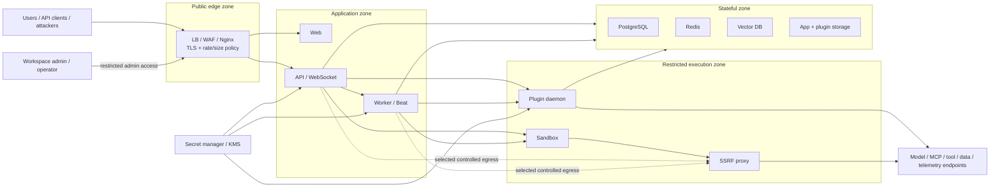

# 13. Security hardening

> **Version áp dụng:** Dify Community `1.15.0 @ 3aa26fb…`; Enterprise controls theo source snapshot được ghi riêng  
> **Ngày kiểm chứng:** `2026-07-16`  
> **Trạng thái xác minh:** `Official-source verified` + `Config validated` + `Design reviewed`; penetration và runtime test đều `RUNTIME-PENDING`  
> **Reviewer:** Security/Platform/Privacy/Legal review required

## Mục tiêu

Sau chương này, đội triển khai phải:

- Nhận diện public edge, control plane, execution, plugin, data và external-provider trust boundary.
- Thay bootstrap secret, đóng debug exposure, bật TLS và thu hẹp CORS/egress trước shared lab hoặc production.
- Áp least privilege cho workspace role, API key, model/tool/plugin credential và data store.
- Xử lý prompt/tool/retrieval output như dữ liệu không tin cậy, không phải instruction hay authorization claim.
- Có retention/redaction, vulnerability handling, test matrix và owner cho từng control.

## Phạm vi và giả định

- Chương bám Community Compose/source `1.15.0`; Enterprise marketing claim không được coi là control đã tồn tại trong Community.
- Security hardening không làm default Compose trở thành HA hoặc compliance-certified.
- Built-in roles là Owner, Admin, Editor và Normal; custom granular roles được docs nêu cho Enterprise. [S-017]
- Enterprise versioned docs xác nhận OAuth/SAML sign-in, nhưng Community/Enterprise negative matrix đầy đủ vẫn là gap. [S-027]
- Sandbox, SSRF proxy, plugin daemon và container network là control/boundary cần test; không tự động chứng minh strong isolation.
- Không dùng dữ liệu/credential production trong lab chưa được phê duyệt.

## Cơ chế hoạt động

### Defense in depth theo bảy lớp

| Lớp | Control tối thiểu | Evidence/gap chính |
|---|---|---|
| Identity/workspace | Least-privilege role, joiner/mover/leaver, break-glass, SSO theo edition | [S-017][S-027]; role terminology và runtime test `RUNTIME-PENDING` |
| Public edge | TLS, hostname, request-size/timeout, rate limit/WAF theo risk, chỉ Nginx/Ingress public | [S-005][S-010]; Compose TLS mặc định chưa bật |
| Secrets | Secret manager, unique random value, pair consistency, rotation/revoke/audit | [S-006][S-009]; rotation lab pending |
| Network/egress | Segmentation, DNS/TLS, allowlist, private-range protection, proxy policy | [S-005][S-006]; không phải mọi egress đi qua SSRF proxy |
| Execution/extensions | Sandbox limits, plugin provenance/signature, tool schema/authorization, code/package policy | [S-016][S-031][S-059]; isolation negative test pending |
| Data | Classification, encryption, backup, retention/deletion, access log, external export review | [S-073][S-075]; conversation log có thể chứa full I/O |
| Supply chain/operations | Pinned tag/digest, CVE scan, change approval, security updates, incident/vulnerability channel | [S-001][S-005][S-078] |

### Bootstrap defaults phải được coi là insecure until reviewed

Compose/`.env.example` có bootstrap values và dynamic image tags. Chương 11 đã inventory các cặp secret cần đồng bộ như DB, Redis/Celery, sandbox, plugin daemon/inner API và Weaviate. [S-005][S-006] Quy tắc:

- sinh secret bằng cơ chế đã phê duyệt; không tái sử dụng giữa môi trường;
- không commit `.env`, resolved Compose config, certificate private key hoặc support bundle chưa redact;
- rotate cả producer và consumer; đổi một phía tạo outage chứ không tạo security improvement;
- xem `SECRET_KEY` là material ký session/JWT/signed object và backup theo ownership rõ;
- không đưa secret vào prompt, tool description, workflow DSL, log/span/tag hoặc ticket.

### Ingress và route exposure

Nginx route UI, API, file, MCP, trigger, WebSocket và plugin hook; mặc định host publish 80/443. Plugin daemon còn publish debug port `5003`. [S-005][S-010]

Production baseline:

- chỉ LB/Ingress/Nginx được public;
- bật HTTPS, TLS 1.2/1.3, certificate lifecycle và redirect phù hợp;
- đóng hoặc bind/restrict `5003`; không expose DB, Redis, vector DB, sandbox, proxy hoặc daemon inner API;
- thu hẹp console/Web API CORS khỏi `*` theo domain thật;
- giới hạn upload/request body và timeout theo workload, không để giá trị lớn chỉ để tránh lỗi;
- tách admin console access bằng network/IAM nếu risk model yêu cầu.

### Egress, SSRF và untrusted content

API/worker/sandbox/plugin có thể gọi model, tool, package, URL và data source ngoài. `ssrf_proxy` chỉ bảo vệ các path được cấu hình dùng proxy; không được dùng làm bằng chứng toàn bộ egress đã kiểm soát. [S-005][S-006]

Controls bắt buộc:

- allowlist domain/port/protocol theo app/plugin/tool;
- chặn loopback, link-local, metadata service và private/control-plane address trừ exception cụ thể;
- TLS verify, DNS monitoring, response-size/content-type limit và timeout;
- không cho user/retrieved/tool output điều khiển arbitrary URL/header;
- coi prompt, document, web content, tool output và model output là untrusted; validate trước code/action/authorization.

### Plugin, tool, MCP và model boundary

- Plugin source Marketplace/GitHub/local phải có publisher/version/provenance/update policy; manifest permission không tự chứng minh isolation. [S-016][S-031]
- Giữ signature verification, scan package/dependency và pin version/digest khi có thể.
- Tool credential scope tối thiểu; downstream phải enforce tenant/user/resource/action, không tin identity do model/user text sinh ra. [S-059]
- MCP server URL do Dify publish chứa credential; lưu như secret và regenerate khi lộ. Client credential/custom header/OAuth phải có owner/rotation. [S-014][S-015]
- Model/embedding/rerank dispatch qua plugin daemon; daemon/provider là critical security/availability path. [S-038]

### Logs, traces và privacy

Application logs có thể giữ complete interaction history, timing, token, error và feedback; docs nêu retention vô thời hạn mặc định. [S-073] External tracing có thể export input/output/user/session/run/tool/retrieval metadata. [S-075][S-076][S-077]

Do đó phải:

- chốt retention/deletion theo data class, không theo default;
- tắt `DEBUG` ở production, đặc biệt khi request logging có thể ghi body; [S-009]
- redact authorization header, token, MCP URL, secret, raw PII và sensitive tool payload;
- kiểm soát region/tenant/subprocessor/retention của external observability;
- tách operational logs khỏi compliance audit; không gọi product log là tamper-evident audit nếu chưa có evidence.

## Kiến trúc/luồng dữ liệu

### D11 — Trust zones và security data flow

Mỗi mũi tên là một policy point: identity, credential, protocol, allowlist, encryption, timeout, telemetry và failure behavior phải được ghi rõ.

## Hướng dẫn hoặc ví dụ triển khai

### Gate 1 — Trước shared lab

- Pin Dify tag/commit; ghi image set, chưa dùng mutable `latest` như production artifact.
- Copy `.env`, sinh lại toàn bộ bootstrap secret và bảo vệ file permission.
- Chỉ dùng test data/model/tool credential; chặn production endpoint.
- Đóng `5003` khỏi untrusted network; chỉ Nginx host port cần thiết được mở.
- Bật TLS nếu lab có user/network ngoài local host.
- Thu hẹp CORS và egress; giữ Weaviate anonymous access disabled, plugin signature verification enabled.
- Xác nhận backup path trước khi tạo dữ liệu cần giữ.

### Gate 2 — Trước pilot

1. Hoàn thành data-flow/threat model theo app, gồm model/tool/plugin/MCP/telemetry.
2. Xác minh role/SSO/edition và joiner/mover/leaver.
3. Chuyển secret sang manager phù hợp, chạy rotation/revoke test.
4. Chạy vulnerability/image/dependency scan và pin digest.
5. Chạy security test matrix dưới đây trên environment tách biệt.
6. Chốt log/trace retention, PII redaction, access và deletion.
7. Review backup encryption/restore/DR và incident response.
8. Có Security/Privacy/Legal/Platform sign-off với accepted risks.

### Security test matrix tối thiểu

| ID | Test | Kết quả mong đợi |
|---|---|---|
| SEC-01 | Bootstrap/default secret scan | Không còn secret mẫu hoặc secret commit/log |
| SEC-02 | External port scan | Chỉ port/route đã phê duyệt reachable; `5003` bị chặn |
| SEC-03 | TLS/hostname/certificate | TLS policy đạt; certificate/renewal alert hoạt động |
| SEC-04 | CORS/origin negative test | Origin ngoài allowlist bị chặn |
| SEC-05 | SSRF tới loopback/private/metadata | Bị chặn; exception được log/owner hóa |
| SEC-06 | Sandbox/code egress | Chỉ endpoint cho phép; timeout/resource limit hữu hạn |
| SEC-07 | Malicious/untrusted plugin fixture | Install/invoke bị policy chặn hoặc cô lập; evidence đủ điều tra |
| SEC-08 | Tool prompt injection và parameter abuse | Không vượt allowlist/schema/authorization |
| SEC-09 | Cross-user/workspace access | Không đọc/sửa resource ngoài quyền |
| SEC-10 | MCP URL/credential revoke | URL cũ/credential cũ hết hiệu lực; log không lộ secret |
| SEC-11 | PII/secret canary qua log/trace | Destination bị cấm không nhận raw canary |
| SEC-12 | Backup access/restore | Backup encrypted/least privilege và restore dùng đúng secret set |
| SEC-13 | Rate/size/concurrency abuse | Request bị giới hạn có kiểm soát, service không sập lan truyền |
| SEC-14 | Dependency/provider outage | Fail closed/degraded theo design; không bypass policy |
| SEC-15 | Vulnerability-report drill | Triage/contain/report dùng private channel và owner đúng |

### Vulnerability handling

Dify yêu cầu báo cáo lỗ hổng qua private GitHub Security Advisory, không qua public issue/discussion/PR; security fix có thể phát hành trong release bình thường. [S-078]

Runbook nội bộ phải thêm:

1. bảo toàn evidence đã redact;
2. xác định affected version/component/config/data;
3. contain credential/network/plugin/app;
4. báo private theo policy và legal disclosure rule;
5. đánh giá patch/mitigation trên staging;
6. rotate/revoke, deploy, validate và retrospective.

## Quyết định và trade-off

- **Community built-in roles vs Enterprise granular controls:** nếu requirement cần fine-grained role/SSO/audit, không tự tuyên bố Community đáp ứng; đánh giá Enterprise hoặc compensating architecture. [S-017][S-019]
- **Sandbox network enabled vs disabled:** enabled hỗ trợ package/HTTP use case nhưng tăng egress/SSRF surface. Mặc định chọn deny/allowlist theo từng use case, không mở toàn mạng vì tiện.
- **External LLMOps vs local-only logs:** external tracing giúp debug/evaluation nhưng mở data-export boundary; chọn theo data class/region/retention và redaction capability.
- **Auto-update vs pinned artifact:** auto-update có thể nhận fix nhanh nhưng phá reproducibility; production dùng controlled promotion, CVE watch và emergency patch path.
- **Rich logs vs data minimization:** full payload giúp debug nhưng tăng privacy/incident impact. Ưu tiên structured metadata/correlation, on-demand protected payload access.

## Security và operations implications

- Security control cần owner, configuration evidence, test, alert, runbook và review date; checklist không có enforcement/test chỉ là intent.
- Image/source/plugin/model/tool drift phải kích hoạt regression/security review.
- Secret rotation, certificate renewal, cleanup, backup và scan là scheduled operations; Beat/worker/CI outage có thể làm control im lặng không chạy.
- Capacity exhaustion là security concern: token/tool loops, upload, vector ingest, log growth và external timeout cần quota/backpressure.
- Admin/support access phải được log, time-bound và review; không chia sẻ owner credential.
- License/tenant/workspace/branding condition là deployment gate song song với technical security. [S-004]

## Failure modes và troubleshooting

| Triệu chứng | Risk/nguyên nhân | Kiểm tra | Hành động đầu tiên |
|---|---|---|---|
| Secret xuất hiện trong Git/log | `.env`, debug/body log, resolved config hoặc trace | Secret scan, access/export inventory | Revoke/rotate, restrict/purge theo policy, incident triage |
| Endpoint nội bộ reachable public | Port mapping/LB/firewall sai | External scan + rendered config | Chặn network trước, rồi sửa manifest/overlay |
| SSRF negative test thành công | Proxy bypass/allowlist quá rộng/untrusted URL | Request path, DNS/proxy/firewall logs | Contain egress, revoke exposed credential, fix policy |
| Cross-user data access | Role/tenant filter/authorization thiếu | Identity/resource/action audit | Disable affected path, preserve evidence, patch/test |
| Plugin/model calls lỗi sau hardening | Egress/credential/signature policy chặn đúng hoặc cấu hình lệch | Daemon/provider log, allowlist, secret version | Không mở toàn mạng/tắt signature; sửa rule hẹp |
| Log retention không thực thi | Cleanup tắt hoặc Beat/worker/DB lỗi | Config, scheduler/worker, DB growth | Khôi phục job, chạy controlled cleanup, alert |
| UI/API lỗi sau rotation | Secret pair không đồng bộ hoặc `SECRET_KEY` impact | Producer/consumer secret version, session/signed URL | Rollback secret theo runbook hoặc hoàn tất coordinated rotation |
| Security fix không vào môi trường | Artifact pin/update process thiếu | Release/advisory inventory, image/source SHA | Emergency change theo controlled test/promotion |
| Sandbox escape/isolation nghi ngờ | Boundary bị vượt hoặc fixture độc hại | Host/container/network evidence | Isolate host/workload, incident response, private report |

## Checklist xác nhận

- [x] Trust zones và critical data/credential flows được inventory.
- [x] Default secret, dynamic image, debug port, CORS/TLS và retention gaps được ghi.
- [x] Plugin/tool/MCP/model và external telemetry được coi là trust boundary.
- [x] Mermaid security-zone diagram được nhúng trực tiếp.
- [ ] Chốt data classification, tenant/workspace model và edition controls.
- [ ] Hoàn tất threat model cho từng app/use case.
- [ ] Chạy SEC-01–SEC-15 và lưu evidence.
- [ ] Xác minh sandbox/plugin isolation bằng negative test.
- [ ] Chạy secret rotation/revoke và backup/restore drill.
- [ ] Chốt vulnerability/CVE/SBOM/image/plugin update process.
- [ ] Render Mermaid trên renderer đích.
- [ ] Security/Privacy/Legal/Platform sign-off.

## Giới hạn/version caveats

- Không có một official Community “production hardening profile” được chứng minh end-to-end trong nguồn đã khóa; chương kết hợp source/config evidence với design controls có nhãn rõ.
- Enterprise marketing claim về OIDC/SCIM/audit/SIEM/workflow RBAC không chứng minh entitlement/runtime của `1.15.0`.
- Built-in product logs không được coi là tamper-evident audit log.
- Container/internal network/manifest permission/subprocess không chứng minh strong isolation.
- Chưa có penetration test, external scan, malicious-plugin fixture, restore/rotation drill hoặc load/abuse test.
- Control/value cụ thể phải thay đổi theo threat model, data class, SLA và hạ tầng; không copy default vào production mà không review.

## Nguồn tham khảo

- [S-001] Dify `1.15.0` release/security notes.
- [S-004] Dify LICENSE tại tag `1.15.0`.
- [S-005] Docker Compose tại tag `1.15.0`.
- [S-006] Docker `.env.example` tại tag `1.15.0`.
- [S-009] Environment Variables, docs snapshot `57a492d…`.
- [S-010] Nginx route template tại tag `1.15.0`.
- [S-014] Dify as MCP client.
- [S-015] Publish Dify app as MCP server.
- [S-016] Integrations and plugins.
- [S-017] Workspace roles.
- [S-027] Personal Settings/Enterprise sign-in.
- [S-031] Plugin Manifest Schema.
- [S-038] Plugin model implementation.
- [S-059] Tool Node.
- [S-073] Application Conversation Logs.
- [S-075] Langfuse Integration.
- [S-076] Opik Integration.
- [S-077] W&B Weave Integration.
- [S-078] Dify Security Policy.
