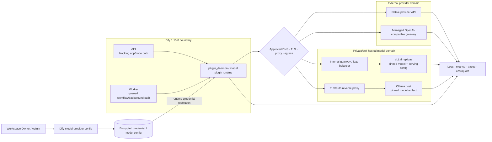
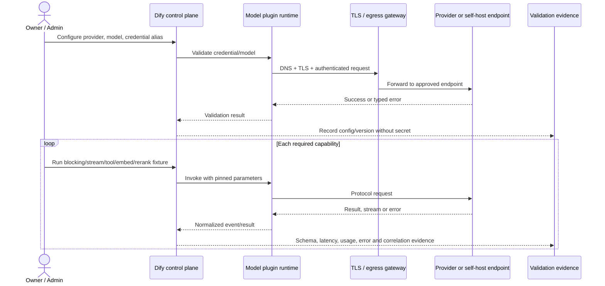

# 14. Tích hợp model provider

> **Version áp dụng:** Dify Community `1.15.0 @ 3aa26fb…`  
> **Docs snapshot:** `release/1.15.0 @ 57a492d…`  
> **Ngày kiểm chứng:** `2026-07-16`  
> **Trạng thái xác minh:** `Official-source verified` + `Design reviewed`; toàn bộ provider/endpoint lab là `RUNTIME-PENDING`  
> **Reviewer:** AI Platform, Network, Security, Privacy và FinOps review pending

## Mục tiêu

Sau chương này, người đọc phải có thể:

- Chọn một trong bốn pattern: provider API qua plugin native, managed OpenAI-compatible gateway, self-hosted vLLM/OpenAI-compatible endpoint hoặc Ollama qua plugin native.
- Nối đúng đường credential và network từ Dify/plugin runtime tới endpoint, gồm DNS, route, TLS, custom CA, proxy/egress và authentication.
- Không nhầm “OpenAI-compatible” với “tương thích mọi capability/parameter/stream event”.
- Lập capability contract cho LLM, streaming, tool call, structured output, vision, embedding và rerank trước khi bật trong app.
- Map model ID, completion mode, context/output limit và sampling parameter giữa Dify, plugin và serving backend.
- Thiết kế timeout, retry, rate-limit, quota, credential load balancing và cross-model fallback thành các lớp khác nhau.
- Onboard provider bằng checklist có evidence, chạy test matrix positive/negative/failure và không công bố runtime behavior khi chưa lab.
- Vận hành endpoint với correlation, latency/token/cost/quota telemetry, redaction, canary và rollback.

## Phạm vi và giả định

### Phạm vi

- Dify Community `1.15.0`; LLM, text embedding và rerank là ba model type chính của playbook.
- External API gồm provider managed bằng plugin native và API/gateway tương thích OpenAI.
- Self-host gồm Ollama qua plugin Ollama và serving stack cung cấp OpenAI-compatible API như vLLM.
- Credential scope, network/TLS/proxy, capability/parameter mapping, streaming/tool/structured-output, timeout/retry/rate limit, cost/quota, fallback/load balancing và observability.
- Chương 06 là nguồn cho model-management/control-plane semantics; chương này tập trung vào connection và release playbook.

### Giả định

- Tổ chức có provider account/project hoặc model-serving endpoint hợp lệ, owner, billing owner và data-processing approval.
- Endpoint self-host đã có owner cho model artifact, GPU/CPU, serving image, capacity, patching và incident; chương này không sizing GPU.
- Test dùng workspace/lab credential và dữ liệu tổng hợp, không dùng production key hoặc dữ liệu nhạy cảm.
- Dify core được pin `1.15.0`; model-provider plugin có lifecycle/version riêng. Các source plugin mới [S-087]–[S-090] là snapshot chính thức tại commit `6b04cde…`, không được coi là plugin version mặc định đi kèm Dify core.
- vLLM/Ollama docs [S-091]–[S-094] là tài liệu official/current tại ngày truy cập; phải pin serving version thực tế khi triển khai.
- Workspace hiện chưa có approved provider credential, self-host endpoint hoặc Docker runtime evidence. Mọi bước/test có nhãn `RUNTIME-PENDING` cho tới khi evidence được ghi vào validation log.

### Ngoài phạm vi

- Chọn “model tốt nhất”, benchmark GPU chi tiết, huấn luyện/fine-tune, model license review thay Legal hoặc giá provider theo thời điểm.
- Viết model-provider plugin mới từ đầu.
- Cam kết rằng một endpoint gắn nhãn OpenAI-compatible hỗ trợ toàn bộ OpenAI API, Responses API hoặc mọi extension.
- Thiết kế HA chi tiết cho GPU cluster; chương chỉ xác định interface/gate mà serving platform phải đáp ứng.

## Cơ chế hoạt động

### 1. Data path của model call

Ở Dify `1.15.0`, model-provider implementation dispatch LLM, embedding và rerank qua `plugin_daemon`; credential validation/schema lookup cũng đi qua model plugin path. [S-038]

Một call logic gồm:

1. App/node chọn provider + model + model type và parameter.
2. Dify resolve workspace/model credential; secret được giải mã cho runtime path. [S-071]
3. API hoặc worker gọi model plugin qua plugin daemon tùy outer execution path.
4. Plugin build protocol request, gọi endpoint external/self-host.
5. Endpoint trả stream/result/usage hoặc error; plugin map về Dify model/event/error contract.
6. Node/workflow xử lý output, retry/fallback hoặc failure.

Vì vậy network test phải chạy từ **plugin runtime path**, không chỉ từ laptop, API container hoặc Dify host. Source cho biết logical call path; địa chỉ nguồn, DNS resolver, proxy và CA bundle thực tế vẫn phải trace trong deployment.

### 2. Bốn pattern tích hợp

| Pattern | Ví dụ | Khi phù hợp | Rủi ro chính |
|---|---|---|---|
| Native managed-provider plugin | Provider SaaS/enterprise cloud có plugin riêng | Muốn mapping auth/model/capability theo provider | Vendor quota/retention/outage; plugin và API version drift |
| OpenAI-compatible managed gateway | Gateway nội bộ hoặc third-party đứng trước nhiều model | Muốn một protocol/egress point và policy tập trung | “Compatible” không đồng nghĩa capability/parameter/error giống nhau |
| Self-hosted OpenAI-compatible server | vLLM sau internal gateway/load balancer | Cần control data/model và có đội GPU/serving | Capacity, batching, model artifact, HA, patching, cold start |
| Native Ollama plugin | Ollama local/LAN/private host | Dev/POC hoặc deployment phù hợp capability Ollama | Local API không auth mặc định; Docker `localhost` trap; model/capability tùy host |

Ưu tiên plugin native khi provider có semantics khác đáng kể. Dùng generic OpenAI-compatible plugin khi conformance suite chứng minh đúng endpoint, model type và feature cần thiết.

### 3. Credential scope và trust boundary

Dify docs baseline nêu provider key cấp quyền model cho workspace và chỉ Owner/Admin quản lý provider/default/credential. [S-065] Với custom/OpenAI-compatible model, credential có thể gồm model name, base URL và API key; schema đánh dấu secret phải được quản lý như secret, không phải app parameter. [S-069][S-071]

Control tối thiểu:

| Boundary | Control |
|---|---|
| Provider account/project | Key riêng theo environment/workspace, scope tối thiểu, budget/quota, owner, expiry/rotation |
| Dify workspace | Owner/Admin only, credential alias không chứa secret, access review, inventory consumer |
| Plugin daemon/runtime | Internal auth/network isolation, không log decrypted key, bảo vệ crash dump/support bundle |
| Network egress | DNS/route allowlist, TLS validation, proxy policy, private-endpoint routing, timeout |
| Endpoint | API key/service identity, tenant/project isolation, request limit, audit, model allowlist |

Current official Ollama plugin cho phép để trống API key khi nối local service; vì vậy nếu mở service ra ngoài trust boundary, phải bọc bằng network isolation hoặc reverse proxy có TLS/auth. [S-089][S-090] vLLM official docs có tùy chọn API key trong server example, nhưng production vẫn cần TLS, network segmentation và gateway policy cho deployment thực tế. [S-093]

### 4. Network, TLS và proxy

#### Reachability

- Endpoint name phải resolve được từ plugin runtime.
- Với Docker, `localhost` trong container không phải host/model server. Official Ollama plugin hướng dẫn dùng host/LAN address có thể truy cập từ Dify container và dùng **host root**, không thêm `/api`. [S-089]
- Với Kubernetes, dùng Service/private DNS hoặc controlled egress; không hardcode Pod IP.
- Security group/firewall chỉ mở từ Dify/plugin runtime tới đúng endpoint/port.

#### TLS

- Production external hoặc cross-host traffic dùng HTTPS/mTLS theo policy.
- Hostname/SAN, chain, expiry và revocation phải hợp lệ; custom CA phải được cài vào đúng plugin/runtime trust store.
- Không dùng “disable certificate verification” làm fix lâu dài.
- Test CA rotation và expired/wrong-host certificate; không chỉ test happy path.

#### Proxy

- Phân biệt **Dify model-call egress proxy** với proxy dùng để pull model/artifact.
- Ollama docs dùng `HTTPS_PROXY` cho model pulls và cảnh báo `HTTP_PROXY` có thể ảnh hưởng client connection; điều này không tự cấu hình Dify-to-Ollama request. [S-092]
- Việc Dify có SSRF proxy cho một số path không chứng minh model-plugin egress đi qua proxy đó. Phải xác minh bằng gateway/proxy log hoặc packet/flow evidence.
- Nếu proxy terminate TLS, CA, SNI, keep-alive, streaming buffering và idle timeout phải được test.

### 5. OpenAI-compatible là protocol baseline, không phải capability guarantee

Current official Dify OpenAI-API-compatible plugin snapshot hỗ trợ configurable model cho `llm`, `text-embedding`, `rerank`, STT và TTS, với các field như endpoint URL, model name, completion mode, context/output limit và feature flags. [S-087][S-088]

Những field feature như vision, function/tool call, streaming tool call hoặc structured output có thể là **operator declaration**. Bật flag không làm serving model tự có capability. Acceptance test phải chứng minh:

| Capability | Protocol evidence tối thiểu | Dify/application evidence |
|---|---|---|
| Blocking LLM | HTTP success, finish reason, usage/error shape | Output đúng contract, token/latency được ghi |
| Streaming | Chunk ordering, terminal/usage/error giữa stream | Client nhận đủ, không duplicate/mất terminal |
| Tool calling | Tool name + JSON args theo schema; behavior single/multiple call | Agent/tool node validate args và loop hữu hạn |
| Structured output | Endpoint nhận response format/schema và trả JSON hợp lệ | Downstream schema + semantic validation |
| Vision/document/audio | Endpoint/model nhận đúng modality | Positive/negative file test; size/type limit |
| Embedding | `/embeddings`-compatible output, dimension ổn định | Index/query dùng cùng model/revision/dimension |
| Rerank | Query + documents → index/score ordering | Top N/threshold, modality và quality test |

vLLM supports several OpenAI-compatible endpoints, including Chat/Completions/Responses and Embeddings, plus rerank-compatible APIs depending served task/version. Parameters/features are endpoint/model/version sensitive; official docs explicitly note some fields are unsupported/ignored and model repository `generation_config.json` can affect defaults. [S-093]

Ollama exposes a partly OpenAI-compatible `/v1` surface, but native Ollama API and capability set are not identical to every OpenAI feature. [S-091] For Dify, choose native Ollama plugin unless the exact OpenAI-compatible path has passed the same test matrix.

### 6. Model and parameter mapping

Capture mapping as a release artifact:

| Concept | Dify/plugin field | Endpoint/server field | Validation |
|---|---|---|---|
| Model identity | Display name + endpoint model name | Served model/deployment ID | `/models` or provider catalog + one invoke |
| Mode | Chat hoặc Completion | `/chat/completions` hoặc `/completions`-like path | Prompt role/template behavior |
| Context size | Declared context limit | Server/model context configuration | Boundary input: fit, near-limit, overflow |
| Output limit | Max token upper bound | `max_tokens`, `max_completion_tokens`, `max_output_tokens` hoặc native equivalent | Small/large boundary and error mapping |
| Sampling | temperature, top-p, stop, penalties | Provider-supported subset/range | Sent payload + deterministic fixtures where applicable |
| Streaming | stream flag | SSE/NDJSON/provider stream | First-token, chunk accumulation, terminal, mid-stream error |
| Tools | function/tool-call flag | tool schema, `tool_choice`, parser/template | Valid/invalid args, zero/one/multiple calls |
| Structured output | JSON/schema capability | response format/guided decoding/native JSON | Syntax + semantic schema validation |
| Embedding | model, batch/context | embedding endpoint, dimension/encoding | Dimension, normalization, batch and long input |
| Rerank | model, endpoint, Top N | rerank/score API | Index/score/order and threshold |

Không khai báo context size lớn hơn server/model thực tế. Với self-host server, Dify field không thay đổi KV-cache, chat template hay serving limit. Với vLLM, pin serving image/model revision, chat template/tool parser và generation-config behavior; với Ollama, pin model digest/Modelfile/context setting theo vận hành của đội model. [S-089][S-093][S-094]

### 7. Streaming, tool calls và structured output

- Streaming thành công không chỉ là nhận chunk đầu; cần terminal, usage, finish reason, cancellation/disconnect và mid-stream error.
- Ollama native integration dùng stream contract riêng của provider; phải test raw chunks, terminal marker và cách installed plugin map lỗi xảy ra sau khi stream đã mở. [S-089]
- Tool calling phụ thuộc model, chat template/parser/server flags và plugin mapping. vLLM docs cảnh báo JSON parse/schema validity không bảo đảm tool choice hoặc business quality. [S-094]
- Structured output phải được validate ở application boundary. Dify LLM docs cũng lưu ý model không native JSON có thể chỉ được prompt với schema và output có thể biến thiên. [S-066]
- Không expose raw reasoning/thinking trace nếu chưa có policy; reasoning field/tag mapping khác nhau giữa provider.

### 8. Embedding và rerank

- Pin embedding provider/model/revision/dimension cho mỗi index; query phải dùng cùng vector space.
- Không cross-model fallback cho embedding query của index hiện hữu. Outage nên fail/pause hoặc chuyển sang retrieval path đã được đánh giá riêng.
- Rerank là endpoint/capability khác LLM. Current Ollama plugin docs nói Ollama không có native rerank endpoint và cần compatible rerank service khi dùng loại này; verify exact installed plugin version. [S-089]
- Dify docs yêu cầu multimodal embedding đi cùng rerank tương thích modality để tránh mất image result. [S-050]
- Benchmark batch size, input length, dimension, throughput, score/order và timeout; không chỉ credential validation.

### 9. Timeout, retry, rate limit và fallback

Tách bốn lớp:

| Lớp | Mục đích | Quy tắc |
|---|---|---|
| Connection/read timeout | Chặn connect/stream treo | Nhỏ hơn caller/proxy budget; streaming idle khác total duration |
| Retry cùng endpoint/model | Phục hồi transient error | Bounded backoff + jitter; tính duplicate cost; không retry auth/bad request mù |
| Credential load balancing | Đổi credential/config cùng provider/model/type | Dify source chỉ rotate một số typed error; không phải model fallback [S-072] |
| Endpoint replica LB | Chọn replica cùng model/revision/config | Thực hiện ở gateway/service; health/capacity-aware; giữ session/stream semantics |
| Cross-model/provider fallback | Duy trì service khi primary lỗi | Explicit workflow/error branch; validate capability, policy, schema, quality, cost |

Retry streaming sau khi đã gửi partial output có thể duplicate text/tool call hoặc tăng cost; client/application phải có request ID và policy rõ. Embedding retry cần idempotent indexing state. Dify error taxonomy tách authentication, connection, rate-limit và quota class; dùng typed class làm input cho policy, nhưng vẫn phải xác minh mapping của installed plugin. [S-060] Authentication, policy và schema error nên fail fast.

### 10. Cost, quota và capacity

| Managed API | Self-host endpoint |
|---|---|
| Theo dõi input/output/embedding/rerank usage, request fee, quota/RPM/TPM, provider budget | Theo dõi GPU/CPU memory, utilization, queue, batch, throughput, model load/cold start, energy/infra, on-call |
| Capacity do provider nhưng quota/outage ngoài control | Capacity do đội vận hành; phải autoscale/admission control/failover |
| Dễ thử model mới nhưng price/retention có thể đổi | Pin model/artifact dễ hơn nhưng patch/serving upgrade là trách nhiệm nội bộ |

Không so sánh chỉ bằng “giá mỗi token” với “GPU đã mua”. Cost model phải gồm idle capacity, redundancy, engineering/on-call, egress, storage, observability và reindex.

### 11. Observability contract

Tín hiệu tối thiểu:

- Dify app/node/run ID, provider, model, model type và fallback flag;
- plugin/plugin-daemon version/status/latency;
- endpoint/gateway request ID, replica/model revision;
- request count, success/error class, retry, rate limit, quota và circuit state;
- time-to-first-token, total latency, stream duration/cancellation;
- input/output/embedding token, batch size, vector dimension, rerank candidate count;
- managed cost hoặc self-host GPU queue/utilization/load duration;
- output schema/tool-call validation failure;
- credential alias, không log key; prompt/response chỉ theo redaction/retention policy.

vLLM provides `/health`, `/v1/models` and Prometheus-compatible `/metrics` in current official docs. [S-093] Ollama compatibility docs list stream-usage support on applicable OpenAI-compatible responses; the exact native metrics and their mapping into Dify still require runtime verification. [S-091] Dify application logs/tracing are described in Chương 09; verify which fields reach each exporter before promising correlation. [S-073][S-075][S-076][S-077]

## Kiến trúc/luồng dữ liệu

### D12 — External và self-hosted model integration topology

Sơ đồ là reference design. `plugin_daemon`/plugin runtime là logical egress boundary theo source; actual source IP, proxy, TLS termination và replica routing phải được xác minh trong lab. Không expose Ollama/vLLM raw port ra Internet chỉ để Dify truy cập.

### D12B — Capability onboarding sequence

Credential validation chỉ là bước đầu; provider chưa được production-ready cho đến khi mọi capability thực sự dùng qua test matrix.

## Hướng dẫn hoặc ví dụ triển khai

### 1. Onboarding checklist chung

Trước khi mở Dify UI, tạo provider record:

| Field | Nội dung bắt buộc |
|---|---|
| Ownership | AI Platform owner, billing/GPU owner, incident/escalation |
| Version | Dify, plugin, provider API hoặc serving image, model ID/revision/digest |
| Capability | LLM mode, stream, tools, structured output, modality, embedding, rerank |
| Data | Classification, region, retention/training, DPA/license, allowed use |
| Credential | Environment, scope, account/project, alias, rotation/revoke owner |
| Network | Source runtime, DNS, route, port, TLS/mTLS, CA, proxy, egress allowlist |
| Reliability | SLO, quota/capacity, timeout, retry, LB, fallback, maintenance |
| Cost | Token/request price hoặc GPU/infra budget, alert threshold, cost center |
| Evidence | Test fixtures, expected outputs, validation IDs, approval và expiry |

### 2. External provider bằng native plugin (`RUNTIME-PENDING`)

1. Cài đúng provider plugin từ nguồn được phê duyệt; lưu plugin version/hash.
2. Tạo lab key/project có quota nhỏ và data policy phù hợp.
3. Chỉ Owner/Admin nhập credential; đặt alias, owner và rotation date ngoài Dify. [S-065]
4. Cho phép egress đúng domain/port; validate DNS/TLS từ plugin runtime.
5. Add model/type cần dùng; không đặt workspace default trước khi test.
6. Chạy credential-negative, blocking, streaming, structured/tool và error tests tương ứng.
7. So Dify usage/error với provider dashboard/request ID.
8. Chạy data-leak/redaction test trước Security/Privacy sign-off.
9. Canary app/node explicit-pin; chỉ đổi default sau impact review.

### 3. Managed hoặc self-hosted OpenAI-compatible endpoint (`RUNTIME-PENDING`)

Current generic plugin snapshot yêu cầu tối thiểu type, model name và endpoint URL; API key có thể optional tùy endpoint. Nó có cấu hình mode/context/output limit và feature flags. [S-087][S-088]

Ví dụ record thiết kế, không phải secret/config export:

| Field | Giá trị ví dụ |
|---|---|
| Provider plugin | `OpenAI-API-compatible`, version/hash đã pin |
| Model type | `LLM` |
| Endpoint model name | exact served ID từ `/v1/models` hoặc gateway catalog |
| API Base URL | `https://llm-gateway.lab.example/v1` |
| Completion mode | `Chat` |
| Context/output limit | Giá trị đã đối chiếu serving config, không đoán |
| Function/tool call | Tắt trước; chỉ bật sau INT-08–INT-10 |
| Structured output | Tắt trước; chỉ bật sau schema tests |
| Credential | Lab bearer token từ secret inventory |

Quy trình:

1. Từ plugin runtime, test DNS, TCP, TLS chain/SAN và authenticated `/models`/health path phù hợp.
2. Kiểm tra plugin ghép URL cho từng model type. Không mặc định mọi type dùng cùng rule `/v1`; current plugin README lưu ý một số non-LLM path có thể append version riêng. [S-087]
3. Test model ID, chat/completion mode và context boundary.
4. Test streaming terminal/mid-stream error qua mọi proxy/LB.
5. Bật từng feature một; không bật theo marketing claim.
6. Pin gateway/backend route để cùng model ID không âm thầm trỏ model revision khác.
7. Ghi request/replica/model revision correlation.

### 4. Self-hosted vLLM sau internal gateway (`RUNTIME-PENDING`)

1. Pin vLLM image/version, model repository revision/digest, tokenizer, chat template và serving flags.
2. Serve đúng task: generation, embedding hoặc rerank/score; không dùng một endpoint model type sai.
3. Bật endpoint authentication; đặt vLLM sau private gateway/Service có TLS, rate limit và access log.
4. Expose health/models/metrics chỉ trong management network; chặn development/profiling/dynamic-loading endpoints nếu không cần.
5. Cấu hình Dify generic plugin tới gateway `/v1` path đã kiểm chứng, không tới Pod/replica trực tiếp.
6. Test parameter mapping và model-repo generation config; lưu effective serving configuration. [S-093]
7. Test structured output/tool calling trên đúng model, parser/template và server version; schema-valid không đồng nghĩa action đúng. [S-094]
8. Load test concurrent streaming, queue/admission, GPU OOM, replica drain và restart.
9. Canary serving/model upgrade; không trộn revision trong cùng LB pool nếu output contract chưa chứng minh tương đương.

### 5. Ollama qua native plugin (`RUNTIME-PENDING`)

1. Pin Ollama version và model digest/Modelfile; pull model trước test.
2. Không dùng `http://localhost:11434` từ Dify container. Chọn private DNS/host reachable.
3. Đặt TLS/auth reverse proxy hoặc strict private network khi local Ollama connection không dùng API key. [S-089][S-090][S-092]
4. Trong Dify Ollama provider, nhập **host root** như `https://ollama-gateway.lab.example`, không thêm `/api`; current official plugin tự ghép native paths. [S-089][S-090]
5. Nhập API key nếu proxy/cloud yêu cầu; local blank chỉ khi network policy đã phê duyệt.
6. Add model type và khai báo context/vision/function-call chỉ theo model thực tế.
7. Test blocking, native NDJSON streaming, mid-stream error, tool call và cold-load latency.
8. Với embedding, test `/api/embed` path qua plugin, dimension/batch/long input.
9. Với rerank, dùng endpoint compatible riêng nếu installed plugin yêu cầu; Ollama current docs/plugin không chứng minh native rerank. [S-089]

### 6. Embedding/rerank onboarding (`RUNTIME-PENDING`)

1. Tạo corpus/query nhỏ có expected relevant chunks.
2. Ghi provider/model/revision/dimension, input/batch limit, normalization và modality.
3. Index vào knowledge base test tách biệt.
4. Query bằng đúng embedding model; kiểm tra dimension và result.
5. Bật rerank, đo order/score/Top N/latency; test timeout và empty input.
6. Nếu multimodal, kiểm tra image candidate trước/sau rerank.
7. Failure test embedding/rerank endpoint; xác nhận fail/degrade policy.
8. Chỉ promote sau retrieval evaluation; đổi embedding dùng dual-index/reindex, không config flip.

### 7. Test matrix

| ID | Scenario | Kỳ vọng/evidence | Trạng thái |
|---|---|---|---|
| INT-01 | DNS/TCP từ plugin runtime | Resolve đúng private/public IP; route/port đúng | `RUNTIME-PENDING` |
| INT-02 | TLS chain/SAN/expiry hợp lệ | Handshake đạt, CA path được ghi | `RUNTIME-PENDING` |
| INT-03 | Wrong-host/expired/untrusted CA | Fail closed; không auto-disable verify | `RUNTIME-PENDING` |
| INT-04 | Credential đúng/sai/revoked | Success và typed auth failure; log không lộ key | `RUNTIME-PENDING` |
| INT-05 | Member quản lý provider | Bị từ chối theo role policy | `RUNTIME-PENDING` |
| INT-06 | Blocking LLM | Output/usage/finish reason đúng contract | `RUNTIME-PENDING` |
| INT-07 | Streaming LLM | TTFT, ordered chunks, terminal/usage/cancel đạt | `RUNTIME-PENDING` |
| INT-08 | Mid-stream endpoint/proxy failure | Client nhận controlled error; không treo/duplicate | `RUNTIME-PENDING` |
| INT-09 | Tool call hợp lệ | Tool name/JSON args/schema/loop đạt | `RUNTIME-PENDING` |
| INT-10 | Invalid/parallel tool calls | Validation fail closed; concurrency behavior được ghi | `RUNTIME-PENDING` |
| INT-11 | Structured output happy/boundary | JSON + semantic schema validation đạt | `RUNTIME-PENDING` |
| INT-12 | Unsupported feature flag bật sai | Invoke fail rõ; không bịa capability | `RUNTIME-PENDING` |
| INT-13 | Context near-limit/overflow | Boundary đúng effective server limit | `RUNTIME-PENDING` |
| INT-14 | Parameter range/name mismatch | Mapped/rejected rõ; effective payload evidence | `RUNTIME-PENDING` |
| INT-15 | 429/rate limit | Bounded backoff; quota/cooldown/alert đúng policy | `RUNTIME-PENDING` |
| INT-16 | Timeout/503/connection reset | Retry budget hữu hạn; error/fallback path rõ | `RUNTIME-PENDING` |
| INT-17 | Same-model multiple credentials | Round robin/cooldown chỉ trong cùng model | `RUNTIME-PENDING` |
| INT-18 | Cross-model fallback | Chỉ chạy approved error; `fallback_used=true`; schema/quality đạt | `RUNTIME-PENDING` |
| INT-19 | Plugin daemon unavailable | Model calls fail có chẩn đoán; không đổi provider vô ích | `RUNTIME-PENDING` |
| INT-20 | Proxy bypass attempt | Traffic chỉ qua approved egress/proxy; deny evidence | `RUNTIME-PENDING` |
| INT-21 | Embedding batch/dimension | Stable dimension, index/query consistency | `RUNTIME-PENDING` |
| INT-22 | Rerank order/score/timeout | Ranking và fail/degrade policy đúng | `RUNTIME-PENDING` |
| INT-23 | vLLM load/OOM/replica drain | Admission/LB/recovery trong SLO đầu vào | `RUNTIME-PENDING` |
| INT-24 | Ollama cold load + stream failure | Cold-load latency và lỗi sau khi stream mở được quan sát | `RUNTIME-PENDING` |
| INT-25 | Model/plugin/server upgrade canary | Regression, latency/cost/capability và rollback đạt | `RUNTIME-PENDING` |
| INT-26 | Log/trace redaction | Không có secret/forbidden PII; correlation vẫn đủ | `RUNTIME-PENDING` |
| INT-27 | Quota/cost threshold | Alert trước hard failure; đúng owner/cost center | `RUNTIME-PENDING` |
| INT-28 | CA/key rotation | Controlled rotation không vượt downtime budget | `RUNTIME-PENDING` |

### 8. Evidence package để sign-off

- Version/hash của Dify, plugin, serving image, model artifact và config.
- Network diagram, DNS/firewall/proxy/TLS/CA evidence.
- Credential alias/owner/scope/rotation record, không chứa secret.
- Capability matrix và test INT-01–INT-28 áp dụng.
- Quality dataset/evaluation, latency/throughput/cost/quota result.
- Failure injection, fallback, canary và rollback result.
- Security/Privacy/Legal/FinOps approvals và expiry/review date.

## Quyết định và trade-off

### Ma trận lựa chọn integration pattern

| Tiêu chí | Native managed API | Managed compatible gateway | Self-host vLLM | Self-host Ollama |
|---|---|---|---|---|
| Time-to-value | Nhanh nếu plugin/provider đã duyệt | Trung bình; cần conformance | Chậm hơn; cần serving/GPU platform | Nhanh cho local/POC phù hợp |
| Data boundary | Prompt/chunk rời tổ chức theo hợp đồng | Qua gateway/provider domain | Có thể giữ private nếu model/artifact/egress phù hợp | Có thể local/private; cloud model là boundary khác |
| Protocol fit | Provider-native mapping tốt hơn | Dialect/feature drift cao hơn | OpenAI-like nhưng version/model config sensitive | Native plugin giảm mismatch; `/v1` chỉ partial compatibility |
| Tool/structured output | Theo model/provider/plugin | Phải test từng route/model | Phụ thuộc model, parser/template/server flags | Phụ thuộc model và plugin declaration |
| Embedding/rerank | Theo provider offering | Theo gateway endpoint | Serve task/model riêng; capacity riêng | Native embedding; rerank có thể cần service compatible |
| Scale/HA | Provider chịu hạ tầng, tổ chức chịu quota | Gateway + provider | Tổ chức chịu replica, GPU, queue, rollout | Tổ chức chịu host/model load; HA cần tự thiết kế |
| Cost profile | Variable theo usage | Usage + gateway fee/ops | GPU/infra + idle + operations | Host resource + operations; không mặc định rẻ hơn |
| Security ownership | Credential, data contract, egress | Thêm gateway trust boundary | Toàn bộ serving/artifact/network | Raw local API cần auth/isolation khi expose |
| Best fit | Production nhanh với approved vendor | Chuẩn hóa nhiều backend có platform team | Production private/control khi có GPU SRE | Dev/POC/edge hoặc use case đã chứng minh |

### Quy tắc quyết định

- Chọn native provider plugin nếu cần nhanh, provider được duyệt và data/quota/cost phù hợp.
- Chọn compatible gateway khi tổ chức đã có AI gateway owner, conformance, routing và observability chuẩn.
- Chọn vLLM khi data/control hoặc cost-at-scale biện minh cho GPU/serving ownership; không chỉ vì muốn “self-host”.
- Chọn Ollama khi footprint/use case phù hợp và đội vận hành chấp nhận host-level lifecycle; không expose unauthenticated API.
- Dùng hybrid: external API làm primary trong POC và self-host candidate, hoặc ngược lại, nhưng fallback chỉ sau quality/security test.

### Fallback và load balancing

- **Dify credential LB**: cùng provider/model/type; xử lý một số typed error. [S-072]
- **Gateway/replica LB**: cùng model revision/effective config; health/capacity-aware ở serving layer.
- **Cross-model fallback**: workflow/app explicit; có compatibility/evaluation/telemetry.
- **Embedding**: không cross-model fallback trên cùng index.
- **Rerank**: có thể fail hoặc dùng approved no-rerank path, nhưng phải đánh dấu degraded và đo quality.

### Parameter normalization hay provider-specific control

Normalize giúp app portable nhưng làm mất feature provider. Provider-specific field tăng capability nhưng tăng lock-in và test scope. Giữ một portable contract tối thiểu, các extension phải versioned và có fallback behavior rõ.

## Security và operations implications

### Security

- Không lưu key trong Markdown, DSL, prompt, node variable, URL query, log hoặc trace tag.
- Tách key/account/project theo environment và workspace; revoke phía provider khi offboard.
- Chỉ Owner/Admin quản lý provider; thêm provider-account IAM và separation of duties. [S-065]
- Mọi external/private endpoint dùng allowlist; chặn arbitrary user-controlled base URL để giảm SSRF/pivot risk.
- TLS verify bắt buộc; custom CA được quản lý/rotate. Không chấp nhận self-signed certificate bằng cách disable verify.
- Nếu Ollama local connection không dùng API key: bind private, reverse proxy auth/TLS, firewall và không public port. [S-089][S-090][S-092]
- Bảo vệ plugin daemon/runtime vì decrypted credential và model data đi qua boundary này. [S-038]
- Provider/plugin/serving image/model artifact là supply-chain dependency: pin digest/version, scan, license/provenance review và patch owner.
- Đánh giá dữ liệu gửi đi: prompts, retrieved chunks, tool output, files/images/audio, metadata, user ID và trace.
- Structured/tool output là untrusted input; validate schema, authorization và side effect ở application/tool boundary.
- Log/trace/redaction/retention phải áp dụng cả Dify, gateway, provider dashboard và self-host serving logs.

### Operations

- Synthetic probes riêng cho blocking, streaming, embedding và rerank; `/health` một mình không đủ.
- SLO phân tách DNS/TLS/connect, queue, TTFT, generation, stream completion và downstream validation.
- Capacity plan gồm concurrency, prompt/output length, workflow/agent iterations, embedding batch và rerank candidates.
- Canary model/plugin/server update; lưu rollback target và không đổi nhiều lớp cùng lúc.
- Credential/CA rotation rehearsal; expiry alert trước ngày hết hạn.
- Managed provider: quota/budget/region/status escalation. Self-host: GPU health/OOM/queue/model load/replica drain.
- Plugin daemon outage là shared dependency; alert/HA design nằm trong platform topology.
- Chạy conformance lại khi provider/gateway/plugin/model/serving version hoặc chat template thay đổi.

## Failure modes và troubleshooting

| Triệu chứng | Nguyên nhân khả dĩ | Kiểm tra theo thứ tự | Hành động an toàn |
|---|---|---|---|
| Credential validation fail | Key/scope/project/model/base URL sai | Alias/config → plugin log → gateway/provider audit | Sửa lab config; không in key |
| DNS/TCP timeout | Plugin runtime không resolve/route/firewall | Runtime DNS → route → SG/firewall → proxy | Sửa network; không đổi model |
| TLS error | CA/SAN/expiry/SNI/proxy interception | Chain từ runtime, CA bundle, gateway cert | Cài/rotate CA/cert; không disable verify |
| `localhost` Ollama không tới | Địa chỉ trỏ container/plugin runtime | URL config, container DNS/network | Dùng reachable private DNS/host root [S-089] |
| 401/403 | Key revoked/sai scope/auth header/proxy | Provider/gateway audit, plugin schema | Rotate/scope đúng; điều tra exposure |
| 404 model/path | Model ID/deployment hoặc URL composition sai | `/models`, gateway route, plugin path rules | Sửa exact model/base URL; test từng type |
| 400 parameter | Unsupported name/range/mode/context | Effective payload, server docs/config | Normalize/map hoặc bỏ parameter |
| Blocking được, streaming lỗi | Proxy buffering/idle timeout/chunk dialect/terminal mapping | Raw stream qua gateway và plugin | Sửa proxy/plugin/config; không bật stream trước gate |
| Lỗi sau khi stream đã mở | Endpoint/plugin không map terminal/error đúng | Chunk transcript, terminal/error parser | Map controlled error; không coi chunk đầu là success |
| Tool call không xuất hiện/sai args | Capability flag/model/parser/template mismatch | Model feature, server flags, schema, raw event | Tắt feature hoặc sửa config; validate args [S-094] |
| Structured JSON invalid | Endpoint/model không native hoặc mapping sai | response format, raw output, validator | Retry bounded/error branch; không parse lỏng [S-066] |
| 429/quota | RPM/TPM/account pool/capacity limit | Header/dashboard, Dify errors, LB cooldown | Backoff/admission; không retry storm |
| 503/reset | Provider outage, replica restart/OOM/proxy | Gateway/replica/GPU/plugin logs | Bounded retry/fallback approved; alert owner |
| Latency tăng | Queue, cold load, long context, retry, proxy | TTFT vs generation vs load/queue metrics | Admission/capacity/model warmup; cap input |
| Cost tăng | Default/model drift, retries/fallback, long output | Model ID, tokens, retry/fallback count | Stop rollout, cap/budget, impact review |
| Embedding dimension mismatch | Model/revision/index changed | Index metadata, endpoint output dimension | Rollback/reindex; không coerce vector |
| Rerank endpoint fail | Wrong path/model/candidate/timeout | Raw request/response, Top N, server task | Approved fail/degrade; không silent |
| Plugin daemon down | Shared model-plugin path unavailable | Daemon health, inner network/auth/log | Restore daemon; provider switch không giải quyết [S-038] |
| Replica trả khác nhau | Mixed model revision/chat template/config | Gateway upstream inventory, response headers | Drain mixed replica; pin homogeneous pool |
| Log lộ secret/PII | Plugin/gateway/provider debug logging | Cross-system log scan/retention | Disable/redact, rotate secret, incident process |

Khoanh vùng theo thứ tự: Dify selection/config → plugin/plugin daemon → DNS/TLS/proxy → endpoint auth/path/model → capacity/quota → protocol/capability mapping → application schema. Không đồng thời đổi key, URL, plugin và model vì làm mất evidence root cause.

## Checklist xác nhận

### Source/design gate

- [x] Core baseline Dify `1.15.0` và docs commit đã pin.
- [x] External native, compatible gateway, vLLM và Ollama pattern được tách.
- [x] Credential, network/TLS/proxy và plugin-runtime boundary được ghi rõ.
- [x] Streaming/tool/structured/embedding/rerank có capability contract.
- [x] Credential LB, endpoint replica LB và cross-model fallback được phân biệt.
- [x] D12 và D12B dùng Mermaid nhúng trực tiếp.
- [x] Có decision matrix, onboarding checklist và test matrix.
- [ ] Mermaid render trên renderer publish mục tiêu.

### Provider onboarding gate (`RUNTIME-PENDING`)

- [ ] Provider/plugin/serving/model version và provenance được pin.
- [ ] Data classification, region, retention/training, DPA/license được duyệt.
- [ ] Credential scope/owner/rotation/revoke và Owner/Admin access test đạt.
- [ ] DNS/route/firewall/TLS/CA/proxy test từ plugin runtime đạt.
- [ ] Base URL/model ID/mode/parameter mapping được evidence.
- [ ] Blocking/streaming/mid-stream/cancellation tests đạt.
- [ ] Tool calling và structured output positive/negative tests đạt nếu dùng.
- [ ] Embedding dimension/index consistency và rerank tests đạt nếu dùng.
- [ ] Timeout/retry/rate-limit/quota/LB/fallback tests đạt.
- [ ] Observability correlation và secret/PII redaction test đạt.
- [ ] Load/capacity/cold-start/replica-recovery test đạt cho self-host.
- [ ] Credential/CA rotation và model/plugin/server canary/rollback rehearsal đạt.
- [ ] AI Platform, Network, Security, Privacy/Legal và FinOps sign-off.

## Giới hạn/version caveats

- Dify core pin `1.15.0`, nhưng provider plugins và serving products release độc lập. [S-087]–[S-094] là official snapshot/current docs theo ngày, không phải entitlement/capability đóng băng cùng core.
- Generic plugin schema/README snapshot có thể mới hơn plugin được cài trong một Dify `1.15.0` workspace; phải ghi installed plugin version và kiểm tra UI/runtime.
- Source core xác nhận dispatch qua plugin daemon nhưng không chứng minh actual proxy/source IP/CA behavior của deployment.
- “OpenAI-compatible” là tập endpoint/field được implement, không phải chứng nhận tương thích toàn bộ API hoặc chất lượng tương đương.
- vLLM/Ollama capability phụ thuộc serving/model/version/config; không áp current docs cho version cũ mà không test.
- Không có runtime evidence trong workspace cho external provider, Ollama, vLLM, TLS/custom CA, proxy, streaming, tool call, embedding hoặc rerank; tất cả vẫn `RUNTIME-PENDING`.
- Dify credential LB là same-model config rotation, không phải cross-provider/model fallback. [S-072]
- Không có cross-model embedding fallback an toàn cho index hiện hữu; thay model cần reindex/evaluation.
- Native telemetry/exporter availability cho toàn bộ metric chưa được xác minh; gateway/provider/server có thể cần bổ sung.
- Các ví dụ hostname, token budget và topology chỉ là minh họa thiết kế, không phải production config.

## Nguồn tham khảo

- [S-038] `api/core/plugin/impl/model.py` tại tag `1.15.0`: model-plugin dispatch qua plugin daemon.
- [S-050] Index Method and Retrieval Settings, docs snapshot `57a492d…`: embedding/rerank và multimodal constraint.
- [S-060] Node and System Error Types, docs snapshot `57a492d…`: auth/connect/rate/quota error taxonomy.
- [S-065] Model Providers, docs snapshot `57a492d…`: provider setup, credential scope, roles và defaults.
- [S-066] LLM Node, docs snapshot `57a492d…`: parameters, streaming, structured output, retry/fallback.
- [S-069] Model Plugin Design Rules, docs snapshot `57a492d…`: model types, features và credential schema.
- [S-071] Provider Configuration Source tại tag `1.15.0`: credential validation/encryption/obfuscation.
- [S-072] Model Manager Source tại tag `1.15.0`: same-model credential round robin/cooldown.
- [S-073] Application Conversation Logs, docs snapshot `57a492d…`.
- [S-075] Langfuse Integration, docs snapshot `57a492d…`.
- [S-076] Opik Integration, docs snapshot `57a492d…`.
- [S-077] W&B Weave Integration, docs snapshot `57a492d…`.
- [S-087] [OpenAI-API-compatible plugin README snapshot](https://github.com/langgenius/dify-official-plugins/blob/6b04cde85d43dbde06f0c40cce1d245677c04d53/models/openai_api_compatible/README.md).
- [S-088] [OpenAI-API-compatible provider schema snapshot](https://github.com/langgenius/dify-official-plugins/blob/6b04cde85d43dbde06f0c40cce1d245677c04d53/models/openai_api_compatible/provider/openai_api_compatible.yaml).
- [S-089] [Ollama plugin README snapshot](https://github.com/langgenius/dify-official-plugins/blob/6b04cde85d43dbde06f0c40cce1d245677c04d53/models/ollama/README.md).
- [S-090] [Ollama provider schema snapshot](https://github.com/langgenius/dify-official-plugins/blob/6b04cde85d43dbde06f0c40cce1d245677c04d53/models/ollama/provider/ollama.yaml).
- [S-091] [Ollama OpenAI compatibility and API behavior](https://docs.ollama.com/api/openai-compatibility).
- [S-092] [Ollama FAQ: network exposure, reverse proxy and pull proxy](https://docs.ollama.com/faq).
- [S-093] [vLLM OpenAI-compatible server and serving endpoints](https://docs.vllm.ai/en/stable/serving/openai_compatible_server/).
- [S-094] [vLLM tool-calling behavior](https://docs.vllm.ai/en/stable/features/tool_calling/).
