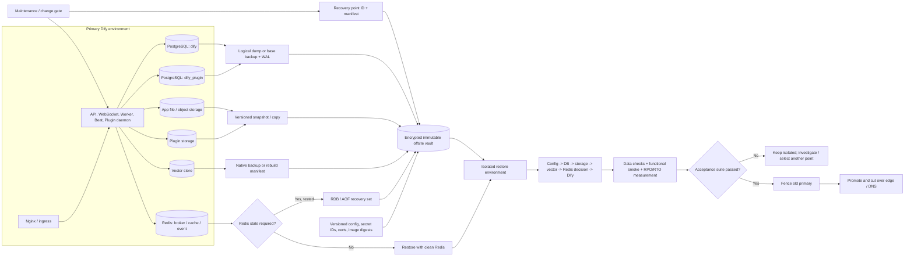

# 15. Operations, backup, upgrade và DR

> **Version áp dụng:** Dify Community Edition `1.15.0`, commit `3aa26fb6374bbd47e5469f7d7cc25f3e0075a60c`  
> **Ngày kiểm chứng:** `2026-07-16`  
> **Trạng thái xác minh:** `Official-source verified` + `Config validated` + `Design reviewed` qua cross-review nội bộ; specialist review, mọi phép đo, restore drill, upgrade rehearsal và DR/failover đều `RUNTIME-PENDING`
>
> **Reviewer:** Service owner, Platform/SRE, DBA, Security và application owner chưa sign-off

## Mục tiêu

Chương này biến topology của Dify thành một mô hình vận hành có owner, recovery point và tiêu chí nghiệm thu rõ ràng. Sau khi hoàn tất các gate, đội vận hành phải có khả năng:

1. theo dõi sức khỏe end-to-end thay vì chỉ nhìn trạng thái container;
2. xác định và bảo vệ toàn bộ state cần để phục hồi Dify;
3. tạo một recovery point nhất quán giữa PostgreSQL, file/object storage, vector store, plugin state và Redis khi Redis được quyết định là dữ liệu cần giữ;
4. phục hồi trên môi trường cô lập, đo RPO/RTO thực tế và chứng minh dữ liệu/app hoạt động;
5. nâng cấp Dify có kiểm soát, chạy database migration đúng một lần theo kế hoạch và rollback bằng recovery point khi schema hoặc state đã thay đổi;
6. điều phối incident, failover và failback mà không tạo split-brain hoặc ghi đồng thời vào hai primary;
7. lưu evidence đủ để một reviewer độc lập tái dựng quyết định và kết quả.

Nguyên tắc xuyên suốt là **restore-first**: một backup chưa được restore và kiểm tra không được tính là năng lực phục hồi đã chứng minh. Chương không mặc định một con số RPO/RTO cho mọi tổ chức; business owner phải phê duyệt mục tiêu, còn SRE phải đo kết quả bằng drill.

## Phạm vi và giả định

### Baseline và ranh giới

- Baseline chính là Docker Compose của Dify Community `1.15.0`: PostgreSQL `15`, Redis `6`, Weaviate `1.27.0`, local app storage và local plugin storage. [S-001][S-005][S-006]
- Các nguyên tắc recovery point, migration gate, evidence và DR áp dụng được cho managed service hoặc Kubernetes, nhưng lệnh cụ thể trong chương là ví dụ cho Compose. Runbook của nền tảng đích phải thay thế tên service, snapshot API và cơ chế fencing tương ứng.
- Chương bao phủ application operation, monitoring/SLO, capacity, backup/restore, upgrade/rollback, incident response và disaster recovery. Nó không cung cấp HA artifact cho Community Edition, không cam kết zero downtime và không thay thế runbook của PostgreSQL, object store hay vector database được chọn.
- Model provider, tool, SMTP và data source ngoài là dependency. Mất một provider có thể là incident chức năng nhưng không mặc nhiên yêu cầu failover toàn bộ Dify.
- Docker daemon trong lab hiện chưa chạy; chưa có backup artifact, timing, metric, restore output, migration rehearsal hay failure-injection evidence. Mọi bước runtime trong chương là `RUNTIME-PENDING`.

### Quy ước trạng thái bằng chứng

| Nhãn | Ý nghĩa trong chương | Có được dùng để tuyên bố production-ready? |
|---|---|---|
| `Official-source verified` | Claim được đối chiếu release note, tài liệu hoặc source chính thức tại version đã pin. | Không, nếu claim còn phụ thuộc môi trường chạy. |
| `Config validated` | Service, mount, biến hoặc entrypoint được đối chiếu manifest/source `1.15.0`. | Không, config tồn tại không chứng minh runtime thành công. |
| `Design reviewed` | Đây là control/runbook đề xuất dựa trên dependency semantics và failure model. | Chỉ sau khi owner phê duyệt và test. |
| `RUNTIME-PENDING` | Chưa chạy hoặc chưa thu evidence trong môi trường đại diện. | Không. |
| `RUNTIME-VALIDATED` | Test có timestamp, version, artifact và expected/actual result đã được reviewer duyệt. | Có, trong đúng phạm vi môi trường và thời hạn hiệu lực của evidence. |

### Ownership và RACI tối thiểu

`A` là người chịu trách nhiệm cuối cùng, `R` là người thực hiện, `C` là người phải được tham vấn và `I` là người được thông báo. Một người có thể giữ nhiều vai trò trong đội nhỏ, nhưng không được bỏ trống ô `A`.

| Hoạt động | Service owner | Platform/SRE | DBA | Storage/vector owner | Security | Application/data owner | Incident commander |
|---|---:|---:|---:|---:|---:|---:|---:|
| Chốt SLO, RPO, RTO và maintenance policy | A | R | C | C | C | C | I |
| Vận hành dashboard, alert và on-call | A | R | C | C | C | I | I |
| Backup PostgreSQL và kiểm tra PITR/dump | C | R | A/R | I | C | I | I |
| Backup object/file, plugin và vector state | C | R | C | A/R | C | I | I |
| Quản lý secret, key, certificate và quyền backup | C | R | C | C | A/R | I | I |
| Restore drill và xác nhận dữ liệu nghiệp vụ | A | R | R | R | C | A/R | I |
| Upgrade, migration và rollback decision | A | R | R | C | C | C | I |
| Điều phối SEV-1/DR, fencing và truyền thông | I | R | R | R | C | C | A |
| Failback và post-incident review | A | R | C | C | C | C | R |

Trước go-live phải thay tên vai trò bằng team, on-call alias và escalation contact thật. Ticket không có service owner hoặc incident commander dự phòng là release blocker.

### Bảng RPO/RTO cần phê duyệt

Các ký hiệu `RPO_*` và `RTO_*` là trường bắt buộc trong service record, không phải giá trị mặc định. `RPO_service` phải không nhỏ hơn RPO tệ nhất của thành phần không thể rebuild; `RTO_service` phải bao gồm provision, restore, migration/validation, DNS/edge cutover và thời gian ra quyết định.

| Phạm vi phục hồi | Source of truth/chiến lược | Mục tiêu phải điền | Cách đo trong drill | Owner chấp thuận | Trạng thái |
|---|---|---|---|---|---|
| PostgreSQL main DB | Dump theo lịch hoặc base backup + WAL/PITR | `RPO_DB`, `RTO_DB` | Chênh lệch giữa thời điểm sự cố giả lập và bản ghi cuối có thể chứng minh; thời gian restore + DB checks | DBA + service owner | Chưa chốt |
| PostgreSQL plugin DB | Cùng recovery point với main DB | `RPO_PLUGIN_DB <= RPO_service`; `RTO_PLUGIN_DB` | Plugin metadata/version trước và sau restore | DBA + app owner | Chưa chốt |
| App file/object storage | Versioned snapshot/copy gắn `recovery_point_id` | `RPO_STORAGE`, `RTO_STORAGE` | File canary, object version, checksum và download test | Storage owner | Chưa chốt |
| Plugin storage | Snapshot/copy cùng recovery point | `RPO_PLUGIN_STORAGE`, `RTO_PLUGIN_STORAGE` | Plugin inventory, package/hash và invocation smoke | Platform + app owner | Chưa chốt |
| Vector store | Native backup/snapshot hoặc rebuild được chứng minh | `RPO_VECTOR`, `RTO_VECTOR` hoặc `RTO_REINDEX` | Collection/object count, retrieval golden set và thời gian rebuild/restore | Data/vector owner | Chưa chốt |
| Redis | Mặc định phục hồi sạch và reconcile queue/cache; chỉ restore khi có quyết định riêng | `RTO_QUEUE`; đặt `RPO_REDIS` nếu Redis state được coi là durable | Queue replay/duplicate/lost-task test, cache warm-up và stream test | Platform + app owner | Chưa chốt |
| Config, secret, signing key, TLS | Versioned secret/config store; không lưu plaintext trong evidence | `RPO_CONFIG`, `RTO_CONFIG` | Restore đúng secret version, login/session/signed-URL và TLS test | Security + Platform | Chưa chốt |
| Toàn dịch vụ | Recovery của chuỗi critical path | `RPO_service`, `RTO_service` | Từ lúc tuyên bố disaster đến khi full acceptance suite đạt | Service owner | Chưa chốt |

Nếu business chưa phê duyệt mục tiêu, trạng thái phải là “chưa có recovery commitment”, không được thay bằng số do đội kỹ thuật tự suy đoán.

## Cơ chế hoạt động

### State inventory của baseline `1.15.0`

| State/dependency | Baseline Compose | Vai trò phục hồi | Xử lý backup |
|---|---|---|---|
| Main PostgreSQL database | `db_postgres`, mặc định database `dify`, bind mount `./volumes/db/data` | App/workspace, workflow, conversation, knowledge metadata và operational state | Critical. Backup logical hoặc physical/PITR; kiểm tra cả role/global object. |
| Plugin PostgreSQL database | Mặc định logical DB `dify_plugin` trên PostgreSQL | Metadata và lifecycle của plugin | Critical khi dùng plugin/model provider; phải cùng recovery point logic với main DB. |
| App storage | API và worker cùng mount `./volumes/app/storage:/app/api/storage` | Uploaded/generated file và material do storage backend lưu | Critical khi dùng local storage; với object store ngoài phải backup bucket/version tương ứng. [S-005] |
| Plugin storage | `./volumes/plugin_daemon:/app/storage` | Package, working state và asset của plugin daemon | Critical; restore phải khớp plugin DB/inventory. [S-005] |
| Vector store | Weaviate mặc định ở `./volumes/weaviate` hoặc backend đã cấu hình | Embedding/index phục vụ retrieval | Backup native/snapshot hoặc có reindex plan đã đo. Đổi `VECTOR_STORE` không tự migrate index hiện có. [S-056] |
| Redis | `./volumes/redis/data:/data` | Celery broker/backend, cache và một số event/coordination state | Không được restore mù. Quyết định clean start hay RDB/AOF phải qua duplicate/replay test. [S-011][S-039] |
| Config và secret | `docker/.env`, optional `envs/**/*.env`, external secret store | Endpoint, credential, signing/encryption material và behavior | Versioned, encrypted, access-controlled; evidence chỉ lưu key name và secret version ID. |
| TLS/edge config | Nginx/certificate path hoặc edge ngoài | Public hostname, trust chain và cutover | Backup private key theo policy hoặc tái cấp có RTO đã đo; theo dõi expiry. |
| Sandbox/SSRF config | Bind-mounted config/dependencies theo Compose | Code execution và outbound control | Backup customization có chủ đích; không coi cache/package tạm là source of truth nếu tái dựng được. |
| App DSL | Export thủ công qua Dify | Hữu ích cho diff/review app configuration | Không phải full backup: không gồm knowledge data, usage log hoặc API key. [S-045] |
| Log/trace/evidence | App log, infrastructure log và external observability | Điều tra incident, audit và xác nhận restore | Retention riêng, redaction và immutable evidence; log Dify có thể chứa toàn bộ hội thoại. [S-073] |

Inventory phải được sinh từ cấu hình hiệu lực của từng môi trường. Nếu dùng external PostgreSQL, Redis, vector hoặc object storage, đường dẫn Compose không còn là nguồn backup; record phải chứa resource ID, region, account/project và native snapshot policy của dịch vụ đó.

### Recovery point nhất quán

`pg_dump` tạo dump nhất quán cho **một database** ngay cả khi database có concurrent access, nhưng mỗi lần chạy chỉ xử lý một database. Nó không tạo transaction chung với object storage, plugin storage hoặc vector store. [S-096] Vì vậy, một “full Dify backup” cần một trong hai mô hình:

1. **Application-consistent recovery point:** chặn write mới, dừng scheduler, drain hoặc dừng worker, xác nhận không còn writer, sau đó backup từng dependency và gắn cùng `recovery_point_id`.
2. **Crash-consistent/provider-coordinated snapshot:** dùng snapshot atomic/coordinated của hạ tầng đã được chứng minh bao phủ tất cả volume liên quan. Không giả định snapshot nhiều dịch vụ độc lập là atomic nếu nhà cung cấp không cam kết.

Nguồn Dify được khảo sát chưa cung cấp quiesce API chính thức hoặc transaction phân tán cho PostgreSQL + storage + vector. Maintenance gate và drain/stop writer trong chương là `Design reviewed`, phải được diễn tập. Nếu không thể quiesce, manifest phải ghi rõ các timestamp lệch nhau và restore test phải chứng minh cơ chế reconcile.

### Vai trò của từng loại backup PostgreSQL

- `pg_dump`/`pg_restore` phù hợp cho logical portability và kiểm tra object-level; custom format `-Fc` hỗ trợ restore linh hoạt. `pg_dump` chỉ dump một database, nên main DB, plugin DB và global role/object phải được inventory riêng. [S-096][S-097]
- Physical/base backup nhanh hơn cho database lớn nhưng gắn chặt hơn với major version và cấu hình. PostgreSQL cung cấp `pg_basebackup` để lấy base backup từ cluster đang chạy. [S-099]
- Base backup kết hợp WAL archive cho phép point-in-time recovery đến một recovery target. Retention WAL phải phủ từ base backup còn dùng được đến target; mất một WAL segment có thể phá chuỗi phục hồi. [S-098]
- Chỉ sao chép `./volumes/db/data` khi PostgreSQL đang chạy không được coi là backup hợp lệ, trừ khi đó là snapshot filesystem/storage có semantics nhất quán được nhà cung cấp bảo đảm và đã restore-test.

### Vector store là state có thể backup hoặc rebuild, nhưng phải chọn trước

Dify lưu cấu trúc index/backend cho dataset hiện có; đổi biến `VECTOR_STORE` không chứng minh index đã được migrate. [S-056] Có hai chiến lược hợp lệ:

- **Restore native snapshot/backup:** nhanh hơn khi index lớn, nhưng yêu cầu module/backend, credential, version compatibility và restore API của vector engine đã được test.
- **Rebuild từ source:** giảm phụ thuộc backup vector nếu tài liệu gốc, metadata, embedding model/plugin, credential và chunking config đều còn. RTO phải tính quota/cost model, queue capacity và thời gian reindex toàn bộ golden dataset.

Tài liệu Weaviate hiện hành có create/status/restore API cho backup backend, nhưng baseline Dify dùng Weaviate `1.27.0`; snippet hiện hành và tính năng mới hơn không được mặc nhiên coi là tương thích. Module backup, backend, quyền, API và restore trên đúng `1.27.0` đều `RUNTIME-PENDING`. [S-101]

### Redis không mặc nhiên là bản sao dữ liệu cần phục hồi

Redis trong Dify nằm trên đường Celery broker/backend, cache và một số event/stream. [S-011][S-039] Redis hỗ trợ RDB snapshot và AOF với trade-off mất dữ liệu/hiệu năng khác nhau. [S-100] Tuy nhiên, restore một queue cũ có thể phát lại task đã hoàn tất hoặc làm xuất hiện trạng thái không còn khớp PostgreSQL/storage.

Baseline an toàn về mặt vận hành là:

1. coi PostgreSQL + storage + vector/plugin state là recovery set chính;
2. khởi động Redis sạch trong restore/DR;
3. reconcile task đang chạy/dở từ source of truth và enqueue lại có kiểm soát;
4. chỉ restore RDB/AOF nếu application owner đã xác định key class cần giữ và test được duplicate, stale result, stream reconnect và task replay.

Đây là quyết định thiết kế, không phải bảo đảm exactly-once của Dify. Quy tắc retry/idempotency theo từng workflow/tool ngoài vẫn cần kiểm tra.

### SLI/SLO và alerting

SLO phải đo trải nghiệm hữu ích, không chỉ process uptime. Bộ SLI tối thiểu:

| Lớp | SLI/metric cần có | Alert/gate |
|---|---|---|
| Edge/API | Tỷ lệ synthetic login/API thành công, HTTP 5xx, latency và time-to-first-byte | Multi-window burn-rate theo SLO; route/health chỉ là tín hiệu phụ. |
| Workflow/model | Tỷ lệ run thành công, latency/TTFT, provider error/rate limit và token/cost | Alert khi vượt error budget hoặc provider làm critical app mất chức năng. |
| Worker/queue | Consumer functional ping, queue depth/age, task failure/retry và scheduled-task freshness | Worker healthcheck bị tắt mặc định; phải có queued synthetic job. [S-005][S-006] |
| Knowledge/vector | Ingest success/age, indexing duration, retrieval latency và golden-query correctness | Alert khi backlog vượt recovery window hoặc retrieval regression. |
| PostgreSQL | Availability, connection saturation, transaction/error, replication/WAL lag nếu có, storage/IO | Alert theo headroom và RPO: WAL/archive failure là recovery incident. |
| Redis | Connectivity, memory/eviction, persistence error nếu bật, queue/event health | Không coi `PING` là đủ cho Celery/stream. |
| Storage | Error/latency, capacity/inode, object version/snapshot status | Forecast exhaustion trước lead time mở rộng và trước backup window. |
| Plugin/provider | Plugin daemon request success, package/storage health, model invocation synthetic | Daemon nằm trên critical path của LLM/embedding/rerank. |
| Backup/DR | Backup age, artifact checksum, replication/offsite age, restore-drill age, observed RPO/RTO | Backup quá recovery policy hoặc drill hết hiệu lực là page/ticket theo severity. |
| Security | Auth anomaly, secret/cert expiry, unexpected egress, backup access và image/CVE status | Route theo incident policy, không đổ secret vào alert payload. |

Mỗi SLI record phải có query, source, window, numerator/denominator, exclusion cho maintenance, owner và cách xử lý missing data. Dashboard không có alert route/on-call hoặc alert không có runbook không được tính là operational control.

### Capacity loop

Capacity planning dùng tốc độ tăng và headroom thay vì một ngưỡng user count chung:

1. ghi baseline request/run rate, concurrency, token throughput, queue age, document ingest, vector count, DB/storage/Redis growth, provider quota và backup duration;
2. forecast tới ngày mở rộng tiếp theo, cộng lead time cấp resource và thời gian restore;
3. load test workload đại diện, gồm streaming, workflow dài, indexing và plugin/model call;
4. kiểm tra contention giữa API, worker, PostgreSQL, Redis, vector và backup IO;
5. chỉ tăng worker concurrency sau khi đo DB connection, Redis, vector/model quota và idempotency downstream;
6. đặt capacity gate cho disk/inode, DB connection, queue age, memory/eviction, WAL/archive, object quota và certificate/secret lifecycle;
7. lặp lại sau mỗi thay đổi model, chunking/index strategy, retention hoặc major traffic shift.

Compose gom nhiều dependency trên một host, nên CPU/RAM/IO headroom không loại bỏ single-host failure domain. Capacity pass không đồng nghĩa HA/DR pass.

## Kiến trúc/luồng dữ liệu

### D14 — Backup, restore và disaster-recovery flow



Mũi tên vào vault thể hiện cùng một manifest/recovery set, không khẳng định các backup engine tự tạo transaction phân tán. `recovery_point_id`, write-freeze interval và từng snapshot/object version là bằng chứng liên kết các artifact. Fencing phải xảy ra trước khi target mới nhận write để tránh split-brain.

Node `Writers` là **nhóm quiesce tổng hợp cho backup**, không phải connectivity map, IAM matrix hoặc NetworkPolicy. Nó không khẳng định mọi thành phần truy cập mọi store: Beat chủ yếu đi Redis; plugin daemon dùng plugin DB/storage và Dify inner API; API/worker có các state path riêng. ACL và network rule phải lấy từ các cạnh chi tiết ở Chương 02/12, còn Runbook 2 phải dừng đúng writer thực tế từ rendered topology của môi trường.

## Hướng dẫn hoặc ví dụ triển khai

### Runbook 0 — Change record và điều kiện bắt đầu

Mọi backup drill, restore, upgrade hoặc DR exercise phải có một record tối thiểu:

```yaml
operation_id: OP-YYYYMMDD-NNN
environment: production
dify_version: 1.15.0
source_commit: 3aa26fb6374bbd47e5469f7d7cc25f3e0075a60c
image_digests: []
recovery_point_id: RP-YYYYMMDDThhmmssZ
change_or_incident_id: CHG-or-INC-ID
approved_rpo: RPO_service
approved_rto: RTO_service
writer_freeze_start_utc: null
writer_freeze_end_utc: null
backup_artifacts: []
secret_version_ids: []
operator: TEAM_OR_ROLE
reviewer: TEAM_OR_ROLE
status: RUNTIME-PENDING
```

Không lưu secret value, signed URL dài hạn hoặc private key trong record. Điều kiện bắt đầu:

- owner/on-call và rollback authority đã xác định;
- target RPO/RTO, maintenance window và communication channel đã được duyệt;
- đủ dung lượng ở nguồn, backup target và restore target;
- backup key/service account còn hiệu lực nhưng không dùng chung với runtime credential;
- release artifact, image digest, Compose/overlay và config version đã pin;
- restore target tách network/hostname/credential để không gửi mail, webhook, scheduled job hoặc request thật;
- không có incident khác làm thay đổi state hoặc invalidate recovery point.

### Runbook 1 — Vận hành theo ca và monitoring

Theo mỗi ca hoặc chu kỳ on-call:

1. kiểm tra SLO/error budget, active alert và thay đổi đang diễn ra;
2. chạy synthetic edge/API, một workflow/model test giới hạn, một queued worker task và một retrieval golden query;
3. kiểm tra queue depth/oldest age, scheduled-task freshness và retry storm;
4. kiểm tra PostgreSQL connection/storage/WAL archive, Redis memory/eviction, vector health, object/file capacity và backup freshness;
5. kiểm tra plugin daemon, model provider quota/rate limit, certificate và secret expiry;
6. đối chiếu backup job thành công với checksum/replication; không chỉ nhìn exit code scheduler;
7. mở capacity ticket nếu forecast chạm exhaustion trước thời gian cấp resource + một restore window;
8. ghi exception, owner và deadline. Alert bị silence phải có expiry và change/incident ID.

Hàng tuần hoặc theo policy: review restore-drill age, failed backup trend, image/security advisory và config drift. Hàng tháng hoặc sau thay đổi lớn: review growth, cost/quota, SLO và capacity model. Tần suất thật phải được service owner phê duyệt.

### Runbook 2 — Tạo application-consistent backup cho Compose

Các lệnh dưới là template cho một host Linux/WSL, chạy từ thư mục `docker`. Chúng chưa được chạy trong lab này.

#### Bước A — Inventory và gắn recovery point

```bash
umask 077
export RPID="RP-$(date -u +%Y%m%dT%H%M%SZ)"
export BACKUP_ROOT="/secure-backup/${RPID}"
mkdir -p "${BACKUP_ROOT}"
docker compose ps -a
docker compose config --services
docker compose config --images
```

Lưu image digest, Git commit, key name của config, secret **version ID**, DB list, storage/vector backend và object/bucket/resource ID. Không lưu output `docker compose config` đã resolve nếu nó chứa secret.

#### Bước A1 — Chốt recovery set cho config, secret, certificate và customization

Recovery set phải chứa artifact đã mã hóa hoặc immutable reference có thể phục hồi cho toàn bộ cấu hình hiệu lực, không chỉ danh sách key:

- `docker/.env`, các file `envs/**/*.env` đang dùng và mọi Compose/Kubernetes overlay: lưu trong encrypted configuration backup hoặc tham chiếu commit/artifact bất biến kèm checksum;
- secret/signing/encryption key: lưu secret-store resource ID, version ID, owner và recovery path; nếu secret store không nằm ngoài failure domain của dịch vụ, phải có encrypted export/replication theo policy hoặc quy trình tái cấp đã đo trong RTO;
- edge/DNS/TLS: lưu resource ID/version của route, WAF/LB policy, certificate chain và private-key recovery hoặc re-issuance procedure; evidence chỉ giữ fingerprint, không giữ private key;
- sandbox/SSRF/plugin customization: lưu đúng file/config/package manifest, source artifact và checksum; loại cache tái dựng được khỏi source of truth;
- với mỗi reference, ghi access-test timestamp, break-glass principal, retention/failure domain và restore-test ID.

Trước khi chặn writer, operator phải kiểm tra artifact/reference tồn tại, checksum/fingerprint khớp và recovery principal thực sự đọc/decrypt được trong môi trường cô lập. Một version ID không còn truy cập được không phải backup; bước này fail thì dừng runbook.

#### Bước B — Chặn write và dừng producer

1. đặt edge vào maintenance/read-only policy đã test; xác nhận request ghi mới bị từ chối;
2. dừng `worker_beat` trước để không phát task mới;
3. ghi queue depth và đợi task có thể hoàn tất trong window; với task không drain được, ghi task ID và quyết định cancel/replay;
4. dừng API, WebSocket, web, worker và plugin daemon — các thành phần có thể ghi vào state;
5. xác nhận không còn process/application credential nào ghi trực tiếp vào PostgreSQL, storage hoặc vector;
6. ghi `writer_freeze_start_utc` và canary/state count.

Ví dụ service names của baseline:

```bash
docker compose stop worker_beat
docker compose stop api api_websocket web worker plugin_daemon
docker compose ps -a
```

Tên service hiệu lực phải lấy từ `docker compose config --services`; không chạy mù nếu môi trường đã tách worker/queue hoặc dùng overlay.

#### Bước C — Backup PostgreSQL

`DB_ADMIN_USER`, `MAIN_DB` và `PLUGIN_DB` dưới đây là default minh họa; phải lấy từ inventory đã review, không hard-code password vào command history.

```bash
set -euo pipefail
: "${BACKUP_ROOT:?run Bước A và đặt BACKUP_ROOT trước}"
test -d "${BACKUP_ROOT}"

export DB_ADMIN_USER="postgres"
export MAIN_DB="dify"
export PLUGIN_DB="dify_plugin"

test ! -e "${BACKUP_ROOT}/postgres-globals.sql"
test ! -e "${BACKUP_ROOT}/${MAIN_DB}.dump"
test ! -e "${BACKUP_ROOT}/${PLUGIN_DB}.dump"

docker compose exec -T db_postgres \
  pg_dumpall -U "${DB_ADMIN_USER}" --globals-only \
  > "${BACKUP_ROOT}/postgres-globals.sql.part"
test -s "${BACKUP_ROOT}/postgres-globals.sql.part"
mv "${BACKUP_ROOT}/postgres-globals.sql.part" \
  "${BACKUP_ROOT}/postgres-globals.sql"

docker compose exec -T db_postgres \
  pg_dump -U "${DB_ADMIN_USER}" -Fc -d "${MAIN_DB}" \
  > "${BACKUP_ROOT}/${MAIN_DB}.dump.part"
test -s "${BACKUP_ROOT}/${MAIN_DB}.dump.part"
mv "${BACKUP_ROOT}/${MAIN_DB}.dump.part" \
  "${BACKUP_ROOT}/${MAIN_DB}.dump"

docker compose exec -T db_postgres \
  pg_dump -U "${DB_ADMIN_USER}" -Fc -d "${PLUGIN_DB}" \
  > "${BACKUP_ROOT}/${PLUGIN_DB}.dump.part"
test -s "${BACKUP_ROOT}/${PLUGIN_DB}.dump.part"
mv "${BACKUP_ROOT}/${PLUGIN_DB}.dump.part" \
  "${BACKUP_ROOT}/${PLUGIN_DB}.dump"

docker compose exec -T db_postgres pg_restore --list \
  < "${BACKUP_ROOT}/${MAIN_DB}.dump" \
  > "${BACKUP_ROOT}/${MAIN_DB}.toc.txt.part"
test -s "${BACKUP_ROOT}/${MAIN_DB}.toc.txt.part"
mv "${BACKUP_ROOT}/${MAIN_DB}.toc.txt.part" \
  "${BACKUP_ROOT}/${MAIN_DB}.toc.txt"

docker compose exec -T db_postgres pg_restore --list \
  < "${BACKUP_ROOT}/${PLUGIN_DB}.dump" \
  > "${BACKUP_ROOT}/${PLUGIN_DB}.toc.txt.part"
test -s "${BACKUP_ROOT}/${PLUGIN_DB}.toc.txt.part"
mv "${BACKUP_ROOT}/${PLUGIN_DB}.toc.txt.part" \
  "${BACKUP_ROOT}/${PLUGIN_DB}.toc.txt"
```

`set -euo pipefail` làm block dừng ở lỗi đầu tiên; artifact chỉ đổi từ `.part` sang tên final sau khi command thành công và file không rỗng. Nếu còn `.part`, thiếu một TOC hoặc warning chưa được phân loại, Bước G không được tạo/publish `SHA256SUMS`. Kiểm tra và ghi riêng exit code, warning trên stderr, database list và object count của **cả hai** TOC. `pg_dumpall --globals-only` bảo vệ role/tablespace-level metadata; không dùng nó thay cho hai database dump và coi file globals là artifact nhạy cảm cần mã hóa. [S-096]

Nếu RPO yêu cầu PITR, đây chỉ là lớp logical bổ sung. DBA phải vận hành base backup + WAL archive riêng, theo dõi archive failure, giữ đủ timeline/WAL và test recovery target. [S-098][S-099]

#### Bước D — Backup app/plugin storage và vector

Với local filesystem, chỉ archive sau khi writer đã dừng:

```bash
set -euo pipefail
: "${BACKUP_ROOT:?run Bước A và đặt BACKUP_ROOT trước}"
test -d "${BACKUP_ROOT}"
test ! -e "${BACKUP_ROOT}/app-storage.tgz"
test ! -e "${BACKUP_ROOT}/plugin-storage.tgz"

tar --numeric-owner -C . -czf \
  "${BACKUP_ROOT}/app-storage.tgz.part" volumes/app/storage
test -s "${BACKUP_ROOT}/app-storage.tgz.part"
mv "${BACKUP_ROOT}/app-storage.tgz.part" \
  "${BACKUP_ROOT}/app-storage.tgz"

tar --numeric-owner -C . -czf \
  "${BACKUP_ROOT}/plugin-storage.tgz.part" volumes/plugin_daemon
test -s "${BACKUP_ROOT}/plugin-storage.tgz.part"
mv "${BACKUP_ROOT}/plugin-storage.tgz.part" \
  "${BACKUP_ROOT}/plugin-storage.tgz"
```

Lưu file count, total bytes, ownership mode và checksum. Nếu dùng object storage ngoài:

- tạo versioned snapshot/copy bằng API chính thức của provider;
- ghi bucket/container, region, snapshot/version ID, encryption key ID và completion timestamp;
- xác nhận delete marker/version retention và cross-region/offsite replication theo policy;
- không dùng lệnh sync một chiều có khả năng xóa đích nếu chưa có approval và dry-run.

Với Weaviate/vector backend, chọn một nhánh:

- chạy native backup, chờ status `SUCCESS`, lưu backup ID/backend/version rồi restore-test; hoặc
- dừng vector service và tạo cold snapshot/archive của data path theo hướng dẫn engine/storage; hoặc
- ghi rebuild manifest gồm source document, chunk/index config, embedding model/plugin version và golden query.

Không tar/copy live vector data directory rồi gọi đó là backup hợp lệ. Với Weaviate `1.27.0`, module/API native backup phải được xác minh trên đúng image trước khi production hóa. [S-101]

#### Bước E — Quyết định Redis

Nếu policy chọn **clean Redis**, manifest ghi `redis_restore_strategy: clean-and-reconcile`; không đưa RDB/AOF vào recovery set. Nếu policy bắt buộc giữ Redis:

1. xác định key class và lý do business;
2. chặn mọi writer, tạo RDB hoặc checkpoint AOF theo Redis runbook;
3. đợi persistence thành công rồi mới copy artifact hoặc snapshot volume;
4. lưu Redis version/config/checksum;
5. test stale key, duplicate task, result backend, stream reconnect và queue replay trước khi chấp nhận. [S-100]

Một bind mount `./volumes/redis/data` tồn tại trong Compose không tự chứng minh RDB/AOF policy đáp ứng RPO.

#### Bước F — Cold snapshot toàn host nếu được chọn

Release note Dify hướng dẫn dừng Compose và backup `volumes` trước upgrade. [S-001] Khi dùng cold snapshot làm lớp bổ sung, dừng cả stateful dependency trước khi archive/snapshot; không xóa volume:

```bash
set -euo pipefail
: "${BACKUP_ROOT:?run Bước A và đặt BACKUP_ROOT trước}"
test -d "${BACKUP_ROOT}"
test ! -e "${BACKUP_ROOT}/compose-volumes-cold.tgz"

docker compose stop db_postgres redis weaviate
tar --numeric-owner -C . -czf \
  "${BACKUP_ROOT}/compose-volumes-cold.tgz.part" volumes
test -s "${BACKUP_ROOT}/compose-volumes-cold.tgz.part"
mv "${BACKUP_ROOT}/compose-volumes-cold.tgz.part" \
  "${BACKUP_ROOT}/compose-volumes-cold.tgz"
```

Cold archive không thay thế logical DB backup, native vector/object backup hoặc restore drill. Nếu môi trường dùng backend ngoài Compose, archive `volumes` không bao phủ chúng.

#### Bước G — Integrity, encryption, replication và reopen

Trước block dưới, xuất manifest đã redacted thành `${BACKUP_ROOT}/recovery-manifest.yaml`; manifest phải liệt kê config/secret/certificate reference, remote object/vector/Redis snapshot ID hoặc rebuild strategy, artifact bắt buộc và completion status. Không đặt secret value hoặc private key vào manifest.

```bash
set -euo pipefail
: "${BACKUP_ROOT:?run Bước A và đặt BACKUP_ROOT trước}"
: "${MAIN_DB:?đặt tên main database từ inventory}"
: "${PLUGIN_DB:?đặt tên plugin database từ inventory}"

test -d "${BACKUP_ROOT}"
test -z "$(find "${BACKUP_ROOT}" -maxdepth 1 -type f -name '*.part' -print -quit)"
test ! -e "${BACKUP_ROOT}/SHA256SUMS"
test ! -e "${BACKUP_ROOT}/SHA256SUMS.part"

for required in \
  recovery-manifest.yaml \
  postgres-globals.sql \
  "${MAIN_DB}.dump" \
  "${MAIN_DB}.toc.txt" \
  "${PLUGIN_DB}.dump" \
  "${PLUGIN_DB}.toc.txt" \
  app-storage.tgz \
  plugin-storage.tgz
do
  test -s "${BACKUP_ROOT}/${required}"
done

(
  cd "${BACKUP_ROOT}"
  find . -maxdepth 1 -type f \
    ! -name '*.part' \
    ! -name 'SHA256SUMS' \
    ! -name 'SHA256SUMS.part' \
    -print0 \
    | sort -z \
    | xargs -0 -r sha256sum
) > "${BACKUP_ROOT}/SHA256SUMS.part"

test -s "${BACKUP_ROOT}/SHA256SUMS.part"
mv "${BACKUP_ROOT}/SHA256SUMS.part" "${BACKUP_ROOT}/SHA256SUMS"
```

Block chỉ checksum regular file final, loại chính checksum và mọi `.part`; nếu thiếu artifact bắt buộc hoặc có file dở, nó fail trước khi publish. Artifact tùy chọn/remote không nằm trong danh sách local bắt buộc phải có ID, checksum/status và recovery instruction trong manifest. Cú pháp này dành cho Bash trên host Linux/WSL và vẫn `RUNTIME-PENDING`.

Sau đó:

1. mã hóa artifact bằng backup key được quản lý riêng; ký manifest nếu policy yêu cầu;
2. replicate sang failure domain khác và áp retention/immutability;
3. kiểm tra checksum ở đích, khả năng decrypt bằng break-glass path và quyền least privilege;
4. khởi động stateful dependency đã dừng, rồi core service theo dependency order;
5. bỏ maintenance sau khi health, queued task, workflow và retrieval smoke đạt;
6. ghi `writer_freeze_end_utc`, backup end time, size, checksum, warning và operator/reviewer;
7. lên lịch restore drill cho recovery set này.

Backup job chỉ đạt khi artifact, checksum, encryption, replication và catalog manifest đều thành công. Restore capability chỉ đạt sau Runbook 3.

### Runbook 3 — Restore drill trên môi trường cô lập

#### Chuẩn bị

1. chọn ngẫu nhiên hoặc theo policy một `recovery_point_id`, không chỉ chọn bản mới nhất;
2. xác minh chữ ký/checksum, quyền decrypt và mọi artifact có cùng recovery set;
3. provision network/account tách biệt; chặn email, webhook, trigger, schedule và provider credential production;
4. pin đúng source commit, image digest, PostgreSQL/Redis/vector major/minor và config version của backup;
5. ghi `T_declare`, target RPO/RTO và acceptance owner;
6. không khởi động Dify image mới hơn vào database cũ trước khi migration decision được duyệt.

#### Thứ tự restore

1. **Config/secrets/certificate:** restore secret version và config mapping, không in value; xác nhận hostname/endpoint của drill không trỏ production.
2. **PostgreSQL globals + databases:** restore vào cluster sạch, fail fast khi có SQL error.
3. **App/plugin storage:** restore đúng owner/mode/path hoặc object version.
4. **Vector:** restore snapshot tương ứng hoặc chạy rebuild đã định nghĩa.
5. **Redis:** khởi tạo sạch mặc định; chỉ restore RDB/AOF theo decision record.
6. **Dify:** start dependency trước, sau đó một API/migration gate có kiểm soát, rồi web, worker, beat, WebSocket và plugin daemon.
7. **Edge:** chỉ mở vào internal test endpoint; chưa thay DNS/production route.

Không chạy nguyên trạng `postgres-globals.sql` vào một cluster đã bootstrap: file có thể chứa role dựng sẵn như `postgres`, còn default Compose thường đã tạo database `dify`. Bỏ `ON_ERROR_STOP` để “đi tiếp” sẽ che lỗi ownership/ACL. Chọn đúng một trong hai procedure sau và lưu lựa chọn trong drill record.

**Procedure A — restore drill trên default Compose, không phá database bootstrap.** Điều kiện trước: Dify core chưa khởi động, target bị cô lập, hai database alternate dưới đây chưa tồn tại và `RESTORE_OWNER` là role DBA đã được phê duyệt. Globals được DBA review/mapping riêng; không feed file globals mù vào `psql`. Block dừng ngay nếu database đã tồn tại hoặc restore lỗi:

```bash
set -euo pipefail
: "${EXPECTED_DB_SYSTEM_ID:?lấy fingerprint từ drill/change record đã duyệt}"
export DB_ADMIN_USER="postgres"
export RESTORE_OWNER="postgres"
export MAIN_RESTORE_DB="dify_restore"
export PLUGIN_RESTORE_DB="dify_plugin_restore"

ACTUAL_DB_SYSTEM_ID="$(docker compose exec -T db_postgres \
  psql -At -U "${DB_ADMIN_USER}" -d postgres \
  -c 'SELECT system_identifier FROM pg_control_system();' | tr -d '\r')"
test "${ACTUAL_DB_SYSTEM_ID}" = "${EXPECTED_DB_SYSTEM_ID}"

docker compose exec -T db_postgres \
  createdb -U "${DB_ADMIN_USER}" -O "${RESTORE_OWNER}" -T template0 "${MAIN_RESTORE_DB}"

docker compose exec -T db_postgres \
  pg_restore -U "${DB_ADMIN_USER}" --exit-on-error --no-owner \
  --role="${RESTORE_OWNER}" -d "${MAIN_RESTORE_DB}" \
  < "${BACKUP_ROOT}/dify.dump"

docker compose exec -T db_postgres \
  createdb -U "${DB_ADMIN_USER}" -O "${RESTORE_OWNER}" -T template0 "${PLUGIN_RESTORE_DB}"

docker compose exec -T db_postgres \
  pg_restore -U "${DB_ADMIN_USER}" --exit-on-error --no-owner \
  --role="${RESTORE_OWNER}" -d "${PLUGIN_RESTORE_DB}" \
  < "${BACKUP_ROOT}/dify_plugin.dump"
```

Assertion `system_identifier` buộc operator đối chiếu đúng cluster đã ghi trong drill/change record trước lệnh tạo database. `RESTORE_OWNER=postgres` chỉ là default lab; ngoài lab phải dùng role restore tối thiểu đã được DBA duyệt. Sau đó trỏ **cấu hình drill** tới hai database alternate và xác minh rendered mapping trong kênh bảo mật trước khi start Dify; không đổi target production. Nếu tên dump khác default, lấy chính xác từ manifest thay vì sửa command tùy hứng.

**Procedure B — DR target cần đúng tên production.** DBA phải provision cluster/role/database trước khi bất kỳ Dify container nào bootstrap; review `postgres-globals.sql`, loại hoặc map built-in/existing role và tablespace theo policy, rồi restore hai dump với owner mapping đã duyệt. Procedure này phụ thuộc operator/managed PostgreSQL nên không có block lệnh dùng chung. Mọi drop/recreate, owner remap và ACL replay cần change approval, pre-check target identity và rehearsal riêng.

Dump là input có thể thực thi code do source superuser kiểm soát, vì vậy chỉ restore artifact tin cậy trong môi trường cô lập. Cả hai procedure đều giữ `--exit-on-error`; chưa procedure nào được chạy trong lab này. [S-096][S-097]

#### Acceptance suite

- PostgreSQL: schema migration head/version đúng kỳ vọng; critical table/object count, referential check và canary row đúng.
- Storage: file/object canary tải được, checksum/MIME/permission đúng; signed URL hoạt động theo policy.
- Auth/config: admin/test user login; session/key behavior và TLS chain đúng; không dùng nhầm production secret/hostname.
- App/workflow: app list và DSL/config xuất hiện; chạy blocking và streaming workflow golden case.
- Worker: enqueue một task, consumer nhận và hoàn tất; không chỉ kiểm tra container `running`.
- Knowledge/vector: document/index count hợp lý; golden retrieval đạt expected document/top-k threshold đã định nghĩa.
- Plugin/model: plugin inventory khớp, daemon khỏe, một provider/plugin test được gọi bằng credential sandbox.
- Redis: không có unexpected replay; task dở được reconcile; cache/stream tự phục hồi.
- Negative test: trigger, mail, webhook và external side effect production bị chặn.
- Evidence: log đã redacted, command/result, snapshot ID, checksum, screenshot/query result và reviewer sign-off.

Ghi `T_ready` khi **toàn bộ** acceptance suite bắt buộc đạt. `RTO_observed = T_ready - T_declare`. Với canary có timestamp/sequence, đo dữ liệu mới nhất còn hiện diện và tính `RPO_observed` so với thời điểm sự cố giả lập. Kết quả vượt target là failed drill dù service cuối cùng khởi động được.

Không dùng drill environment làm production standby nếu nó đã nhận side effect hoặc không có fencing. Sau drill, revoke credential tạm, xóa dữ liệu đúng policy và giữ evidence không chứa secret.

### Runbook 4 — Upgrade Dify và database migration

> **Version gate:** Procedure dưới đây chỉ dành cho target Dify `1.15.0`. Stable `1.16.0` xuất hiện sau ngày khóa baseline và có delta về Agent runtime, Compose/env, migration, OpenAI và MCP; không áp command hoặc giả định `1.15.0` cho upgrade `1.16.0` cho tới khi impact review/regression G-053 hoàn tất. Xem [Chương 00](../00-scope-version-and-assumptions.md). [S-121]

#### Preflight

1. đọc release note của **mọi version trung gian** và kiểm tra supported upgrade path;
2. pin target tag/commit/image digest; scan artifact và review mutable tag;
3. diff `.env.example`, `envs/**/*.env.example`, Compose/overlay, dependency image và database/vector compatibility;
4. inventory biến thêm/bỏ/đổi, secret mapping, plugin version và breaking behavior;
5. tạo recovery point nhất quán; restore thành công nó trên clone đại diện;
6. chạy upgrade rehearsal trên clone có dữ liệu và workload gần production;
7. đo migration duration, lock/space/WAL, app smoke và rollback duration;
8. duyệt maintenance, go/no-go metric, rollback deadline và communication.

Release `1.15.0` có database migration, thêm `19` biến, bỏ `2`, đổi `1`, thay đổi Compose và yêu cầu backfill plugin auto-upgrade. [S-001] Không chỉ pull image rồi giả định backward compatibility.

#### Controlled migration

Entrypoint API `1.15.0` chạy `flask upgrade-db` khi `MIGRATION_ENABLED=true`; `MODE=migration` chạy migration rồi thoát. [S-013] `docker compose run` chỉ tạo một container cho **một invocation**; hai pipeline vẫn có thể gọi đồng thời. Vì vậy production phải lấy environment-scoped atomic lock có owner/run ID, TTL/heartbeat, fencing token và audit trước khi chạm database:

1. lấy exclusive lock cho đúng environment; nếu lock bận hoặc stale chưa được xử lý theo runbook thì fail-safe;
2. xác nhận không có migration container/process hoặc promotion khác đang active;
3. chặn traffic/write, dừng beat và drain/dừng worker;
4. tạo/verify recovery point cuối;
5. start dependency cần thiết, giữ core service mới ở zero/not started;
6. chạy **một** migration job theo artifact/overlay đã rehearsal;
7. kiểm tra exit code, migration head, DB lock/storage/WAL và error;
8. chạy release-specific one-shot/backfill bằng target image khi core service vẫn chưa rollout;
9. chỉ sau đó start API/web/worker/plugin theo rollout plan;
10. chạy acceptance suite, theo dõi observation window và chỉ release lock sau promote/rollback handoff.

Lock backend là quyết định hạ tầng, nhưng file marker hoặc kiểm tra tên container không phải atomic lock. CI-10 ở Chương 16 phải khởi động hai deployment cạnh tranh và chứng minh chỉ một owner đi vào critical section.

Compose production dùng một overlay bất biến để tắt migration trên **mọi** long-lived service chạy Dify API image. Ví dụ artifact `compose.migration-disabled.yaml` phải được review cùng release:

```yaml
services:
  api:
    environment:
      MIGRATION_ENABLED: "false"
  api_websocket:
    environment:
      MIGRATION_ENABLED: "false"
  worker:
    environment:
      MIGRATION_ENABLED: "false"
  worker_beat:
    environment:
      MIGRATION_ENABLED: "false"
```

Nếu môi trường có worker/queue service bổ sung, tất cả service dùng cùng entrypoint phải có control tương đương. Pipeline phải parse rendered configuration trong scope bảo mật và fail nếu bất kỳ long-lived service nào thiếu giá trị `false`; không in resolved secret ra log.

Quy trình duy nhất được phép promote, vẫn cần rehearsal trước và chỉ được chạy khi pipeline đang giữ fencing token hợp lệ:

```bash
docker compose -f docker-compose.yaml -f compose.migration-disabled.yaml \
  run --rm -e MODE=migration -e MIGRATION_ENABLED=true api

docker compose -f docker-compose.yaml -f compose.migration-disabled.yaml \
  run --rm --no-deps --entrypoint flask -e MIGRATION_ENABLED=false \
  api backfill-plugin-auto-upgrade

docker compose -f docker-compose.yaml -f compose.migration-disabled.yaml up -d

docker compose -f docker-compose.yaml -f compose.migration-disabled.yaml ps -a
```

Block lệnh không tự lấy environment lock. CLI override chỉ bật migration cho migration one-shot; backfill one-shot cố ý override entrypoint thành Flask CLI nhưng vẫn dùng đúng target image/config, còn cùng overlay giữ migration tắt khi `up`. Dependency phải được start/health-check theo bước 5 trước khi dùng `--no-deps`; command và application context phải pass rehearsal trên artifact thật. Không được chạy `up` bằng file set khác sau one-shot. Cả lock/fencing, overlay, singleton assertion, migration, backfill và restart behavior đều `RUNTIME-PENDING`; không áp dụng lần đầu ở production.

#### Go/no-go sau upgrade

Go khi migration/backfill thành công, error/latency/queue không vượt gate, critical workflow/retrieval/plugin/auth đạt, dữ liệu canary đúng và không có security/config drift. No-go khi:

- migration/backfill lỗi hoặc duration/lock vượt window;
- schema/version không xác định;
- app mới đã ghi state nhưng compatibility với bản cũ chưa được chứng minh;
- queue tăng không hồi phục, retrieval/plugin/provider regression;
- secret/session/file access hoặc audit/logging bị lỗi;
- rollback recovery point/checksum không còn sẵn.

### Runbook 5 — Rollback sau upgrade

Rollback decision phụ thuộc state transition:

| Tình huống | Chiến lược ưu tiên |
|---|---|
| Chưa chạy migration, chưa có write bằng version mới | Có thể rollback image/config đã pin sau khi xác minh compatibility. |
| Migration đã chạy nhưng version cũ được source chính thức chứng minh compatible | Chỉ rollback theo procedure version-specific đã rehearsal. |
| Migration đã chạy, compatibility/reverse migration không được chứng minh | Fencing + restore toàn recovery set trước upgrade. |
| Version mới đã ghi DB/storage/vector/plugin state | Restore đồng bộ cùng `recovery_point_id`; không chỉ downgrade image. |
| Chỉ provider/plugin ngoài lỗi | Cân nhắc disable/reroute thành phần; không restore toàn hệ thống nếu không cần. |

Procedure bảo thủ:

1. tuyên bố rollback và giữ maintenance; dừng write mới;
2. lưu log/metric/dump chẩn đoán đã redacted, không làm thay đổi thêm schema;
3. fence stack lỗi và dừng producer/worker/beat;
4. xác minh recovery set, source tag, image digest, config và secret version cũ;
5. restore PostgreSQL, app/plugin storage, vector và Redis strategy từ cùng recovery point;
6. start version cũ, chạy full acceptance suite;
7. chỉ mở traffic khi service owner + DBA + application owner sign-off;
8. reconcile dữ liệu phát sinh sau recovery point theo business procedure, không merge thủ công vào DB nếu chưa review.

Không dùng `docker compose down -v`, xóa `volumes/` hay giữ schema mới với image cũ như bước rollback chung. `docker compose down` không xóa named volume nếu không có `--volumes`, nhưng bind mount và external backend vẫn cần được quản lý riêng. [S-047]

### Runbook 6 — Incident response

#### Phân loại và first response

| Severity gợi ý | Điều kiện | Hành động đầu |
|---|---|---|
| SEV-1 | Mất dịch vụ critical, data corruption/loss, security compromise hoặc có nguy cơ vượt RPO/RTO | Chỉ định incident commander, mở bridge/timeline, freeze change, bảo vệ evidence, đánh giá DR. |
| SEV-2 | Degraded service đáng kể, queue/backlog tăng, một dependency/provider critical lỗi nhưng còn workaround | On-call điều phối, giảm tải/disable feature có kiểm soát, theo dõi error budget. |
| SEV-3 | Lỗi cục bộ/không critical, capacity/config drift chưa ảnh hưởng người dùng | Ticket có owner/deadline, không tự ý xóa state để “sửa nhanh”. |

#### Tabletop fixture — queue backlog trong khi API còn hoạt động

> **Illustrative only:** Số liệu và timeline dưới đây chỉ là input cho desk walkthrough OPS-22, không phải output runtime, baseline SLO hay ngưỡng alert khuyến nghị. Giả định alert đã vượt threshold/window do service owner phê duyệt.

**Tình huống được bơm:** sau một config rollout, worker vẫn ở trạng thái `running` nhưng subscription list không còn queue `dataset`.

| UTC giả lập | Dashboard/alert quan sát | Diễn giải cần đưa ra |
|---|---|---|
| `09:00` | API success `99.8%`, p95 `1.2 s`; queue `dataset` depth `120`, oldest age `20 s`; queued synthetic đạt | Baseline trước incident; cả online và background path đang hữu dụng |
| `09:05` | API success `99.7%`, p95 `1.3 s`; depth `1,800`, oldest age `8 min`; indexing vượt freshness gate | Không phải outage toàn API; failure domain ưu tiên là worker/Redis/queue/provider path |
| `09:07` | Container worker vẫn `running`; queued synthetic timeout; worker inventory chỉ có queue `workflow`, thiếu `dataset`; Redis connectivity bình thường | Container status là false positive; bằng chứng hướng tới queue-routing/config regression |
| `09:12` | Depth tiếp tục tăng nhưng không có dấu hiệu corruption/security hoặc duplicate side effect | Phân loại khởi điểm `SEV-2`; giảm producer và giữ recovery-in-place trong khi theo dõi escalation condition |

**Desk response mong đợi:**

1. acknowledge alert, ghi UTC timeline, chỉ định on-call lead/comms/scribe theo policy và freeze rollout liên quan;
2. giảm hoặc tạm dừng dataset ingestion producer; không flush Redis, reindex hoặc enqueue lại hàng loạt;
3. đối chiếu rendered queue config với artifact trước rollout, worker subscription/functional ping, Redis health và worker/provider log đã redacted;
4. rollback hoặc sửa queue list bằng artifact/change đã duyệt, rồi chỉ mở consumer cần thiết;
5. chạy lại queued synthetic, xác nhận `dataset` được consume, oldest age/depth giảm bền vững và indexing hoàn tất;
6. reconcile task ID/status với PostgreSQL/downstream để phát hiện lost hoặc duplicate work trước khi mở producer;
7. chỉ đóng incident khi alert resolve qua observation window, API/queue/retrieval ổn định và PIR có action owner/deadline cho config validation cùng queued readiness probe.

Nếu trong tabletop xuất hiện corruption, security impact hoặc nguy cơ vượt RPO/RTO, phải nâng severity và chuyển sang fencing/restore/DR decision; không giữ `SEV-2` chỉ vì API còn trả `200`.

First 15-minute checklist phải được tổ chức điều chỉnh theo policy:

1. xác nhận impact bằng synthetic và user signal; ghi UTC timeline;
2. chỉ định IC, technical lead, communications và scribe;
3. dừng change/deploy/backup destructive; bảo vệ backup/WAL/log hiện có;
4. xác định phạm vi: edge, API, worker, DB, Redis, storage, vector, plugin/provider hay network;
5. kiểm tra nguy cơ corruption/security; nếu có, ưu tiên fencing và evidence preservation;
6. chọn recover-in-place, dependency failover, restore hay full DR bằng RPO/RTO;
7. cập nhật stakeholder theo cadence; không đưa secret/PII/prompt vào public channel;
8. mọi lệnh thay đổi state phải có operator, timestamp, expected effect và rollback.

Sau phục hồi: xác nhận dữ liệu, side effect, queue/retry và security; đóng incident chỉ khi monitoring ổn định. Post-incident review phải tạo action có owner/deadline cho detection, prevention, backup/restore, capacity và runbook gap.

Nếu phát hiện vulnerability hoặc nghi ngờ lỗ hổng Dify chưa công bố, dùng private GitHub Security Advisory theo security policy, không đăng public issue chứa exploit/secret. [S-078]

### Runbook 7 — DR failover và failback

#### Chuẩn bị trước disaster

- backup/WAL/object/vector snapshot được replicate sang account/project/region hoặc failure domain khác;
- infrastructure/config artifact và image digest có thể lấy khi primary registry/repository unavailable;
- secret/KMS/certificate break-glass path hoạt động độc lập với primary;
- target network, DNS/edge, firewall, egress, provider allowlist và quota đã được chuẩn bị;
- database/object/vector compatibility và capacity ở target đã được test;
- DNS TTL/cutover, client caching và certificate issuance nằm trong RTO;
- primary có cơ chế fencing: tắt ingress/write credential, revoke route hoặc cô lập network;
- runbook xác định warm/cold standby, người có quyền declare disaster và người có quyền promote.

Single-host Compose không phải HA. Nếu không có standby và offsite recovery set, DR thực tế là cold rebuild; RTO phải phản ánh thời gian cấp host, tải image, restore và validate.

#### Failover

1. IC tuyên bố disaster, ghi `T_declare`, chọn target và recovery point/PITR target.
2. Fence primary hoặc chuyển nó sang trạng thái không thể nhận write; xác minh từ bên ngoài.
3. Provision/activate target bằng artifact đã pin; không dùng `latest`.
4. Restore config/secret, PostgreSQL, storage, vector và Redis strategy theo Runbook 3.
5. Chạy migration chỉ khi target version yêu cầu và đã rehearsal; restore trước rồi upgrade sau thường giảm biến số.
6. Chặn scheduler/external side effect cho tới khi data acceptance đạt.
7. Chạy full acceptance suite, đo RPO/RTO và xin sign-off.
8. Cut over edge/DNS/load balancer; theo dõi cả resolution từ nhiều network.
9. Mở worker/beat và external integrations theo từng nhóm; giám sát duplicate/replay.
10. Duy trì enhanced monitoring, stakeholder update và reconciliation list.

#### Failback

Failback là một change riêng, không phải thao tác “đổi DNS về”:

1. xác định target đang là source of truth và freeze old primary;
2. xây lại hoặc resync primary cũ từ source of truth mới, không nối hai divergent writer;
3. tạo recovery point mới và rehearsal cutback;
4. chặn write, đồng bộ delta bằng cơ chế đã chứng minh, validate;
5. cut over có kiểm soát, monitor và giữ rollback point;
6. revoke credential/route tạm, xử lý dữ liệu cô lập và đóng DR sau reconciliation + PIR.

Không dùng PostgreSQL failover để suy ra object/vector/plugin state cũng đã failover nhất quán. Mỗi dependency phải có evidence riêng trong manifest.

### Evidence package và exit criteria

Một operation chỉ hoàn tất khi package có:

- change/incident ID, UTC timeline, owner/operator/reviewer;
- Dify tag/commit, image digest, Compose/overlay/config version;
- `recovery_point_id`, writer-freeze interval và source resource IDs;
- DB backup/base/WAL, storage/vector/Redis artifact IDs, size, checksum, encryption/replication status;
- secret/cert **version ID**, không có secret value;
- command/tool version, exit code, warning và redacted logs;
- expected/actual test result, row/object/count/hash canary, workflow/retrieval/plugin run ID;
- `RPO_observed`, `RTO_observed`, deviation và acceptance/sign-off;
- gap/action item có owner và deadline.

Exit criteria theo loại operation:

| Operation | Exit bắt buộc |
|---|---|
| Backup | Writer consistency được ghi; tất cả artifact/checksum/encryption/offsite catalog đạt; không có missing component. |
| Restore drill | Full acceptance suite đạt, RPO/RTO trong mục tiêu, negative side-effect test đạt, reviewer sign-off. |
| Upgrade | Backup đã restore-test; migration/backfill + smoke/SLO đạt; observation window kết thúc; rollback point còn hợp lệ. |
| Rollback | Version/config/data cùng recovery point; full acceptance đạt; delta/loss được business owner chấp thuận. |
| Incident | Impact hết, dữ liệu/security/replay được xác nhận, monitoring ổn định, timeline/PIR/action được mở. |
| DR/failover | Primary được fence, target là source of truth, RPO/RTO đo được, edge cutover và reconciliation đạt. |

## Quyết định và trade-off

### Dump định kỳ hay PITR

Logical dump dễ inspect/restore chọn lọc và portable hơn, nhưng restore lâu khi database lớn và RPO bị giới hạn bởi lịch dump. Base backup + WAL/PITR có thể giảm RPO và tăng tốc recovery, đổi lại tăng complexity, storage, monitoring và yêu cầu chain WAL không đứt. Nhiều hệ thống critical nên giữ cả hai lớp; quyết định dựa trên RPO/RTO và restore benchmark, không dựa trên cảm giác.

### Quiesce có downtime hay backup nóng có reconcile

Quiesce tạo recovery point dễ giải thích hơn nhưng gây maintenance và cần drain worker. Backup nóng giảm downtime nhưng đòi hỏi snapshot coordination hoặc reconciliation proof giữa DB, storage và vector. Khi Dify không cung cấp distributed snapshot, RPO nhỏ không tự giải quyết consistency.

### Backup vector hay rebuild

Native backup giảm thời gian/chi phí reindex nhưng khóa vào engine/version/backend. Rebuild đơn giản hóa backup set nhưng phụ thuộc tài liệu gốc, embedding provider/plugin, quota và deterministic-enough pipeline. Chọn bằng drill với full-size corpus; không dùng test vài tài liệu để suy RTO production.

### Redis restore hay clean start

Restore RDB/AOF giữ một số operational state nhưng có rủi ro stale cache và task replay. Clean start tránh phát lại mù nhưng cần reconciliation và enqueue lại. Mặc định của chương là clean start vì PostgreSQL/storage/vector mới là recovery set chính; thay đổi quyết định cần key inventory và failure test.

### Cold, warm hay hot DR

- Cold DR rẻ hơn nhưng RTO dài và phụ thuộc khả năng cấp hạ tầng khi disaster.
- Warm DR rút ngắn provision/restore nhưng cần patching, drift control và test định kỳ.
- Hot/active-passive giảm RTO hơn nhưng cần replication/fencing nhất quán cho nhiều store; Compose single host không cung cấp sẵn năng lực này.
- Active-active không được đề xuất nếu chưa có semantics multi-writer cho DB, object, vector, scheduler và side effect.

### Rollback image hay restore data

Image-only rollback nhanh nhưng chỉ an toàn trước state/schema change hoặc khi backward compatibility được chứng minh. Sau migration/new write, restore-based rollback tốn thời gian hơn nhưng bảo toàn invariant. Chương chọn restore-based làm default bảo thủ.

### Availability và cost của external dependency

Managed PostgreSQL/object/vector có thể tách failure domain và cung cấp native backup, nhưng thêm network, credential, quota, egress cost, vendor version và failover semantics. “Managed” không chuyển ownership RPO/RTO cho nhà cung cấp; đội Dify vẫn phải restore và test end-to-end.

## Security và operations implications

- Backup có thể chứa account, toàn bộ hội thoại, prompt, uploaded document, provider credential đã mã hóa, plugin/package và signing material; phân loại ít nhất bằng dữ liệu production cao nhất. [S-073]
- Tách runtime credential, backup writer, restore reader và KMS admin; dùng least privilege, MFA/dual control cho restore production và audit mọi download/decrypt.
- Mã hóa in transit/at rest; giữ key ở failure domain khác nhưng có break-glass. Backup bất biến/offsite phải chống cả ransomware và lỗi operator.
- Không commit `.env`, dump, manifest có signed URL, certificate private key hoặc support bundle vào Git/ticket/chat. Evidence chỉ chứa secret version/fingerprint đã redacted.
- Dump PostgreSQL từ nguồn không tin cậy có thể thực thi code khi restore; chỉ nhận artifact có provenance/signature và restore trước trong sandbox cô lập. [S-096][S-097]
- Retention/deletion phải đồng bộ data classification, legal hold và quyền xóa. Xóa production record nhưng giữ vô hạn trong backup là một data-governance gap.
- Restore drill phải chặn email, webhook, trigger, schedule và model/tool call thật để tránh data exfiltration hoặc side effect.
- Secret rotation phải xét `SECRET_KEY`, DB/Redis credential, plugin inner key, sandbox key, vector/object credential, model provider key và TLS. Khôi phục sai `SECRET_KEY` có thể phá session/signed material; backup local app storage cũng có thể chứa key auto-generated.
- S3/object/vector backup credential không nên có quyền xóa production nếu không cần. Immutable bucket có thể yêu cầu cấu hình access-check riêng; phải test với backend/version thực.
- Log/traces phục vụ incident nhưng có thể chứa nội dung hội thoại; áp retention, redaction, access audit và secure export. [S-073]
- Theo dõi security advisory và nâng cấp bản vá theo risk. Không để “có backup” trở thành lý do trì hoãn fix critical vulnerability. [S-078]
- Capacity incident có thể làm backup thất bại vì thiếu disk/IO/WAL space; backup workload phải nằm trong capacity/load test, không chạy lần đầu trên production peak.
- Scheduler/beat phải là singleton theo topology dự kiến; sau failover chỉ mở target scheduler khi primary đã fence để tránh job kép.

## Failure modes và troubleshooting

Trước mọi sửa chữa, lưu UTC timestamp, version, state và log đã redacted. Không xóa volume, flush Redis, reindex toàn bộ hoặc rerun migration như phản xạ đầu tiên.

| Triệu chứng | Khả năng | Kiểm tra có mục tiêu | Hành động an toàn đầu tiên |
|---|---|---|---|
| Backup job “success” nhưng file dump rỗng | Redirection/quyền/command lỗi hoặc chỉ kiểm tra scheduler exit | Size, checksum, stderr, `pg_restore --list` | Đánh fail backup; giữ bản trước; chạy lại có giám sát. |
| `pg_restore` lỗi owner/role | Thiếu globals hoặc mapping khác môi trường | `postgres-globals.sql`, role list, TOC | Restore vào cluster sạch; dùng DBA-reviewed owner mapping, không bỏ lỗi. |
| Hai DB phục hồi nhưng plugin lỗi | Plugin DB/storage lệch recovery point hoặc thiếu secret | Plugin inventory, DB timestamp, storage hash, daemon log | Giữ target cô lập; chọn recovery set đồng bộ hoặc reinstall có kiểm soát. |
| File metadata có nhưng download 404 | Object/app storage thiếu hoặc sai version/path/permission | Object version, file canary, mount owner, endpoint | Không mở traffic; restore storage artifact đúng RPID. |
| Knowledge list có nhưng retrieval rỗng | Vector snapshot thiếu/khác backend hoặc embedding/plugin lỗi | Stored index backend, collection count, golden query, plugin/provider health | Restore đúng vector backup hoặc chạy rebuild manifest; không chỉ đổi `VECTOR_STORE`. |
| Redis restore làm task chạy lại | Queue/result state cũ, task ngoài không idempotent | Task IDs, DB status, worker log, downstream audit | Dừng worker; fence side effect; reconcile rồi enqueue/skip có phê duyệt. |
| Redis sạch nhưng job dở mất | Không có reconciliation/requeue procedure | DB task status, dead-letter/audit, user report | Giữ write hạn chế; lập danh sách và requeue theo business rule. |
| Worker container `running` nhưng backlog tăng | Healthcheck mặc định disabled, broker/queue routing/provider lỗi | Celery functional ping, queue age, worker log và synthetic task | Giảm producer, sửa consumer/dependency; không scale mù. |
| PITR không tới target | WAL thiếu, archive failure, timezone/timeline sai | Base backup chain, WAL inventory, archive log, recovery target | Không overwrite source; thử timeline/point khác trên clone; báo RPO breach. |
| Cold volume archive không restore được DB | Copy data directory/version/permission không đúng | PostgreSQL major, owner, snapshot method, DB log | Dùng logical/PITR artifact; giữ cold copy để forensic, không sửa tại chỗ. |
| Weaviate native backup API không có | Module chưa bật hoặc docs/client mới hơn `1.27.0` | Image version, enabled modules, endpoint/status | Dừng rollout; dùng cold snapshot/rebuild đã test, không nâng engine ad hoc. |
| Migration chạy nhiều lần/cạnh tranh | Nhiều API/worker entrypoint có `MIGRATION_ENABLED=true` | Startup logs, DB lock, rendered env, migration head | Dừng core rollout; chỉ giữ one-shot migration path đã duyệt. |
| Migration thành công nhưng app lỗi | Env/Compose/plugin backfill hoặc dependency compatibility thiếu | Release diff, API/worker/plugin log, backfill evidence | Giữ maintenance; theo rollback decision table. |
| Downgrade image không start | Schema/state mới không backward compatible | Migration head, version log, restored clone | Fence và restore recovery set; không tiếp tục chỉnh schema thủ công. |
| Secret restore sai | Lấy latest thay vì version tại recovery point | Secret version ID/fingerprint, auth/signed URL/plugin key pair | Dừng service liên quan; restore đúng version qua secret manager; rotate nếu lộ. |
| Backup không decrypt được trong DR | KMS/key cùng failure domain, quyền hoặc key rotation gap | Key ID, break-glass access, audit log | Không phá artifact; kích hoạt security/DR escalation; chọn recovery set còn decrypt được. |
| DNS đã cut over nhưng client vào primary cũ | TTL/cache/route hoặc primary chưa fence | DNS từ nhiều resolver, load balancer target, write audit | Fence primary ngay; ngừng write target nếu split-brain; đánh giá reconciliation. |
| Cả primary và DR chạy beat | Fencing/start order sai | Beat process, scheduled task IDs, downstream side effects | Dừng một scheduler; bảo vệ side effect; reconcile duplicate. |
| Restore đạt health nhưng RTO fail | Provision/decrypt/DNS/validation lâu hơn giả định | Timeline từng phase | Ghi failed drill; đầu tư warm standby/automation hoặc điều chỉnh commitment có approval. |
| Backup chiếm hết IO/disk | Capacity không tính dump/WAL/archive | Disk/IO/WAL, backup size/duration | Throttle/abort an toàn, bảo vệ DB; tăng headroom/chuyển window. |
| Incident log lộ prompt/secret | Thu log/support bundle không redaction | Evidence ACL/content scan | Hạn chế quyền, rotate secret bị lộ, xử lý theo data/security incident. |

## Checklist xác nhận

### Source/config/design gate

- [x] Baseline khóa ở Dify `1.15.0` và commit đầy đủ.
- [x] Main DB, plugin DB, app storage, plugin storage, vector và Redis được inventory từ Compose/source.
- [x] Migration entrypoint và backfill riêng của `1.15.0` được ghi rõ.
- [x] DSL được phân biệt với full backup.
- [x] PostgreSQL dump/restore, PITR/base backup, Redis persistence, Weaviate backup và Docker volume semantics dùng nguồn primary/official.
- [x] Consistency gap giữa DB + storage + vector được nêu; không tuyên bố distributed snapshot.
- [x] Mermaid recovery/failover flow được nhúng trực tiếp.
- [x] Ownership, RPO/RTO worksheet, SLI/SLO, capacity, incident và DR exit criteria đã có.
- [x] Source IDs [S-095]–[S-102] đã được đưa vào source register và Appendix E.
- [ ] Mermaid render đạt trên renderer xuất bản mục tiêu.
- [ ] Service owner, DBA, Security và application/data owner review thiết kế.

### Test matrix (`RUNTIME-PENDING`)

| ID | Test/failure injection | Expected result/exit | Evidence bắt buộc | Trạng thái |
|---|---|---|---|---|
| OPS-01 | Synthetic edge/API + workflow/model | Alert đúng route; SLI query phản ánh failure/recovery | Query, alert timeline, run ID | `RUNTIME-PENDING` |
| OPS-02 | Dừng/treo worker khi enqueue task | Container status không che được lỗi; queue-age alert; task phục hồi có kiểm soát | Queue/worker metric, task ID | `RUNTIME-PENDING` |
| OPS-03 | Logical backup main + plugin DB | Dump/TOC/checksum đủ; warning được xử lý | Dump metadata, `pg_restore --list` | `RUNTIME-PENDING` |
| OPS-04 | Restore PostgreSQL vào cluster sạch | Schema/count/canary đạt; fail fast khi lỗi | Restore log, SQL checks | `RUNTIME-PENDING` |
| OPS-05 | Mất một WAL segment trong PITR drill | Recovery failure được phát hiện; RPO breach được báo, không promote | WAL/timeline log | `RUNTIME-PENDING` |
| OPS-06 | Restore app/object + plugin storage | File/plugin hash, permission và invocation đạt | Object version, checksums, smoke | `RUNTIME-PENDING` |
| OPS-07 | Weaviate/vector native restore | Đúng version/module; status success; golden retrieval đạt | Backup ID/status, query result | `RUNTIME-PENDING` |
| OPS-08 | Vector rebuild từ source | Full corpus hoàn tất trong `RTO_REINDEX`; cost/quota ghi nhận | Count, duration, cost, golden set | `RUNTIME-PENDING` |
| OPS-09 | Restore với Redis sạch | Không unexpected replay; task dở được reconcile/requeue | Task audit, queue state | `RUNTIME-PENDING` |
| OPS-10 | Restore RDB/AOF nếu được chọn | Không duplicate side effect/stale result; stream reconnect đạt | Key-class list, task/downstream audit | `RUNTIME-PENDING` |
| OPS-11 | Full cross-store restore cùng RPID | DB/file/plugin/vector canary đồng bộ; RPO/RTO đạt | Full manifest và acceptance suite | `RUNTIME-PENDING` |
| OPS-12 | Secret/config/cert restore | Đúng version; auth/session/signed URL/TLS/plugin keys đạt | Version IDs, redacted fingerprints | `RUNTIME-PENDING` |
| OPS-13 | Upgrade clone lên `1.15.0` | One-shot migration + plugin backfill + smoke đạt | Migration/backfill log, schema head | `RUNTIME-PENDING` |
| OPS-14 | Kill migration giữa chừng | Trạng thái được phát hiện; rerun/restore theo rehearsal, không corruption | DB lock/head/log, decision | `RUNTIME-PENDING` |
| OPS-15 | Rollback sau schema/new-write | Restore cùng RPID, version cũ hoạt động, loss được định lượng | Restore evidence, business sign-off | `RUNTIME-PENDING` |
| OPS-16 | Host loss/cold DR | Target provision/restore/cutover trong target; old primary fenced | DR timeline, DNS/fence proof | `RUNTIME-PENDING` |
| OPS-17 | Region/account failure | Offsite artifact + KMS/break-glass dùng được | Cross-domain IDs, decrypt audit | `RUNTIME-PENDING` |
| OPS-18 | DNS stale/split-brain exercise | Primary bị fence trước write target; không dual writer | Resolver/route/write audit | `RUNTIME-PENDING` |
| OPS-19 | Capacity/load + backup đồng thời | SLO trong gate; không hết disk/connection/WAL; forecast được cập nhật | Load profile, metric, duration | `RUNTIME-PENDING` |
| OPS-20 | Backup credential compromise | Credential revoke/rotate; backup integrity/availability giữ được | Security timeline, access audit | `RUNTIME-PENDING` |
| OPS-21 | Restore drill negative side effect | Không gửi mail/webhook/trigger/model call production | Network/audit evidence | `RUNTIME-PENDING` |
| OPS-22 | Incident tabletop + communication | IC/roles/cadence/escalation hoạt động; action được giao owner | Timeline, comms, PIR actions | `RUNTIME-PENDING` |

### Production exit gate

- [ ] RACI có tên team/on-call/escalation thật; không trống accountable owner.
- [ ] `RPO_service`, `RTO_service` và mục tiêu từng dependency được business phê duyệt.
- [ ] SLI query, SLO/error budget, alert route và runbook đã test.
- [ ] Capacity model có dữ liệu workload đại diện và bao gồm backup/restore IO.
- [ ] Backup schedule, retention, encryption, immutability và offsite replication đạt.
- [ ] Full restore drill chọn recovery point thực đạt RPO/RTO.
- [ ] Vector backup hoặc rebuild path đạt trên full-size representative corpus.
- [ ] Redis clean/restore decision có duplicate/replay evidence.
- [ ] Secret/KMS/certificate break-glass restore đạt.
- [ ] Upgrade/migration/backfill và restore-based rollback rehearsal đạt.
- [ ] Host/region DR, fencing, DNS cutover và failback rehearsal đạt.
- [ ] Evidence không lộ secret/PII và được reviewer độc lập sign-off.
- [ ] Mọi failed test/gap critical đã đóng hoặc có risk acceptance còn hiệu lực.

## Giới hạn/version caveats

- Procedure release-specific bám Dify Community `1.15.0`; release sau có thể đổi migration, backfill, service, volume, env hoặc dependency version.
- Release note và source chứng minh migration/backfill tồn tại, nhưng không chứng minh reverse migration hoặc backward compatibility với image cũ. Rollback mặc định vẫn là restore-based.
- Chưa tìm thấy quiesce API hoặc official whole-system backup ordering cho Dify. Maintenance/drain/stop writer là thiết kế cần runtime rehearsal.
- `pg_dump` nhất quán trong một database, không đồng bộ PostgreSQL với object/file/vector store và cũng không tạo một transaction chung giữa `dify` với `dify_plugin` khi chạy hai lệnh riêng.
- Current Weaviate docs là change-sensitive; baseline Compose dùng `1.27.0`. Module/backend/API backup trên image này chưa được xác nhận.
- Redis key lifecycle, Celery redelivery/idempotency và duplicate side effect chưa được chứng minh; không khẳng định exactly-once.
- External PostgreSQL/Redis/object/vector/KMS/provider cần runbook chính thức theo vendor, region và service tier thật; chương không thể thay thế provider SLA/restore semantics.
- Số RPO/RTO, retention, SLO, alert threshold, legal hold, data classification và capacity của tổ chức chưa được cung cấp.
- Docker daemon lab chưa chạy; mọi command, timing, metric, image digest, backup/restore, migration, rollback, incident và DR test đều `RUNTIME-PENDING`.
- Chưa có model/provider credential, production DNS/TLS, full-size corpus hoặc side-effect sandbox, nên acceptance end-to-end chưa chạy.
- Compose là single-host reference. Không diễn giải nó thành HA, multi-region replication hoặc zero-downtime deployment.
- Restore một backup cũ vào runtime mới có thể tự chạy migration nếu `MIGRATION_ENABLED=true`; phải kiểm soát start order và version trước khi khởi động core service.
- DSL export hữu ích cho app configuration nhưng không bao phủ knowledge data, usage log, API key hoặc toàn bộ platform state. [S-045]
- Backup tồn tại không chứng minh decrypt key, offsite access, DNS cutover hoặc người trực còn khả năng thực thi dưới áp lực incident.

## Nguồn tham khảo

- [S-001] [Dify `1.15.0` Release Note](https://github.com/langgenius/dify/releases/tag/1.15.0) — env/Compose changes, database migration, upgrade backup steps và plugin auto-upgrade backfill.
- [S-005] [Dify Docker Compose tại tag `1.15.0`](https://github.com/langgenius/dify/blob/1.15.0/docker/docker-compose.yaml) — service, dependency, image và state mount.
- [S-006] [Dify `.env.example` tại tag `1.15.0`](https://github.com/langgenius/dify/blob/1.15.0/docker/.env.example) — default backend, migration, worker health và operational settings.
- [S-009] [Dify Environment Variables tại docs snapshot `57a492d`](https://github.com/langgenius/dify-docs/blob/57a492d8063d1583c582b4c0444fb838c6dd3027/en/self-host/deploy/configuration/environments.mdx) — config/logging/storage/vector semantics và upgrade guidance.
- [S-011] [Dify Celery extension tại tag `1.15.0`](https://github.com/langgenius/dify/blob/1.15.0/api/extensions/ext_celery.py) — Redis broker/backend và scheduled-task configuration.
- [S-013] [Dify API image entrypoint tại tag `1.15.0`](https://github.com/langgenius/dify/blob/1.15.0/api/docker/entrypoint.sh) — `MIGRATION_ENABLED`, `MODE=migration`, API/worker/beat start behavior.
- [S-021] [Dify Docker deployment README tại tag `1.15.0`](https://github.com/langgenius/dify/blob/1.15.0/docker/README.md) — env precedence, upgrade và storage/vector switching context.
- [S-039] [Dify Redis extension tại tag `1.15.0`](https://github.com/langgenius/dify/blob/1.15.0/api/extensions/ext_redis.py) — Redis standalone/Sentinel/Cluster client behavior.
- [S-045] [Dify Manage Apps and DSL tại docs snapshot `57a492d`](https://github.com/langgenius/dify-docs/blob/57a492d8063d1583c582b4c0444fb838c6dd3027/en/self-host/use-dify/workspace/app-management.mdx) — DSL scope và exclusions.
- [S-047] [Docker Compose Down CLI Reference](https://docs.docker.com/reference/cli/docker/compose/down/) — container/network/volume removal semantics; truy cập `2026-07-16`.
- [S-056] [Dify Vector Factory tại tag `1.15.0`](https://github.com/langgenius/dify/blob/1.15.0/api/core/rag/datasource/vdb/vector_factory.py) — backend resolution của index hiện có; config switch không chứng minh migration.
- [S-073] [Dify Application Conversation Logs tại docs snapshot `57a492d`](https://github.com/langgenius/dify-docs/blob/57a492d8063d1583c582b4c0444fb838c6dd3027/en/self-host/use-dify/monitor/logs.mdx) — log/feedback/token/latency/error và dữ liệu hội thoại nhạy cảm.
- [S-078] [Dify Security Policy tại tag `1.15.0`](https://github.com/langgenius/dify/blob/1.15.0/SECURITY.md) — private vulnerability reporting và update guidance.
- [S-095] [PostgreSQL 15 — Backup and Restore](https://www.postgresql.org/docs/15/backup.html) — ba nhóm SQL dump, filesystem-level backup và continuous archiving; truy cập `2026-07-16`.
- [S-096] [PostgreSQL 15 — `pg_dump`](https://www.postgresql.org/docs/15/app-pgdump.html) — per-database consistent dump, custom format, globals caveat và untrusted dump warning; truy cập `2026-07-16`.
- [S-097] [PostgreSQL 15 — `pg_restore`](https://www.postgresql.org/docs/15/app-pgrestore.html) — restore archive, error/owner/selection controls; truy cập `2026-07-16`.
- [S-098] [PostgreSQL 15 — Continuous Archiving and PITR](https://www.postgresql.org/docs/15/continuous-archiving.html) — base backup, WAL, recovery target và timelines; truy cập `2026-07-16`.
- [S-099] [PostgreSQL 15 — `pg_basebackup`](https://www.postgresql.org/docs/15/app-pgbasebackup.html) — base backup của PostgreSQL cluster đang chạy; truy cập `2026-07-16`.
- [S-100] [Redis — Persistence](https://redis.io/docs/latest/operate/oss_and_stack/management/persistence/) — RDB/AOF trade-off, backup và recovery considerations; truy cập `2026-07-16`.
- [S-101] [Weaviate — Backups](https://docs.weaviate.io/deploy/configuration/backups) — create/status/restore, backend và version-sensitive examples; truy cập `2026-07-16`.
- [S-102] [Docker — Volumes: backup, restore or migrate](https://docs.docker.com/engine/storage/volumes/#back-up-restore-or-migrate-data-volumes) — volume lifecycle và backup/restore pattern; truy cập `2026-07-16`.
- [S-121] [Dify `1.16.0` Release Note](https://github.com/langgenius/dify/releases/tag/1.16.0) — post-baseline Agent, topology, environment, migration, OpenAI và MCP delta; truy cập `2026-07-20`.
