# 16. CI/CD và Infrastructure as Code

> **Version áp dụng:** Dify Community Edition `1.15.0`, commit `3aa26fb6374bbd47e5469f7d7cc25f3e0075a60c`  
> **Ngày kiểm chứng:** `2026-07-16`  
> **Trạng thái xác minh:** `Official-source verified` + `Design reviewed`; pipeline và promotion rehearsal đang `RUNTIME-PENDING`  
> **Reviewer:** Platform/Security/Application owner review pending

## Mục tiêu

Chương này đưa ra một reference pipeline để biến source, image, cấu hình hạ tầng và Dify DSL thành release bundle có thể kiểm toán. Sau khi áp dụng, đội triển khai phải trả lời được năm câu hỏi cho mọi lần phát hành:

1. chính xác source commit, image digest và manifest nào đã được triển khai;
2. cấu hình nào được quản lý như code và secret nào chỉ được tham chiếu từ secret manager;
3. gate nào đã chạy, bằng chứng nằm ở đâu và ai đã phê duyệt;
4. thay đổi schema/data nào làm rollback phải dựa trên restore;
5. ứng dụng Dify/DSL nào được promote, với dependency và compatibility nào.

Đích đến không phải “tự động hóa mọi lệnh”. Đích đến là promotion có kiểm soát, cùng một artifact đi qua các môi trường, và không dùng CI/CD để che khuất migration, secret rotation hoặc restore risk.

## Phạm vi và giả định

### Phạm vi

- Upstream baseline Dify `1.15.0`, gồm Dify API/web và plugin daemon `0.6.3`.
- Hai kiểu tiêu thụ artifact:
  - **upstream consumption:** mirror image chính thức, khóa digest và triển khai bằng overlay/IaC nội bộ;
  - **custom build:** build từ fork đã review khi tổ chức thực sự sửa source.
- Docker Compose cho môi trường đơn host và manifest/Helm nội bộ cho Kubernetes.
- Hạ tầng, runtime config schema, secret references, Dify DSL và release evidence.
- Promotion `dev -> staging -> production`, có approval và rollback point.

### Ngoài phạm vi

- Không cung cấp một Helm chart Community “chính thức”; Chương 12 xử lý reference architecture và provenance gap.
- Không chọn cụ thể GitHub Actions, GitLab CI, Jenkins, Argo CD, Flux, Terraform hay OpenTofu làm công cụ bắt buộc.
- Không coi app DSL là backup toàn hệ thống. DSL không chứa knowledge data, usage logs hoặc API key; backward compatibility cũng cần được kiểm tra theo target version. [S-045]
- Không đưa credential thật, `.env` đã resolve, database dump hoặc conversation log vào artifact store thông thường.

### Giả định vận hành

- Mỗi môi trường có identity riêng, secret scope riêng và state backend riêng.
- Production chỉ nhận artifact immutable đã qua staging; production không tự build lại.
- Database, vector store, object/file storage và plugin state được backup theo một restore point đã định nghĩa trước migration.
- Mọi hành vi cần daemon, registry, cluster, credential hoặc traffic thật được gắn `RUNTIME-PENDING` cho đến khi lab có evidence.

## Cơ chế hoạt động

### Release bundle là đơn vị promotion

Một release record tối thiểu nên chứa:

| Thành phần | Giá trị cần khóa | Không được thay thế bằng |
|---|---|---|
| Dify source | tag `1.15.0` + full commit SHA | `main`, branch hoặc “latest release” lookup |
| Docs baseline | commit `57a492d8063d1583c582b4c0444fb838c6dd3027` | nhánh docs có thể dịch chuyển |
| Plugin daemon | version `0.6.3` + commit `54432d8…` | chỉ ghi “compatible plugin daemon” |
| Container images | registry, repository, platform và digest | mutable tag như `latest` |
| Deployment model | rendered Compose/Kubernetes manifest hash | chỉ lưu template chưa render |
| Config | non-secret values, schema/version và secret reference names | `.env`/Secret plaintext |
| App artifacts | DSL hash, app ID logical, dependency manifest | export thủ công không review |
| Database change | migration inventory, pre/post schema evidence | giả định image rollback sẽ rollback schema |
| Evidence | test IDs, log/run IDs redacted, approval, timestamp | ảnh chụp không gắn release ID |

Docker mô tả digest là định danh SHA-256 theo nội dung và immutable, khác với tag có thể được tái trỏ. Vì vậy digest—not tag—là khóa artifact tại promotion gate. [S-105]

### Tách build khỏi deploy

Pipeline có hai trust boundary:

1. **Build/ingest:** kiểm tra provenance, tạo hoặc mirror artifact, scan, sinh SBOM/attestation và khóa digest.
2. **Deploy/promote:** chỉ nhận release bundle đã ký/phê duyệt, render config cho môi trường, tạo backup/rollback point, deploy và chạy smoke.

Production deploy identity không cần quyền sửa source; build identity không cần quyền truy cập production secret. Nếu cùng một credential có thể build image, đọc secret production và deploy, blast radius của CI compromise quá lớn.

### Configuration as code không đồng nghĩa secret as code

Repository lưu:

- tên biến, type, required/optional, default được phép và validation rule;
- secret reference, owner, rotation class và consumer list;
- network, storage, resource, scaling và policy definitions;
- overlay khác nhau theo môi trường ở mức non-secret.

Secret manager lưu giá trị. Pipeline chỉ nhận secret tại deploy/runtime scope cần thiết, masking log và không đưa resolved output vào artifact. `docker compose config` có thể resolve/merge model, nhưng output đầy đủ có thể chứa giá trị nhạy cảm; dùng `--quiet`, `--services`, `--profiles` và `--images` cho gate không cần secret dump. [S-046]

### DSL là application artifact có giới hạn

Dify DSL thích hợp để review topology, variables và app configuration, nhưng không thay thế backup dữ liệu. Pipeline cần:

- kiểm tra DSL không chứa secret plaintext hoặc endpoint không được phê duyệt;
- tính hash và gắn source commit/release record;
- duy trì manifest ngoài DSL cho required model/provider, plugin, knowledge base và environment variable;
- import vào staging trước production;
- chạy contract test trên input/output, error path và dependency;
- dùng deployment mapping riêng cho logical app ID thay vì hard-code ID từng môi trường.

Source chính thức lưu ý secret-type variable có cách xử lý riêng và DSL không bao gồm knowledge data, usage logs hoặc API keys. [S-045]

## Kiến trúc/luồng dữ liệu

### D15 — Immutable promotion, migration gate và rollback watch

```mermaid
flowchart LR
    Change["Source, IaC, config schema hoặc DSL change"] --> Review["PR review + policy checks"]
    Review --> Resolve["Resolve upstream commit và image digest"]
    Resolve --> Verify["Verify provenance, scan, SBOM và license gate"]
    Verify --> Bundle["Immutable release bundle"]

    subgraph Evidence["Evidence store"]
        Meta["Commit, digest, manifest hash"]
        Tests["Test IDs và redacted results"]
        Approval["Approval và timestamps"]
    end

    Bundle --> Meta
    Bundle --> Dev["Deploy dev"]
    Dev --> Contract["Static + contract tests"]
    Contract --> Staging["Deploy staging"]
    Staging --> Lock["Environment-exclusive migration lease"]
    Lock --> Backup["Backup / restore point"]
    Backup --> Smoke["Migration + smoke + failure checks"]
    Smoke --> Tests
    Smoke --> Gate{"Production approval?"}
    Gate -->|"No"| Stop["Stop, preserve evidence"]
    Gate -->|"Yes"| Prod["Deploy same digests to production"]
    Approval --> Prod
    Prod --> Post["Post-deploy verification"]
    Post --> Tests
    Post --> Observe["SLO, logs, traces và rollback watch"]

    Secrets["Environment secret manager"] -. "short-lived references" .-> Dev
    Secrets -. "short-lived references" .-> Staging
    Secrets -. "separate production identity" .-> Prod
```



Không có mũi tên build lại giữa staging và production. Nếu production resolve tag lần nữa, artifact thực tế có thể khác bản đã test dù tên tag giống nhau.

## Hướng dẫn hoặc ví dụ triển khai

### 1. Cấu trúc repository tham chiếu

```text
platform/
  baselines/dify-1.15.0.lock.yaml
  compose/base.yaml
  compose/overlays/{dev,staging,prod}.yaml
  kubernetes/base/
  kubernetes/overlays/{dev,staging,prod}/
  config/schema.yaml
  policy/
applications/
  <app-logical-name>/app.dsl.yaml
  <app-logical-name>/dependencies.yaml
  <app-logical-name>/tests/
releases/
  <release-id>/manifest.yaml
  <release-id>/evidence-index.md
```

Tên thư mục chỉ là design pattern. Không tạo bản sao secret, database dump hoặc resolved production manifest trong Git.

### 2. Baseline lock

Ví dụ nội dung logic của `dify-1.15.0.lock.yaml`:

```yaml
schemaVersion: 1
dify:
  version: "1.15.0"
  sourceCommit: "3aa26fb6374bbd47e5469f7d7cc25f3e0075a60c"
docs:
  sourceCommit: "57a492d8063d1583c582b4c0444fb838c6dd3027"
pluginDaemon:
  version: "0.6.3"
  sourceCommit: "54432d8a0a77dc6a29bc608918590a977ed46cf7"
images:
  # Pipeline điền digest đã resolve và verify; không dùng digest minh họa.
  difyApi: "<registry>/langgenius/dify-api@sha256:<verified-digest>"
  difyWeb: "<registry>/langgenius/dify-web@sha256:<verified-digest>"
```

CI phải reject placeholder và digest sai định dạng. Digest thật chỉ được cập nhật qua PR có evidence scan/provenance và upgrade note.

### 3. PR/static gate

Một thay đổi chỉ được merge khi đạt các check phù hợp:

1. xác nhận full SHA/tag baseline và không có mutable branch reference;
2. validate YAML/JSON/DSL syntax, schema và duplicate key;
3. render Compose bằng `docker compose config --quiet` và liệt kê profile/service/image;
4. render Kubernetes/Helm nội bộ bằng version toolchain đã khóa;
5. policy check: không public DB/Redis/vector/sandbox/plugin debug port; không privileged/hostPath ngoài allowlist;
6. secret scan trên diff và lịch sử commit liên quan;
7. kiểm tra action/workflow dependency được pin full commit SHA;
8. validate DSL dependency manifest và expected input/output contract;
9. tạo human-readable diff cho image, env key, port, volume, permission và migration impact.

GitHub xác nhận full-length commit SHA là cách dùng action như immutable release; tag/branch có thể thay đổi. Nếu dùng GitHub Actions, đây là release gate chứ không chỉ recommendation. [S-103]

### 4. Artifact ingest/build gate

Với upstream consumption:

1. pull image từ registry được phê duyệt theo version;
2. resolve digest theo từng platform cần chạy;
3. mirror vào registry nội bộ nếu policy yêu cầu;
4. scan vulnerability/license/malware theo policy;
5. tạo hoặc thu SBOM/provenance khi khả dụng;
6. ký/attest artifact và ghi issuer/repository/workflow identity;
7. cập nhật lock file bằng digest đã verify;
8. đóng release bundle; không resolve lại tag khi promote.

Với custom build, thêm reproducible build inputs, dependency lock, unit/integration tests và source-to-image attestation. Artifact attestation thiết lập liên kết giữa artifact, source và workflow build; nó không tự chứng minh artifact an toàn, nên policy vẫn phải đánh giá source, scan và signer. [S-104]

### 5. Environment render gate

Mỗi môi trường render từ cùng base + overlay đã version hóa:

- chỉ thay endpoint, resource, replica, domain, secret reference và policy cần thiết;
- reject unknown/missing env key so với schema;
- kiểm tra cặp credential phải nhất quán, ví dụ Redis password với Celery broker URL;
- kiểm tra storage/vector/DB selection khớp service profile và endpoint;
- xuất diff đã redacted giữa release đang chạy và candidate;
- tính hash trên rendered non-secret manifest;
- không upload output có secret lên CI artifact.

Release `1.15.0` thêm/bỏ/đổi biến và Compose configuration; upgrade gate phải diff `.env.example`, env templates và manifest với baseline trước. [S-001][S-006][S-021]

### 6. Staging deployment gate (`RUNTIME-PENDING`)

Staging phải dùng cùng digest và deployment model với production candidate:

1. tạo hoặc xác minh restore point trước migration;
2. deploy dependency/config change theo runbook;
3. chạy database migration đúng một owner đã xác định;
4. với upgrade `1.15.0`, chạy plugin auto-upgrade backfill theo release note;
5. chạy health/readiness và synthetic queued job;
6. chạy workflow blocking/streaming, knowledge ingest/retrieval, model, plugin và auth smoke;
7. inject ít nhất timeout provider, worker interruption và dependency reconnect;
8. export DSL từ staging nếu workflow có transform và so hash/semantic diff;
9. lưu run ID, timestamps, digest, schema version và kết quả đã redacted.

“Một owner” phải được cưỡng chế bằng **environment-scoped atomic lock**, không chỉ bằng `parallelism: 1`, `completions: 1` hoặc một lệnh `docker compose run`: hai pipeline độc lập vẫn có thể tạo hai invocation. Lock backend do tổ chức chọn nhưng phải có environment ID, owner/run ID, TTL/heartbeat, fencing token, audit, stale-lock recovery và quyền chỉ cho deploy identity. Pipeline giữ lock xuyên suốt preflight → backup gate → migration/backfill → rollout hoặc rollback handoff; nếu không lấy được lock thì fail-safe trước khi chạm database. Preflight còn phải xác nhận không có migration Job/container khác đang active. CI-10 phải khởi động hai promotion cạnh tranh và chứng minh chỉ một owner tiến vào critical section.

Không promote nếu chỉ có container `running`; worker healthcheck mặc định bị disable trong Compose baseline và cần functional queue evidence. [S-005][S-006]

### 7. Production approval và deploy (`RUNTIME-PENDING`)

Approval record tối thiểu:

| Gate | Owner | Evidence bắt buộc |
|---|---|---|
| Artifact/provenance | Platform/Supply chain | digest, signer/attestation, scan và exception |
| Data/migration | DBA/Data owner | backup ID, restore-test freshness, migration/rollback classification |
| Security | Security | secret/network/RBAC/plugin/provider review |
| Application quality | App owner | DSL hash, contract/smoke result, known limitations |
| Operations | SRE/Operations | capacity, alerts, on-call, rollback watch window |

Production deploy chỉ lấy bundle đã duyệt, kiểm tra digest/signature trước apply, lấy environment-exclusive lock, chặn concurrent deployment và mở traffic sau post-deploy smoke. Job singleton chỉ hợp lệ bên trong lock này. Mọi manual intervention phải được ghi vào release record; nếu manifest live khác bundle, tuyên bố drift và dừng promotion tiếp theo.

### 8. Rollback và roll-forward

Chọn chiến lược trước deploy:

- **Config/app-only, backward compatible:** có thể roll back manifest/DSL về artifact trước nếu dependency contract còn đúng.
- **Image-only, schema compatible:** deploy digest cũ sau khi xác nhận schema, plugin và env vẫn tương thích.
- **Schema/data destructive hoặc chưa chứng minh backward compatibility:** dừng write, restore đồng bộ DB/vector/file/plugin state từ rollback point và triển khai bundle cũ.
- **Security fix khẩn:** ưu tiên roll-forward đã test; không hạ về image có lỗ hổng nếu chưa có risk acceptance.

Không chạy `docker compose down --volumes` trong rollback. Hạ image không tự hoàn tác database migration. [S-047]

### 9. Test matrix CI/CD

| ID | Tầng | Kịch bản | Điều kiện đạt | Trạng thái |
|---|---|---|---|---|
| CI-01 | Static | Full source/docs/plugin SHA | Không branch/mutable lookup | Design reviewed |
| CI-02 | Static | Compose render | Syntax, service/profile/image list đúng | RUNTIME-PENDING |
| CI-03 | Static | Kubernetes/Helm render | Schema/policy và deterministic diff đạt | RUNTIME-PENDING |
| CI-04 | Supply chain | Resolve image digest per platform | Lock file chứa digest đã verify | RUNTIME-PENDING |
| CI-05 | Supply chain | Scan + SBOM/provenance | Qua policy hoặc có exception hết hạn | RUNTIME-PENDING |
| CI-06 | Supply chain | Verify attestation/signer | Identity và source workflow đúng policy | RUNTIME-PENDING |
| CI-07 | Security | Secret scan và negative fixture | Fixture bị chặn; không có secret thật trong log/artifact | RUNTIME-PENDING |
| CI-08 | Config | Missing/unknown env key | Candidate sai bị reject | RUNTIME-PENDING |
| CI-09 | DSL | Syntax, hash và dependency manifest | Import staging và contract test đạt | RUNTIME-PENDING |
| CI-10 | Migration | Concurrent deploy/migration | Chỉ một migration owner; deploy còn lại chờ/fail-safe | RUNTIME-PENDING |
| CI-11 | Runtime | Blocking + streaming workflow | Output/event contract đạt | RUNTIME-PENDING |
| CI-12 | Runtime | Queue/indexing/plugin smoke | Functional path đạt, không chỉ process health | RUNTIME-PENDING |
| CI-13 | Failure | Provider timeout/worker interruption | Bounded failure/recovery, không duplicate side effect ngoài policy | RUNTIME-PENDING |
| CI-14 | Promotion | Staging và production artifact equality | Digest + manifest hash giống nhau ngoài overlay được phép | RUNTIME-PENDING |
| CI-15 | Drift | Manual live change | Detect, alert và mở reconciliation PR/incident | RUNTIME-PENDING |
| CI-16 | Rollback | Config/image rollback | SLO và data check đạt | RUNTIME-PENDING |
| CI-17 | Restore | Schema-changing rollback | Restore đồng bộ đạt RPO/RTO mục tiêu | RUNTIME-PENDING |

## Quyết định và trade-off

### Dùng upstream image hay custom build

Upstream image giảm ownership build nhưng vẫn cần digest lock, scan, mirror/provenance policy và compatibility test. Custom build cho phép patch/hardening nhưng biến đội triển khai thành owner của dependency, rebuild cadence, provenance và regression suite. Chỉ fork khi có requirement được ghi nhận và exit strategy.

### GitOps pull hay pipeline push

GitOps pull giúp cluster reconciliation và drift detection, nhưng thêm controller/credential/repository trust boundary. Pipeline push đơn giản hơn cho POC nhưng drift và quyền deploy dễ tập trung. Cả hai phải promote immutable bundle và có approval; công cụ không thay đổi data migration risk.

### Một repository hay nhiều repository

Monorepo giúp atomic review giữa IaC, config schema và DSL; tách repository giúp phân quyền và release cadence độc lập. Nếu tách, release bundle phải khóa version/hash của từng repo để tránh “latest from each repo”.

### Tự động production hay manual approval

Tự động giảm thao tác nhưng không phù hợp khi backup, migration, legal/security exception hoặc model cost chưa được máy kiểm tra. Manual approval chỉ có giá trị khi reviewer thấy evidence có cấu trúc; nút approve không thay test.

### Pin digest và cập nhật bảo mật

Digest bảo đảm cùng nội dung, nhưng không tự nhận bản vá. Cần bot/process mở PR digest mới, kèm scan và promotion lại. Đây là trade-off có kiểm soát giữa reproducibility và patch freshness, không phải lý do dùng mutable tag. [S-105]

## Security và operations implications

- Pin mọi third-party CI action/workflow bằng full commit SHA, hạn chế action allowlist và review source/action permissions. [S-103]
- Dùng OIDC/short-lived identity khi nền tảng hỗ trợ; tránh static cloud/registry credential sống lâu trong repository secrets.
- Tách build, staging deploy và production deploy identities; production permission chỉ cấp cho protected environment/release path.
- Đặt workflow permission mặc định read-only, nâng quyền theo từng job; không cấp production secret cho pull request từ fork hoặc untrusted code.
- Ký/attest bundle và verify trước deploy. Attestation là provenance evidence, không thay vulnerability/security review. [S-104]
- Không log `docker compose config` đầy đủ, Kubernetes Secret, token, prompt/conversation production hoặc provider response nhạy cảm.
- Artifact retention phải đủ cho audit/rollback nhưng tuân data classification; evidence index chỉ link đến kho có kiểm soát.
- Registry phải có immutability/retention policy, vulnerability re-scan và cơ chế quarantine/revoke digest.
- Pipeline cần concurrency lock cho deployment/migration, timeout hữu hạn và cleanup không phá hủy state.
- Alert trên failed promotion, drift, expired exception, signature verification failure, image vulnerability mới và secret exposure.
- IaC state chứa endpoint/ID và đôi khi sensitive output; mã hóa, phân quyền, lock và backup state backend.
- Dify app logs, DSL và provider metadata có thể chứa dữ liệu nhạy cảm; scrub fixture và không sao chép production conversation sang test.

## Failure modes và troubleshooting

| Triệu chứng | Nguyên nhân khả dĩ | Cách xác minh | Hành động an toàn đầu tiên |
|---|---|---|---|
| Staging đạt nhưng production khác hành vi | Tag được resolve lại, overlay drift hoặc secret/provider khác | So digest, rendered hash, config schema và dependency manifest | Dừng rollout; không build/pull tag lại; đối chiếu release bundle. |
| Pipeline lộ secret trong log | Debug trace, resolved config hoặc command echo | Tìm exposure theo incident procedure, audit artifact/cache | Thu hồi/rotate secret, hạn chế evidence và mở security incident. |
| DSL import thành công nhưng app lỗi | Thiếu model/plugin/knowledge/env dependency | Đối chiếu dependency manifest, run history và provider availability | Giữ traffic ở bản cũ; bổ sung dependency qua change được review. |
| Deploy treo ở migration | Hai pipeline cùng chạy, DB lock hoặc migration lỗi | Deployment lock, API/migration log, DB activity | Chặn deploy mới; không kill/xóa DB tùy tiện; DBA đánh giá transaction. |
| Rollback image vẫn lỗi | Schema/config/plugin state không backward compatible | So migration, env diff, plugin version và restore point | Chuyển sang restore-based rollback đã định nghĩa. |
| Image scan thay đổi sau promotion | Vulnerability database mới hoặc exception hết hạn | Re-scan cùng digest và kiểm tra policy timestamp | Đánh giá exploitability; patch/roll-forward hoặc risk acceptance có hạn. |
| Attestation verify fail | Sai signer/repo/workflow, digest hoặc metadata mất | Verify offline/online theo policy, so registry digest | Quarantine artifact; không bypass verification để kịp lịch. |
| IaC apply có partial resources | Timeout/provider error hoặc state lock mất | State backend, cloud audit log, plan/live diff | Khóa apply mới; import/reconcile có review, không sửa state thủ công vội. |
| Drift detector báo thay đổi tay | Hotfix không backport hoặc controller conflict | Live diff, audit identity và desired state | Xác định incident hay authorized hotfix; tạo PR reconciliation trước lần deploy sau. |
| Worker/container `running` nhưng job không chạy | Healthcheck thiếu hoặc queue/broker lỗi | Synthetic queued job, queue depth, worker log | Dừng promotion; khôi phục consumer/broker và chạy lại functional smoke. |
| Production approval thiếu evidence | Job retention hết, link sai hoặc test không gắn release ID | Evidence index và artifact metadata | Không approve; tái tạo test trên cùng bundle nếu còn khả năng. |

Không chữa pipeline bằng cách tắt signature verification, bỏ scan/policy gate, dùng `latest`, in secret để debug hoặc xóa state/volume.

## Checklist xác nhận

### Design/source gate

- [x] Baseline Dify, docs và plugin daemon được khóa bằng version + immutable commit.
- [x] DSL được phân loại là app artifact có dependency, không phải full backup.
- [x] Pipeline tách build/ingest khỏi deploy/promotion.
- [x] Release bundle schema, evidence và approval model đã được định nghĩa.
- [x] Mutable image/action reference được xác định là release risk.
- [x] Mermaid pipeline được nhúng trực tiếp trong Markdown.
- [ ] Mermaid đã render trên renderer publish mục tiêu.

### Implementation/runtime gate (`RUNTIME-PENDING`)

- [ ] CI toolchain và version được khóa; runner trust boundary được review.
- [ ] Third-party action/workflow được pin full SHA và giới hạn permission.
- [ ] Image digest cho mọi platform được resolve, mirror/scan và khóa.
- [ ] SBOM/provenance/signature policy được tạo và verify trong deploy job.
- [ ] Config schema reject missing/unknown key; secret không xuất hiện trong artifact/log.
- [ ] Compose và Kubernetes render/policy checks đạt.
- [ ] DSL dependency manifest, staging import và contract tests đạt.
- [ ] Staging dùng đúng production-candidate digest.
- [ ] Backup/restore point và migration singleton gate đạt.
- [ ] Production approval có đủ Platform, Security, Data, App và Operations evidence.
- [ ] Post-deploy smoke, SLO watch và rollback decision window hoạt động.
- [ ] Drift detection và reconciliation flow đã thử.
- [ ] Config/image rollback rehearsal đạt.
- [ ] Schema-changing restore rehearsal đạt RPO/RTO.
- [ ] Evidence retention, redaction và access control được xác nhận.

## Giới hạn/version caveats

- Chương này là reference design, chưa phải pipeline executable hoặc `RUNTIME-VALIDATED`.
- GitHub Actions chỉ là ví dụ cho supply-chain controls; tổ chức dùng công cụ khác phải ánh xạ control tương đương.
- GitHub/Docker documentation là current web docs, truy cập `2026-07-16`; option và entitlement có thể thay đổi.
- Chưa có digest thực tế vì lab Docker daemon chưa chạy; mọi `<verified-digest>` là placeholder phải bị CI reject.
- Dify upstream Compose `1.15.0` còn có mutable image tag ở dependency; source tag pin không đủ để bảo đảm runtime artifact immutable. [S-005]
- Dify DSL compatibility, import API/automation surface và ID mapping cần lab theo app type; không giả định một procedure chung cho mọi app.
- Custom Community Helm packaging vẫn là artifact nội bộ cho đến khi có provenance chính thức khác; xem Chương 12.
- Migration/backfill, model/provider/plugin dependency và vector/storage state có thể khiến rollback phải dựa trên restore.
- Artifact attestation chứng minh provenance theo policy, không chứng minh code không có lỗ hổng. [S-104]
- Exact SLO, approval threshold, vulnerability severity, exception TTL và retention phải do tổ chức chốt.

## Nguồn tham khảo

- [S-001] Dify `1.15.0` Release Note: env/Compose changes, migration và plugin auto-upgrade backfill.
- [S-005] Dify `docker-compose.yaml` tại tag `1.15.0`: image/service/profile/healthcheck và mutable dependency tags.
- [S-006] Dify `.env.example` tại tag `1.15.0`: config baseline và dependency/credential coupling.
- [S-021] Dify Docker deployment README tại tag `1.15.0`: configuration precedence và upgrade guidance.
- [S-045] Manage Apps and DSL tại docs snapshot `57a492d`: export/import scope, secret/data exclusion và compatibility caveat.
- [S-046] Docker Compose Config CLI Reference, truy cập `2026-07-16`: rendered model validation.
- [S-047] Docker Compose Down CLI Reference, truy cập `2026-07-16`: volume-removal semantics.
- [S-078] Dify Security Policy tại tag `1.15.0`: vulnerability disclosure route.
- [S-103] GitHub Actions Secure Use Reference, truy cập `2026-07-16`: full-SHA pinning và workflow hardening.
- [S-104] GitHub Artifact Attestations, truy cập `2026-07-16`: provenance, generation/verification và limitation.
- [S-105] Docker Image Digests, truy cập `2026-07-16`: digest identity, immutability và platform manifests.
