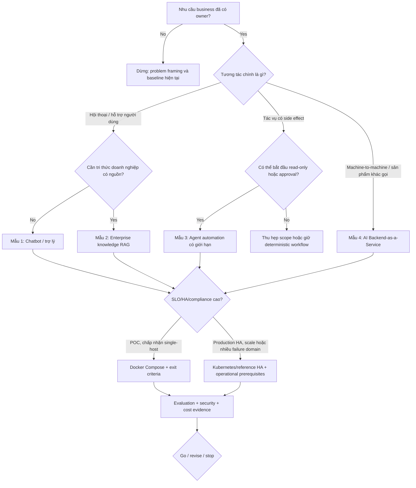

# 17. Các mẫu use case và khung ra quyết định

> **Version áp dụng:** Dify Community Edition `1.15.0`  
> **Ngày kiểm chứng:** `2026-07-16`  
> **Trạng thái xác minh:** `Official-source verified` + `Design reviewed` qua cross-review nội bộ; specialist review và scenario/runtime validation vẫn `RUNTIME-PENDING`
>
> **Reviewer:** Product, Architecture, Security và Operations review pending

## Mục tiêu

Chương này biến bốn nhóm năng lực của Dify thành bốn mẫu ứng dụng có thể dùng để bắt đầu discovery:

1. chatbot/trợ lý nội bộ;
2. RAG tra cứu tri thức doanh nghiệp;
3. agent tự động hóa quy trình;
4. AI Backend-as-a-Service cho hệ thống khác.

Mục tiêu là chọn **mẫu khởi đầu**, không gắn nhãn use case vĩnh viễn. Một sản phẩm có thể kết hợp nhiều mẫu, nhưng POC nên có một luồng chính, một nhóm người dùng, một data boundary và một success metric ưu tiên. Nếu gom chat, RAG, agent write action và public API vào POC đầu tiên, rất khó biết giá trị hay rủi ro đến từ đâu.

## Phạm vi và giả định

### Phạm vi quyết định

- Business interaction: hội thoại, tìm kiếm/tra cứu, tác vụ có side effect hoặc API machine-to-machine.
- Dữ liệu: nguồn, độ nhạy, độ mới, quyền truy cập và ground-truth.
- Execution: deterministic Workflow/Chatflow hay Agent reasoning/tool loop.
- Delivery: Dify WebApp, API, MCP hoặc tích hợp vào giao diện hiện hữu.
- Topology: Compose cho POC/single-host hay Kubernetes/reference HA design.
- Mức kiểm soát: human approval, downstream authorization, audit, retention và rollback.

### Các giả định không được tự động coi là đúng

- “Chatbot” không mặc nhiên cần Agent; phần lớn FAQ/RAG có thể dùng Chatflow xác định hơn.
- “RAG” không mặc nhiên giải quyết authorization hoặc hallucination; citation chỉ là provenance, không tự chứng minh câu trả lời đúng. [S-050][S-051][S-055]
- “Agent” không có quyền hành động chỉ vì tool được cấu hình trong workspace; downstream system phải enforce identity/authorization. [S-057][S-059]
- “API” không biến Dify thành system of record; caller vẫn sở hữu business transaction, idempotency và dữ liệu chuẩn.
- Mốc “dưới khoảng 50 người dùng” chỉ là heuristic từ brief. Concurrency, ingestion, workflow complexity, model latency, SLO và failure domain mới là đầu vào thiết kế.

### Ngoài phạm vi

- Không viết solution design riêng cho HR, ITSM, CRM hoặc ngành cụ thể.
- Không tạo sizing/cost cố định khi chưa có workload; xem Chương 19.
- Không thay security/privacy/legal review bằng điểm số use case.
- Không khẳng định Enterprise capability hoặc entitlement ngoài bằng chứng đã khóa ở Chương 10.

## Cơ chế hoạt động

### Mô hình ba lớp

Mỗi use case được tách thành:

| Lớp | Câu hỏi | Output cần có |
|---|---|---|
| Business contract | Ai dùng, quyết định/tác vụ nào được hỗ trợ, hậu quả khi sai? | Problem statement, owner, success/harm metrics |
| AI application | Workflow/RAG/Agent nào biến input thành output? | App type, graph, model, knowledge/tool dependency, evaluation set |
| Platform control | Dữ liệu và execution được bảo vệ/vận hành thế nào? | Identity, topology, SLO, observability, retention, backup/DR, cost guardrail |

Dify cung cấp workflow, RAG, agent, model management, observability và API ở lớp ứng dụng/platform, nhưng không tự cung cấp business authority hay ground-truth cho mọi domain. Product positioning chính thức phù hợp với vai trò “LLM application platform”, không phải ERP/CRM/ITSM thay thế. [S-003]

### Từ deterministic đến autonomous

Mức tự động hóa nên tăng theo evidence:

1. **Suggest:** hệ thống trả lời/đề xuất, người dùng quyết định.
2. **Prepare:** hệ thống tạo draft/payload nhưng chưa gửi.
3. **Approve:** người có thẩm quyền duyệt action cụ thể.
4. **Execute bounded:** chạy action trong allowlist, có idempotency và giới hạn.
5. **Autonomous:** tự lập kế hoạch/thực thi trong một policy domain hẹp.

Không nhảy từ demo chat sang bước 5. Với action có tài chính, pháp lý, nhân sự, truy cập hệ thống hoặc thay đổi dữ liệu, POC mặc định dừng ở Suggest/Prepare cho đến khi identity, approval, audit, compensating transaction và kill switch đã được test.

### Đánh giá theo hai trục

- **Value uncertainty:** chưa biết người dùng có cần/kết quả có cải thiện KPI không.
- **Execution risk:** hậu quả khi output sai, prompt bị tấn công, tool lỗi hoặc dependency unavailable.

POC ưu tiên lát cắt có value uncertainty đủ để học nhưng execution risk thấp. High-value/high-risk có thể đáng làm, nhưng cần sandbox/read-only/human approval ngay từ đầu.

## Kiến trúc/luồng dữ liệu

### D16 — Use-case và deployment decision flow



Cây này không chọn model, vector database hoặc edition thay cho đội dự án. Nó xác định câu hỏi tiếp theo và ngăn topology/Agent bị chọn trước khi có business contract.

## Hướng dẫn hoặc ví dụ triển khai

### Mẫu 1 — Chatbot hoặc trợ lý nội bộ

**Khi phù hợp**

- Người dùng cần một giao diện hội thoại để hỏi đáp, soạn thảo, phân loại hoặc hướng dẫn.
- Output là advisory/draft; người dùng vẫn chịu trách nhiệm hành động.
- Kiến thức có thể đến từ prompt, model hoặc một tập knowledge hẹp.
- Giá trị đến từ giảm thời gian tìm/soạn, tăng consistency hoặc triage nhanh.

**Reference flow**

```text
User -> WebApp/portal -> Chatflow -> optional retrieval -> LLM -> policy/output formatting -> User
```

Chatflow có interaction model hội thoại và Answer node; Workflow phù hợp hơn với tác vụ một lần/deterministic. [S-040]

**Đầu vào discovery**

- Persona và top 20 intent thật.
- Kênh delivery: Dify WebApp hay portal nội bộ.
- Ngôn ngữ, accessibility và peak concurrency.
- Data classification của câu hỏi/answer/log.
- Escalation route khi bot không chắc hoặc người dùng cần chuyên gia.

**POC hẹp đề xuất**

- Một nhóm 10–20 người dùng thử, một domain không nhạy cảm.
- 30–50 câu hỏi đại diện; tách answerable, ambiguous và out-of-scope.
- Không có write tool; nếu có RAG chỉ dùng một corpus đã review.
- Output bắt buộc chỉ rõ giới hạn và escalation.

**Metrics**

| Nhóm | Ví dụ metric |
|---|---|
| Chất lượng | task success, groundedness khi có RAG, refusal đúng, human rating |
| Trải nghiệm | p50/p95 end-to-end latency, abandonment, escalation rate |
| An toàn | sensitive-data leakage, policy violation, jailbreak success |
| Kinh tế | token/request, cost/successful task, support minutes saved |

**Rủi ro chính**

- Người dùng tin câu trả lời không có nguồn.
- Conversation log giữ dữ liệu nhạy cảm; default retention cần được chốt chủ động. [S-073]
- Prompt dài làm tăng latency/cost và làm lộ context không cần thiết.
- UI đẹp che khuất refusal/escalation kém.

**Exit criteria**

Chỉ mở rộng khi quality threshold trên golden set, red-team baseline, log policy, feedback route, model/provider quota và owner vận hành đều đạt.

### Mẫu 2 — Enterprise knowledge RAG

**Khi phù hợp**

- Câu trả lời phải dựa trên tài liệu doanh nghiệp có thể truy vết.
- Người dùng cần tìm nhanh policy, manual, sản phẩm, quy trình hoặc tri thức phân tán.
- Corpus có owner, permission, lifecycle và đủ chất lượng để làm ground-truth tương đối.

**Reference flow**

```text
Source -> ingest/parse -> chunk -> embed/index -> retrieve/filter/rerank -> context -> LLM -> answer + citation
```

Dify hỗ trợ managed/external knowledge, pipeline ingest và retrieval integration; lựa chọn chunk/index/retrieval phải được kiểm chứng trên corpus thật. [S-048][S-049][S-050]

**Đầu vào discovery**

- Source inventory, owner, format, volume, update/delete frequency.
- ACL model và liệu document-level permission có cần enforce hay không.
- Ngôn ngữ, bảng/ảnh, scanned PDF và cấu trúc metadata.
- Golden questions, supporting passages và unacceptable answer patterns.
- Freshness SLA, delete SLA và legal hold/retention.

**POC hẹp đề xuất**

- 100–500 tài liệu đã làm sạch từ một domain.
- Ít nhất 50 query với expected relevant passages; có negative/no-answer set.
- So 2–3 chunk/retrieval configurations, không chỉ demo một query đẹp.
- Kiểm tra ingest, update, delete, retrieval, citation và provider outage.

**Metrics**

| Tầng | Metric |
|---|---|
| Ingestion | parse success, duplicate rate, indexing lag, delete consistency |
| Retrieval | recall@k, precision@k/nDCG, rerank uplift, filter correctness |
| Generation | groundedness, citation presence/correctness, no-answer accuracy |
| Runtime | query p95, ingest queue backlog, vector/storage growth, cost/query |

**Rủi ro chính**

- Metadata filter bị dùng như authorization boundary khi chưa có negative test.
- Citation có mặt nhưng không hỗ trợ claim trả lời.
- Đổi embedding/vector backend mà không reindex/migration plan; config change không tự chứng minh dữ liệu đã migrate. [S-056]
- Parser/chunk làm mất bảng, ảnh hoặc context quan trọng.

**Exit criteria**

Corpus owner xác nhận quality/coverage; Security xác nhận ACL path; Operations chứng minh backup/restore và reindex strategy; golden set đạt ngưỡng đã chốt, gồm negative/deletion cases.

### Mẫu 3 — Agent tự động hóa quy trình nghiệp vụ

**Khi phù hợp**

- Tác vụ cần chọn động tool/bước dựa trên context và không thể mô hình hóa hoàn toàn bằng nhánh deterministic đơn giản.
- Có tool contract rõ, downstream API ổn định và action có thể giới hạn.
- Giá trị của flexibility lớn hơn chi phí đánh giá/guardrail.

Nếu đường đi đã biết trước, Workflow thường dễ kiểm thử, audit và ước tính chi phí hơn Agent. Dify hỗ trợ Function Calling/ReAct và reasoning/tool loop có maximum iterations, nhưng iteration cap không phải total timeout hoặc business authorization. [S-057][S-062][S-063]

**Reference flow**

```text
Request -> scope/policy -> agent plan -> read tools -> draft action -> human approval -> write tool -> verify result -> audit
```

**Đầu vào discovery**

- Tool inventory; read/write classification; credential owner.
- Caller/end-user identity propagation và downstream authorization.
- Idempotency key, timeout, retry, compensation và rate limit cho từng action.
- Maximum iteration/token/cost/time budget.
- Approval role, expiry, payload diff và kill switch.

**POC hẹp đề xuất**

- Bắt đầu read-only: tra ticket/status, tổng hợp và tạo draft.
- Một hoặc hai tools với JSON schema chặt, fixture không nhạy cảm.
- Write action chỉ ở sandbox và yêu cầu approval ngoài prompt.
- Inject tool timeout, malformed output, duplicate request, prompt injection và permission denial.

**Metrics**

- Task completion và tool-selection correctness.
- Unauthorized/incorrect action rate bằng `0` trên test set bắt buộc.
- Approval acceptance/rejection, duplicate side effect và recovery rate.
- Iterations, tokens, latency và cost trên một task thành công.
- Human time saved sau khi trừ review/correction effort.

**Rủi ro chính**

- Prompt/tool description bị coi là policy enforcement.
- Credential workspace được dùng vượt authority của end user.
- Retry tạo side effect lặp; Agent “sửa lỗi” bằng action tiếp theo không được phép.
- Tool output chứa instruction độc hại hoặc dữ liệu từ trust zone khác.

**Exit criteria**

Chưa pilot write action nếu thiếu end-user authorization, approval evidence, idempotency/compensation, complete audit, budget, kill switch và red-team prompt/tool output.

### Mẫu 4 — AI Backend-as-a-Service

**Khi phù hợp**

- Sản phẩm/hệ thống nội bộ cần gọi một AI capability qua API thay vì dùng giao diện Dify.
- Đội platform muốn tái sử dụng workflow/model/RAG governance phía sau contract ổn định.
- Caller sở hữu UX/business transaction và cần decouple khỏi graph triển khai.

**Reference flow**

```text
Caller -> enterprise API gateway -> adapter/contract -> Dify app API -> workflow/model/RAG -> normalized response -> caller
```

Dify định vị API là một phần của application platform, nhưng production contract nên đặt sau gateway/adapter do tổ chức sở hữu để quản lý identity, schema, quota, versioning và error normalization. [S-003]

**Đầu vào discovery**

- Consumer, synchronous/streaming/batch mode và request volume.
- Stable input/output/error schema, timeout budget và compatibility policy.
- AuthN/AuthZ, tenant/user context, quota và abuse control.
- Idempotency/correlation, trace propagation và data residency.
- Provider/model fallback impact đến schema/quality.

**POC hẹp đề xuất**

- Một endpoint internal, một workflow đã version/hash.
- Gateway key/identity riêng; không expose console API.
- Contract tests cho valid/invalid input, provider timeout, rate limit và streaming disconnect.
- Load profile nhỏ nhưng đo queue/model latency riêng.

**Metrics**

- Availability/error budget, p50/p95/p99 latency theo mode.
- Contract conformance và backward compatibility.
- Rate-limit/retry amplification, token/cost per caller/use case.
- Correlation completeness và mean time to isolate provider vs Dify vs caller error.

**Rủi ro chính**

- Consumer phụ thuộc trực tiếp graph/model detail và khó nâng cấp.
- API key không gắn end-user/tenant context; quota và audit sai.
- Caller retry sau timeout tạo duplicate business transaction.
- Streaming connection vượt capacity proxy/worker hoặc timeout chain.

**Exit criteria**

API contract, gateway policy, consumer quota, SLO, synthetic monitor, dependency fallback, version/deprecation policy và on-call ownership phải có trước production exposure.

### Bảng chọn nhanh

| Tín hiệu chính | Chatbot | Knowledge RAG | Agent automation | AI BaaS |
|---|---|---|---|---|
| Người dùng tương tác hội thoại | Rất phù hợp | Thường kết hợp | Có thể | Không bắt buộc |
| Cần nguồn/citation doanh nghiệp | Có thể | Cốt lõi | Tùy tool/context | Tùy API contract |
| Có side effect | Tránh | Tránh | Cốt lõi nhưng phải bounded | Caller/business service sở hữu |
| Đường xử lý cố định | Chatflow | Workflow/Chatflow | Nếu cố định thì không cần Agent | Workflow sau API |
| Consumer là hệ thống | Có thể | Có thể | Có thể | Cốt lõi |
| Rủi ro khởi đầu | Thấp–trung bình | Trung bình | Cao | Trung bình–cao |
| POC mặc định | Suggest | Answer + cite | Read-only/prepare | Một internal contract |

### Chọn topology sau khi chọn use case

| Điều kiện | Compose candidate | Kubernetes/reference HA candidate |
|---|---|---|
| Giai đoạn | POC/pilot, chấp nhận maintenance | Production cần rollout/HA/scale |
| Failure domain | Chấp nhận mất một host | Cần tách replica/AZ/dependency |
| Tải | Concurrency/job thấp và đo được | Nhiều online + background workload, cần scale độc lập |
| State | Local/bundled dependency chấp nhận được | Shared/external state, backup/DR rõ |
| Tổ chức | Một owner, kỹ năng container cơ bản | Platform/SRE sở hữu cluster, chart, on-call |
| Compliance | Control bù trừ đủ cho lab | Network/secret/audit/isolation policy bắt buộc |

Không chọn Kubernetes chỉ vì số user; một RAG ingest nặng cho ít user có thể cần tách worker/dependency sớm, trong khi chatbot nội bộ nhẹ có thể chạy pilot trên Compose.

## Quyết định và trade-off

### Workflow hay Agent

Chọn Workflow khi bước/nhánh có thể mô tả, output cần lặp lại và side effect cần kiểm soát. Chọn Agent khi decision path thực sự động và tool space đã giới hạn. Có thể dùng hybrid: Workflow làm policy/envelope, Agent chỉ quyết định trong một node/domain hẹp.

### WebApp hay tích hợp vào sản phẩm

Dify WebApp giảm time-to-demo, phù hợp học về quality. Portal/API integration cần thêm gateway, identity, UX, accessibility, contract và lifecycle nhưng phù hợp production ownership. Không dùng UI demo làm bằng chứng API/tenant security.

### Managed knowledge hay external knowledge

Managed path giảm integration effort; external path có thể giữ source/retrieval control nhưng thêm API availability, auth, consistency và observability. Quyết định theo data ownership/ACL/freshness, không chỉ theo vector engine ưa thích.

### External model hay self-host model

External API giảm GPU/serving ownership nhưng thêm data egress, quota, provider dependency và variable cost. Self-host tăng control/residency nhưng đội dự án sở hữu GPU capacity, serving, patch, model evaluation và incident. Chương 14 cung cấp integration gate; Chương 19 đưa cost formula.

### Community hay Enterprise

Community có thể phù hợp POC và một số production scope nếu control bù trừ đáp ứng yêu cầu. Khi cần vendor-supported Helm/K8s, SSO, granular RBAC, audit/SIEM hoặc nhiều workspace, phải đối chiếu entitlement/version với vendor và Legal/Procurement; public Enterprise page chỉ là snapshot marketing. [S-019]

## Security và operations implications

| Mẫu | Security gate ưu tiên | Operations gate ưu tiên |
|---|---|---|
| Chatbot | log/PII, prompt abuse, content policy, escalation | latency, provider quota, feedback và retention |
| Knowledge RAG | document ACL, metadata-filter bypass, exfiltration, delete | ingestion queue, index consistency, backup/reindex |
| Agent | tool credential, end-user auth, approval, idempotency, kill switch | iteration/cost budget, side-effect audit, failure recovery |
| AI BaaS | gateway identity, tenant context, rate limit, schema abuse | SLO, versioning, streaming capacity, consumer isolation |

Controls chung:

- Data-flow/threat model theo từng use case; không tái sử dụng một sơ đồ chung mà bỏ qua source/tool/caller mới.
- Fixture và evaluation data có classification/owner; không copy production conversation vào POC tùy tiện.
- Provider/tool/observability egress phải có allowlist, DPA/residency review và redaction.
- Log input/output theo minimum necessary; correlation không yêu cầu lưu toàn prompt vĩnh viễn.
- Model/provider/DSL/plugin version được khóa trong release record.
- Backup/restore boundary bao gồm DB, vector/file/plugin state và config; DSL không phải full backup. [S-045]
- SLO tách Dify, model provider, vector/retrieval và downstream tool để tìm đúng failure domain.
- Cost guardrail và quota theo use case/caller, không chỉ workspace aggregate.

## Failure modes và troubleshooting

| Failure | Mẫu dễ gặp | Dấu hiệu | Điều chỉnh scope/control |
|---|---|---|---|
| Demo tốt nhưng user không quay lại | Tất cả | Usage/task success thấp ngoài demo script | Quay lại problem/UX baseline; không scale infra trước. |
| Answer trôi chảy nhưng sai | Chatbot/RAG | Human/golden evaluation fail | Giảm scope, thêm retrieval/refusal/escalation; không chỉ đổi prompt. |
| Citation sai hoặc không support claim | RAG | Source tồn tại nhưng passage không liên quan | Đánh giá retrieval và claim support riêng. |
| ACL leak | RAG/API | User truy xuất document/tenant khác | Dừng pilot; fix authorization ngoài metadata prompt/filter. |
| Agent gọi sai tool/action | Agent | Tool trace/side effect ngoài intent | Disable write, thu hẹp allowlist, thêm approval/downstream auth. |
| Duplicate side effect | Agent/API | Hai ticket/order/update cho một request | Idempotency key, dedup, compensation và retry policy. |
| p95 cao dù Dify khỏe | Tất cả | Provider/tool/retrieval span chiếm thời gian | Tách latency budget; timeout/fallback/cache theo contract. |
| Cost tăng nhanh | Agent/RAG/API | Token, iteration, retrieval hoặc traffic tăng | Quota, budget, model/context optimization; đo cost/success. |
| POC không thể productionize | Tất cả | Không có owner/SLO/backup/security evidence | Áp exit criteria Chương 18; revise hoặc stop thay vì lift-and-shift. |
| Chọn Kubernetes nhưng vận hành yếu | Tất cả | Chart drift, alert/restore/upgrade không owner | Thu hẹp topology hoặc bổ sung platform ownership trước launch. |

Khi troubleshooting, phân biệt lỗi business fit, quality, security, dependency và platform. Thêm replica không chữa corpus kém; đổi model không chữa missing authorization.

## Checklist xác nhận

### Use-case card

- [ ] Có business owner và một problem statement đo được.
- [ ] Persona/consumer và interaction chính đã rõ.
- [ ] Mẫu chính trong bốn mẫu đã chọn; mẫu phụ được ghi riêng.
- [ ] System of record và decision authority không bị gán nhầm cho Dify.
- [ ] Data source/classification/owner/ACL/freshness/delete đã khai báo.
- [ ] Output harm và unacceptable outcome đã liệt kê.
- [ ] Mức automation hiện tại là Suggest/Prepare/Approve/Execute/Autonomous.
- [ ] Workflow vs Agent có lý do và đã ưu tiên deterministic khi đủ.
- [ ] Delivery surface, identity và downstream contract đã rõ.
- [ ] Evaluation set và success/harm/cost metrics có owner.

### Platform/pilot gate

- [ ] Model, knowledge, tool, plugin và external dependency inventory hoàn chỉnh.
- [ ] Threat/data-flow review hoàn tất cho đúng use case.
- [ ] Retention/redaction/egress/quota policy đã chốt.
- [ ] Compose/Kubernetes được chọn theo SLO/failure/load/ownership, không chỉ user count.
- [ ] Backup/restore, rollback và on-call requirement đã ánh xạ.
- [ ] POC scope có negative/failure cases, không chỉ happy path.
- [ ] Production exit criteria và stop condition đã thỏa thuận trước demo.
- [ ] Runtime evidence gắn version, configuration và release ID.
- [ ] Product, Architecture, Security, Operations và data owner sign-off theo risk.

## Giới hạn/version caveats

- Đây là pattern library, không thay solution design cho một nghiệp vụ cụ thể.
- Các mẫu dựa trên capability Dify `1.15.0`; Agent, plugin, MCP, DSL và edition behavior có thể đổi ở release sau.
- Chưa có scenario do doanh nghiệp cung cấp, nên threshold/metric đều là template cần chốt.
- Chưa có runtime lab, provider credential, corpus, tool hoặc consumer API; mọi POC example là `RUNTIME-PENDING`.
- Public Enterprise/pricing pages thay đổi theo thời gian; entitlement thực tế cần vendor confirmation và hợp đồng.
- License có điều kiện bổ sung về multi-tenant/branding; use case service/platform phải qua Legal, không suy từ topology kỹ thuật. [S-004]
- Citation, metadata filter, workspace credential, iteration cap và WebApp đều không tự tạo security boundary đầy đủ.
- Use case có thể chuyển mẫu theo thời gian; thay đổi từ advisory sang write/autonomous action là security/operations change, không phải chỉ prompt update.
- Editorial target mỗi mẫu là bản đồ 1–2 trang; thiết kế sâu nên nằm trong addendum riêng để stable core không phình vô hạn.

## Nguồn tham khảo

- [S-003] Dify README tại tag `1.15.0`: định vị platform, workflow, RAG, agent, model, observability và API.
- [S-004] Dify LICENSE tại tag `1.15.0`: điều kiện bổ sung cần Legal review cho use case dịch vụ/multi-tenant/branding.
- [S-019] Dify Enterprise public page, truy cập `2026-07-16`: capability snapshot cho procurement/edition discussion.
- [S-040] Workflow and Chatflow tại docs snapshot `57a492d`: interaction/start/end semantics.
- [S-045] Manage Apps and DSL tại docs snapshot `57a492d`: app artifact scope và exclusions.
- [S-048] Knowledge Overview tại docs snapshot `57a492d`: managed/external knowledge lifecycle.
- [S-049] Knowledge Pipeline Orchestration tại docs snapshot `57a492d`: ingestion/chunk/test/publish flow.
- [S-050] Index Method and Retrieval Settings tại docs snapshot `57a492d`: retrieval/rerank/multimodal settings.
- [S-051] Knowledge Retrieval Node tại docs snapshot `57a492d`: query/filter/result/citation path.
- [S-055] Dataset Retrieval source tại tag `1.15.0`: retrieval/source metadata behavior.
- [S-056] Vector Factory source tại tag `1.15.0`: stored backend selection và migration caveat.
- [S-057] Agent Node tại docs snapshot `57a492d`: strategy, tool, memory, iteration và output.
- [S-059] Tool Node tại docs snapshot `57a492d`: tool parameter/credential selection boundary.
- [S-062] Function Calling Agent Runner tại tag `1.15.0`: model-tool loop và usage/iteration behavior.
- [S-063] ReAct/CoT Agent Runner tại tag `1.15.0`: reasoning/tool loop và max-iteration behavior.
- [S-073] Application Conversation Logs tại docs snapshot `57a492d`: live interaction logging và retention concern.
