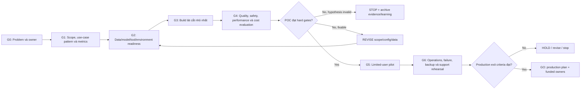

# 18. Checklist POC và pilot

> **Version áp dụng:** Dify Community Edition `1.15.0`  
> **Ngày kiểm chứng:** `2026-07-16`  
> **Trạng thái xác minh:** `Design reviewed`; execution và scenario walkthrough đang `RUNTIME-PENDING`  
> **Reviewer:** Product/Architecture/Security/Operations review pending

## Mục tiêu

POC phải trả lời “giải pháp có khả thi và có đáng đầu tư tiếp không?”, không chỉ “demo có chạy không?”. Pilot phải trả lời thêm “một nhóm người dùng thật có nhận được giá trị trong ranh giới an toàn/vận hành đã định nghĩa không?”.

Chương này cung cấp stage-gate từ ý tưởng đến quyết định, với owner và evidence rõ. Kết quả hợp lệ gồm cả `GO`, `REVISE` và `STOP`; việc dừng một giả thuyết không hiệu quả là output thành công nếu evidence đủ tốt.

## Phạm vi và giả định

### Phân biệt POC, pilot và production

| Giai đoạn | Câu hỏi chính | Người dùng/dữ liệu | Mức cam kết |
|---|---|---|---|
| POC | Capability và quality có khả thi trên lát cắt hẹp? | Nhóm kỹ thuật, fixture/golden set đã kiểm soát | Không SLO production; không write action ngoài sandbox |
| Pilot | Người dùng đại diện có nhận giá trị và control có vận hành được? | Nhóm giới hạn, dữ liệu được phê duyệt | Time-boxed, có support/rollback/kill switch |
| Production | Hệ thống đáp ứng SLO, security, compliance, operations và economics dài hạn? | Scope chính thức | On-call, DR, lifecycle, audit và ownership đầy đủ |

POC chạy trên Docker Compose không tự trở thành production khi có thêm user. Pilot không phải cách né security/legal review bằng nhãn “thử nghiệm”.

### Phạm vi checklist

- Bốn mẫu use case ở Chương 17.
- External/self-host model path, RAG, Workflow/Chatflow, Agent và API delivery.
- Data/model/tool/plugin readiness.
- Evaluation, security test, performance, failure recovery, observability và cost.
- Go/revise/stop và production exit criteria.

### Giả định

- Baseline Dify `1.15.0` đã khóa; version drift là change control.
- Docker daemon, provider credential, corpus và test cluster hiện chưa sẵn sàng; execution item mang `RUNTIME-PENDING`.
- Mọi dữ liệu thật chỉ được dùng sau classification, owner approval, minimization và deletion plan.

## Cơ chế hoạt động

### Một giả thuyết, nhiều ngưỡng

POC card nên có dạng:

```text
Cho [persona], khi [task/context], giải pháp dùng [mẫu use case]
sẽ cải thiện [business metric] từ [baseline] lên [target],
trong khi giữ [quality/safety/latency/cost constraints].
```

Một demo không có baseline và target chỉ chứng minh giao diện có thể phản hồi. Mỗi POC cần ngưỡng ở bảy nhóm:

| Nhóm | Câu hỏi | Ví dụ cách đo |
|---|---|---|
| Business | Có cải thiện task/outcome thật? | completion time, deflection, adoption, correction effort |
| Quality | Output có đúng/hữu ích/grounded? | golden set, rubric, retrieval metrics, human rating |
| Safety | Có vượt policy hoặc làm lộ dữ liệu? | red-team/negative set, authorization tests |
| Performance | Người dùng/consumer chấp nhận được? | p50/p95/p99, streaming first-token, indexing lag |
| Reliability | Dependency/failure có bounded recovery? | timeout, retry, queue/provider/tool failure drills |
| Cost | Giá trị có chịu được unit economics? | cost/successful task, token/retrieval/GPU/ops effort |
| Operability | Có thể phát hiện, chẩn đoán, rollback? | correlation, alerts, backup/restore, runbook exercise |

Không dùng weighted average để che một hard failure. Ví dụ quality cao không bù cho cross-user data leak; unauthorized write action là automatic `NO-GO`.

### Evidence chain

Mỗi kết quả phải nối được:

```text
Requirement -> Test ID -> Version/config -> Input fixture -> Raw result -> Evaluation -> Decision
```

Evidence phải redacted, có timestamp/owner, giữ đủ lâu cho review và không chứa secret. Screenshot có thể bổ sung trải nghiệm, nhưng không thay machine-readable result, run ID hoặc configuration snapshot.

### Gate owner

| Gate | Accountable owner | Reviewer tối thiểu |
|---|---|---|
| Problem/value | Product/business owner | User representative |
| Architecture/data | Solution architect/data owner | Platform owner |
| Security/privacy/legal | Security/data privacy/Legal theo scope | Application owner |
| Quality/evaluation | AI/application owner | Domain expert |
| Platform/operations | Platform/SRE | Security + application owner |
| Economics | Product/FinOps | Platform + AI platform |
| Go/no-go | Sponsor/business owner | Tất cả gate owner có blocking right |

## Kiến trúc/luồng dữ liệu



Không bỏ qua G4 vì sponsor thích demo, và không bỏ qua G6 vì POC đã chạy ổn trong giờ làm việc.

## Hướng dẫn hoặc ví dụ triển khai

### G0 — Intake và problem framing

- [ ] `POC-001` Có sponsor và business owner chịu trách nhiệm outcome.
- [ ] `POC-002` Persona, task, trigger và current process được mô tả.
- [ ] `POC-003` Baseline hiện tại có dữ liệu hoặc phương pháp đo hợp lý.
- [ ] `POC-004` Harm khi sai/chậm/không hoạt động đã liệt kê.
- [ ] `POC-005` System of record và human decision authority đã xác định.
- [ ] `POC-006` POC time-box, budget, team và stop condition được duyệt.
- [ ] `POC-007` Không có solution predetermined nếu problem chưa đủ rõ.

**Evidence:** one-page POC charter, current-state sample, stakeholder map và risk classification sơ bộ.

**Gate fail nếu:** không có owner; không đo được outcome; use case chỉ là “phải dùng AI/Dify”; hậu quả không thể giới hạn trong POC.

### G1 — Scope và success contract

- [ ] `POC-010` Chọn một mẫu chính từ Chương 17.
- [ ] `POC-011` Chốt một happy path và các negative/out-of-scope paths.
- [ ] `POC-012` Chọn mức automation: Suggest, Prepare, Approve hoặc Execute bounded.
- [ ] `POC-013` Chọn Workflow/Chatflow trước; chỉ dùng Agent khi path động là requirement.
- [ ] `POC-014` Chốt delivery surface và identity path.
- [ ] `POC-015` Chốt hard gates và target cho bảy nhóm metric.
- [ ] `POC-016` Chốt qualitative rubric trước khi xem output cuối.
- [ ] `POC-017` Ghi rõ điều không được chứng minh bởi POC.

**Evidence:** use-case card, scope diagram, metric contract, out-of-scope list và decision log.

Ví dụ hard gates cho knowledge assistant:

| Gate | Ngưỡng minh họa cần được owner thay thế | Loại |
|---|---:|---|
| Cross-user/unauthorized retrieval | `0` trên negative set bắt buộc | Hard |
| Citation supports answer claim | Target do domain owner chốt | Hard |
| No-answer đúng trên out-of-scope set | Target do domain owner chốt | Hard |
| p95 latency | Theo UX/SLO candidate | Trade-off |
| Cost/successful answer | Theo business case | Trade-off |

Không dùng các dòng “target do owner chốt” làm production threshold; chúng là yêu cầu discovery.

### G2 — Data, model, tool và environment readiness

#### Data/corpus

- [ ] `POC-020` Source owner, classification, residency và retention được phê duyệt.
- [ ] `POC-021` Có inventory format/volume/language/quality/update/delete/ACL.
- [ ] `POC-022` Fixture/golden set tách khỏi training/tuning sample.
- [ ] `POC-023` PII/secret được bỏ hoặc tokenize theo policy.
- [ ] `POC-024` Có cleanup owner và deadline sau POC.

#### Model/provider

- [ ] `POC-025` Chọn external hoặc self-host path; ghi endpoint/region/capability.
- [ ] `POC-026` DPA/residency/egress, credential, quota và budget đã review.
- [ ] `POC-027` Model support streaming/tool/structured output/embedding/rerank theo nhu cầu.
- [ ] `POC-028` Timeout, retry, rate limit và fallback semantics đã khai báo.

#### Tool/plugin

- [ ] `POC-029` Tool được phân read/write; write mặc định disabled hoặc sandboxed.
- [ ] `POC-030` Downstream test identity và authorization có scope tối thiểu.
- [ ] `POC-031` Tool schema, idempotency, timeout, compensation và audit được định nghĩa.
- [ ] `POC-032` Plugin provenance/permission/version/signature policy đã review.

#### Environment

- [ ] `POC-033` Dify/source/docs/plugin version được khóa.
- [ ] `POC-034` Compose/cluster, DNS/TLS, storage, DB/Redis/vector và secret path sẵn sàng.
- [ ] `POC-035` Test data tách production; network egress/ingress có allowlist.
- [ ] `POC-036` Logs/traces/cost telemetry và evidence store hoạt động.
- [ ] `POC-037` Kill switch, cleanup và environment owner đã xác định.

### G3 — Build lát cắt nhỏ nhất

1. Dựng một app/graph tối thiểu cho happy path.
2. Khóa model, prompt, parameters, knowledge/tool/plugin dependencies.
3. Thêm input validation, explicit out-of-scope/refusal và error branch.
4. Thêm correlation ID và structured outcome fields cần đánh giá.
5. Export/hash DSL; tạo dependency manifest riêng. DSL không gồm knowledge data, usage logs hoặc API key nên không dùng làm backup. [S-045]
6. Chạy developer smoke bằng fixture không nhạy cảm.
7. Chỉ sau khi baseline đo được mới thử prompt/chunk/model variants.

Checklist:

- [ ] `POC-040` Graph có tên node/variable/error path dễ audit.
- [ ] `POC-041` Không có secret trong prompt, DSL, code hoặc log.
- [ ] `POC-042` Model/tool/retrieval call có timeout hữu hạn.
- [ ] `POC-043` Retry chỉ bật khi idempotency/side effect đã được xử lý.
- [ ] `POC-044` Agent có max iterations và budget; write action có approval ngoài prompt.
- [ ] `POC-045` Knowledge config và corpus version được ghi cùng run.
- [ ] `POC-046` App DSL hash + dependency manifest được lưu trong release record.

### G4 — Evaluation trước demo

#### Thiết kế evaluation set

| Tập | Mục đích | Ví dụ |
|---|---|---|
| Representative | Đo task thường gặp | Top intents/queries từ current process |
| Boundary | Đo giới hạn domain/input | Câu mơ hồ, thiếu dữ kiện, format lạ |
| Negative | Đo refusal/no-answer/auth | Tài liệu không được phép, câu ngoài corpus |
| Adversarial | Đo prompt/tool/data abuse | Prompt injection, malicious document/tool output |
| Failure | Đo dependency/recovery | Provider timeout, Redis/worker/tool unavailable |
| Regression | Giữ behavior sau thay đổi | Cases từng lỗi hoặc business-critical |

Knowledge retrieval test trong UI có thể hỗ trợ xem retrieval records, nhưng không thay production evaluation/golden set. [S-053]

#### Quy trình đánh giá

1. Freeze candidate configuration.
2. Chạy toàn bộ set bằng script/process tái hiện được.
3. Lưu raw output + trace/run ID đã redacted.
4. Chấm bằng deterministic rules khi có thể; rubric/human review cho phần chủ quan.
5. Blind review một phần để giảm confirmation bias.
6. Phân tích theo slice: intent, language, source, permission, length, model path.
7. Tính confidence interval hoặc ít nhất sample size; không công bố phần trăm từ vài case.
8. So với baseline/current process, không chỉ so hai prompt.

Checklist:

- [ ] `POC-050` Golden set có owner, version và expected behavior.
- [ ] `POC-051` Hard safety/auth cases đạt tuyệt đối theo contract.
- [ ] `POC-052` Quality/business target đạt trên representative set.
- [ ] `POC-053` p50/p95 và component latency được đo, không chỉ cảm nhận.
- [ ] `POC-054` Token/provider/retrieval/GPU cost được quy về successful task.
- [ ] `POC-055` Không chọn/chỉnh candidate dựa trên test set rồi báo cùng số như holdout.
- [ ] `POC-056` Regression set được lưu cho pilot/release sau.

### G5 — Security và failure gate

Ma trận tối thiểu:

| ID | Kịch bản | Điều kiện đạt |
|---|---|---|
| POC-060 | Sai/expired provider credential | Fail bounded; không leak secret; alert/cause rõ |
| POC-061 | Prompt injection từ user | Không vượt data/tool policy |
| POC-062 | Malicious retrieved document/tool output | Không biến untrusted content thành authority |
| POC-063 | Cross-user/tenant/ACL attempt | Deny; không lộ metadata/content |
| POC-064 | Tool permission denial | Agent/workflow không bypass hoặc lặp action nguy hiểm |
| POC-065 | Duplicate/retry request | Không duplicate side effect ngoài policy |
| POC-066 | Provider timeout/rate limit | Timeout/retry/fallback đúng contract |
| POC-067 | Worker/Redis interruption | Queue symptom/recovery quan sát được; no silent success |
| POC-068 | Vector/storage failure | Fail/degrade rõ; không trả stale/wrong result ngầm |
| POC-069 | Log/tracing destination outage | Core path theo policy; không block hoặc drop im lặng ngoài thiết kế |
| POC-070 | Secret rotation | Consumer reconnect; secret cũ bị revoke; evidence redacted |
| POC-071 | Backup/restore sample | Dữ liệu/app behavior khôi phục nhất quán |

Agent write action còn cần explicit approval, payload diff, expiry, end-user authorization, audit và kill switch. Workspace tool credential không tự chứng minh downstream authority. [S-057][S-059]

### G6 — Demo có kiểm soát

Demo script phải gồm:

1. problem và baseline;
2. một happy path đại diện;
3. một no-answer/refusal hoặc permission denial;
4. một dependency failure/recovery đã chuẩn bị;
5. metric/evidence thực thay vì chỉ UI;
6. limitation và những gì POC chưa chứng minh;
7. quyết định cần sponsor đưa ra.

Không dùng tài khoản admin, production secret hoặc dữ liệu bất ngờ trong live demo. Chuẩn bị recorded fallback cho lỗi trình chiếu nhưng phân biệt rõ recorded result và live evidence.

### G7 — Limited-user pilot

- [ ] `POC-080` Pilot population, invitation, consent/notice và support hours rõ.
- [ ] `POC-081` Training/onboarding và acceptable-use guidance được phát hành.
- [ ] `POC-082` Feedback gắn task/run nhưng không lộ dữ liệu ngoài policy.
- [ ] `POC-083` Quota, budget, provider limit và capacity headroom được đặt.
- [ ] `POC-084` Dashboard/alerts/on-call/escalation hoạt động.
- [ ] `POC-085` Daily/weekly quality, safety, usage và cost review có owner.
- [ ] `POC-086` Kill switch/rollback được thử trước mở pilot.
- [ ] `POC-087` Pilot có ngày kết thúc và cleanup/decision meeting.

Conversation logs có thể chứa đầy đủ interaction và default retention cần được chốt; debug run history và live-user logs cũng không phải cùng một nguồn evidence. [S-073][S-074]

### G8 — Go, revise hoặc stop

| Quyết định | Khi nào | Output bắt buộc |
|---|---|---|
| `GO` | Hard gates đạt; value/quality/cost/operations đủ evidence; production gap có owner/budget | Production backlog, architecture, risk acceptance, rollout và funding |
| `REVISE` | Giả thuyết còn giá trị nhưng data/scope/config/control có lỗi sửa được | Thay đổi cụ thể, test lặp lại, deadline và stop condition mới |
| `HOLD` | Phụ thuộc vendor/legal/data/platform chưa giải quyết | Blocker, owner, trigger để đánh giá lại; không để POC chạy vô hạn |
| `STOP` | Không đạt value, risk không chấp nhận, economics xấu hoặc không có owner | Learning report, cleanup/deletion, revoke credential và archive evidence |

### Scenario walkthrough — trợ lý tra cứu chính sách nội bộ

**Giả thuyết:** nhân viên tìm câu trả lời chính sách nhanh hơn, có nguồn, trên một corpus đã review.

**Scope POC:** 200 tài liệu public-internal, 50 golden questions, không có HR case cá nhân, không có write tool, 15 người dùng kỹ thuật.

**Architecture candidate:** Compose; Chatflow + managed knowledge + external model test credential; logs giữ ngắn theo POC policy.

**Hard gates:** không cross-document ACL leak; out-of-scope refusal; citation hỗ trợ claim; credential không lộ; delete test; backup/restore sample.

**Trade-off:** nếu document-level ACL không thể chứng minh, tách corpus theo audience hoặc dừng POC thay vì gọi metadata filter là authorization.

**Production gap dự kiến:** SSO/RBAC/edition, HA, managed dependency, data retention, formal SLO, provider DPA/quota, load/restore/DR và user support.

Walkthrough này là template `RUNTIME-PENDING`, không phải kết quả đã đo.

## Quyết định và trade-off

### POC breadth hay depth

Một lát cắt end-to-end hẹp tạo evidence tốt hơn nhiều feature rời rạc. Thêm feature chỉ khi nó kiểm tra một giả thuyết/risk quan trọng.

### Synthetic hay real data

Synthetic giảm privacy risk nhưng có thể bỏ qua format/noise/ACL thật. Bắt đầu synthetic/redacted, sau đó dùng representative approved sample với deletion/retention controls.

### Human evaluation hay automated evaluation

Automated rules lặp lại tốt cho schema, citation, latency và một số safety cases. Domain correctness/utility thường cần human review. LLM-as-judge chỉ là một signal, phải khóa judge model/prompt và calibration.

### Compose hay Kubernetes trong POC

Compose tối ưu tốc độ học product/capability. Kubernetes phù hợp khi chính giả thuyết là HA/scale/security platform. Không bắt đầu cluster phức tạp nếu POC đang hỏi liệu answer có hữu ích hay không.

### Model tốt nhất hay model có thể vận hành

Model đạt benchmark cao nhưng vi phạm residency, quota, latency hoặc cost không phải candidate production. Evaluation phải bao gồm operational fit.

### Fix prompt hay fix system

Prompt phù hợp instruction/format; corpus, authorization, tool contract, timeout, idempotency và UX escalation thuộc system design. Không dùng prompt để vá control ngoài trust boundary.

## Security và operations implications

- POC environment vẫn phải có authentication, TLS theo scope, secret manager/path an toàn và network restriction.
- Không cấp production DB/provider/tool credential cho POC; dùng identity riêng với least privilege.
- Data minimization, retention, deletion và legal hold áp dụng ngay khi dùng dữ liệu thật.
- Red-team set và raw result là sensitive evidence; phân quyền và retention tương ứng.
- Scan/review plugin và dependency; không cài marketplace plugin chỉ để demo mà bỏ provenance/permission.
- Budget/quotas là safety control cho model/Agent, không chỉ FinOps.
- Log/trace correlation phải đủ điều tra nhưng scrub token, secret, PII và restricted document content.
- Backup/restore và rollback rehearsal là production exit criteria; backup file tồn tại chưa phải evidence.
- On-call/support ownership phải tồn tại trong pilot; không dựa vào người viết demo luôn online.
- Kết thúc POC phải revoke key, xóa environment/data theo policy và ghi completion evidence.

## Failure modes và troubleshooting

| Failure pattern | Dấu hiệu | Nguyên nhân thường gặp | Hành động |
|---|---|---|---|
| “POC thành công” chỉ vì demo chạy | Không có baseline/set/threshold | Scope theo feature | Quay lại G0/G1; định nghĩa hypothesis và hard gates. |
| Metric thay sau khi thấy kết quả | Target/rubric không version | Outcome bias | Freeze success contract; báo exploratory result riêng. |
| Golden set quá dễ | 100% trên vài prompt được chọn | Test leakage/cherry-pick | Bổ sung representative/boundary/negative/holdout slices. |
| Human rating không nhất quán | Reviewer chênh lớn | Rubric mơ hồ/domain thiếu | Calibrate rubric, double-score sample, adjudicate. |
| POC lộ dữ liệu | Raw log/artifact chứa PII/secret | Debug/telemetry quá rộng | Dừng test, incident/rotation/deletion và sửa redaction. |
| Agent demo gây side effect | Tool dùng credential thật/không approval | Scope vượt maturity | Disable write, sandbox, thêm downstream auth/idempotency. |
| Latency/cost không ổn định | Tail tăng, retry/token phình | Provider/Agent/context/queue | Tách component span, iteration/retry và successful-task cost. |
| Pilot không có user adoption | Login nhưng không lặp task | Problem/UX/workflow mismatch | User interview + task observation; không chỉ đổi model. |
| Không thể rollback/restore | Chỉ export DSL/backup một phần | State inventory thiếu | Áp Chương 15; test synchronized restore. |
| POC kéo dài vô hạn | Không decision date/owner | Sunk-cost/blocked dependency | Dùng HOLD/STOP; cleanup và trigger đánh giá lại rõ. |

## Checklist xác nhận

### POC complete

- [ ] Charter, scope, owner, time-box và stop condition được duyệt.
- [ ] Use-case pattern, automation level và system-of-record boundary rõ.
- [ ] Baseline + bảy nhóm metric/hard gate đã freeze trước evaluation.
- [ ] Data/model/tool/plugin/environment readiness đạt.
- [ ] Golden set có representative, boundary, negative, adversarial, failure và regression cases.
- [ ] Candidate version/config/DSL/dependency hash được lưu.
- [ ] Quality, safety, performance, reliability, cost và operability evidence đầy đủ.
- [ ] Security/failure matrix POC-060–POC-071 đạt hoặc có blocker rõ.
- [ ] Demo trình bày limitation và decision, không chỉ happy path.
- [ ] Kết quả là GO/REVISE/HOLD/STOP có owner phê duyệt.

### Production exit criteria

- [ ] Pilot user/value evidence đạt trên thời gian đủ đại diện.
- [ ] Architecture/topology, capacity và dependency SLO được review.
- [ ] Identity/RBAC/audit/network/secret/data-lifecycle controls được runtime-test.
- [ ] Provider/tool/plugin/vendor/legal/procurement approvals hoàn tất.
- [ ] Image/config/DSL promotion pipeline và rollback controls đạt.
- [ ] Backup/restore, upgrade/rollback, failure/recovery và DR drill đạt RPO/RTO.
- [ ] Monitoring, alerts, on-call, incident, support và escalation có owner.
- [ ] Unit economics và budget guardrail được FinOps/business duyệt.
- [ ] Rollout/canary/kill switch/deprecation plan sẵn sàng.
- [ ] Residual risks có acceptance có hạn và review date.

## Giới hạn/version caveats

- Checklist chưa được chạy trong workspace này; mọi execution state là `RUNTIME-PENDING`.
- Threshold minh họa không phải recommendation production; business/domain/security owner phải chốt.
- Dify `1.15.0` là baseline; nâng version yêu cầu regression và source/config drift review.
- Docker daemon, provider credential, approved corpus/tool và test cluster chưa có.
- Community/Enterprise capability và license applicability vẫn có các gate Legal/Procurement riêng.
- Evaluation không loại bỏ hoàn toàn stochastic behavior; cần repeated runs, slice analysis và monitoring sau launch.
- POC quality không chứng minh HA, DR, security isolation hoặc economics ở production scale.
- Agent iteration cap, citation, metadata filter, workspace credential và attestation đều có giới hạn đã mô tả ở các chương tương ứng.
- Scenario walkthrough chỉ minh họa quy trình, không phải lab evidence.

## Nguồn tham khảo

- [S-001] Dify `1.15.0` Release Note: baseline, migration và upgrade-specific changes.
- [S-040] Workflow and Chatflow tại docs snapshot `57a492d`: lựa chọn interaction/execution surface.
- [S-045] Manage Apps and DSL tại docs snapshot `57a492d`: DSL scope, secrets/data exclusions và compatibility.
- [S-053] Test Knowledge Retrieval tại docs snapshot `57a492d`: retrieval test records và giới hạn của test UI.
- [S-057] Agent Node tại docs snapshot `57a492d`: tools, strategy, memory, iterations và outputs.
- [S-059] Tool Node tại docs snapshot `57a492d`: credential/tool parameter boundary.
- [S-073] Application Conversation Logs tại docs snapshot `57a492d`: live interaction data và retention implications.
- [S-074] Workflow Run History tại docs snapshot `57a492d`: application/node run evidence và timing.
- [S-078] Dify Security Policy tại tag `1.15.0`: vulnerability reporting route.
