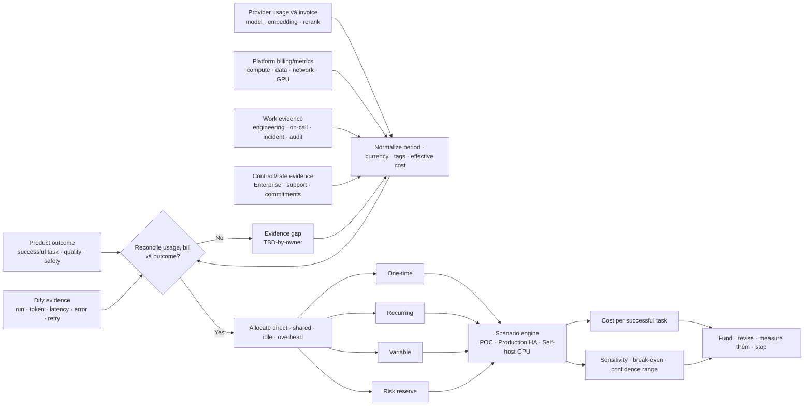

# 19. Mô hình chi phí

> **Version áp dụng:** Dify Community `1.15.0 @ 3aa26fb…`; Enterprise/Cloud theo public snapshot ngày `2026-07-16`  
> **Ngày kiểm chứng:** `2026-07-16`  
> **Trạng thái xác minh:** `Official-source verified` + `Design reviewed`; giá, khối lượng và effort thực tế đều `TBD-by-owner`  
> **Reviewer:** Product, FinOps, AI Platform, Platform/SRE, Security và Procurement review pending

## Mục tiêu

Chương này cung cấp một mô hình **tham số hóa**, không phải bảng báo giá. Mục tiêu là giúp đội dự án:

1. lập fully loaded cost cho Dify thay vì chỉ cộng VM và model token;
2. tách chi phí one-time, recurring, variable và risk reserve để không trộn cash flow với run-rate;
3. đo cost per successful task bằng outcome thật, không dùng HTTP `200` hoặc số request làm mẫu số thay thế;
4. so sánh ba scenario: POC Compose dùng external API, production HA dùng external API và self-host model trên GPU;
5. đưa embedding, rerank, vector/storage, network, observability, backup/DR, CI/CD và effort vận hành vào cùng cost boundary;
6. so sánh Enterprise subscription/vendor support với chi phí compensating controls và rủi ro còn lại của Community;
7. chạy sensitivity và break-even bằng input có owner, nguồn, thời điểm và confidence thay vì tạo độ chính xác giả.

FinOps định nghĩa unit economics bằng cách nối technology cost với business/technical unit phù hợp và nhấn mạnh rằng fully loaded unit cost cần cả dữ liệu chi phí lẫn dữ liệu outcome. [S-106] Trong chương này, unit chính là **successful task** theo success contract của Chương 18; các unit phụ như token, request, GB hoặc GPU-hour chỉ dùng để giải thích cost driver.

## Phạm vi và giả định

### Phạm vi chi phí

Cost boundary bao gồm:

- Dify compute: API, web, WebSocket, worker, beat, plugin daemon, sandbox và SSRF proxy;
- PostgreSQL, Redis, vector store, object/file storage và plugin storage;
- external LLM, embedding, rerank, speech hoặc multimodal provider khi được dùng;
- GPU serving, CPU/RAM phụ trợ, model artifact, driver/operator, energy/facility và spare capacity khi self-host;
- ingress/load balancer, DNS/TLS, private endpoint, NAT, egress và inter-zone/inter-region traffic;
- logs, metrics, traces, LLMOps/evaluation và retention;
- backup, restore test, DR capacity và recovery exercise;
- CI/CD, registry, scan, SBOM, signing/attestation, test environment và promotion;
- platform engineering, AI engineering, security/compliance, FinOps, on-call, incident và upgrade effort;
- Enterprise subscription/vendor support hoặc Community compensating controls;
- risk reserve có phương pháp, tách khỏi actual spend.

Default Compose `1.15.0` gồm nhiều service và stateful dependency, không phải một process Dify duy nhất; vì vậy “giá một VM” chưa phải TCO của POC. [S-005][S-006] Tương tự, production HA là design riêng với stateful service, failover và vận hành; không suy chi phí production từ Compose.

### Ranh giới quyết định phải khóa

Mỗi workbook/model instance phải ghi:

| Input | Nội dung cần khóa | Giá trị hiện tại |
|---|---|---|
| Business scope | Use case, persona, task và success contract | `TBD-by-owner` — Product |
| Environment | POC, pilot hay production; region và data boundary | `TBD-by-owner` — Architecture/Security |
| Time horizon | Khoảng forecast, kỳ báo cáo và amortization policy | `TBD-by-owner` — Finance/FinOps |
| Currency | Reporting currency, FX source/date và tax treatment | `TBD-by-owner` — Finance |
| Demand | Started task, concurrency, seasonality, growth và peak factor | `TBD-by-owner` — Product/SRE |
| Quality/SLO | Success, latency, availability, RPO/RTO và safety gates | `TBD-by-owner` — Product/SRE/Security |
| Data | Corpus, ingestion churn, retention, backup và egress | `TBD-by-owner` — Data owner |
| Model path | External API, self-host GPU hoặc hybrid/fallback | `TBD-by-owner` — AI Platform |
| Edition | Community, Enterprise hoặc Cloud; entitlement/support scope | `TBD-by-owner` — Procurement/Legal |
| Allocation | Cách chia shared/idle/overhead cost cho app/tenant/team | `TBD-by-owner` — FinOps |

### Giả định phương pháp

- Giá lấy từ invoice, contract, private quote hoặc official rate card có timestamp; không lấy một giá công khai hiện tại rồi coi là giá lịch sử/tương lai.
- Credits, tax, commitment, discount và prepaid purchase phải theo policy Finance; luôn giữ cả gross/list view và effective/actual view nếu cần giải thích.
- So sánh external API với self-host GPU chỉ hợp lệ khi quality, capability, data boundary, latency và availability scope tương đương hoặc chênh lệch được ghi rõ.
- POC không có HA/on-call không được dùng làm baseline “rẻ hơn” cho production.
- Engineering hour dùng loaded labor rate được Finance phê duyệt; không dùng lương cá nhân trong artifact chia sẻ.
- Risk reserve là planning line, không cộng lại vào actual spend khi incident cost đã được ghi nhận.
- Không có default price, volume, token, utilization, useful life, discount rate hoặc salary rate trong tài liệu này. Mọi input chưa có evidence giữ `TBD-by-owner`.

### Bốn lớp chi phí

| Lớp | Định nghĩa | Ví dụ | Cảnh báo kế toán/mô hình |
|---|---|---|---|
| One-time | Phát sinh để thiết kế, mua, migrate hoặc đạt readiness ban đầu | POC build, security review, corpus cleanup, initial indexing, GPU purchase, integration, training | Báo cáo cash riêng; chỉ amortize vào unit cost theo policy đã duyệt |
| Recurring | Run-rate cam kết hoặc phát sinh đều theo kỳ | Baseline infra, subscription, support, on-call coverage, CI/CD base, DR standby, depreciation/lease | Không gọi là fixed tuyệt đối nếu contract có bậc/capacity block |
| Variable | Thay đổi theo usage, data growth hoặc event | Model token/request, embedding, rerank, GPU burst, storage/log ingest, egress, build minute | Driver và billing unit khác nhau theo provider |
| Risk reserve | Ngân sách cho uncertainty/residual risk | Incident, price/FX change, capacity surge, failed migration, Community control gap | Không phải invoice; dùng range hoặc expected-loss có owner |

## Cơ chế hoạt động

### 1. Công thức tổng quát

Với một kỳ báo cáo `t`:

```text
C_total(t) = C_recurring(t)
           + C_variable(t)
           + C_one_time_allocated(t)
           + C_risk_reserve(t)
```

Giữ thêm cash view để tránh che acquisition spike:

```text
Cash_out(t) = cash_recurring(t) + cash_variable(t) + cash_one_time(t)
```

`C_one_time_allocated` chỉ được tính từ `cash_one_time` bằng amortization rule do Finance chọn. Không vừa cộng toàn bộ purchase vào kỳ, vừa cộng depreciation/amortization của chính purchase đó.

### 2. Cost per successful task

```text
N_success(t) = số task hoàn tất success contract trong kỳ t

C_per_success(t) = C_allocated_scope(t) / N_success(t)
```

`C_allocated_scope` phải chứa chi phí của **mọi attempt**, gồm failed call, retry, fallback, warm-up và idle allocation. `N_success` chỉ đếm task đạt outcome, quality, safety và policy gates đã định nghĩa trước; một workflow kết thúc kỹ thuật nhưng câu trả lời sai hoặc action bị human reject không mặc nhiên là success.

Khi `N_success = 0`, không xuất một con số chia; báo `undefined`, incident context và total burn. Không loại failed task khỏi tử số vì chính chúng tạo waste cần nhìn thấy.

Unit economics có thể dùng cost per API call hoặc cost per token làm technical metric, nhưng business unit phải gắn với giá trị nhận được. [S-106] Một successful task có thể tạo nhiều workflow run, model call, embedding query, rerank request và tool call.

### 3. Driver model cho model API

Với mỗi provider/model/billing class `m`:

```text
C_llm(t) = Σm [U_input(m,t)  × P_input(m,t)
             + U_output(m,t) × P_output(m,t)
             + U_cached(m,t) × P_cached(m,t)
             + U_request(m,t) × P_request(m,t)]
```

- `U_*` là usage **được provider bill**, không phải prompt length ước đoán.
- `P_*` là effective contracted rate đúng model, region/tier, timestamp, currency và billing unit.
- Nếu provider không có một class, đặt usage/cost class đó là `N/A`, không gán số không khi chưa biết.
- Retry, fallback và agent iteration phải xuất thành usage riêng. Dify runner cộng token qua nhiều vòng agent; path động có thể tốn nhiều model/tool call hơn fixed workflow. [S-062][S-063]

Dify application logs có thể cung cấp token, latency và error cho interaction, nhưng phải reconcile với provider invoice/usage export vì log ứng dụng không phải hóa đơn và có thể thiếu failed/streamed/provider-side adjustment. [S-073]

### 4. Embedding, rerank và RAG

```text
C_embedding(t) = U_ingest_embed(t) × P_ingest_embed(t)
               + U_query_embed(t)  × P_query_embed(t)
               + C_reindex(t)

C_rerank(t) = U_rerank_billed(t) × P_rerank(t)
```

`U_rerank_billed` có thể là request, token, document/candidate hoặc compute-time tùy contract. Không ép mọi provider vào một unit.

`C_reindex` gồm embedding usage/compute, worker/GPU, vector write, temporary dual index, storage, validation và engineering effort. Đổi embedding model hoặc vector backend là migration/reindex decision; cấu hình mới không tự migrate index cũ. [S-050][S-056]

### 5. GPU/self-host model serving

```text
C_gpu_platform(t) = C_paid_gpu_capacity(t)
                  + C_cpu_ram(t)
                  + C_model_storage(t)
                  + C_network(t)
                  + C_energy_facility(t)
                  + C_serving_software_support(t)
                  + C_observability(t)
                  + C_platform_oncall(t)
                  + C_ha_spare(t)

GPU_utilization_useful(t) = useful_GPU_time(t) / paid_GPU_time(t)
```

`C_paid_gpu_capacity` phải bao gồm toàn bộ capacity block đã mua/lease/reserve trong kỳ, không chỉ active inference hour. `C_ha_spare` tách ra để thấy premium của availability nhưng không cộng hai lần nếu spare đã nằm trong paid capacity.

NVIDIA DCGM exporter cung cấp GPU telemetry cho Prometheus và có thể map metric vào Kubernetes workload. [S-109] Telemetry này hỗ trợ utilization/capacity diagnosis; nó không tự tạo cost allocation hoặc invoice.

Nếu chạy Kubernetes, OpenCost specification phân biệt workload, idle và cluster overhead; allocation cho CPU/RAM/GPU reservation dựa trên phần lớn hơn giữa request và usage theo spec. [S-108] Dùng phương pháp nhất quán để tránh cho rằng idle GPU/worker node “miễn phí”.

### 6. Infra, storage, network và operations

```text
C_platform(t) = C_compute(t) + C_database(t) + C_redis(t)
              + C_vector(t) + C_object_file(t) + C_edge_network(t)
              + C_observability(t) + C_backup_dr(t) + C_cicd(t)
              + C_security_tooling(t) + C_people(t)
```

Các driver tối thiểu:

| Nhóm | Quantity/driver | Price/effective-cost evidence | Usage/outcome evidence |
|---|---|---|---|
| Compute Dify | instance/pod resource-hours, reserved capacity, idle share | Cloud invoice/export, data-center allocation | VM/Kubernetes metrics, labels, deployment inventory |
| Database/Redis/vector | node/service tier-hours, IOPS/request, storage, backup | Invoice/contract/rate card | Provider metrics, DB/vector inventory |
| Object/file storage | GB-month, request class, lifecycle, retrieval | Invoice/rate card | Bucket/storage metrics |
| Network | ingress/egress, NAT, inter-zone/region, private endpoint | Invoice/rate card | Flow/billing logs |
| Observability | log/metric/trace ingest, indexed/storage/retention, seats | Vendor invoice/contract | Telemetry backend usage; sampling/retention config |
| Backup/DR | protected GB, snapshot/WAL, replication, standby, restore drill | Invoice/internal allocation | Backup IDs, retention, restore test duration |
| CI/CD | build/runtime minute, runner/cluster, registry/artifact, scan/sign | Invoice/internal allocation | Pipeline and registry usage |
| People | hours × loaded rate theo activity | Finance-loaded rate | Time record, ticket, incident, change/review log |

FOCUS cung cấp common schema cho cost/usage datasets giữa nhiều provider và hỗ trợ allocation, budgeting và forecasting. [S-107] Nó giúp normalize billing data; business outcome, internal labor và Dify run mapping vẫn phải join riêng.

### 7. Community compensating controls và Enterprise

Không mô hình Community là “free” và Enterprise là “license only”. Dùng hai đầy đủ cost stacks:

```text
C_community = C_infra + C_model_usage + C_base_operations
            + C_compensating_controls + C_community_residual_risk

C_enterprise = C_infra + C_model_usage + C_subscription
             + C_vendor_support + C_residual_internal_operations
             + C_enterprise_residual_risk
```

Community compensating-control register tối thiểu:

| Gap/requirement | One-time effort | Recurring effort/tooling | Residual risk/evidence |
|---|---|---|---|
| SSO/JML và access governance | Design/integration/test | Access review, manual JML hoặc identity bridge | Permission test, orphan-account rate |
| Granular authorization | Role/object mapping, gateway/app control | Review, exception handling | Positive/negative authorization suite |
| Audit/SIEM | Event extraction/schema/integration | Ingest, retention, detection tuning, review | Coverage and incident reconstruction test |
| Kubernetes/HA | Internal chart/reference architecture, failure tests | Upgrade, chart maintenance, on-call | SLO/failure/restore evidence |
| Plugin daemon CE limitation | Recovery/runbook or architecture workaround | Monitoring, restart, incident effort | Community scale-out limitation remains [S-032] |
| Security/patch lifecycle | Hardening, scan/admission setup | CVE triage, release review, emergency upgrade | Patch latency and exception reserve |
| Vendor support absence/difference | Internal escalation/runbook | Triage, source diagnosis, specialist availability | MTTR and unresolved defect reserve |
| Compliance evidence | Control mapping, assessment | Evidence collection, audit response | Control gaps and audit reserve |

Public pricing/Enterprise pages là snapshot change-sensitive và không thay private quote, entitlement, support SLA hoặc version compatibility matrix. [S-018][S-019] Một internal control không mặc nhiên tương đương native Enterprise capability về security, support hoặc license; Legal/Security/Procurement phải xác nhận trước khi đặt hai option cạnh nhau như tương đương.

### 8. Risk reserve

Nếu tổ chức dùng expected-loss:

```text
C_risk_reserve(t) = Σr [Probability(r,t) × Financial_impact(r,t)]
```

Nếu xác suất không đáng tin, dùng scenario range `low/base/high`, nêu trigger và owner thay vì tạo phần trăm. Risk register nên bao gồm provider price/quota change, traffic spike, abuse, failed migration/reindex, outage/data loss, Community control gap, GPU lead time/failure, FX và specialist availability.

### 9. Sensitivity và break-even

Sensitivity một biến:

```text
Impact_x = C_total(x_high) - C_total(x_low)
```

Chạy tối thiểu với task volume, success rate, input/output token, retry/fallback rate, ingestion churn, rerank candidates, retention, egress, GPU utilization, peak/HA reserve, on-call effort và effective rate. Giữ quality/SLO constant khi so sánh cost.

Trong một đoạn tuyến tính mà capacity chưa nhảy bậc:

```text
C_external(q) = F_external + q × V_external
C_selfhost(q) = F_selfhost + q × V_selfhost

q_break_even = (F_selfhost - F_external) / (V_external - V_selfhost)
```

Chỉ dùng `q_break_even` nếu:

- `V_external > V_selfhost` trong cùng billing/business unit;
- hai option đáp ứng cùng quality, capability, latency, data policy và availability;
- fixed cost đã gồm labor, idle, spare, observability, backup và support;
- `q` nằm trong cùng capacity block.

GPU capacity thường là step function. Khi vượt một block hoặc cần thêm HA replica, phải tính lại từng interval; không ngoại suy một đường thẳng qua mọi tải. Nếu điều kiện trên không đạt, kết luận hợp lệ là **chưa có break-even có ý nghĩa**, không ép ra một điểm.

Với Community và Enterprise, break-even là điều kiện quyết định, không chỉ volume:

```text
Enterprise premium <= internal control/tooling/labor tránh được
                    + risk reduction được chấp nhận
                    + support/lead-time value được định lượng
```

Giá trị nào chưa có evidence giữ `TBD-by-owner` và thực hiện scenario range.

## Kiến trúc/luồng dữ liệu

### D19 — Evidence-to-unit-economics pipeline



Pipeline phải giữ trace từ output về invoice/usage export, allocation rule và business outcome. Dashboard không có reconciliation status chỉ là estimate view, không phải financial truth.

## Hướng dẫn hoặc ví dụ triển khai

### 1. Workbook tối thiểu

Tạo các sheet/table logic sau trong công cụ Finance/FinOps được phê duyệt:

1. `Assumptions` — scope, time, currency, quality/SLO, low/base/high, owner và confidence.
2. `Rates` — provider/service/SKU, billing unit, list/effective rate, contract, currency, valid-from/to và source.
3. `Usage` — task/run/model/token/storage/network/GPU/CI usage theo environment/app.
4. `People` — activity class, hours và loaded rate; không chứa lương cá nhân.
5. `Allocation` — direct/shared/idle/overhead rule và rationale.
6. `Scenarios` — ba scenario chuẩn, option Community/Enterprise và sensitivity switches.
7. `Outcomes` — started/successful task, quality/safety/SLO gates.
8. `Reconciliation` — expected cost, invoice cost, variance, explanation và sign-off.
9. `Decisions` — cost range, break-even validity, recommendation, gaps và expiry date.

### 2. Evidence contract cho từng input

| Field | Bắt buộc |
|---|---|
| Input ID | Stable identifier |
| Scenario/environment | POC, production HA hoặc GPU; app/team/tenant scope |
| Value/range | Low, base, high; `TBD-by-owner` nếu chưa có |
| Unit | Token, request, GB-month, GPU-hour, loaded hour, currency/kỳ… |
| Source | Invoice/export/contract/metric/ticket/run ID |
| Effective time | Usage period và rate validity |
| Owner | Người chịu trách nhiệm cập nhật/chấp thuận |
| Confidence | Measured, contracted, quoted, estimated hoặc unknown |
| Allocation rule | Direct, shared driver, idle hoặc overhead |
| Sensitivity | Driver có cần low/high run không |

FOCUS có thể normalize provider billing dimensions/metrics, nhưng mapping `app/run/task/tenant` phải dựa tag, label, account/project và correlation riêng của tổ chức. [S-107]

### 3. Scenario A — POC Compose + external model API

**Mục đích:** chứng minh capability, quality và unit-cost direction trên phạm vi nhỏ. Không có HA/SLO production và không dùng production data/key.

Topology dựa official Compose `1.15.0`: Dify core, PostgreSQL, Redis, Weaviate/local storage, sandbox/proxy và external model path. [S-005][S-006][S-038]

```text
C_POC_total = C_setup_and_evaluation
            + C_compose_host_for_POC_period
            + C_external_model_usage
            + C_embedding_rerank_and_index
            + C_storage_network_observability
            + C_security_and_review

C_POC_per_success = C_POC_total / N_POC_successful_tasks
```

| Input | Driver | Owner | Scenario value |
|---|---|---|---|
| POC duration | Approved start/end period | Product | `TBD-by-owner` |
| Started/successful task | Golden/user test set và success contract | Product/AI | `TBD-by-owner` |
| Compose host | Runtime-hours × effective host rate | Platform/FinOps | `TBD-by-owner` |
| Model usage | Billed input/output/cache/request class | AI Platform/FinOps | `TBD-by-owner` |
| Embedding/rerank | Ingest/query/reindex/rerank billing unit | RAG/FinOps | `TBD-by-owner` |
| Vector/storage | Corpus/index/file/log size và retention | Data/Platform | `TBD-by-owner` |
| Network | Provider egress/NAT/private connectivity nếu có | Network/FinOps | `TBD-by-owner` |
| Build/evaluation | Loaded hours cho setup, prompt/workflow, golden set | Product/Engineering | `TBD-by-owner` |
| Security/privacy review | Loaded hours và tool/test spend | Security/Privacy | `TBD-by-owner` |
| CI/CD/artifacts | Runner, registry, scan và test artifact | Platform | `TBD-by-owner` |

**Không được suy:** POC host cost là production cost; local volume là DR; một operator hỗ trợ giờ hành chính là on-call; free credit là effective rate dài hạn; demo completion là successful task.

### 4. Scenario B — Production HA + external model API

**Mục đích:** fully loaded run-rate cho production có multi-replica compute, state HA, observability, backup/DR, release control và on-call. Kubernetes Community trong tài liệu là reference architecture nội bộ, không phải official Community chart. [S-008]

```text
C_prod_period = C_ha_dify_compute
              + C_managed_or_operated_state
              + C_external_model_usage
              + C_embedding_rerank_vector_storage
              + C_edge_network
              + C_observability_security_cicd
              + C_backup_dr
              + C_platform_oncall
              + C_edition_and_support
              + C_one_time_allocated
              + C_risk_reserve

C_prod_per_success = C_prod_period / N_prod_successful_tasks
```

| Input | Driver | Owner | Scenario value |
|---|---|---|---|
| Demand profile | Task volume, concurrency, peak, seasonality, growth | Product/SRE | `TBD-by-owner` |
| Success/SLO | Success denominator, latency, availability, RPO/RTO | Product/SRE | `TBD-by-owner` |
| Dify compute | API/web/WS/worker/beat/plugin/sandbox/proxy capacity | Platform | `TBD-by-owner` |
| HA reserve | Topology spread, surge, spare/failover capacity | SRE/FinOps | `TBD-by-owner` |
| PostgreSQL/Redis | Tier/node/IO/storage/backup/connection capacity | Database/Platform | `TBD-by-owner` |
| Vector/object storage | Query/write, GB-month, replication, lifecycle | RAG/Data | `TBD-by-owner` |
| Model API | Billed LLM/embedding/rerank plus retry/fallback | AI Platform/FinOps | `TBD-by-owner` |
| Edge/network | LB/Gateway, WAF, DNS/TLS, NAT, egress, cross-zone | Network | `TBD-by-owner` |
| Observability | Ingest/index/retention/seats/LLMOps evaluation | SRE/AI | `TBD-by-owner` |
| Backup/DR | Backup storage, replication, standby và drills | SRE/Database | `TBD-by-owner` |
| CI/CD/security | Runner/registry/scan/sign/admission/test environments | Platform/Security | `TBD-by-owner` |
| Platform/on-call | Build, release, patch, incident, capacity, support coverage | Platform/SRE | `TBD-by-owner` |
| Enterprise option | Subscription, vendor support/SLA và residual ops | Procurement | `TBD-by-owner` |
| Community option | Compensating-control tooling/labor và residual risk | Platform/Security | `TBD-by-owner` |

Chạy hai sub-scenario Community và Enterprise trên cùng demand/SLO/data assumptions. Nếu capability hoặc support scope khác, ghi difference trước khi so total; không dùng giá thấp hơn để che một hard requirement chưa đạt.

### 5. Scenario C — Self-host model trên GPU

**Mục đích:** so sánh GPU serving platform với external API sau khi đã chọn model artifact, serving stack và quality/capability contract. Dify vẫn cần toàn bộ platform cost bên ngoài GPU.

```text
C_selfhost_period = C_dify_platform
                  + C_paid_gpu_capacity
                  + C_cpu_ram_storage_network
                  + C_model_artifact_and_license
                  + C_driver_operator_serving
                  + C_gpu_observability
                  + C_energy_facility
                  + C_ha_spare_and_dr
                  + C_ai_platform_oncall
                  + C_embedding_rerank_path
                  + C_one_time_allocated
                  + C_risk_reserve

C_selfhost_per_success = C_selfhost_period / N_selfhost_successful_tasks
```

| Input | Driver | Owner | Scenario value |
|---|---|---|---|
| Model artifact | Model/revision, license, quantization và storage | AI Platform/Legal | `TBD-by-owner` |
| Serving SLO | Tokens/second, first-token/total latency, batch, context | AI Platform/Product | `TBD-by-owner` |
| Demand | Prompt/output distribution, concurrency, peak, growth | Product/SRE | `TBD-by-owner` |
| GPU capacity | GPU type/count/block-hours hoặc purchase/lease | AI Platform/FinOps | `TBD-by-owner` |
| Useful utilization | Useful inference time ÷ paid GPU time | AI Platform | `TBD-by-owner` |
| CPU/RAM | Scheduler/gateway/tokenizer/vector/serving support | Platform | `TBD-by-owner` |
| Model/cache storage | Artifact, KV/cache policy, registry, snapshot | AI Platform | `TBD-by-owner` |
| Network/egress | Model pull, client traffic, replication, cross-zone | Network | `TBD-by-owner` |
| Energy/facility | Metered power/cooling/rack/colo allocation nếu sở hữu | Data Center/FinOps | `TBD-by-owner` |
| Serving stack | Driver, operator, runtime, gateway và support | AI Platform | `TBD-by-owner` |
| HA/spare | Replica/spare GPU, failure-domain và DR posture | SRE | `TBD-by-owner` |
| GPU telemetry | DCGM/metrics storage và operations | SRE | `TBD-by-owner` |
| Engineering/on-call | Benchmark, tune, patch, model rollout, incident | AI Platform/SRE | `TBD-by-owner` |
| Embedding/rerank | Local GPU/CPU hoặc external service path | RAG/AI Platform | `TBD-by-owner` |

Nếu GPU đã mua, không coi marginal electricity là toàn bộ cost. Ghi acquisition cash, amortized/depreciated capacity, opportunity cost theo Finance, idle/spare và people cost. Nếu dùng cloud GPU, effective rate phải gồm commitment/interruptibility và recovery overhead đúng contract.

### 6. Bảng so sánh đầu ra ba scenario

| Output | POC Compose/API | Production HA/API | Self-host GPU |
|---|---|---|---|
| Total cash trong horizon | `TBD-by-owner` | `TBD-by-owner` | `TBD-by-owner` |
| Allocated run-rate/kỳ | `TBD-by-owner` | `TBD-by-owner` | `TBD-by-owner` |
| Variable cost/success | `TBD-by-owner` | `TBD-by-owner` | `TBD-by-owner` |
| Fully loaded cost/success | `TBD-by-owner` | `TBD-by-owner` | `TBD-by-owner` |
| Quality/SLO/data-policy pass | `TBD-by-owner` | `TBD-by-owner` | `TBD-by-owner` |
| Dominant cost driver | `TBD-by-owner` | `TBD-by-owner` | `TBD-by-owner` |
| Largest evidence gap | `TBD-by-owner` | `TBD-by-owner` | `TBD-by-owner` |
| Low/base/high range | `TBD-by-owner` | `TBD-by-owner` | `TBD-by-owner` |
| Break-even valid? | `TBD-by-owner` | `TBD-by-owner` | `TBD-by-owner` |

### 7. Reconciliation và cadence

1. Forecast trước POC/pilot bằng range.
2. Reconcile provider usage, Dify telemetry và invoice theo kỳ.
3. Giải thích variance do volume, mix, retry, rate, FX, retention, idle hoặc allocation.
4. Cập nhật unit cost bằng successful-task denominator.
5. Chạy sensitivity và capacity-step scenarios.
6. Review monthly trong pilot/production và ngay sau incident, model/index migration hoặc contract change.
7. Expire decision khi rate, model, release, SLO hoặc architecture thay đổi.

## Quyết định và trade-off

### Decision matrix

| Quyết định | Option giảm near-term spend | Option tăng control/resilience | Trade-off phải định lượng |
|---|---|---|---|
| POC topology | Compose time-boxed | Production-like environment sớm | Tốc độ học so với rework/evidence realism |
| Model serving | External API | Self-host GPU | Token/request variable cost so với idle/spare/ops/capex |
| Stateful services | Shared/minimal | Managed HA hoặc operated HA | Baseline cost so với RPO/RTO/on-call |
| Vector/RAG | Default/simple index | Managed/HA/dual-index | Query/GB cost, migration/reindex và quality |
| Observability | Sampling/short retention | Full critical-path evidence | Ingest/storage cost so với incident/quality blind spot |
| Backup/DR | Backup tối thiểu | PITR, offsite, standby và drills | Spend so với data-loss/downtime exposure |
| CI/CD | Manual/limited | Immutable promotion, scan/sign/attest | Tool/runner/people cost so với supply-chain/release risk [S-103][S-104][S-105] |
| Edition | Community | Enterprise/vendor support | Subscription so với compensating controls, support và residual risk |
| Capacity purchase | On-demand | Commitment/reservation/hardware | Flexibility so với forecast/lock-in/idle risk |
| Retention | Ngắn, aggregate | Dài, high-cardinality | Investigation/compliance value so với cost/privacy |

### External API hay self-host GPU

External API thường giảm one-time platform work và biến nhiều cost thành usage-based, nhưng tạo quota, price, data-boundary và provider concentration risk. Self-host tăng control nhưng nhận GPU capacity blocks, model lifecycle, telemetry, HA, patch và specialist on-call. Chỉ chọn theo total outcome-adjusted cost sau benchmark; không so “price per token” với “GPU đã có”.

### Community hay Enterprise

Enterprise có public positioning cho Kubernetes/Helm, SSO, granular access, audit/SIEM và support-related enterprise use, nhưng pricing/entitlement thực phải lấy từ quote/contract và artifact compatibility. [S-019] Community có thể phù hợp khi đội chấp nhận ownership, song compensating controls, plugin daemon availability gap, upgrade/security maintenance và incident effort phải hiện thành cost/risk lines. [S-032]

Không đưa một control tự xây vào cột “tương đương” nếu chưa có positive/negative test, operations owner và Legal/Security acceptance.

### Optimize cost hay preserve hard gates

Không tối ưu bằng cách:

- giảm model/embedding/rerank làm quality xuống dưới gate;
- xóa backup/DR hoặc HA mà không đổi SLO/RPO/RTO và risk acceptance;
- tắt security log/scan/patch để giảm bill;
- tăng retry/fallback không giới hạn để che provider failure;
- ép GPU utilization cao tới mức queue/latency vượt SLO;
- dùng failed/low-quality output làm mẫu số “success”.

## Security và operations implications

### Cost telemetry cũng là dữ liệu nhạy cảm

- Provider/project/account, tenant/app ID, prompt token, model, usage pattern và invoice có thể lộ workload, customer hoặc thương mại.
- Dify conversation logs có thể chứa full conversation ngoài token/latency/error; áp data classification, redaction, access và retention. [S-073]
- Không đưa API key, contract confidential rate, salary cá nhân hoặc prompt/response vào workbook chia sẻ rộng.
- FOCUS/cost export và OpenCost endpoint cần RBAC, encryption và audit như finance/operations data. [S-107][S-108]
- Tag/label không chứa customer name hoặc dữ liệu nhạy cảm; dùng opaque cost-center mapping.

### Credential, quota và abuse

Model/provider credential vừa là secret vừa là spending authority. [S-065]

- Tách key/project theo environment và billing owner.
- Đặt quota/budget alert, rate limit, maximum agent iteration/tool response và bounded retry.
- Alert không phải hard control; test behavior khi quota chạm ngưỡng.
- Theo dõi anomalous token/output, retry storm, unexpected model/fallback và unapproved endpoint.
- Break-glass quota increase phải có expiry và post-review.

### Operations ownership

- Mỗi cost line có technical owner và financial owner.
- Platform/on-call effort phải lấy từ ticket, incident, change và rota evidence; không ước lượng bằng “vài giờ”.
- Restore drill, model/index migration, secret rotation và security patch là planned workload, không chỉ incident reserve.
- Với GPU, theo dõi utilization, memory, errors, thermal/power, queue và model load; DCGM chỉ là một telemetry source, cần map sang request/outcome. [S-109]
- Reconciliation variance và missing allocation là alert FinOps có runbook.

### Guardrails chống tối ưu cục bộ

| Guardrail | Lý do |
|---|---|
| Quality/safety/SLO gate trước cost ranking | Option rẻ nhưng không đạt requirement không phải candidate |
| Total cost và unit cost cùng hiển thị | Volume tăng có thể làm total tăng trong khi efficiency tốt hơn |
| Gross/list và effective/actual tách nhau | Credit/discount tạm thời không che rate economics |
| Idle/shared/overhead được phân bổ có rule | Tránh “free rider” và GPU/Kubernetes idle biến mất |
| Cash và amortized view tách nhau | Không double count hoặc che acquisition need |
| Actual spend và risk reserve tách nhau | Không coi reserve là invoice hoặc cộng incident hai lần |
| Low/base/high + confidence | Không tạo độ chính xác giả từ input yếu |

## Failure modes và troubleshooting

| Hiện tượng | Nguyên nhân ưu tiên | Kiểm tra/evidence | Cách xử lý |
|---|---|---|---|
| Provider bill tăng nhưng traffic không tăng | Retry/fallback/agent iteration/output dài hoặc model mix đổi | Dify/provider request ID, token class, error, fallback | Bounded retry; pin/approve model; root-cause failure; cập nhật driver |
| Cost per task giảm bất thường | Mẫu số dùng request/HTTP success thay business success | Outcome contract, rejected/corrected task, duplicate run | Recompute `N_success`; giữ all-attempt cost ở tử số |
| Forecast thấp hơn invoice | Thiếu tax/egress/NAT/request/backup/log hoặc dùng list unit sai | Invoice line/SKU, FOCUS fields, rate validity | Bổ sung cost class; reconcile effective cost và allocation [S-107] |
| POC trông rẻ hơn production rất nhiều | So scope không tương đương: không HA/on-call/DR/security | Scenario boundary và hard gates | Không dùng POC làm production baseline; normalize scope |
| GPU cost/inference quá thấp | Chỉ tính active GPU-hour, bỏ idle/spare/CPU/people | Paid capacity, DCGM, scheduler, invoice/asset record | Tính full capacity block và fully loaded platform [S-109] |
| GPU utilization cao nhưng latency xấu | Queue/batch/concurrency ép quá mức | Queue wait, first-token/total latency, GPU metric | Optimize theo SLO; thêm capacity block hoặc admission control |
| Kubernetes shared cost “mất” | Không phân idle/cluster overhead hoặc missing labels | OpenCost allocation, node bill, namespace/app tags | Chọn allocation rule; reconcile workload + idle + overhead [S-108] |
| RAG cost spike sau model change | Reindex/dual-index/embedding churn không budget | Index job, embedding usage, vector/object growth | Treat change như migration; budget/canary/rollback [S-050][S-056] |
| Observability bill tăng liên tục | Conversation/log retention, cardinality hoặc sampling drift | Ingest/index/retention by source/app | Redact, sample/tier/aggregate theo policy; giữ audit/SLO coverage |
| Backup bill thấp nhưng restore fail | Chỉ trả storage, không test restore/full state | Backup IDs, restore run, vector/plugin/object consistency | Fund drills và missing components; sửa RPO/RTO model |
| Community có vẻ miễn phí | Không ghi platform/security/audit/upgrade/support effort | Time/ticket/control register, incident MTTR | Cost compensating controls và residual risk riêng |
| Enterprise option có giá nhưng thiếu scope | Copy public pricing hoặc quote thiếu entitlement/SLA/version | Signed quote, order form, feature/version/support matrix | Procurement/vendor clarification; không so trước scope lock [S-018][S-019] |
| Cost tăng do “success rate” giảm | Quality/provider/tool/data regression | Golden/production outcome, run/error correlation | Fix quality/reliability; sensitivity theo success rate |
| Effective rate biến động khó hiểu | Credit/commitment/amortization/FX phân bổ sai | Contract, invoice, currency/period policy | Finance review; giữ gross/effective/cash views |
| Double count one-time | Purchase cộng cả cash và amortization trong cùng metric | Ledger mapping và formula audit | Tách cash flow khỏi allocated unit cost |
| Risk reserve phình hoặc bằng không | Xác suất/impact không có owner hoặc actual incident bị cộng lại | Risk register, incident ledger, reserve policy | Dùng range/trigger; reconcile và release reserve định kỳ |
| Cost không trace được tới app/task | Thiếu tag/correlation hoặc nhiều account dùng chung | Dify run, provider project, cluster label, billing export | Thiết kế mapping; báo unallocated cost thay vì phân bổ tùy ý |

## Checklist xác nhận

### Model design

- [x] Baseline Dify khóa tại Community `1.15.0`.
- [x] Cost boundary bao phủ infra, model/token, embedding/rerank, GPU, vector/storage và network.
- [x] Observability, backup/DR, CI/CD và platform/on-call effort được tính.
- [x] One-time, recurring, variable và risk reserve được tách.
- [x] Cost per successful task có success denominator rõ.
- [x] Community compensating controls tách khỏi Enterprise subscription/vendor support.
- [x] Ba scenario chuẩn và sensitivity/break-even formula đã có.
- [x] Không có default price hoặc precision giả.

### Input/evidence gate

- [ ] Product khóa task, success contract, volume/peak/growth và quality/SLO.
- [ ] Finance khóa horizon, currency/FX, tax, loaded rate và amortization policy.
- [ ] FinOps nhập invoice/export, effective rates, commitment/credit và allocation rules.
- [ ] AI Platform nhập provider/model/billing units, token/retry/fallback hoặc GPU capacity/utilization.
- [ ] RAG/Data nhập corpus, churn, embedding/rerank, vector/object growth và reindex path.
- [ ] Network nhập LB/NAT/egress/inter-zone/private-endpoint drivers.
- [ ] SRE nhập observability retention, backup/DR, CI/CD, on-call và incident evidence.
- [ ] Procurement nhập Enterprise subscription, vendor support/SLA và valid quote period.
- [ ] Security/Legal xác nhận compensating-control equivalence và residual risk treatment.

### Calculation/review gate

- [ ] Mọi input `TBD-by-owner` đã được thay bằng value/range hoặc explicit `N/A` có lý do.
- [ ] Rate và usage có cùng unit, currency và effective period.
- [ ] Provider usage/Dify telemetry đã reconcile với invoice.
- [ ] Shared, idle và overhead cost không bị mất hoặc double count.
- [ ] Cash, amortized, gross/list, effective/actual và reserve views không bị trộn.
- [ ] Failed/retried/fallback attempt ở tử số; chỉ business-success task ở mẫu số.
- [ ] Low/base/high sensitivity đã chạy cho dominant drivers.
- [ ] Break-even chỉ công bố khi quality/SLO/scope và capacity interval tương đương.
- [ ] Recommendation có owner, confidence, evidence link và expiry/review date.

## Giới hạn/version caveats

- Dify technical baseline là Community `1.15.0`; model provider plugin, Enterprise artifact, cloud services và pricing có release/cadence riêng.
- Public pricing/Enterprise pages là snapshot ngày truy cập, không phải quote, invoice, historical price hoặc entitlement guarantee. [S-018][S-019]
- Chương không chứa actual workload, provider credential, invoice, Enterprise quote, GPU benchmark, labor rate hoặc business outcome; mọi số tổ chức phải cung cấp vẫn `TBD-by-owner`.
- Token/log telemetry của Dify hỗ trợ phân tích nhưng không thay provider billing export; coverage phải reconcile theo path thực. [S-073]
- External provider có thể bill theo token, character, image, audio duration, request, candidate hoặc custom unit; formula phải theo contract thật.
- Agent loop, retry và fallback làm usage phi tuyến; average token của happy path không đủ forecast tail. [S-062][S-063][S-066]
- Embedding/vector change có thể phát sinh full reindex và dual-storage cost. [S-050][S-056]
- Kubernetes/OpenCost và FOCUS cung cấp allocation/normalization methodology, không tự quyết định business allocation fairness. [S-107][S-108]
- DCGM metric không phải invoice và utilization cao không đồng nghĩa cost-optimal nếu latency/reliability giảm. [S-109]
- GPU capacity, commitments và Enterprise subscription thường có bậc/term; break-even tuyến tính chỉ là local approximation.
- Risk reserve phụ thuộc policy và uncertainty; không trình bày như actual spend hoặc guarantee.
- Loaded labor, depreciation, opportunity cost, tax, discount, FX và capital treatment thuộc Finance policy.
- Compensating control không mặc nhiên đạt equivalence về capability, license, compliance hoặc vendor accountability.
- Scenario POC, production HA và self-host GPU phục vụ decision framing; sizing/procurement cuối cùng cần benchmark, quote và review.

## Nguồn tham khảo

- [S-001] [Dify `1.15.0` Release Note](https://github.com/langgenius/dify/releases/tag/1.15.0) — release baseline và upgrade-specific work.
- [S-005] [Dify Docker Compose tại tag `1.15.0`](https://github.com/langgenius/dify/blob/1.15.0/docker/docker-compose.yaml) — service, dependency, image và state baseline.
- [S-006] [Dify `.env.example` tại tag `1.15.0`](https://github.com/langgenius/dify/blob/1.15.0/docker/.env.example) — model, storage, vector, database, Redis và operational configuration surface.
- [S-008] [Dify Deployment Overview tại docs snapshot `57a492d`](https://github.com/langgenius/dify-docs/blob/57a492d8063d1583c582b4c0444fb838c6dd3027/en/self-host/deploy/overview.mdx) — Compose path và Enterprise Kubernetes HA context.
- [S-018] [Dify Pricing](https://dify.ai/pricing) — current public edition/pricing snapshot; không thay private quote.
- [S-019] [Dify Enterprise](https://dify.ai/dify-enterprise) — current public Enterprise capability positioning.
- [S-032] [Plugin Daemon README `0.6.3`](https://github.com/langgenius/dify-plugin-daemon/blob/0.6.3/README.md) — Community Kubernetes scale-out limitation và runtime ownership.
- [S-038] [Dify Plugin Model Implementation tại tag `1.15.0`](https://github.com/langgenius/dify/blob/1.15.0/api/core/plugin/impl/model.py) — LLM/embedding/rerank dispatch path.
- [S-050] [Index Method and Retrieval Settings tại docs snapshot `57a492d`](https://github.com/langgenius/dify-docs/blob/57a492d8063d1583c582b4c0444fb838c6dd3027/en/self-host/use-dify/knowledge/create-knowledge/setting-indexing-methods.mdx) — embedding/rerank/index choices.
- [S-056] [Dify Vector Factory tại tag `1.15.0`](https://github.com/langgenius/dify/blob/1.15.0/api/core/rag/datasource/vdb/vector_factory.py) — existing-index backend selection và migration caveat.
- [S-062] [Function Calling Agent Runner tại tag `1.15.0`](https://github.com/langgenius/dify/blob/1.15.0/api/core/agent/fc_agent_runner.py) — iterative model/tool execution và accumulated usage.
- [S-063] [ReAct Agent Runner tại tag `1.15.0`](https://github.com/langgenius/dify/blob/1.15.0/api/core/agent/cot_agent_runner.py) — iterative model/tool execution và accumulated usage.
- [S-065] [Model Providers tại docs snapshot `57a492d`](https://github.com/langgenius/dify-docs/blob/57a492d8063d1583c582b4c0444fb838c6dd3027/en/self-host/use-dify/workspace/model-providers.mdx) — credential/provider ownership and billing authority.
- [S-066] [LLM Node tại docs snapshot `57a492d`](https://github.com/langgenius/dify-docs/blob/57a492d8063d1583c582b4c0444fb838c6dd3027/en/self-host/use-dify/nodes/llm.mdx) — retry/fallback and model-call behavior.
- [S-073] [Application Conversation Logs tại docs snapshot `57a492d`](https://github.com/langgenius/dify-docs/blob/57a492d8063d1583c582b4c0444fb838c6dd3027/en/self-host/use-dify/monitor/logs.mdx) — token, latency, error, feedback và sensitive conversation evidence.
- [S-103] [GitHub Actions Secure Use Reference](https://docs.github.com/en/actions/reference/security/secure-use) — CI/CD security controls that require cost ownership.
- [S-104] [GitHub Artifact Attestations](https://docs.github.com/en/actions/concepts/security/artifact-attestations) — provenance generation/verification scope.
- [S-105] [Docker Image Digests](https://docs.docker.com/dhi/core-concepts/digests/) — immutable image promotion input.
- [S-106] [FinOps Framework — Unit Economics](https://www.finops.org/framework/capabilities/unit-economics/) — technology/business unit metrics, inputs và fully loaded maturity.
- [S-107] [FOCUS Specification `1.4`](https://focus.finops.org/focus-specification/v1-4/) — common cost-and-usage schema, effective cost, allocation/budgeting/forecasting foundation.
- [S-108] [OpenCost Specification](https://opencost.io/docs/specification/) — Kubernetes workload, idle, overhead và allocation methodology.
- [S-109] [NVIDIA DCGM Exporter](https://docs.nvidia.com/datacenter/dcgm/latest/gpu-telemetry/dcgm-exporter.html) — GPU telemetry export and Kubernetes workload mapping.
